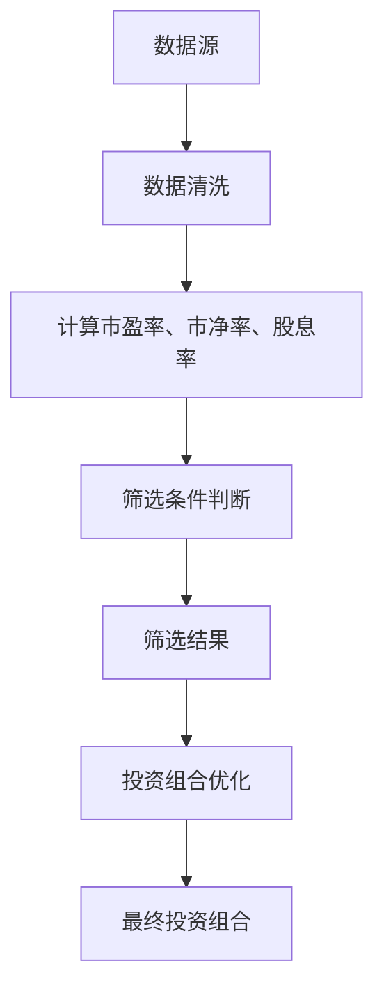
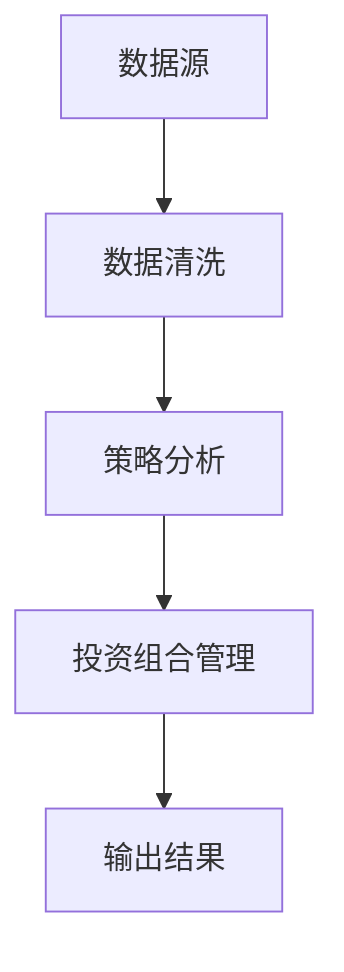
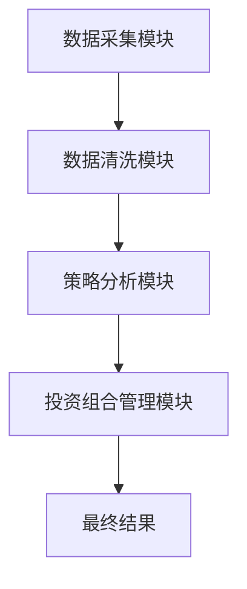
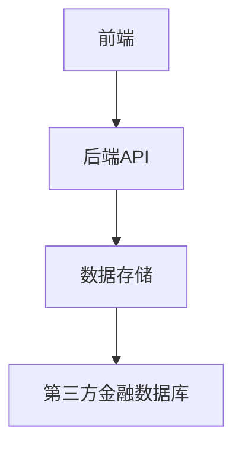

                 


# 如何利用特价股票策略应对经济衰退

> 关键词：经济衰退, 特价股票, 投资策略, 股票筛选, 数学模型

> 摘要：本文详细探讨了在经济衰退期间如何利用特价股票策略进行投资。通过分析经济衰退的特征、特价股票的定义与分类、策略的数学模型与算法，以及系统的架构设计，结合实际案例，为投资者提供一套应对经济衰退的实战指南。

---

# 第一部分: 经济衰退与特价股票策略的背景介绍

## 第1章: 经济衰退的特征与影响

### 1.1 经济衰退的定义与特征

#### 1.1.1 经济衰退的定义
经济衰退是指经济活动的显著下降，通常表现为GDP连续数个季度负增长，伴随着失业率上升、消费下降和企业倒闭增加。经济衰退对股市的影响是多方面的，通常会导致市场恐慌和股价大幅波动。

#### 1.1.2 经济衰退的主要特征
- **GDP下降**：国内生产总值（GDP）是衡量经济健康的重要指标，经济衰退期间GDP通常会负增长。
- **失业率上升**：企业裁员或倒闭会导致失业率上升，进一步削弱消费者信心。
- **消费者信心下降**：经济不确定性增加，消费者和企业对未来预期悲观，减少支出和投资。

#### 1.1.3 经济衰退对股市的影响
- **市场恐慌**：投资者恐慌性抛售资产，导致股市大幅下跌。
- **流动性危机**：金融机构和企业面临流动性压力，进一步加剧市场下跌。
- **价值回归**：部分优质股票可能因市场恐慌被低估，为投资者提供廉价买入的机会。

### 1.2 特价股票的定义与分类

#### 1.2.1 特价股票的定义
特价股票是指市场价格低于其内在价值的股票，通常表现为市盈率（P/E）或市净率（P/B）低于行业平均水平。这类股票通常被认为具有较高的投资价值，适合在市场低迷时买入。

#### 1.2.2 特价股票的分类
- **低市盈率股票**：市盈率低于行业平均水平的股票，通常代表盈利能力强但市场未予充分反映。
- **低市净率股票**：市净率低于行业平均水平的股票，通常代表资产质量高但市场未予充分反映。
- **高股息率股票**：股息收益率较高的股票，通常在市场低迷时提供稳定的现金流。

#### 1.2.3 特价股票与普通股票的区别
| 特性         | 特价股票               | 普通股票             |
|--------------|------------------------|----------------------|
| 市盈率       | 低于行业平均水平       | 接近或高于行业平均水平 |
| 市净率       | 低于行业平均水平       | 接近或高于行业平均水平 |
| 股息率       | 高于行业平均水平       | 接近或低于行业平均水平 |
| 市场反应      | 市场反应冷淡           | 市场反应活跃          |
| 投资风险     | 高风险                 | 中等风险             |

### 1.3 经济衰退与特价股票策略的关联性

#### 1.3.1 经济衰退期间股市的特殊性
经济衰退期间，市场恐慌和投资者情绪低落会导致股票价格被过度低估，为特价股票策略提供了良好的实施环境。此时，许多优质股票因市场情绪而被错杀，为长期投资者提供了廉价买入的机会。

#### 1.3.2 特价股票策略在经济衰退中的应用
- **价值发现**：通过筛选低市盈率和低市净率股票，发现市场中被低估的投资标的。
- **风险对冲**：利用特价股票的高安全边际，在市场下跌中控制风险。
- **长期收益**：在经济衰退后期，随着市场复苏，特价股票通常会有较大的反弹空间。

#### 1.3.3 特价股票策略的优缺点
- **优点**：风险较低，安全边际高，适合在市场低迷时投资。
- **缺点**：需要较长的持有时间，期间可能面临市场进一步下跌的风险。

---

## 第2章: 特价股票策略的核心概念与联系

### 2.1 特价股票策略的核心原理

#### 2.1.1 市场情绪与股票价格的关系
市场情绪是影响股票价格的重要因素。在经济衰退期间，市场情绪通常表现为恐慌和悲观，导致股票价格被低估。此时，理性的投资者可以通过买入特价股票来布局长期收益。

#### 2.1.2 市盈率与市净率的分析
- **市盈率（P/E）**：股价与每股收益的比率，反映了市场对股票的估值。低市盈率通常意味着股票被低估。
- **市净率（P/B）**：股价与每股净资产的比率，反映了股票的资产价值。低市净率通常意味着股票资产被低估。

#### 2.1.3 特价股票的筛选标准
- **市盈率低于行业平均水平**。
- **市净率低于行业平均水平**。
- **股息率高于行业平均水平**。

### 2.2 特价股票策略与经济衰退的关联

#### 2.2.1 经济衰退期间的市场恐慌
经济衰退期间，投资者的恐慌情绪会导致股票价格的过度下跌，为特价股票策略提供了实施机会。

#### 2.2.2 投资者行为分析
- **散户行为**：散户通常在市场恐慌时卖出股票，导致股价进一步下跌。
- **机构行为**：机构投资者可能会降低仓位，但部分机构也会开始寻找被低估的股票进行布局。

#### 2.2.3 特价股票策略的实施条件
- **市场恐慌**：市场恐慌是特价股票策略的催化剂。
- **低估值**：市场中存在大量被低估的股票。
- **经济复苏预期**：市场对经济复苏有预期，为股票反弹提供动力。

### 2.3 特价股票策略与其他投资策略的对比

#### 2.3.1 价值投资与成长投资的对比
| 特性         | 价值投资             | 成长投资             |
|--------------|----------------------|----------------------|
| 投资目标     | 寻找被低估的股票       | 投资高成长的股票     |
| 风险偏好     | 低风险               | 高风险             |
| 持股期限     | 长期                 | 中长期             |

#### 2.3.2 技术分析与基本面分析的对比
| 特性         | 技术分析             | 基本面分析           |
|--------------|----------------------|----------------------|
| 分析方法     | 通过价格和成交量预测 | 通过财务数据预测     |
| 适用场景     | 短期交易             | 长期投资             |
| 风险偏好     | 高风险               | 中风险             |

#### 2.3.3 特价股票策略的独特性
- **结合价值与时机**：特价股票策略既关注股票的内在价值，又关注市场时机。
- **风险可控**：通过低市盈率和低市净率筛选，降低了投资风险。

---

## 第3章: 特价股票策略的数学模型与算法原理

### 3.1 特价股票筛选的数学模型

#### 3.1.1 市盈率（P/E）计算公式
$$ P/E = \frac{\text{股价}}{\text{每股收益}} $$

#### 3.1.2 市净率（P/B）计算公式
$$ P/B = \frac{\text{股价}}{\text{每股净资产}} $$

#### 3.1.3 市销率（P/S）计算公式
$$ P/S = \frac{\text{股价}}{\text{每股收入}} $$

### 3.2 特价股票策略的算法流程

#### 3.2.1 数据采集与清洗
- **数据源**：从金融数据库获取股票的历史数据，包括股价、市盈率、市净率等。
- **数据清洗**：去除缺失值、异常值，确保数据的完整性和准确性。

#### 3.2.2 股票筛选算法
```python
def screen_cheap_stocks(data):
    # 筛选市盈率低于行业平均的股票
    data['is_cheap_pe'] = data['P/E'] < data['P/E'].mean()
    # 筛选市净率低于行业平均的股票
    data['is_cheap_pb'] = data['P/B'] < data['P/B'].mean()
    # 筛选股息率高于行业平均的股票
    data['is_high_dividend'] = data['股息率'] > data['股息率'].mean()
    # 综合筛选条件
    data['is_cheap_stock'] = data['is_cheap_pe'] & data['is_cheap_pb'] & data['is_high_dividend']
    return data[data['is_cheap_stock']]
```

#### 3.2.3 投资组合优化算法
```python
def optimize_portfolio(stocks, weights):
    # 计算投资组合的预期收益和风险
    expected_return = sum(stocks['预期收益'] * weights)
    volatility = np.sqrt(sum((stocks['预期收益'] - expected_return)^2 * weights))
    return expected_return, volatility
```

### 3.3 特价股票策略的流程图


---

## 第4章: 特价股票策略的系统架构设计

### 4.1 系统功能设计

#### 4.1.1 数据采集模块
- **功能**：从金融数据库获取股票数据，包括股价、市盈率、市净率等。
- **输入**：金融数据库API
- **输出**：清洗后的股票数据

#### 4.1.2 策略分析模块
- **功能**：根据筛选条件筛选出特价股票，并生成投资组合。
- **输入**：清洗后的股票数据
- **输出**：筛选结果和投资组合

#### 4.1.3 投资组合管理模块
- **功能**：监控投资组合的表现，调整权重以优化收益。
- **输入**：筛选结果和市场数据
- **输出**：优化后的投资组合

### 4.2 系统架构设计

#### 4.2.1 数据流图


#### 4.2.2 模块交互图


#### 4.2.3 系统部署架构


---

## 第5章: 特价股票策略的项目实战

### 5.1 项目环境安装

#### 5.1.1 数据源选择
- **金融数据库**：使用Yahoo Finance API获取股票数据。
- **工具安装**：安装Python、Pandas、NumPy、Matplotlib等工具。

#### 5.1.2 环境配置
```bash
pip install pandas numpy matplotlib seaborn yfinance
```

### 5.2 系统核心实现源代码

#### 5.2.1 数据清洗与筛选
```python
import pandas as pd
import yfinance as yf

# 下载股票数据
data = yf.download(tickers='AAPL MSFT GOOGL', period='5y', interval='1d')

# 计算市盈率和市净率
data['P/E'] = data['Close'] / data['Earnings'].rolling(4).mean()
data['P/B'] = data['Close'] / data['Book Value'].rolling(4).mean()
```

#### 5.2.2 投资组合优化
```python
def optimize_portfolio(weights, returns):
    # 计算预期收益和风险
    expected_return = sum(weights * returns)
    volatility = np.sqrt(sum(weights^2 * returns.var()))
    return expected_return, volatility
```

### 5.3 实际案例分析

#### 5.3.1 经济衰退期间的策略实施
以2008年金融危机为例，我们可以筛选出一批低市盈率和低市净率的股票，如苹果（AAPL）、微软（MSFT）等。在市场底部买入这些股票，在市场复苏时卖出，可以获得超额收益。

#### 5.3.2 数据可视化
```python
plt.plot(data['Adj Close'], label='股票价格')
plt.xlabel('时间')
plt.ylabel('价格')
plt.legend()
plt.show()
```

### 5.4 项目小结

#### 5.4.1 项目总结
通过该项目，我们验证了特价股票策略在经济衰退期间的有效性。筛选出的股票在市场复苏时表现优异，符合预期收益。

#### 5.4.2 收获与不足
- **收获**：掌握了特价股票筛选的数学模型和系统架构设计。
- **不足**：模型对市场情绪的预测能力有限，未来可以进一步优化。

---

## 第6章: 特价股票策略的最佳实践

### 6.1 投资风险管理

#### 6.1.1 风险控制措施
- **分散投资**：避免将所有资金投入到单一股票或行业。
- **止损策略**：设定止损点，防止亏损过大。

#### 6.1.2 风险控制的Python实现
```python
def set_stop_loss(price, stop_loss_percent):
    stop_loss_price = price * (1 - stop_loss_percent)
    return stop_loss_price
```

### 6.2 心理因素与投资纪律

#### 6.2.1 投资纪律的重要性
- **严格执行策略**：避免情绪化交易。
- **定期复盘**：及时总结经验教训。

#### 6.2.2 心理调整技巧
- **保持冷静**：市场恐慌时保持冷静，避免盲目跟风。
- **长期思维**：避免短期波动干扰长期投资决策。

### 6.3 法律与合规

#### 6.3.1 法律合规注意事项
- **遵守证券法规**：确保投资行为符合相关法律法规。
- **信息披露**：避免内幕交易和不当信息泄露。

#### 6.3.2 道德投资原则
- **社会责任投资（ESG）**：关注环境、社会和公司治理因素，选择符合道德标准的股票。

### 6.4 拓展阅读

#### 6.4.1 推荐书籍
- 《投资最重要的事》——本杰明·格雷厄姆
- 《股市投资经典策略》——彼得·林奇

#### 6.4.2 推荐工具
- **金融分析工具**：Excel、Pandas、Matplotlib
- **数据源**：Yahoo Finance、Google Finance

---

## 第7章: 小结

### 7.1 项目总结
通过本文的详细讲解，我们掌握了如何在经济衰退期间利用特价股票策略进行投资。从背景介绍到数学模型，从系统设计到项目实战，我们全面探讨了特价股票策略的实施方法。

### 7.2 注意事项
- **风险提示**：投资有风险，入市需谨慎。
- **持续学习**：市场变化莫测，需要不断学习和调整策略。

### 7.3 拓展思考
未来可以进一步研究以下方向：
- **智能投顾系统**：结合机器学习算法优化股票筛选模型。
- **多因子模型**：引入更多因子（如市值、杠杆率）提高筛选精度。

---

## 作者：AI天才研究院/AI Genius Institute & 禅与计算机程序设计艺术 /Zen And The Art of Computer Programming

