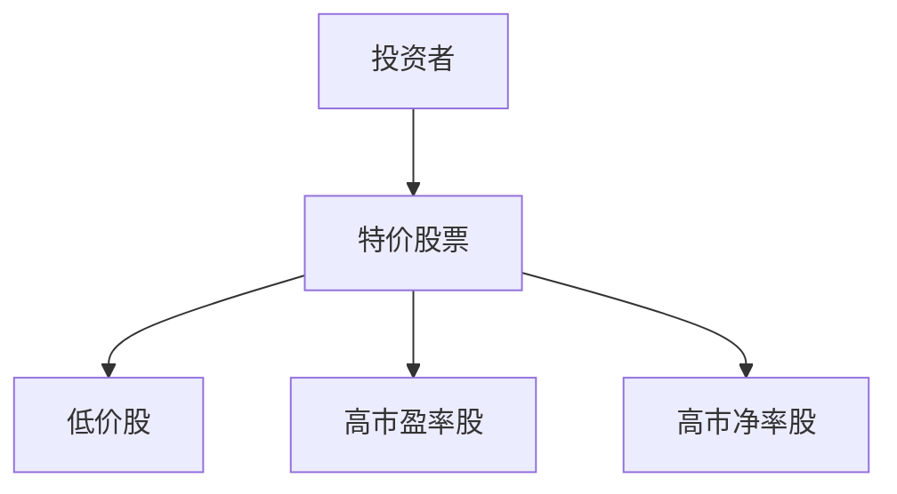
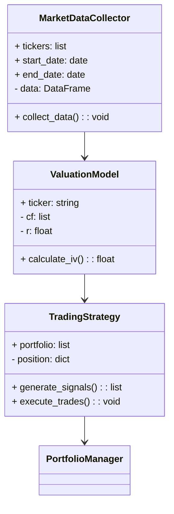

                 


# 如何利用特价股票策略应对货币政策变化

> 关键词：特价股票策略、货币政策变化、股票投资、价值投资、算法交易、风险管理

> 摘要：本文详细探讨了如何利用特价股票策略应对货币政策变化。通过分析货币政策变化对股市的影响，结合特价股票策略的核心原理，提出了基于价值投资和风险管理的策略优化方案。文章从理论到实践，结合数学模型和算法实现，为投资者提供了一套应对货币政策变化的有效方法。

---

## 第一部分：背景与概念

### 第1章：货币政策变化与股市的影响

#### 1.1 货币政策的基本概念

货币政策是国家宏观调控的重要工具，通过调节货币供应量和利率水平，影响经济运行和市场参与者的投资行为。货币政策的变化对股市的影响是多方面的，主要体现在以下几个方面：

- **货币政策工具**：包括公开市场操作、存款准备金率、再贴现率等。这些工具直接影响市场流动性，进而影响股市资金的流入和流出。
- **利率水平**：利率的变化直接影响企业的融资成本和投资者的收益预期。低利率环境通常会刺激股市上涨，而高利率环境则可能导致股市下跌。
- **经济周期**：货币政策的变化往往与经济周期密切相关。在经济衰退期，宽松的货币政策通常会刺激股市上涨；而在经济过热时，紧缩的货币政策则可能导致股市下跌。

#### 1.2 特价股票策略的定义与特点

特价股票策略是一种基于价值投资理念的投资策略，主要关注那些市场价格低于其内在价值的股票。以下是特价股票策略的核心特点：

- **低估值**：特价股票通常具有较低的市盈率、市净率等估值指标，相对于其基本面表现，市场价格被低估。
- **长期投资**：特价股票策略强调长期持有，等待市场对低估股票的重新定价。
- **风险控制**：通过选择基本面良好、财务健康的公司，降低投资风险。

#### 1.3 货币政策变化与特价股票策略的联系

货币政策的变化对股市的影响是多方面的，而特价股票策略作为一种逆向投资策略，能够在货币政策变化中找到投资机会。具体表现在以下几个方面：

- **宽松货币政策下的机会**：在宽松货币政策下，市场流动性增加，资金流入股市，具有低估值的特价股票可能被市场重新定价，带来投资收益。
- **紧缩货币政策下的防御性**：在紧缩货币政策下，市场流动性减少，股市可能下跌，但具有低估值的特价股票由于其防御性较强，可能下跌幅度较小，为投资者提供安全垫。

#### 1.4 特价股票策略的影响因素

影响特价股票策略的因素主要包括宏观经济因素、市场情绪和公司基本面等。

- **宏观经济因素**：包括GDP增速、通货膨胀率、利率水平等。这些因素直接影响股市的整体表现，进而影响特价股票策略的效果。
- **市场情绪**：投资者情绪的变化会影响市场流动性，进而影响特价股票的价格。市场恐慌时，特价股票可能被过度抛售；市场乐观时，特价股票可能被迅速拉升。
- **公司基本面**：包括公司的财务状况、盈利能力、管理团队等。良好的基本面是特价股票策略的基础，只有基本面良好、估值被低估的股票才能作为投资标的。

---

## 第二部分：特价股票策略的核心概念与联系

### 第2章：特价股票策略的核心原理

#### 2.1 特价股票策略的理论基础

特价股票策略的核心理论是价值投资，其主要观点是市场价格与内在价值之间的差异是投资机会的来源。以下是价值投资理论的几个关键点：

- **内在价值**：股票的内在价值是其未来现金流的现值，可以通过 discounted cash flow (DCF) 模型计算。
- **市场情绪与价格波动**：市场价格受市场情绪影响，往往偏离内在价值。当市场价格低于内在价值时，是买入的良机。
- **长期持有**：价值投资者通常长期持有股票，等待市场重新认识到其内在价值。

#### 2.2 特价股票策略的关键属性对比

为了更好地理解特价股票策略，我们需要将其与其他类型的股票策略进行对比，找出其独特性。

##### 表2-1：特价股票策略与其他股票策略的对比

| 策略类型         | 核心目标             | 投资期限       | 风险承受能力 |
|------------------|----------------------|----------------|---------------|
| 特价股票策略     | 投资被低估的股票     | 长期           | 较低           |
| 成长股策略       | 投资高成长的公司     | 中长期         | 较高           |
| 周期性股票策略   | 投资周期性行业的股票 | 短期           | 较高           |
| 防御性股票策略   | 投资稳定收益的股票   | 长期           | 较低           |

##### 图2-1：特价股票策略的实体关系图



---

## 第三部分：特价股票策略的算法原理

### 第3章：特价股票策略的算法实现

#### 3.1 特价股票策略的算法流程

为了实现特价股票策略的自动化交易，我们可以设计一个基于算法的交易系统。以下是算法的主要流程：

1. **数据收集**：收集目标股票的市场数据，包括价格、成交量、财务指标等。
2. **估值计算**：使用DCF模型等方法计算股票的内在价值。
3. **筛选股票**：根据设定的估值指标（如市盈率、市净率等）筛选出被低估的股票。
4. **交易信号生成**：当市场价格低于内在价值时，生成买入信号；当市场价格回升至合理水平时，生成卖出信号。
5. **风险管理**：根据市场波动和投资者的风险承受能力，调整投资组合的仓位和止损点。

#### 3.2 特价股票策略的数学模型

以下是价值投资中常用的DCF模型：

$$ \text{内在价值} = \sum_{t=1}^{n} \frac{CF_t}{(1 + r)^t} $$

其中：
- $CF_t$ 是第 $t$ 年的自由现金流
- $r$ 是折现率
- $n$ 是估计的持有期限

通过DCF模型计算出的内在价值与市场价格进行对比，可以判断股票是否被低估。

#### 3.3 特价股票策略的Python代码实现

以下是基于Python的特价股票策略实现代码示例：

```python
import pandas as pd
import numpy as np
import yfinance as yf

# 下载股票数据
def get_stock_data(ticker):
    df = yf.download(ticker, start='2020-01-01', end='2023-01-01')
    return df['Adj Close']

# 计算DCF模型的内在价值
def calculate_intrinsic_value(ticker):
    df = get_stock_data(ticker)
    # 假设自由现金流和折现率已知
    CF = [100, 120, 150]  # 现金流预测
    r = 0.08  # 折现率
    n = len(CF)
    # 计算DCF内在价值
    iv = 0
    for t in range(n):
        iv += CF[t] / (1 + r)**t
    iv = iv / (1 + r)**n  # 永续年金假设
    return iv

# 特价股票筛选
def screen_cheap_stocks(tickers):
    selected = []
    for ticker in tickers:
        iv = calculate_intrinsic_value(ticker)
        price = get_stock_data(ticker).iloc[-1]
        if iv > price * 1.1:  # 考虑10%的安全边际
            selected.append(ticker)
    return selected

# 示例：筛选股票池中的特价股票
tickers = ['AAPL', 'MSFT', 'GOOGL']
cheap_stocks = screen_cheap_stocks(tickers)
print("被低估的股票：", cheap_stocks)
```

---

## 第四部分：系统分析与架构设计方案

### 第4章：应对货币政策变化的股票交易系统

#### 4.1 问题场景介绍

在货币政策变化的背景下，投资者需要一种能够自动识别和应对市场波动的股票交易系统。该系统需要能够实时监控市场数据，评估股票的内在价值，并根据市场变化动态调整投资组合。

#### 4.2 系统功能设计

##### 图4-1：系统功能设计类图



#### 4.3 系统架构设计

##### 图4-2：系统架构设计

```mermaid
rectangle Database {
    MarketData
    ValuationResults
    TradingSignals
}
rectangle MarketDataProvider {
    API
    DataFeed
}
rectangle TradingSystem {
    MarketDataCollector
    ValuationModel
    TradingStrategy
}
```

---

## 第五部分：项目实战

### 第5章：应对货币政策变化的股票交易系统实现

#### 5.1 环境安装

以下是实现该系统所需的环境配置：

- **Python 3.8+**
- **Pandas、NumPy、yfinance**
- **Jupyter Notebook 或 IDE**

#### 5.2 系统核心实现

以下是系统的核心代码实现：

```python
# 系统核心代码
class MarketDataCollector:
    def __init__(self, tickers, start_date, end_date):
        self.tickers = tickers
        self.start_date = start_date
        self.end_date = end_date
        self.data = self.collect_data()
    
    def collect_data(self):
        data = pd.DataFrame()
        for ticker in self.tickers:
            df = yfinance.download(ticker, start=self.start_date, end=self.end_date)
            data[ticker] = df['Adj Close']
        return data

class ValuationModel:
    def __init__(self, ticker, cf, r):
        self.ticker = ticker
        self.cf = cf
        self.r = r
    
    def calculate_iv(self):
        iv = 0
        for t in range(len(self.cf)):
            iv += self.cf[t] / (1 + self.r)**t
        iv = iv / (1 + self.r)**len(self.cf)
        return iv

class TradingStrategy:
    def __init__(self, tickers, cf, r):
        self.tickers = tickers
        self.cf = cf
        self.r = r
        self.portfolio = []
    
    def generate_signals(self):
        signals = []
        for ticker in self.tickers:
            iv = ValuationModel(ticker, self.cf, self.r).calculate_iv()
            price = MarketDataCollector([ticker], '2020-01-01', '2023-01-01').data[ticker].iloc[-1]
            if iv > price * 1.1:
                signals.append(('BUY', ticker))
            else:
                signals.append(('SELL', ticker))
        return signals

# 示例：系统实现
tickers = ['AAPL', 'MSFT', 'GOOGL']
cf = [100, 120, 150]
r = 0.08
strategy = TradingStrategy(tickers, cf, r)
signals = strategy.generate_signals()
print("交易信号：", signals)
```

#### 5.3 案例分析与结果解读

通过上述代码实现，我们可以看到在宽松货币政策环境下，系统生成的交易信号可能以买入为主。而在紧缩货币政策环境下，系统可能会生成更多的卖出信号。这体现了特价股票策略在应对货币政策变化中的灵活性和适应性。

---

## 第六部分：总结与展望

### 第6章：总结与展望

#### 6.1 总结

本文详细探讨了如何利用特价股票策略应对货币政策变化。通过分析货币政策变化对股市的影响，结合特价股票策略的核心原理，提出了基于价值投资和风险管理的策略优化方案。文章从理论到实践，结合数学模型和算法实现，为投资者提供了一套应对货币政策变化的有效方法。

#### 6.2 展望

未来的研究可以进一步优化算法交易系统，引入更多的风险管理工具，如期权和期货，以提高系统的抗风险能力。同时，可以通过机器学习技术，对市场数据进行深度分析，提升策略的智能化水平。

---

## 作者

**作者：AI天才研究院/AI Genius Institute & 禅与计算机程序设计艺术/Zen And The Art of Computer Programming**

