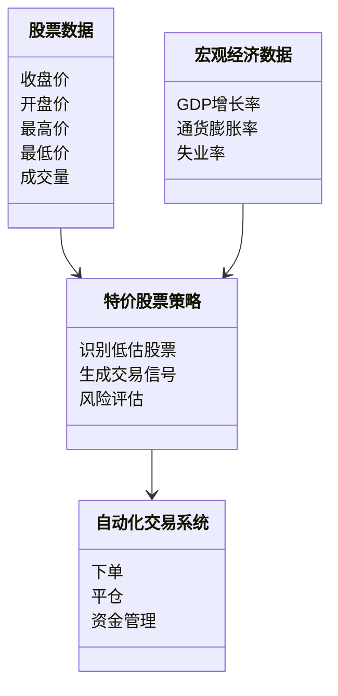
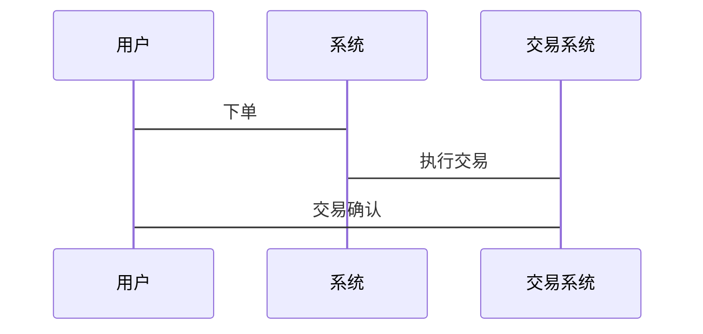

                 


# 如何利用特价股票策略应对货币政策变化

> 关键词：特价股票、货币政策、投资策略、量化交易、风险控制

> 摘要：本文详细探讨了在货币政策变化的背景下，如何利用特价股票策略进行有效的投资。通过分析货币政策对股市的影响，结合特价股票的基本概念与策略，本文提出了基于数学模型的套利策略和投资组合优化方法。同时，本文还探讨了系统架构设计与项目实战，帮助投资者在复杂多变的市场环境中实现稳健收益。

---

## 第1章: 货币政策对股市的影响概述

### 1.1 货币政策的基本概念与工具

#### 1.1.1 货币政策的定义与目标
货币政策是由中央银行制定和实施的，通过调节货币供应量、利率等工具来实现经济增长、就业和价格稳定等宏观目标的政策。

#### 1.1.2 主要货币政策工具解析
- **法定存款准备金率**：中央银行规定商业银行必须持有的存款准备金比例。
- **基准利率**：中央银行设定的基准利率，影响整个金融市场的利率水平。
- **公开市场操作**：通过买卖政府债券来调节市场流动性。

#### 1.1.3 货币政策对经济的传导机制
货币政策通过影响利率、信贷供给和市场预期，进而影响企业和个人的投资、消费行为，最终作用于股市。

---

### 1.2 货币政策变化对股市的影响

#### 1.2.1 利率政策对股市的直接影响
- 利率下降：降低企业融资成本，提升股市估值。
- 利率上升：增加企业融资成本，抑制股市表现。

#### 1.2.2 货币供应量变化对股市的间接影响
- 货币宽松：增加市场流动性，推高股市估值。
- 货币紧缩：减少市场流动性，打压股市表现。

#### 1.2.3 货币政策预期对投资者心理的影响
- 货币政策预期通过影响市场情绪，间接影响股市走势。

---

### 1.3 特价股票策略的基本概念

#### 1.3.1 特价股票的定义与特征
- **定义**：指市场价格低于内在价值的股票。
- **特征**：低估值、高分红、高安全边际。

#### 1.3.2 特价股票投资的基本原则
- 买入低估股票，卖出高估股票。
- 长期投资，价值回归。

#### 1.3.3 特价股票与市场周期的关系
- 在市场低迷期更容易出现特价股票。
- 在市场上涨期，特价股票可能被市场重新估值。

---

## 第2章: 特价股票策略的核心原理

### 2.1 特价股票的市场定位与识别

#### 2.1.1 特价股票的识别标准
- 市盈率（P/E）低于行业平均水平。
- 市净率（P/B）低于1。
- 股息率高于行业平均水平。

#### 2.1.2 市场估值与内在价值的对比
- 市场估值：基于市场情绪和预期的价格。
- 内在价值：基于企业基本面的合理价格。

#### 2.1.3 特价股票的市场周期分析
- 在市场底部，投资者应寻找低估股票。
- 在市场顶部，投资者应避免高价股票。

---

### 2.2 货币政策变化下的投资机会

#### 2.2.1 利率下降周期中的投资机会
- 利率下降，债券收益率降低，资金流向股市，推高股票价格。
- 低利率环境下，高分红股票吸引力增强。

#### 2.2.2 货币宽松政策下的股票市场表现
- 货币宽松，市场流动性增加，股市上涨。
- 市场流动性增加，资金推动型股票表现较好。

#### 2.2.3 货币紧缩周期中的防御性投资策略
- 货币紧缩，市场流动性减少，股市可能下跌。
- 投资者应选择防御性股票，如公用事业、医疗等。

---

### 2.3 特价股票策略的数学模型

#### 2.3.1 股票价值的评估公式
$$ V = \frac{D}{k} $$
其中，$V$为股票的内在价值，$D$为预期股利，$k$为折现率。

#### 2.3.2 市场估值与货币政策的关系模型
$$ P = V \times (1 + \beta \times \Delta M) $$
其中，$P$为市场价格，$V$为内在价值，$\beta$为货币政策敏感系数，$\Delta M$为货币政策变化幅度。

---

## 第3章: 货币政策变化下的套利策略

### 3.1 套利策略的基本原理

#### 3.1.1 套利的定义与分类
- **定义**：利用同一资产在不同市场或不同时间点的价格差异，通过同时买入和卖出该资产来获利。
- **分类**：跨市场套利、跨期套利、跨资产套利。

#### 3.1.2 套利的基本原理与风险
- 基本原理：利用价格差异获利。
- 风险：市场风险、流动性风险、操作风险。

---

### 3.2 利率套利策略的应用

#### 3.2.1 利率上升周期中的套利机会
- 买入短期债券，卖出长期债券。

#### 3.2.2 利率下降周期中的套利策略
- 买入长期债券，卖出短期债券。

#### 3.2.3 套利组合的构建与风险控制
- 组合构建：利用债券的久期差异构建套利组合。
- 风险控制：监控市场变化，及时调整头寸。

---

### 3.3 货币政策变化下的跨市场套利

#### 3.3.1 跨市场套利的基本原理
- 在不同市场之间寻找价格差异，利用汇率和价格差异获利。

#### 3.3.2 货币政策变化下的汇率影响
- 利率差异导致汇率变动。
- 汇率变动影响跨市场套利的收益。

#### 3.3.3 跨市场套利的风险与机会
- 风险：汇率波动、市场流动性不足。
- 机会：市场间价格差异带来的套利机会。

---

## 第4章: 特价股票策略的算法实现

### 4.1 特价股票识别的算法模型

#### 4.1.1 基于技术分析的特价股票识别
- 技术指标：MACD、RSI、KDJ等。
- 交易信号：买入信号和卖出信号。

#### 4.1.2 基于基本面分析的特价股票识别
- 财务指标：市盈率、市净率、股息率等。
- 价值判断：内在价值与市场价值的对比。

#### 4.1.3 综合分析模型的设计与实现
- 综合考虑技术分析和基本面分析，构建多因子模型。

---

### 4.2 货币政策变化的预测模型

#### 4.2.1 时间序列分析模型
- ARIMA模型：用于预测未来利率变化。
- GARCH模型：用于预测市场波动性。

#### 4.2.2 货币政策变化的机器学习预测
- 线性回归模型：基于宏观经济指标预测货币政策变化。
- 支持向量机（SVM）：用于分类货币政策变化的方向。

#### 4.2.3 基于宏观经济指标的预测模型
- 主要指标：GDP增长率、通货膨胀率、失业率等。

---

### 4.3 策略优化与回测

#### 4.3.1 策略优化的基本原理
- 参数优化：调整模型参数以提高收益。
- 风险控制：降低最大回撤和波动性。

#### 4.3.2 策略回测的方法与工具
- 回测工具：Python的回测框架（如Backtrader）。
- 数据来源：历史价格数据和宏观经济数据。

#### 4.3.3 策略表现的评估指标
- 收益率：年化收益率、夏普比率。
- 风险指标：最大回撤、波动率。

---

## 第5章: 投资组合管理与风险控制

### 5.1 投资组合管理的基本原理

#### 5.1.1 投资组合管理的目标
- 最大化收益。
- 最小化风险。

#### 5.1.2 投资组合管理的步骤
- 确定投资目标。
- 选择投资策略。
- 构建投资组合。
- 监控和调整。

---

### 5.2 基于特价股票策略的投资组合构建

#### 5.2.1 投资组合的资产配置
- 股票配置：主要配置低估股票。
- 债券配置：用于对冲市场风险。
- 现金配置：用于捕捉市场机会。

#### 5.2.2 投资组合的风险控制
- 个股集中度：避免过度集中。
- 行业分散：避免行业风险。

---

## 第6章: 系统架构设计与项目实战

### 6.1 问题场景介绍

#### 6.1.1 问题背景
- 货币政策变化对股市的影响。
- 特价股票投资机会。

#### 6.1.2 项目目标
- 构建一个基于特价股票策略的投资系统。
- 实现自动化交易和风险控制。

---

### 6.2 系统功能设计

#### 6.2.1 领域模型（Mermaid 类图）


---

### 6.3 系统架构设计（Mermaid 架构图）

```mermaid
archi
    股票数据采集模块 --> 数据存储模块
    宏观经济数据采集模块 --> 数据存储模块
    数据分析模块 --> 数据存储模块
    交易执行模块 --> 数据存储模块
    风险控制模块 --> 数据存储模块
```

---

### 6.4 系统接口设计

#### 6.4.1 数据接口
- 股票数据接口：提供历史价格数据。
- 宏观经济数据接口：提供宏观经济指标。

#### 6.4.2 交易接口
- 交易系统接口：提供下单、撤单、查询订单状态等功能。

---

### 6.5 系统交互设计（Mermaid 序列图）



---

## 第7章: 项目实战与经验分享

### 7.1 环境安装

#### 7.1.1 Python 环境配置
- 安装Python 3.x
- 安装相关库：pandas、numpy、scikit-learn、backtrader。

#### 7.1.2 数据源配置
- 股票数据：Yahoo Finance 或其他数据源。
- 宏观经济数据：央行网站或其他数据源。

---

### 7.2 系统核心实现

#### 7.2.1 特价股票识别代码
```python
import pandas as pd
import numpy as np

def is_cheap_stock(stock_data, industry_avg_pe):
    stock_pe = stock_data['PE']
    return stock_pe < industry_avg_pe * 0.8
```

#### 7.2.2 自动化交易系统代码
```python
class TradingSystem:
    def __init__(self, data_source, trading_strategy):
        self.data_source = data_source
        self.trading_strategy = trading_strategy

    def execute_trade(self, signal):
        if signal == 'buy':
            # 下单买入
            pass
        elif signal == 'sell':
            # 下单卖出
            pass
```

---

### 7.3 案例分析与经验分享

#### 7.3.1 案例分析
- 案例1：2020年新冠疫情后的市场机会。
- 案例2：2021年央行降准后的市场表现。

#### 7.3.2 经验分享
- 风险控制是投资成功的关键。
- 系统化交易能够减少人为情绪干扰。

---

## 第8章: 结论与展望

### 8.1 本章小结
- 本文详细探讨了如何利用特价股票策略应对货币政策变化。
- 提出了基于数学模型和系统架构的投资策略。

### 8.2 注意事项
- 投资有风险，入市需谨慎。
- 系统化交易需要结合市场实际情况进行调整。

### 8.3 拓展阅读
- 《投资学基础》
- 《算法交易与量化投资》
- 《货币政策与金融市场》

---

## 作者：AI天才研究院 & 禅与计算机程序设计艺术

感谢您的阅读！如果对本文有任何疑问或建议，请随时与我们联系。

