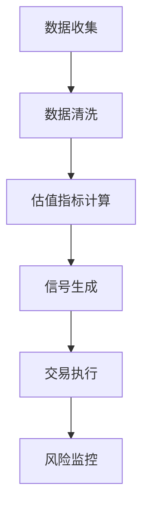

                 


# 如何利用特价股票策略应对通货膨胀

**关键词**：特价股票、通货膨胀、股票投资、估值指标、风险管理

**摘要**：  
通货膨胀是经济周期中的常见现象，它不仅会影响个人的购买力，还会对资本市场产生深远的影响。在通货膨胀的环境下，投资者需要寻找有效的策略来保护和增加自己的财富。特价股票作为一种具有潜在价值的股票类型，可以通过合理的筛选和投资策略，帮助投资者在通货膨胀中实现资产保值和增值。本文将从通货膨胀对股市的影响入手，详细分析特价股票的定义、筛选方法和投资策略，结合数学模型和实际案例，为投资者提供一套应对通货膨胀的有效方案。

---

# 第一部分: 通货膨胀与特价股票策略的背景与基础

## 第1章: 通货膨胀与特价股票概述

### 1.1 通货膨胀的基本概念

#### 1.1.1 通货膨胀的定义与表现形式
通货膨胀是指物价总水平在一段时间内持续上涨，导致货币购买力下降的经济现象。其表现形式包括：
- 消费者价格指数（CPI）的上涨
- 生产者价格指数（PPI）的上涨
- 货币贬值

#### 1.1.2 通货膨胀对经济的影响
- 消费者购买力下降
- 企业成本上升
- 利率上升，借贷成本增加
- 资产价格波动

#### 1.1.3 通货膨胀对股市的影响
- 股票价格可能上涨或下跌，取决于企业盈利能力和市场预期
- 高通胀环境下，高分红股票和周期性股票可能表现较好

### 1.2 特价股票的定义与特点

#### 1.2.1 特价股票的定义
特价股票是指市场价格低于其内在价值的股票，通常被认为被市场低估。

#### 1.2.2 特价股票的核心特征
- 市净率（P/B）低于行业平均水平
- 市盈率（P/E）低于行业平均水平
- 股息率较高

#### 1.2.3 特价股票与普通股票的区别
| 特性 | 特价股票 | 普通股票 |
|------|----------|----------|
| 价格 | 低于内在价值 | 价格反映市场情绪 |
| 估值指标 | P/B、P/E较低 | 估值指标可能处于正常或高位 |

### 1.3 通货膨胀与特价股票的关系

#### 1.3.1 通货膨胀对股票价格的影响
- 通胀可能导致企业成本上升，但利润增长可能抵消部分影响。
- 高通胀环境下，投资者可能转向实物资产或避险资产，影响股票价格。

#### 1.3.2 特价股票在通货膨胀中的投资机会
- 低估的股票在通胀环境中可能重新估值。
- 高分红股票在通胀中表现较好，因为分红可以部分抵消通胀影响。

#### 1.3.3 特价股票策略的核心逻辑
- 在通胀环境下，寻找具有稳定盈利能力和高分红的特价股票，能够在通胀中实现资产保值和增值。

---

# 第二部分: 特价股票策略的核心原理与数学模型

## 第2章: 特价股票策略的核心原理

### 2.1 特价股票筛选的数学模型

#### 2.1.1 市净率（P/B）的定义与计算
$$ P/B = \frac{\text{股票价格}}{\text{每股净资产}} $$

#### 2.1.2 市盈率（P/E）的定义与计算
$$ P/E = \frac{\text{股票价格}}{\text{每股收益}} $$

#### 2.1.3 股息率的定义与计算
$$ \text{股息率} = \frac{\text{每股股息}}{\text{股票价格}} \times 100\% $$

#### 2.1.4 其他估值指标（如EV/EBITDA）
$$ EV/EBITDA = \frac{\text{企业价值}}{\text{息税折旧及摊销前利润}} $$

### 2.2 通货膨胀对股票估值的影响

#### 2.2.1 通货膨胀对市净率的影响
- 通胀可能导致资产重估，P/B可能上升。
- 在通胀初期，P/B可能被低估，提供投资机会。

#### 2.2.2 通货膨胀对市盈率的影响
- 高通胀可能导致P/E下降，因为利率上升可能使股票相对债券吸引力下降。

#### 2.2.3 通货膨胀对股息率的影响
- 高通胀环境下，股息率高的股票更具吸引力，因为分红可以部分抵消通胀影响。

### 2.3 特价股票策略的数学模型

#### 2.3.1 基于市净率的选股模型
$$ \text{综合估值得分} = \alpha \times P/B + \beta \times P/E + \gamma \times \text{股息率} $$

---

## 第3章: 特价股票策略的数学公式与模型

### 3.1 常用估值指标的数学公式

#### 3.1.1 市净率公式
$$ P/B = \frac{\text{股票价格}}{\text{每股净资产}} $$

#### 3.1.2 市盈率公式
$$ P/E = \frac{\text{股票价格}}{\text{每股收益}} $$

#### 3.1.3 股息率公式
$$ \text{股息率} = \frac{\text{每股股息}}{\text{股票价格}} \times 100\% $$

#### 3.1.4 EV/EBITDA公式
$$ EV/EBITDA = \frac{\text{企业价值}}{\text{息税折旧及摊销前利润}} $$

### 3.2 特价股票筛选的综合模型

#### 3.2.1 综合估值得分公式
$$ \text{综合估值得分} = \alpha \times P/B + \beta \times P/E + \gamma \times \text{股息率} $$

---

## 第4章: 特价股票策略的系统架构设计

### 4.1 系统功能设计

#### 4.1.1 数据收集模块
- 数据源：股票市场数据、宏观经济指标
- 工具：API接口、数据清洗工具

#### 4.1.2 信号生成模块
- 筛选特价股票：基于P/B、P/E、股息率等指标
- 生成投资信号：根据市场环境调整权重

#### 4.1.3 交易执行模块
- 自动化交易：基于信号执行买卖指令
- 风险控制：设置止损和止盈点

#### 4.1.4 风险监控模块
- 实时监控市场波动
- 调整投资组合

### 4.2 系统架构图


---

## 第5章: 实战案例分析

### 5.1 案例背景

#### 5.1.1 项目介绍
- 行业选择：假设选择一个受通胀影响较大的行业，如能源行业
- 数据来源：某时间段的历史数据

### 5.2 案例分析

#### 5.2.1 数据准备
```python
import pandas as pd
data = pd.read_csv('stock_data.csv')
```

#### 5.2.2 估值指标计算
```python
data['P/B'] = data['price'] / data['book_value']
data['P/E'] = data['price'] / data['eps']
data['dividend_yield'] = data['dividend'] / data['price'] * 100
```

#### 5.2.3 特价股票筛选
```python
data['综合得分'] = 0.4 * data['P/B'] + 0.3 * data['P/E'] + 0.3 * data['dividend_yield']
data = data.sort_values('综合得分', ascending=False)
```

#### 5.2.4 投资组合构建
```python
selected_stocks = data.head(10)
```

#### 5.2.5 投资效果评估
- 回测结果：比较投资组合与市场指数的表现
- 风险调整后收益：夏普比率等指标

### 5.3 项目小结

---

# 第三部分: 总结与展望

## 第6章: 总结与展望

### 6.1 本章总结
- 特价股票策略在通货膨胀中的有效性
- 数学模型和系统的实用性

### 6.2 未来研究方向
- 更复杂的多因子模型
- 机器学习在选股中的应用
- 风险管理的优化

### 6.3 投资建议
- 根据市场环境调整策略
- 分散投资，降低风险
- 定期回顾和优化投资组合

### 6.4 注意事项
- 风险提示：市场波动、模型假设的局限性
- 避免过度交易和追涨杀跌

### 6.5 拓展阅读
- 推荐书籍：《投资学》、《股票技术分析》
- 推荐网站：Yahoo Finance、Morningstar

---

# 作者

**作者：AI天才研究院/AI Genius Institute & 禅与计算机程序设计艺术 /Zen And The Art of Computer Programming**

