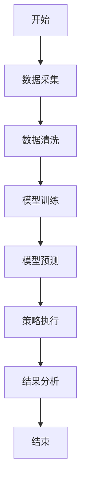
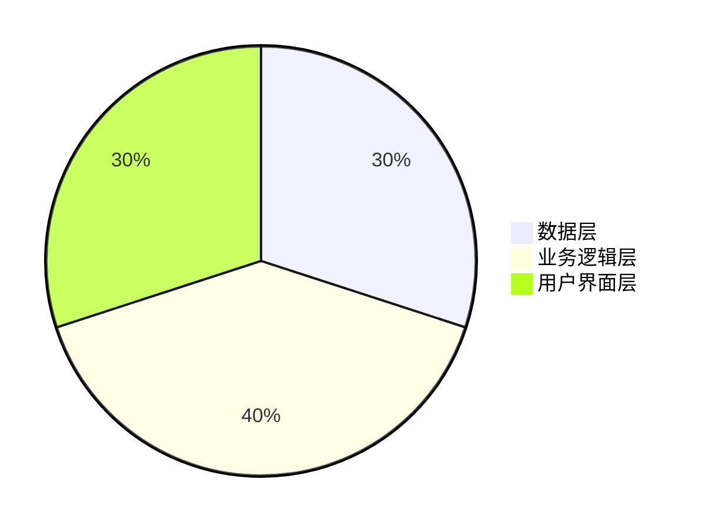
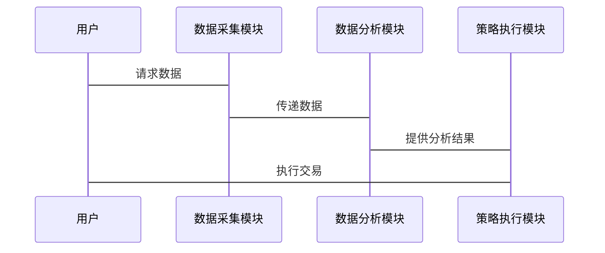

                 


# 如何利用特价股票策略捕捉市场底部

> 关键词：特价股票策略, 市场底部, 股票投资, 量化分析, 风险控制, 系统设计  
> 摘要：本文探讨如何利用特价股票策略捕捉市场底部，通过数学模型、系统设计和项目实战等方法，帮助投资者在市场波动中实现稳健收益。

---

## 第1章: 特价股票策略的背景与概念

### 1.1 什么是特价股票策略
#### 1.1.1 特价股票的定义
特价股票是指在特定市场条件下，价格低于其内在价值或历史平均水平的股票。这些股票通常被市场低估，具有较高的投资潜力。

#### 1.1.2 特价股票的市场特征
- **低估值**：市盈率、市净率等指标低于行业平均水平。
- **高波动性**：价格波动较大，短期内可能大幅波动。
- **周期性**：通常出现在市场低迷或衰退时期。

#### 1.1.3 特价股票与普通股票的区别
| 属性 | 特价股票 | 普通股票 |
|------|----------|----------|
| 估值 | 低估值    | 市场估值  |
| 波动性 | 高波动性  | 中低波动性 |
| 市场周期 | 低迷或衰退 | 不受特定周期影响 |

### 1.2 市场底部的定义与特征
#### 1.2.1 市场底部的形成机制
市场底部通常由供需失衡、投资者情绪低落等因素引起，是市场调整后的低点。

#### 1.2.2 特价股票与市场底部的关系
在市场底部，许多股票价格被低估，投资者可以通过购买特价股票来捕捉市场回升的机会。

#### 1.2.3 特价股票在市场周期中的位置
- **底部区域**：市场底部时，特价股票价格最低，适合买入。
- **回升阶段**：市场逐渐恢复，特价股票价格回升，带来收益。

### 1.3 特价股票策略的核心要素
#### 1.3.1 策略的目标与原则
- **目标**：在市场底部买入，市场回升时卖出，获取价差收益。
- **原则**：低买高卖，分散投资，风险控制。

#### 1.3.2 策略的适用场景
- **市场低迷**：适合使用特价股票策略。
- **行业周期低谷**：特定行业股票价格被低估时。

#### 1.3.3 策略的风险与挑战
- **市场波动**：价格波动大，可能导致亏损。
- **信息不对称**：难以获取准确的市场信息。
- **操作风险**：执行策略时的操作失误。

---

## 第2章: 特价股票策略的数学模型与分析

### 2.1 特价股票的统计分析
#### 2.1.1 市场波动的统计特征
市场波动可以用统计方法分析，如标准差、方差等指标。

#### 2.1.2 均值回归与波动率分析
- **均值回归**：假设价格会回归到均值，即市场底部时价格低于均值，市场顶部时高于均值。
- **波动率分析**：高波动率可能意味着市场不稳定，但波动率低可能意味着市场稳定。

### 2.2 特价股票的回归分析
#### 2.2.1 线性回归模型
使用线性回归分析股票价格与市场指数的关系，确定特价股票的异常值。

#### 2.2.2 非线性回归模型
考虑复杂市场关系，使用非线性回归模型进行分析。

### 2.3 特价股票的聚类分析
#### 2.3.1 聚类算法的原理
将股票按价格、估值等指标进行聚类，识别出特价股票。

#### 2.3.2 股票市场的聚类特征
分析聚类结果，找出低估值、高波动性的股票群体。

### 2.4 特价股票的数学模型实现
#### 2.4.1 模型的构建与优化
构建回归模型或聚类模型，优化参数以提高准确性。

#### 2.4.2 模型的验证与评估
使用历史数据验证模型，评估其预测能力。

---

## 第3章: 特价股票策略的系统分析与架构设计

### 3.1 系统分析
#### 3.1.1 系统目标与范围
开发一个系统，实时监控市场数据，识别特价股票，捕捉市场底部。

#### 3.1.2 系统功能需求
- 数据采集：实时获取股票价格、估值指标等数据。
- 数据分析：使用数学模型分析数据，识别特价股票。
- 策略执行：根据分析结果执行买入或卖出操作。

#### 3.1.3 系统性能需求
- 高效数据处理：快速处理大量数据。
- 实时分析：及时识别市场变化。

### 3.2 系统架构设计
#### 3.2.1 分层架构设计
- 数据层：存储市场数据。
- 业务逻辑层：处理数据，执行分析。
- 用户界面层：展示结果，提供操作界面。

#### 3.2.2 模块化设计
- 数据采集模块：负责数据的获取。
- 数据分析模块：执行数学模型分析。
- 策略执行模块：根据分析结果执行交易。

#### 3.2.3 系统接口设计
- 数据接口：与数据源对接，获取实时数据。
- 用户接口：提供友好的用户界面，方便操作。

### 3.3 系统实现
#### 3.3.1 数据采集模块
- 使用API获取股票数据，如Yahoo Finance API。
- 数据清洗：处理缺失值和异常值。

#### 3.3.2 数据分析模块
- 应用回归模型或聚类模型进行分析。
- 识别特价股票，生成买入信号。

#### 3.3.3 策略执行模块
- 根据信号执行交易，如买入或卖出。
- 记录交易日志，便于后续分析。

### 3.4 系统测试与优化
#### 3.4.1 测试方案设计
- 单元测试：测试各模块功能。
- 集成测试：测试系统整体性能。
- 性能测试：测试系统在高负载下的表现。

#### 3.4.2 测试结果分析
- 评估系统准确性，调整模型参数。
- 优化数据处理流程，提高效率。

---

## 第4章: 特价股票策略的项目实战

### 4.1 环境安装与配置
#### 4.1.1 Python环境搭建
- 安装Python，推荐使用Anaconda发行版。

#### 4.1.2 数据库安装与配置
- 使用MySQL或MongoDB存储数据。
- 配置数据库连接，确保数据安全。

#### 4.1.3 第三方库安装
- 使用pip安装numpy、pandas、scikit-learn等库。

### 4.2 系统核心实现
#### 4.2.1 数据采集与清洗
- 使用pandas库进行数据清洗。
- 处理缺失值，标准化数据格式。

#### 4.2.2 数据分析与建模
- 应用回归模型进行预测。
- 使用聚类算法识别特价股票。

#### 4.2.3 策略执行与测试
- 根据模型结果执行交易策略。
- 记录交易结果，分析策略的有效性。

### 4.3 代码实现与解读
#### 4.3.1 数据采集代码
```python
import pandas as pd
import numpy as np

# 示例代码：从Yahoo Finance获取数据
def get_stock_data(ticker):
    # 这里需要使用实际的API，如pandas_datareader
    data = pd.DataFrame()
    return data
```

#### 4.3.2 数据分析代码
```python
from sklearn.linear_model import LinearRegression

# 示例代码：线性回归模型
model = LinearRegression()
model.fit(X, y)
```

#### 4.3.3 策略执行代码
```python
def execute_strategy(signals):
    # 根据信号执行交易
    pass
```

### 4.4 实际案例分析
#### 4.4.1 案例背景介绍
假设2020年新冠疫情导致市场底部，许多股票价格被低估。

#### 4.4.2 数据分析与策略制定
- 采集疫情期间股票数据。
- 应用模型分析，识别特价股票。

#### 4.4.3 策略执行与结果分析
- 在市场底部买入特价股票。
- 市场回升时卖出，计算收益。

---

## 第5章: 特价股票策略的最佳实践与注意事项

### 5.1 最佳实践 tips
#### 5.1.1 策略执行中的注意事项
- 分散投资，避免过度集中。
- 定期监控，及时调整策略。

#### 5.1.2 风险控制策略
- 设置止损点，控制风险敞口。
- 保持充足的资金流动性。

#### 5.1.3 策略优化的建议
- 定期回测，验证策略的有效性。
- 引入更多指标，丰富分析维度。

### 5.2 系统架构的优化建议
#### 5.2.1 系统性能优化
- 使用分布式架构，提高数据处理效率。
- 优化数据库查询，提升响应速度。

#### 5.2.2 系统安全性的提升
- 加强数据加密，防止数据泄露。
- 定期进行安全漏洞扫描。

#### 5.2.3 系统可扩展性的增强
- 设计模块化架构，方便功能扩展。
- 使用云服务，弹性扩展资源。

### 5.3 项目总结与展望
#### 5.3.1 项目总结
总结项目成果，评估策略的有效性。

#### 5.3.2 未来研究方向
- 研究更复杂的模型，如机器学习算法。
- 探索多因子模型，提高预测精度。

#### 5.3.3 读者的进一步学习建议
建议读者学习相关书籍和课程，深入理解股票策略和数学模型。

---

## 第6章: 特价股票策略的数学模型与算法实现

### 6.1 算法原理讲解
#### 6.1.1 线性回归模型
$$ y = \beta_0 + \beta_1 x + \epsilon $$

#### 6.1.2 聚类算法
- K-means聚类：将股票分为不同的类别。
- 层次聚类：分析股票之间的关系。

### 6.2 数学公式
#### 6.2.1 均值回归公式
$$ E(y|x) = \beta_0 + \beta_1 x $$

#### 6.2.2 方差分析公式
$$ \sigma^2 = \frac{1}{n-1} \sum_{i=1}^{n} (x_i - \bar{x})^2 $$

### 6.3 算法流程图


### 6.4 系统架构图


### 6.5 系统交互图


---

# 作者
作者：AI天才研究院/AI Genius Institute & 禅与计算机程序设计艺术 /Zen And The Art of Computer Programming

