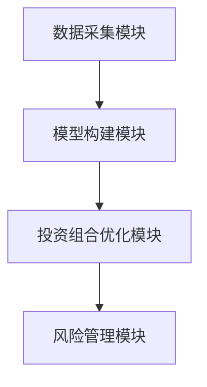
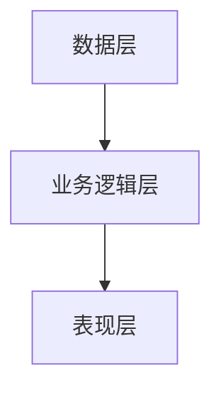

                 


# 如何利用特价股票策略构建全球宏观主题基金

> 关键词：特价股票策略，全球宏观主题基金，数学模型，系统架构，Python代码

> 摘要：本文将详细介绍如何利用特价股票策略构建全球宏观主题基金。通过分析特价股票策略的核心原理、全球宏观主题基金的系统架构、数学模型的构建与优化，以及实际项目实战，为读者提供一套完整的解决方案。本文适合对金融投资和计算机技术感兴趣的读者阅读。

---

## 第1章: 特价股票策略与全球宏观主题基金的背景介绍

### 1.1 特价股票策略的定义与特点

#### 1.1.1 特价股票的定义
特价股票是指市场价格显著低于其内在价值的股票。通常，这类股票可能因为市场波动、公司短期问题或市场情绪被低估。投资者可以通过挖掘这些被低估的股票，捕捉市场反弹或价值回归的机会。

#### 1.1.2 特价股票的核心特点
- **低估值**：市盈率（P/E）和市净率（P/B）等指标显著低于行业平均水平。
- **高分红**：许多特价股票的公司倾向于高分红，为投资者提供稳定的现金流。
- **高风险**：特价股票往往来自业绩不佳或处于困境中的公司，投资风险较高。
- **周期性**：特价股票的投资机会通常出现在市场低迷或经济衰退期。

#### 1.1.3 特价股票与普通股票的区别
| 属性       | 特价股票                     | 普通股票                     |
|------------|------------------------------|------------------------------|
| 估值水平   | 低于内在价值                 | 接近或高于内在价值             |
| 投资策略   | 价值回归型投资               | 增长型或价值型投资             |
| 风险水平   | 较高                         | 较低或适中                   |
| 适用场景   | 市场低迷或经济衰退             | 市场稳定或增长期               |

### 1.2 全球宏观主题基金的概念

#### 1.2.1 宏观主题基金的定义
宏观主题基金是一种以宏观经济趋势为投资主线，通过分析全球经济、行业周期和政策变化，投资于与特定主题相关的股票或资产的基金。

#### 1.2.2 全球宏观主题基金的特点
- **全球化视角**：投资范围覆盖全球市场，捕捉不同地区的投资机会。
- **主题驱动**：以特定经济主题（如科技、消费、能源等）为投资主线。
- **灵活调整**：根据宏观经济变化动态调整投资策略。
- **高波动性**：受宏观经济因素影响较大，收益波动性较高。

#### 1.2.3 宏观主题基金的投资策略
- **行业轮动**：根据宏观经济周期调整投资行业。
- **资产配置**：根据市场环境调整股票、债券等资产的比例。
- **主题挖掘**：识别全球范围内具有增长潜力的主题，集中投资。

### 1.3 特价股票策略在宏观主题基金中的应用

#### 1.3.1 特价股票策略在宏观投资中的作用
- **价值发现**：在宏观经济低迷期，特价股票往往具有较高的安全边际。
- **周期性投资**：在经济衰退期，特价股票策略可以帮助基金在底部布局，捕捉经济复苏带来的收益。

#### 1.3.2 特价股票与宏观经济的关系
- 特价股票通常出现在经济低迷期，反映了市场的悲观情绪。
- 在经济复苏或增长期，特价股票往往能够快速反弹，为基金带来超额收益。

#### 1.3.3 特价股票策略在全球市场中的应用案例
- 2008年全球金融危机后，许多银行和企业的股票价格大幅下跌，许多投资者通过特价股票策略成功抄底，获得了丰厚的回报。

---

## 第2章: 特价股票策略与宏观主题基金的核心概念

### 2.1 特价股票策略的数学模型

#### 2.1.1 特价股票选择的数学公式
$$ P = \frac{E}{P/E \text{目标值}} $$
其中：
- \( P \) 表示股票的内在价值。
- \( E \) 表示公司的净利润。
- \( P/E \text{目标值} \) 表示目标市盈率。

#### 2.1.2 市盈率（P/E）的计算公式
$$ P/E = \frac{\text{股价}}{\text{每股收益}} $$

#### 2.1.3 市净率（P/B）的计算公式
$$ P/B = \frac{\text{股价}}{\text{每股净资产}} $$

### 2.2 宏观主题基金的系统架构

#### 2.2.1 宏观主题基金的系统组成
- 数据采集模块：采集全球宏观经济数据、行业数据和个股数据。
- 模型构建模块：构建宏观经济主题模型，筛选相关股票。
- 投资组合优化模块：根据宏观经济预测优化投资组合。
- 风险管理模块：监控和管理投资风险。

#### 2.2.2 宏观主题基金的架构图



#### 2.2.3 宏观主题基金的实体关系图

```mermaid
erd
    entity 宏观主题基金
    entity 特价股票
    entity 宏观经济数据
    entity 行业数据
    entity 个股数据
    宏观主题基金 --|> 特价股票
    宏观主题基金 --|> 宏观经济数据
    宏观主题基金 --|> 行业数据
    宏观主题基金 --|> 个股数据
```

---

## 第3章: 特价股票策略的算法原理

### 3.1 特价股票筛选算法

#### 3.1.1 筛选算法的步骤
1. 采集个股数据，包括市盈率（P/E）、市净率（P/B）等指标。
2. 筛选出P/E低于行业平均水平的股票。
3. 筛选出P/B低于行业平均水平的股票。
4. 综合考虑其他因素（如公司财务状况、行业前景等），进一步筛选出具有投资价值的股票。

#### 3.1.2 算法的数学模型
$$ \text{筛选条件} = \begin{cases} 
P/E < \text{行业平均P/E} & \text{且} \\
P/B < \text{行业平均P/B} 
\end{cases} $$

#### 3.1.3 算法的实现代码
```python
import pandas as pd

def screen_cheap_stocks(stock_data, industry_avg_pe, industry_avg_pb):
    cheap_stocks = []
    for stock in stock_data.index:
        pe = stock_data.loc[stock, 'P/E']
        pb = stock_data.loc[stock, 'P/B']
        if pe < industry_avg_pe and pb < industry_avg_pb:
            cheap_stocks.append(stock)
    return cheap_stocks
```

### 3.2 宏观主题基金的投资策略算法

#### 3.2.1 投资策略的数学模型
$$ \text{投资权重} = \frac{\text{行业景气度}}{\sum \text{行业景气度}} $$
其中：
- 行业景气度 = 行业宏观经济指标的加权平均值。

#### 3.2.2 投资策略的实现代码
```python
import pandas as pd

def macro_theme_investment(stock_data, macro_factors):
    industry_sentiment = {}
    for industry in macro_factors.index:
        sentiment = 0
        for factor in macro_factors.columns:
            sentiment += macro_factors.loc[industry, factor]
        industry_sentiment[industry] = sentiment
    total_sentiment = sum(industry_sentiment.values())
    investment_weights = {industry: (sentiment / total_sentiment) for industry, sentiment in industry_sentiment.items()}
    return investment_weights
```

---

## 第4章: 特价股票策略与宏观主题基金的系统设计

### 4.1 系统功能设计

#### 4.1.1 系统功能模块划分
- 数据采集模块：负责采集全球宏观经济数据、行业数据和个股数据。
- 模型构建模块：负责构建特价股票筛选模型和宏观经济主题模型。
- 投资组合优化模块：负责根据模型输出结果优化投资组合。
- 风险管理模块：负责监控和管理投资风险。

#### 4.1.2 系统功能的流程图


#### 4.1.3 系统功能的实现代码
```python
import pandas as pd

class StockDataCollector:
    def collect_macro_data(self):
        # 采集宏观经济数据
        pass

    def collect_industry_data(self):
        # 采集行业数据
        pass

    def collect_stock_data(self):
        # 采集个股数据
        pass

class ModelBuilder:
    def build_stock_screen_model(self):
        # 构建股票筛选模型
        pass

    def build_macro_theme_model(self):
        # 构建宏观经济主题模型
        pass

class InvestmentOptimizer:
    def optimize_portfolio(self):
        # 优化投资组合
        pass

class RiskManager:
    def manage_risk(self):
        # 管理投资风险
        pass
```

### 4.2 系统架构设计

#### 4.2.1 系统架构的组成
- 数据层：存储宏观经济数据、行业数据和个股数据。
- 业务逻辑层：负责数据处理、模型构建和投资组合优化。
- 表现层：展示投资结果和风险管理信息。

#### 4.2.2 系统架构的流程图



#### 4.2.3 系统架构的优化建议
- 数据层：使用分布式数据库提高数据存储效率。
- 业务逻辑层：采用并行计算加速模型构建过程。
- 表现层：使用可视化工具提升用户体验。

---

## 第5章: 特价股票策略与宏观主题基金的项目实战

### 5.1 环境安装与配置

#### 5.1.1 环境配置的步骤
1. 安装Python编程语言。
2. 安装Pandas、NumPy等数据分析库。
3. 安装Matplotlib或Seaborn等可视化库。
4. 安装Jupyter Notebook用于代码编写和测试。

#### 5.1.2 环境配置的代码示例
```python
import sys
import pandas as pd
import numpy as np
import matplotlib.pyplot as plt
```

### 5.2 系统核心实现

#### 5.2.1 系统核心功能的实现代码
```python
def main():
    # 数据采集
    data_collector = StockDataCollector()
    macro_data = data_collector.collect_macro_data()
    industry_data = data_collector.collect_industry_data()
    stock_data = data_collector.collect_stock_data()

    # 模型构建
    model_builder = ModelBuilder()
    cheap_stocks = model_builder.build_stock_screen_model(stock_data)
    macro_theme = model_builder.build_macro_theme_model(macro_data, industry_data)

    # 投资组合优化
    investment_optimizer = InvestmentOptimizer()
    investment_optimizer.optimize_portfolio(cheap_stocks, macro_theme)

    # 风险管理
    risk_manager = RiskManager()
    risk_manager.manage_risk(investment_optimizer.get_portfolio())
```

#### 5.2.2 系统核心功能的优化建议
- 数据采集模块：使用爬虫技术获取实时数据。
- 模型构建模块：引入机器学习算法提高筛选精度。
- 投资组合优化模块：采用多因子模型优化投资组合。

### 5.3 实际案例分析

#### 5.3.1 案例分析的背景
假设在2020年全球经济衰退期间，许多企业股票价格大幅下跌，许多投资者通过特价股票策略成功抄底，获得了丰厚的回报。

#### 5.3.2 案例分析的步骤
1. 采集全球经济衰退期间的宏观经济数据和个股数据。
2. 筛选出符合条件的特价股票。
3. 构建宏观经济主题模型，确定投资主题。
4. 优化投资组合，分配资金比例。
5. 监控和管理投资风险。

#### 5.3.3 案例分析的结果与总结
通过特价股票策略和宏观经济主题模型的结合，投资者成功捕捉到了市场底部的投资机会，获得了显著的超额收益。

---

## 第6章: 特价股票策略与宏观主题基金的总结与展望

### 6.1 本章小结
- 特价股票策略是一种有效的投资工具，能够在市场低迷期捕捉价值回归的机会。
- 全球宏观主题基金通过分析宏观经济趋势，投资于具有增长潜力的主题。
- 通过特价股票策略和宏观主题基金的结合，投资者可以在不同市场环境下实现稳健的投资回报。

### 6.2 未来展望
- 随着人工智能技术的发展，特价股票筛选和宏观经济预测将更加精准。
- 全球化投资将继续深化，投资者需要关注新兴市场和新兴主题。
- 可持续投资和ESG（环境、社会、治理）因素将成为未来投资的重要方向。

---

作者：AI天才研究院/AI Genius Institute & 禅与计算机程序设计艺术 /Zen And The Art of Computer Programming

