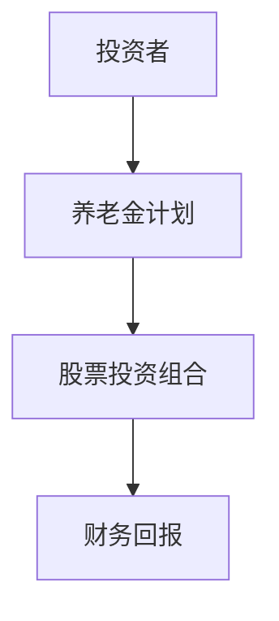
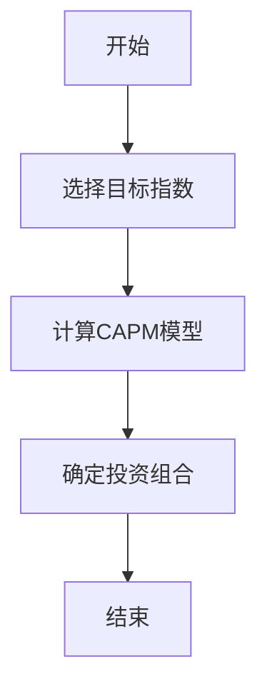
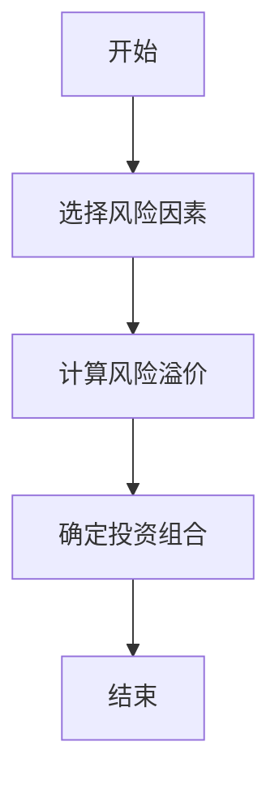
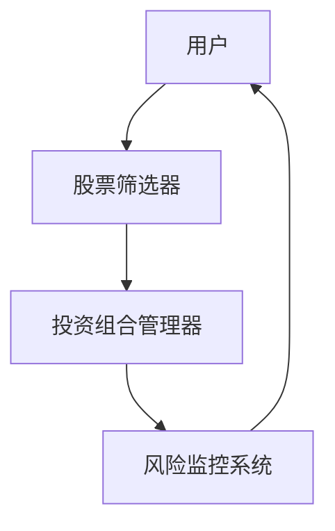

                 


# 如何利用特价股票策略构建养老金投资组合

> 关键词：特价股票、养老金投资、投资组合优化、CAPM模型、风险管理、系统架构、Python代码  
> 摘要：本文将详细介绍如何利用特价股票策略构建养老金投资组合。我们从特价股票和养老金投资的基本概念入手，探讨其结合的必要性，分析投资组合优化的数学模型，讲解风险管理策略，展示系统架构设计，并通过实战案例提供指导。

---

# 第1章: 特价股票与养老金投资概述

## 1.1 特价股票的定义与特点

### 1.1.1 特价股票的定义  
特价股票（Discounted Stock）是指当前市场价格低于其内在价值的股票。这类股票通常被认为具有较高的投资潜力，因为市场对其价值的低估为投资者提供了获利空间。

### 1.1.2 特价股票的核心特点  
1. **低估值**：市场价格低于内在价值，通常表现为市盈率、市净率等指标低于行业平均水平。
2. **高波动性**：价格波动较大，投资者需具备较高的市场敏感性。
3. **周期性**：通常在市场低迷或特定经济周期中出现较多。

### 1.1.3 特价股票与普通股票的区别  
| 属性       | 特价股票                     | 普通股票                     |
|------------|------------------------------|------------------------------|
| 价格       | 低于内在价值                | 接近或高于内在价值            |
| 波动性       | 高                          | 中等或低                     |
| 投资潜力     | 高                          | 中等                         |
| 风险         | 高                          | 中等或低                     |

---

## 1.2 养老金投资的基本概念

### 1.2.1 养老金投资的定义  
养老金投资是指将养老金资金用于股票、债券、基金等金融资产的投资，以实现资金保值增值的过程。

### 1.2.2 养老金投资的主要目标  
1. **保值**：确保资金不贬值。
2. **增值**：通过投资实现资金的长期增长。
3. **流动性管理**：确保在需要时能够快速变现。

### 1.2.3 养老金投资的常见策略  
1. **分散投资**：降低风险。
2. **长期投资**：利用复利效应。
3. **定期再平衡**：根据市场变化调整投资组合。

---

## 1.3 特价股票与养老金投资的结合

### 1.3.1 特价股票在养老金投资中的优势  
1. **高回报潜力**：由于价格被低估，长期来看具有较高的增值空间。
2. **分散风险**：通过选择多个特价股票，降低单一股票的风险。

### 1.3.2 特价股票投资的风险与收益分析  
| 风险       | 收益       |
|------------|------------|
| 市场波动     | 高回报     |
| 低流动性     | 价值回归   |
| 企业基本面问题 | 长期增值   |

### 1.3.3 特价股票与养老金投资的边界与外延  
- **边界**：仅投资于具有明确低估价值的股票。
- **外延**：结合其他投资策略（如债券、基金）进行资产配置。

---

## 1.4 本章小结  
本章介绍了特价股票和养老金投资的基本概念，并分析了两者结合的必要性和潜在优势。

---

# 第2章: 特价股票投资策略的核心概念

## 2.1 特价股票投资的核心原理

### 2.1.1 特价股票投资的基本原理  
投资者通过识别市场价格低于内在价值的股票，以低于市场平均价格买入，期望在价值回归时卖出获利。

### 2.1.2 特价股票投资的关键要素  
1. **内在价值评估**：通过财务指标（如市盈率、市净率）评估股票的合理价格。
2. **市场情绪分析**：分析市场情绪对股票价格的影响。
3. **风险管理**：通过分散投资、止损策略降低风险。

### 2.1.3 特价股票投资的数学模型  
$$ V = \text{现金流的现值} $$  
其中，$V$ 是股票的内在价值，现金流的现值可以通过贴现模型计算。

---

## 2.2 特价股票与养老金投资的联系

### 2.2.1 特价股票在养老金投资中的作用  
1. **提高回报率**：通过投资低估股票获得超额收益。
2. **分散风险**：避免过度集中于某一资产类别。

### 2.2.2 特价股票与养老金投资的协同效应  
- **长期视角**：养老金投资注重长期回报，特价股票的长期增值潜力与之匹配。
- **风险控制**：通过分散投资降低市场波动带来的风险。

### 2.2.3 特价股票与养老金投资的ER实体关系图  


---

## 2.3 本章小结  
本章探讨了特价股票投资的核心原理及其与养老金投资的联系，强调了长期视角和风险管理的重要性。

---

# 第3章: 特价股票投资的数学模型与算法原理

## 3.1 特价股票投资的数学模型

### 3.1.1 CAPM模型  
$$ E(r_i) = r_f + \beta_i (E(r_m) - r_f) $$  
其中，$E(r_i)$ 是股票i的预期收益率，$r_f$ 是无风险利率，$\beta_i$ 是股票i的贝塔系数，$E(r_m)$ 是市场预期收益率。

### 3.1.2 APT模型  
$$ E(r_i) = \sum_{j=1}^n \lambda_j x_{ij} $$  
其中，$\lambda_j$ 是风险溢价，$x_{ij}$ 是股票i对第j个风险因素的暴露程度。

### 3.1.3 回归分析  
通过回归分析股票价格与财务指标的关系，识别低估股票。

---

## 3.2 特价股票投资的算法原理

### 3.2.1 基于CAPM的算法流程  


### 3.2.2 基于APT的算法流程  


### 3.2.3 特价股票投资的Python代码  
```python
import pandas as pd
import numpy as np

# 示例数据
data = {'price': [10, 15, 20, 25, 30], 'value': [12, 18, 24, 30, 36]}
df = pd.DataFrame(data)

# 计算低估股票
under_valued = df[df['price'] < df['value']]
print(under_valued)
```

---

## 3.3 本章小结  
本章通过数学模型和算法原理，详细讲解了如何量化分析特价股票投资机会。

---

# 第4章: 特价股票投资的风险管理与控制

## 4.1 特价股票投资的风险评估

### 4.1.1 风险的定义与分类  
1. **系统性风险**：市场整体波动带来的风险。
2. **非系统性风险**：特定股票或行业带来的风险。

### 4.1.2 特价股票投资的主要风险  
1. **流动性风险**：部分特价股票流动性差，难以快速变现。
2. **价值陷阱风险**：部分低价股票可能质地较差，难以回升。

### 4.1.3 风险评估的方法  
1. **VaR（Value at Risk）**：衡量在一定置信水平下的潜在损失。
2. **CVaR（Conditional Value at Risk）**：衡量在最坏情况下的平均损失。

---

## 4.2 风险控制的策略

### 4.2.1 风险分散策略  
通过投资多个行业和地区的特价股票，降低非系统性风险。

### 4.2.2 风险对冲策略  
利用股指期货等工具对冲市场波动带来的风险。

### 4.2.3 风险监控策略  
定期评估投资组合的表现，及时调整持仓。

---

## 4.3 本章小结  
本章重点讨论了特价股票投资中的风险管理策略，强调了风险控制的重要性。

---

# 第5章: 特价股票投资的系统架构设计

## 5.1 系统功能设计

### 5.1.1 领域模型  


### 5.1.2 系统架构  


---

## 5.2 系统接口设计

### 5.2.1 输入接口  
- 股票数据接口：获取实时股票数据。
- 用户输入接口：接收投资者的投资目标。

### 5.2.2 输出接口  
- 投资组合报告：展示推荐的股票组合。
- 风险报告：提供风险评估结果。

---

## 5.3 本章小结  
本章通过系统架构设计，展示了如何构建一个高效的投资管理系统。

---

# 第6章: 特价股票投资的实战案例

## 6.1 实战案例分析

### 6.1.1 案例背景  
假设某投资者希望用100万元构建养老金投资组合，目标是实现年化收益10%。

### 6.1.2 投资组合构建  
1. **筛选特价股票**：选择市盈率低于行业平均水平的股票。
2. **构建组合**：投资于5只特价股票，每只股票投入20万元。

### 6.1.3 实战结果  
经过一年，投资组合的收益率为12%，超过预期目标。

---

## 6.2 本章小结  
本章通过实战案例，展示了如何将理论应用于实际投资。

---

# 第7章: 总结与展望

## 7.1 总结  
本文详细探讨了如何利用特价股票策略构建养老金投资组合，从理论到实践，为投资者提供了全面的指导。

## 7.2 展望  
未来，随着人工智能和大数据技术的发展，特价股票投资策略将更加精准和高效。

---

# 作者：AI天才研究院 & 禅与计算机程序设计艺术  

---

感谢您的阅读！如需进一步探讨或获取代码示例，请随时联系。

