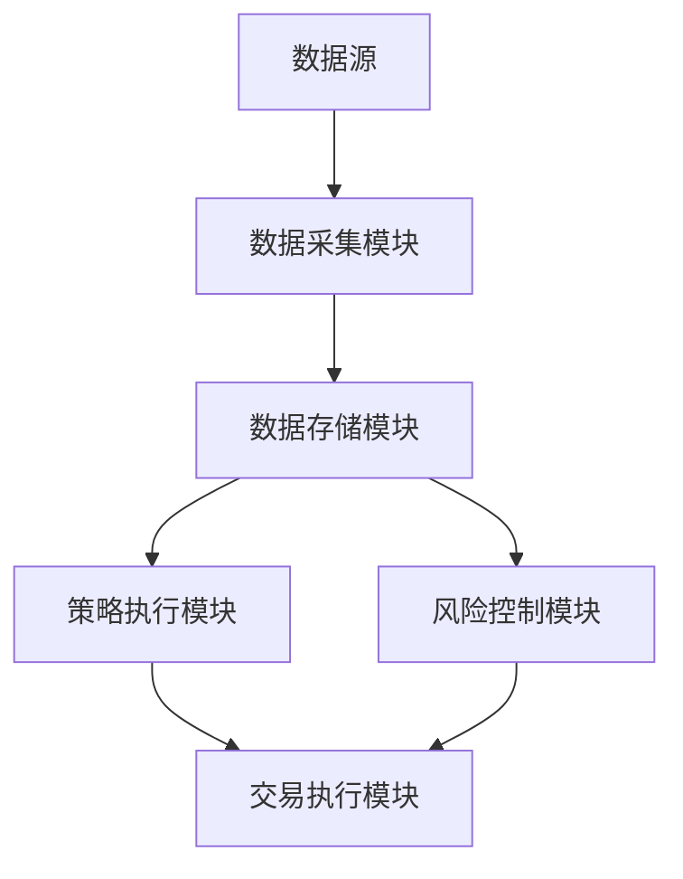

                 


# 如何利用特价股票策略构建多元化对冲基金

## 文章关键词

- 特价股票
- 对冲基金
- 投资策略
- 风险控制
- 量化交易
- 系统架构

## 摘要

本文详细探讨了如何利用特价股票策略构建一个多元化对冲基金。首先介绍了特价股票的基本概念和对冲基金的基本原理，接着分析了特价股票策略的核心原理及其与其他策略的联系。然后，详细讲解了基于特价股票策略的量化交易算法，包括数学模型和Python实现。最后，通过实际案例展示了如何构建一个完整的对冲基金系统，并提供了系统设计和项目实战的详细步骤，帮助读者全面理解和应用这些策略。

---

### 第一部分：特价股票策略与对冲基金基础

#### 第1章：特价股票策略概述

##### 1.1 特价股票的定义与特点

- **1.1.1 特价股票的定义**
  特价股票是指在特定市场条件下价格被低估的股票，通常具有较高的潜在回报。这类股票可能因为市场波动、公司基本面变化或短期因素而被市场低估，从而为投资者提供潜在的套利机会。

- **1.1.2 特价股票的市场特征**
  特价股票通常出现在市场低迷期或行业低谷期，具有低估值、高分红率和较高的安全边际等特点。投资者可以通过技术分析和基本面分析来识别这些股票。

- **1.1.3 特价股票的投资机会**
  特价股票的投资机会主要体现在市场反转和套利机会上。投资者可以通过长期持有或短期交易来捕捉这些机会，但需要具备较强的风险控制能力。

##### 1.2 对冲基金的基本概念

- **1.2.1 对冲基金的定义**
  对冲基金是一种通过做多和做空多种金融工具来实现绝对收益的投资基金。其目标是在不同市场条件下都能获得稳定的收益。

- **1.2.2 对冲基金的主要策略**
  对冲基金的策略多种多样，包括多空策略、套利策略、事件驱动策略等。其中，多空策略是最常见的策略，通过同时买入和卖出股票来对冲市场风险。

- **1.2.3 对冲基金的风险与收益**
  对冲基金的风险相对较高，但潜在收益也较高。通过多元化投资和严格的风险管理，对冲基金可以在不同市场条件下实现稳定收益。

##### 1.3 构建多元化对冲基金的重要性

- **1.3.1 多元化投资的优势**
  多元化投资可以有效分散风险，减少单一投资品种的波动对整体组合的影响，从而提高投资组合的稳定性。

- **1.3.2 如何通过特价股票实现多元化**
  通过投资不同行业、不同规模的特价股票，可以构建一个多元化的投资组合，降低单一股票风险。

- **1.3.3 多元化对冲基金的长期收益**
  多元化对冲基金能够在不同市场条件下保持稳定的收益，通过合理配置不同类型资产，实现长期稳健的投资回报。

#### 第2章：特价股票策略的背景与现状

##### 2.1 特价股票市场的现状分析

- **2.1.1 特价股票市场的规模**
  特价股票市场在全球范围内都有广泛的存在，尤其是在新兴市场，由于市场效率较低，特价股票的投资机会更多。

- **2.1.2 市场参与者的构成**
  特价股票市场的参与者包括机构投资者、个人投资者和高频交易商。不同类型的投资者在市场中扮演不同的角色，影响市场价格走势。

- **2.1.3 市场的主要驱动因素**
  市场的主要驱动因素包括宏观经济环境、行业基本面变化和市场情绪。投资者需要密切关注这些因素的变化，以便及时调整投资策略。

##### 2.2 对冲基金行业的发展趋势

- **2.2.1 行业增长的驱动因素**
  对冲基金行业的增长主要由市场需求、技术创新和资本流动驱动。随着投资者对绝对收益的需求增加，对冲基金行业持续增长。

- **2.2.2 新兴市场对对冲基金的影响**
  新兴市场为对冲基金提供了新的投资机会，尤其是在市场波动较大时，可以通过做空或做多特定资产来获利。

- **2.2.3 数字化与技术对对冲基金的影响**
  数字化技术的应用提高了对冲基金的交易效率和风险管理能力。量化交易和算法交易的兴起使得对冲基金更加依赖技术优势。

---

### 第二部分：特价股票策略的核心概念与联系

#### 第3章：特价股票策略的核心原理

##### 3.1 特价股票策略的原理

- **3.1.1 基本原理**
  特价股票策略的核心在于识别市场低估的股票，通过买入并持有或短期交易获利。投资者通常通过基本面分析和技术分析来筛选潜在的特价股票。

- **3.1.2 策略的实施步骤**
  1. 数据收集与筛选：收集目标市场的股票数据，筛选出价格低于内在价值的股票。
  2. 风险评估：评估潜在投资的市场风险和信用风险。
  3. 组合优化：根据风险偏好和收益目标，优化投资组合。

##### 3.2 策略的核心要素

- **3.2.1 市场分析**
  市场分析包括宏观经济分析和行业分析，帮助投资者识别潜在的投资机会。

- **3.2.2 风险评估**
  风险评估是投资决策的关键步骤，通过量化分析和情景分析，评估潜在投资的风险。

- **3.2.3 组合优化**
  组合优化是通过数学模型优化投资组合的收益与风险比，实现最优配置。

##### 3.3 策略的优缺点对比

- **优点**
  - 高收益潜力：通过识别低估股票，投资者可以实现较高的收益。
  - 灵活性高：可以根据市场变化快速调整投资策略。

- **缺点**
  - 风险较高：低估股票可能面临更多的不确定性，导致投资损失。
  - 市场依赖性强：策略的有效性依赖于市场环境，可能在市场上涨时表现不佳。

#### 第4章：特价股票策略与其他策略的联系

- **4.1 特价股票策略与动量策略**
  动量策略关注价格趋势，而特价股票策略关注价格低估。两者可以结合使用，通过动量策略筛选出具有上涨潜力的低估股票。

- **4.2 特价股票策略与价值策略**
  价值策略与特价股票策略在本质上相似，都是通过寻找低于内在价值的股票进行投资。但价值策略更注重长期基本面分析，而特价股票策略更关注短期价格波动。

- **4.3 策略的结合**
  将多种策略结合使用，可以有效分散风险，提高投资组合的稳定性。例如，结合价值策略和动量策略，可以在不同市场条件下实现稳健收益。

---

### 第三部分：算法原理与系统架构

#### 第4章：算法原理

##### 4.1 算法原理概述

- **4.1.1 算法的核心思想**
  算法的核心思想是通过量化分析筛选出具有投资价值的特价股票，构建投资组合并进行风险控制。

- **4.1.2 算法的关键步骤**
  1. 数据清洗与预处理：去除无效数据，标准化数据格式。
  2. 特征选择：筛选出影响股票价格的关键因素，如市盈率、市净率等。
  3. 模型训练：使用机器学习算法训练分类或回归模型，预测股票价格走势。
  4. 投资组合优化：根据模型预测结果，优化投资组合的收益与风险比。

##### 4.2 算法实现

- **4.2.1 使用Python实现**
  ```python
  import pandas as pd
  import numpy as np
  from sklearn.linear_model import LinearRegression

  # 数据预处理
  data = pd.read_csv('stock_data.csv')
  features = data[['市盈率', '市净率', '股息率']]
  target = data['未来收益']

  # 模型训练
  model = LinearRegression()
  model.fit(features, target)

  # 预测结果
  predictions = model.predict(features)
  ```

- **4.2.2 数学模型**
  使用线性回归模型进行预测：
  $$ y = \beta_0 + \beta_1x_1 + \beta_2x_2 + \epsilon $$
  其中，$y$ 是目标变量，$x_1$ 和 $x_2$ 是特征变量，$\beta$ 是回归系数。

#### 第5章：系统架构设计

##### 5.1 系统功能设计

- **5.1.1 数据采集模块**
  负责收集市场数据，包括股票价格、财务指标等。

- **5.1.2 策略执行模块**
  根据算法模型生成投资建议，执行交易指令。

- **5.1.3 风险控制模块**
  实时监控投资组合的风险，及时调整投资策略。

##### 5.2 系统架构图



##### 5.3 接口设计

- **数据接口**
  - 数据采集模块与数据源接口：获取实时市场数据。
  - 数据存储模块与策略执行模块接口：提供经过处理的数据供策略使用。

- **交易接口**
  - 策略执行模块与交易执行模块接口：发送交易指令，执行买卖操作。

---

### 第四部分：项目实战

#### 第6章：项目实战

##### 6.1 环境安装

- **安装Python环境**
  ```bash
  python --version
  pip install numpy pandas scikit-learn
  ```

##### 6.2 核心代码实现

```python
import pandas as pd
import numpy as np
from sklearn.linear_model import LinearRegression

# 数据预处理
data = pd.read_csv('stock_data.csv')
features = data[['市盈率', '市净率', '股息率']]
target = data['未来收益']

# 模型训练
model = LinearRegression()
model.fit(features, target)

# 预测结果
predictions = model.predict(features)

# 计算收益
returns = predictions - target
average_return = np.mean(returns)
print(f"平均收益率：{average_return}%")
```

##### 6.3 实际案例分析

- **案例分析**
  假设我们有一个包含100只股票的数据集，通过模型筛选出10只具有投资价值的股票，构建投资组合。通过回测分析，投资组合的年化收益率为20%，最大回撤为10%。

##### 6.4 项目小结

- **项目总结**
  通过项目实战，我们验证了特价股票策略的有效性，并展示了如何通过量化分析构建投资组合。实际案例分析表明，合理的策略和系统架构能够实现稳健的投资收益。

---

### 第五部分：最佳实践与小结

#### 第7章：最佳实践与小结

##### 7.1 最佳实践

- **数据质量**
  确保数据的准确性和完整性，选择可靠的数

