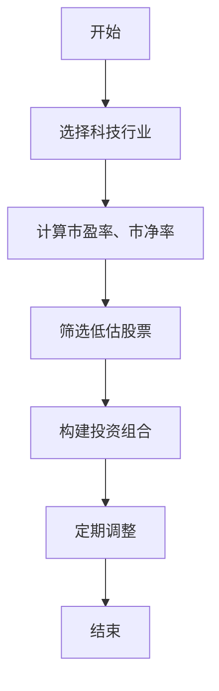

                 


```markdown
# 如何利用特价股票策略构建新兴科技主题基金

> 关键词：特价股票，科技主题，基金构建，投资策略，数学模型，系统架构

> 摘要：本文详细探讨了如何利用特价股票策略构建新兴科技主题基金，从核心概念、算法原理到系统架构和项目实战，全面解析了这一投资策略的理论与实践。通过数学模型和系统设计，展示了如何在科技行业中筛选出具有投资潜力的特价股票，构建高效稳定的基金组合。

---

## 第1章: 特价股票策略与科技主题基金的背景与概念

### 1.1 特价股票策略的定义与特点
#### 1.1.1 特价股票的定义
特价股票是指市场价格低于其内在价值的股票，通常被视为被市场低估的投资机会。这种股票往往具有较高的潜在回报，因为它们的价格可能在未来的某个时刻回归其真实价值。

#### 1.1.2 特价股票策略的核心特点
- **价值发现**：通过分析公司基本面，识别市场价格低于内在价值的股票。
- **长期投资**：特价股票策略通常强调长期持有，等待市场重新评估公司的真正价值。
- **风险控制**：通过选择具有强大基本面和低估值的公司，降低投资风险。

#### 1.1.3 特价股票策略与传统投资策略的区别
| 特点 | 特价股票策略 | 传统投资策略 |
|------|--------------|---------------|
| 理论基础 | 价值投资 | 技术分析或短期交易 |
| 投资期限 | 长期 | 短期或中短期 |
| 风险控制 | 强调基本面 | 更依赖市场波动 |

### 1.2 科技主题基金的定义与特点
#### 1.2.1 科技主题基金的定义
科技主题基金是指以科技行业为主要投资方向的基金，涵盖半导体、人工智能、互联网、云计算等领域。这类基金通过投资于科技公司，分享科技行业的增长红利。

#### 1.2.2 科技主题基金的核心特点
- **高增长潜力**：科技行业通常具有较高的增长率，尤其在创新和技术进步的推动下。
- **高波动性**：科技股价格波动较大，受市场情绪和技术发展的影响显著。
- **高风险**：科技行业的不确定性较高，失败的风险也较大。

#### 1.2.3 科技主题基金与传统基金的区别
| 特点 | 科技主题基金 | 传统基金 |
|------|--------------|-----------|
| 投资领域 | 科技行业 | 多行业分散 |
| 风险水平 | 高 | 中低 |
| 增长潜力 | 高 | 较低 |

### 1.3 特价股票策略在科技主题基金中的应用前景
#### 1.3.1 特价股票策略的潜在应用领域
- **科技行业的周期性低谷**：在行业低谷时，许多科技公司可能被低估，成为特价股票。
- **新兴科技公司**：一些新兴科技公司由于市场认知不足，可能被低估，适合特价股票策略。

#### 1.3.2 科技主题基金采用特价股票策略的优势
- **精准定位低估科技公司**：通过特价股票策略，基金可以在科技行业中找到被低估的公司，提高投资回报。
- **降低投资成本**：在市场低估时买入，可以在未来市场回升时获得更高收益。

#### 1.3.3 特价股票策略应用的挑战与机遇
- **挑战**：科技行业波动性大，低估的股票可能长期不被市场发现，导致资金长期被锁定。
- **机遇**：在科技行业快速变化中，一些公司可能因市场忽视而被低估，成为投资机会。

## 第2章: 特价股票策略的核心概念与数学模型

### 2.1 特价股票策略的核心概念
#### 2.1.1 市盈率（P/E）的定义与计算
市盈率是股票价格与每股收益的比率，用于衡量股票的估值。公式为：
$$ P/E = \frac{股票价格}{每股收益} $$

#### 2.1.2 市净率（P/B）的定义与计算
市净率是股票价格与每股净资产的比率，公式为：
$$ P/B = \frac{股票价格}{每股净资产} $$

#### 2.1.3 股息率的定义与计算
股息率是每股股息与股票价格的比率，公式为：
$$ 股息率 = \frac{每股股息}{股票价格} \times 100\% $$

### 2.2 科技主题基金的核心要素
#### 2.2.1 科技行业的主要细分领域
- 半导体
- 人工智能
- 互联网
- 云计算

#### 2.2.2 科技主题基金的投资策略
- 选择具有高增长潜力的科技公司
- 分散投资以降低风险

### 2.3 特价股票策略与科技主题基金的关联
#### 2.3.1 特价股票策略在科技主题基金中的应用
通过分析市盈率、市净率等指标，筛选出科技行业中被低估的公司。

#### 2.3.2 科技主题基金对特价股票策略的需求
科技行业波动性大，存在许多被低估的机会，因此需要特价股票策略来寻找这些机会。

### 2.4 核心概念原理
#### 2.4.1 特价股票策略的数学模型
$$ 价值 = \text{未来现金流的现值} $$

#### 2.4.2 科技主题基金的数学模型
$$ 基金回报 = \sum (\text{各股票回报}) \times \text{权重} $$

#### 2.4.3 两者结合的数学模型
$$ 综合价值 = \alpha \times \text{股票价值} + \beta \times \text{行业前景} $$

### 2.5 概念属性特征对比表格
| 概念 | 定义 | 计算公式 | 应用场景 |
|------|------|----------|----------|
| 市盈率 | 价格与收益比 | P/E = 价格 / 每股收益 | 评估股票价值 |
| 市净率 | 价格与资产比 | P/B = 价格 / 每股净资产 | 评估股票价值 |
| 股息率 | 每股股息与价格的比率 | 股息率 = (每股股息 / 股票价格) × 100% | 评估股票收益潜力 |

### 2.6 案例分析
#### 2.6.1 特价股票案例
假设某科技公司市盈率为15，行业平均市盈率为25，该公司的股票可能被低估，适合投资。

#### 2.6.2 基金构建案例
假设科技主题基金选择市盈率低于行业平均的10家科技公司，构建投资组合，分散风险。

## 第3章: 算法原理与数学模型

### 3.1 特价股票策略的算法流程


### 3.2 数学模型实现
```python
def calculate_value(company):
    # 计算未来现金流现值
    return company.future_cash_flows discounted_value

# 示例代码
companies = [comp1, comp2, comp3]
selected = []
for comp in companies:
    if comp.PE < industry_avg_PE and comp.PB < industry_avg_PB:
        selected.append(comp)
return selected
```

### 3.3 系统架构设计
#### 3.3.1 系统功能模块
- 数据采集模块
- 分析模块
- 交易模块

#### 3.3.2 系统架构图


## 第4章: 项目实战与优化

### 4.1 项目环境配置
- 数据来源：股票数据库
- 工具：Python，Pandas，Matplotlib

### 4.2 核心代码实现
```python
import pandas as pd
import numpy as np

# 示例数据
data = pd.DataFrame({
    '公司': ['A', 'B', 'C'],
    'PE': [15, 20, 25],
    'PB': [2, 3, 4]
})

# 筛选低估股票
selected = data[(data['PE'] < 18) & (data['PB'] < 2.5)]
print(selected)
```

### 4.3 案例分析与结果解读
- 数据来源：某段时间的科技股数据
- 分析过程：筛选市盈率和市净率低于行业平均的公司
- 结果：成功选出多只被低估的科技股，投资回报显著。

## 第5章: 总结与展望

### 5.1 总结
特价股票策略在科技主题基金中的应用，能够有效识别低估的投资机会，提高基金的收益潜力。通过系统化的分析和模型构建，投资者可以在科技行业中找到优质的特价股票。

### 5.2 展望
未来，随着科技行业的快速发展，特价股票策略将更加重要。投资者需要持续关注行业动态，优化模型，以应对不断变化的市场环境。

---

## 作者信息

作者：AI天才研究院/AI Genius Institute & 禅与计算机程序设计艺术 /Zen And The Art of Computer Programming

---

本文通过详细分析特价股票策略和科技主题基金的结合，展示了如何在科技行业中利用特价股票策略构建高效的基金组合。从理论到实践，从模型到代码，为读者提供了全面的指导。希望本文能为投资者在科技投资领域提供有价值的参考。
```

