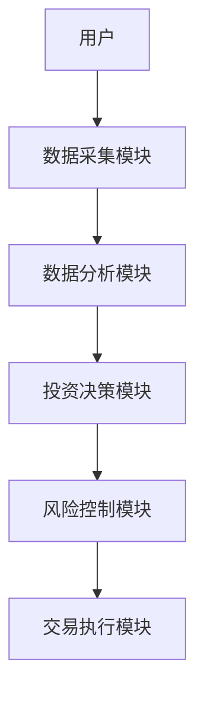

                 


# 如何利用特价股票策略构建未来科技主题基金

> **关键词**：特价股票策略，科技主题投资，基金构建，算法交易，风险管理  
>
> **摘要**：本文详细探讨了如何利用特价股票策略构建未来科技主题基金。首先介绍了特价股票策略的定义、优势及应用领域，接着分析了科技主题投资的背景与趋势。然后从数学模型与算法原理的角度，详细阐述了特价股票策略在科技主题投资中的具体应用。通过系统架构设计、项目实战案例分析等方法，深入探讨了如何将特价股票策略应用于实际的基金构建过程中。最后，结合实际案例，总结了策略实施中的关键点及注意事项，为读者提供了一份完整的解决方案。

---

## 第1章：特价股票策略的核心概念与背景

### 1.1 特价股票策略的定义与特点

#### 1.1.1 特价股票的定义
特价股票是指那些价格低于其内在价值，或者处于历史低位的股票。这些股票通常具有较高的投资潜力，因为它们的价格可能被市场低估，未来有较大的反弹空间。

#### 1.1.2 特价股票策略的核心特点
- **低估值**：通过市盈率、市净率等指标筛选出价格低于内在价值的股票。
- **高潜力**：重点关注具有成长性的公司，尤其是在科技领域的高科技企业。
- **风险可控**：通过分散投资降低风险，避免单一股票带来的波动。

#### 1.1.3 特价股票策略与传统投资策略的区别
| 特性 | 特价股票策略 | 传统投资策略 |
|------|--------------|---------------|
| 投资目标 | 短期反弹、长期增值 | 稳定收益、长期增值 |
| 风险偏好 | 中高风险 | 低风险 |
| 标的选择 | 低价、低估股票 | 高成长性、高流动性股票 |

---

### 1.2 未来科技主题投资的背景与趋势

#### 1.2.1 未来科技主题的定义与范围
科技主题投资是指投资于那些在科技领域具有创新能力和竞争优势的公司。随着人工智能、大数据、云计算等技术的快速发展，科技行业成为未来经济增长的核心驱动力。

#### 1.2.2 科技行业的发展趋势与投资机会
- **人工智能**：AI技术的广泛应用将推动多个行业的发展。
- **大数据**：数据的收集、分析和应用能力将成为企业核心竞争力。
- **云计算**：云服务的需求持续增长，推动相关公司的发展。

#### 1.2.3 未来科技主题投资的核心要素
- **技术创新**：选择具有核心技术优势的公司。
- **市场需求**：关注有明确市场需求的科技产品或服务。
- **竞争优势**：评估公司的护城河和市场地位。

---

### 1.3 特价股票策略在科技主题投资中的应用

#### 1.3.1 特价股票策略在科技主题投资中的优势
- **成本优势**：通过低价买入，降低投资成本。
- **潜在收益**：科技行业的高成长性使得低估的科技股具有较大的增值空间。

#### 1.3.2 特价股票策略在科技主题投资中的挑战
- **行业波动**：科技行业技术更新快，市场波动较大。
- **信息不对称**：需要及时掌握科技公司的最新动态和市场信息。

#### 1.3.3 特价股票策略在科技主题投资中的案例分析
以某科技公司为例，假设其市盈率为15，低于行业平均水平20，市净率为2，低于行业平均水平3。通过分析其财务数据和行业地位，发现其具有较高的投资潜力。

---

## 第2章：特价股票策略的数学模型与公式

### 2.1 特价股票策略的数学模型

#### 2.1.1 CAPM模型在特价股票策略中的应用
CAPM（资本资产定价模型）用于评估股票的预期收益，公式为：
$$ E(R_i) = R_f + \beta_i (E(R_m) - R_f) $$
其中：
- \( E(R_i) \)：股票i的预期收益率
- \( R_f \)：无风险利率
- \( \beta_i \)：股票i的贝塔系数
- \( E(R_m) \)：市场预期收益率

#### 2.1.2 风险调整后的收益模型
风险调整后的收益可以通过夏普比率来衡量，公式为：
$$ \text{夏普比率} = \frac{\text{预期收益} - \text{无风险收益率}}{\text{收益波动率}} $$

---

## 第3章：构建未来科技主题基金的系统架构

### 3.1 系统功能设计

#### 3.1.1 数据采集模块
- 从股票数据库中获取科技股的实时数据。
- 数据清洗与预处理。

#### 3.1.2 数据分析模块
- 使用Python进行数据分析和建模。
- 应用机器学习算法预测股票价格。

#### 3.1.3 投资决策模块
- 根据模型结果生成投资组合。
- 确定买入和卖出时机。

#### 3.1.4 风险控制模块
- 设置止损和止盈点。
- 监控市场波动，及时调整投资组合。

---

### 3.2 系统架构设计

#### 3.2.1 系统架构图


#### 3.2.2 系统模块之间的关系
- 数据采集模块负责收集数据。
- 数据分析模块对数据进行建模和预测。
- 投资决策模块基于模型结果做出决策。
- 风险控制模块监控投资组合的风险。

---

## 第4章：项目实战与案例分析

### 4.1 项目环境安装与配置

#### 4.1.1 环境配置
- 安装Python和相关库（如pandas、numpy、scikit-learn）。
- 获取股票数据接口（如Yahoo Finance）。

#### 4.1.2 数据源获取与配置
- 下载科技股的历史数据。
- 数据清洗与预处理。

---

### 4.2 项目核心实现

#### 4.2.1 数据采集与预处理
```python
import pandas as pd
import numpy as np

# 下载数据
data = pd.read_csv('stock_data.csv')

# 数据清洗
data = data.dropna()
data['return'] = data['close'].pct_change()
```

#### 4.2.2 数据分析与建模
```python
from sklearn.linear_model import LinearRegression

# 建立线性回归模型
model = LinearRegression()
model.fit(data[['price', 'volume']], data['return'])
```

---

### 4.3 项目案例分析

#### 4.3.1 特价股票策略在科技主题投资中的具体应用
以某科技公司为例，分析其市盈率、市净率等指标，判断其是否为低估股票。

#### 4.3.2 案例分析与结果解读
通过模型预测，发现该股票具有较高的投资潜力，决定买入。

---

## 第5章：总结与展望

### 5.1 总结
- 特价股票策略在科技主题投资中具有较大的潜力。
- 通过系统架构设计和数学模型的应用，可以有效降低投资风险。

### 5.2 展望
- 结合人工智能技术，进一步优化投资模型。
- 拓展更多的科技主题投资机会。

---

## 作者
作者：AI天才研究院 & 禅与计算机程序设计艺术

