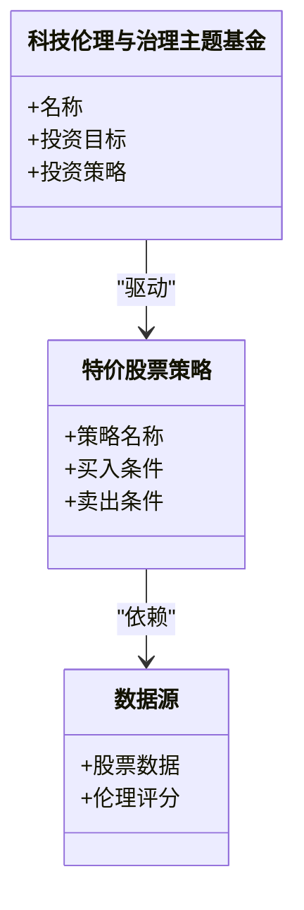
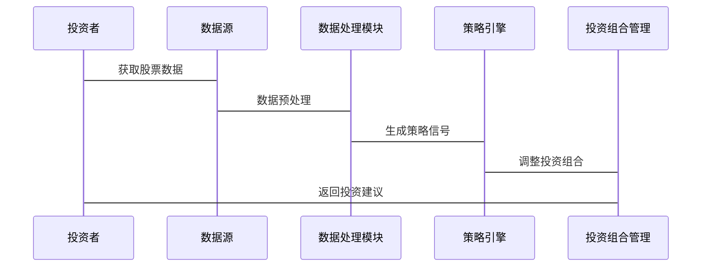

                 


# 如何利用特价股票策略构建未来科技伦理与治理主题基金

> 关键词：科技伦理，治理主题，基金构建，特价股票策略，量化投资，系统架构

> 摘要：本文探讨了如何利用特价股票策略构建未来科技伦理与治理主题基金。文章首先介绍了科技伦理与治理主题基金的背景，分析了特价股票策略的核心概念及其与主题基金的关系。接着，详细讲解了量化投资模型的算法原理，包括数据收集、特征选择、模型训练和策略优化。随后，从系统架构设计的角度，展示了如何构建支持特价股票策略的主题基金系统，包括功能设计、架构图、接口设计和交互流程。最后，通过实战案例分析了如何将这些理论应用于实际投资中，并总结了最佳实践和未来的研究方向。

---

## 第一章: 引言

### 1.1 本书的目的与意义
- 1.1.1 为什么选择科技伦理与治理主题基金？
- 1.1.2 特价股票策略的核心价值
- 1.1.3 本书的结构与阅读方法

### 1.2 本书的核心概念
- 1.2.1 科技伦理与治理的定义
- 1.2.2 特价股票策略的基本原理
- 1.2.3 主题基金的构建逻辑

---

## 第二章: 背景介绍

### 2.1 科技伦理与治理主题基金的背景
- 2.1.1 科技发展的伦理挑战
- 2.1.2 治理框架的演变
- 2.1.3 科技伦理与投资的结合

### 2.2 特价股票策略的背景
- 2.2.1 特价股票的定义与特点
- 2.2.2 市场周期与投资机会
- 2.2.3 特价股票策略的优缺点

---

## 第三章: 核心概念与联系

### 3.1 科技伦理与治理主题基金的核心概念
- 3.1.1 主题基金的定义与分类
- 3.1.2 科技伦理与治理的实体关系图
```mermaid
er
    entity 科技伦理与治理 {
        id
        名称
        核心原则
    }
    entity 特价股票策略 {
        id
        名称
        战略目标
    }
    entity 主题基金 {
        id
        名称
        投资目标
    }
    科技伦理与治理 --> 特价股票策略: "驱动"
    特价股票策略 --> 主题基金: "构建"
```

### 3.2 特价股票策略与主题基金的关系
- 3.2.1 策略与基金的相互作用
- 3.2.2 理论模型与实际应用
- 3.2.3 核心概念的对比分析
```markdown
| 概念 | 定义 | 属性 |
|------|------|------|
| 特价股票策略 | 以低于市场价买入股票的策略 | 价格敏感性、周期性、风险性 |
| 主题基金 | 投资于特定主题的基金 | 主题聚焦性、分散性、长期性 |
```

---

## 第四章: 算法原理讲解

### 4.1 量化投资模型
- 4.1.1 数据收集与特征提取
- 4.1.2 模型训练与优化
- 4.1.3 策略生成与评估


### 4.2 数学模型与公式
- 4.2.1 回归分析模型
$$ y = \beta_0 + \beta_1 x + \epsilon $$
- 4.2.2 时间序列分析模型
$$ ARIMA(p, d, q) $$
- 4.2.3 优化算法
$$ \min_{w} \frac{1}{2}w^Tw + \lambda \|w\|_1 $$

---

## 第五章: 系统分析与架构设计

### 5.1 问题场景介绍
- 5.1.1 投资者需求分析
- 5.1.2 系统目标设定

### 5.2 项目介绍
- 5.2.1 系统功能设计


### 5.3 系统架构设计


### 5.4 系统接口设计
- 5.4.1 API接口定义
- 5.4.2 数据交互流程

### 5.5 系统交互流程


---

## 第六章: 项目实战

### 6.1 环境安装
- 6.1.1 安装Python
- 6.1.2 安装相关库（如pandas、numpy、scikit-learn）

### 6.2 核心代码实现
```python
# 简单的回归模型示例
import pandas as pd
import numpy as np
from sklearn.linear_model import LinearRegression

# 数据加载
data = pd.read_csv('stock_data.csv')

# 特征与目标分离
X = data[['price', 'volume']]
y = data['target']

# 模型训练
model = LinearRegression()
model.fit(X, y)

# 预测
new_data = pd.DataFrame({'price': [100], 'volume': [2000]})
prediction = model.predict(new_data)
print(prediction)
```

### 6.3 案例分析
- 6.3.1 实战案例
- 6.3.2 代码实现与解读
- 6.3.3 投资结果分析

### 6.4 项目总结
- 6.4.1 成果展示
- 6.4.2 经验教训
- 6.4.3 改进建议

---

## 第七章: 结论与展望

### 7.1 结论
- 7.1.1 核心观点总结
- 7.1.2 研究成果概述

### 7.2 未来展望
- 7.2.1 研究方向
- 7.2.2 技术趋势
- 7.2.3 投资机会

---

## 附录

### 附录A: 数据来源与处理
- 数据清洗代码示例

### 附录B: 工具安装指南
- 如何安装并配置量化投资工具

### 附录C: 参考文献
- 相关书籍与论文推荐

---

## 作者：AI天才研究院 & 禅与计算机程序设计艺术

