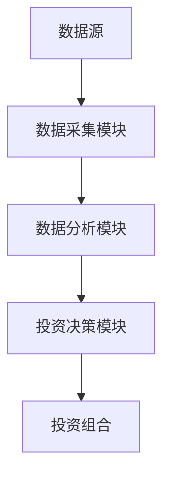
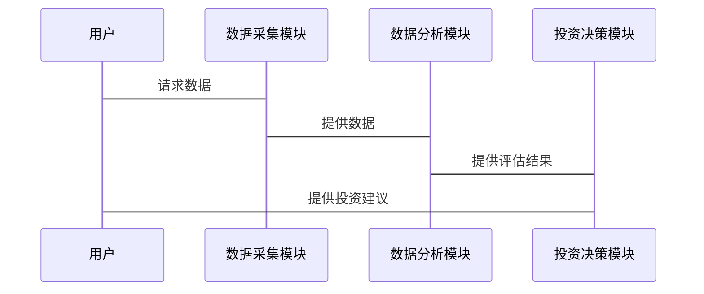

                 


# 如何利用特价股票策略构建未来科技伦理主题基金

## 关键词：特价股票、科技伦理、主题基金、投资策略、风险管理

## 摘要：本文探讨了如何利用特价股票策略构建一个以未来科技伦理为主题的基金。通过分析特价股票的特点、科技伦理的重要性以及如何结合两者构建基金，文章详细讲解了投资策略、数学模型、系统架构和实战案例，为读者提供了全面的指导。

---

## 正文

### 第一部分：特价股票策略与科技伦理概述

#### 第1章：特价股票策略的基础

##### 1.1 特价股票的定义与特点

###### 1.1.1 特价股票的定义
特价股票是指价格被市场低估的股票，通常具有较高的潜在增值空间。这些股票可能因为市场波动或公司短期问题而被低估，但具备长期投资价值。

###### 1.1.2 特价股票的特点与优势
- **低估价格**：市场价格低于内在价值。
- **高潜在回报**：长期持有的增值潜力大。
- **低风险**：通常来自财务健康但暂时被市场忽视的公司。

###### 1.1.3 特价股票与传统股票的区别
| 特性 | 特价股票 | 传统股票 |
|------|-----------|-----------|
| 价格 | 低于价值 | 反映市场情绪 |
| 风险 | 较低      | 较高       |
| 回报 | 长期较高   | 短期波动大 |

##### 1.2 科技伦理的重要性

###### 1.2.1 科技伦理的基本概念
科技伦理涉及科技发展中的道德规范，确保技术进步符合社会价值观和法律规定。

###### 1.2.2 科技伦理在投资中的作用
投资于科技公司时，需评估其伦理风险，避免投资于可能引发社会争议的公司。

###### 1.2.3 科技伦理与社会责任的关系
企业应承担社会责任，避免对环境、隐私和社会造成负面影响。

---

### 第二部分：科技伦理主题基金的构建

#### 第2章：科技伦理主题基金的定义与目标

##### 2.1 科技伦理主题基金的定义
科技伦理主题基金专注于投资那些符合伦理标准的科技公司，旨在推动可持续发展。

##### 2.2 投资目标
- **长期增值**：通过投资优质科技公司实现资产增值。
- **伦理导向**：避免投资于有伦理争议的公司。

#### 第3章：构建科技伦理主题基金的策略

##### 3.1 确定投资目标和策略
- **目标设定**：明确基金的投资目标和范围。
- **策略选择**：采用价值投资策略，寻找被低估的科技股。

##### 3.2 评估科技公司的伦理风险
- **环境影响**：评估公司的环保措施。
- **隐私保护**：检查数据使用是否符合隐私法规。
- **社会责任**：公司是否积极参与社会公益。

##### 3.3 构建投资组合
- **分散投资**：避免过度集中于单一行业或公司。
- **动态调整**：定期评估并调整投资组合。

##### 3.4 风险管理
- **止损策略**：设定止损点以限制潜在损失。
- **分散投资**：通过多样化降低风险。

---

### 第三部分：数学模型与系统架构

#### 第4章：数学模型

##### 4.1 特价股票估值模型
$$ V = \frac{E}{P} $$
其中，V是内在价值，E是公司盈余，P是股价。

##### 4.2 风险评估模型
$$ R = \sum (P_i - \mu)^2 $$
其中，R是风险，P_i是每种投资的风险值，μ是平均风险。

#### 第5章：系统架构

##### 5.1 系统功能设计
- 数据采集：收集科技公司的财务和伦理数据。
- 数据分析：评估公司价值和伦理风险。
- 投资决策：基于分析结果构建投资组合。

##### 5.2 系统架构设计


##### 5.3 系统接口设计
- 数据接口：从数据库获取公司数据。
- 分析接口：调用分析模块进行评估。

##### 5.4 系统交互流程


---

### 第四部分：项目实战

#### 第6章：项目实战

##### 6.1 环境安装
安装Python和相关库，如Pandas、NumPy、Scikit-learn。

##### 6.2 核心代码实现

```python
import pandas as pd
import numpy as np

def calculate_value(price, earnings):
    return earnings / price

data = pd.DataFrame({
    '公司': ['A', 'B', 'C'],
    '股价': [10, 15, 20],
    '盈余': [5, 7, 10]
})

data['内在价值'] = data.apply(lambda x: calculate_value(x['股价'], x['盈余']), axis=1)
print(data)
```

##### 6.3 代码应用解读
- 计算内在价值，识别低估股票。
- 结合伦理评估，筛选符合标准的公司。

##### 6.4 实际案例分析
分析某科技公司，评估其伦理风险和投资价值。

##### 6.5 项目小结
通过代码实现，展示如何将理论应用于实践。

---

### 第五部分：结论与最佳实践

#### 第7章：结论

##### 7.1 总结
科技伦理主题基金通过投资特价股票，实现长期增值和伦理导向。

##### 7.2 未来展望
随着科技发展，伦理投资将越来越重要。

#### 第8章：最佳实践

##### 8.1 投资建议
- 定期评估投资组合。
- 关注公司伦理风险。

##### 8.2 风险管理
- 设置止损点。
- 保持投资组合分散。

---

### 作者信息

作者：AI天才研究院/AI Genius Institute & 禅与计算机程序设计艺术 /Zen And The Art of Computer Programming

---

通过以上结构，文章详细讲解了如何利用特价股票策略构建科技伦理主题基金，涵盖了背景、策略、数学模型、系统架构和实战案例，为读者提供了全面的指导。

