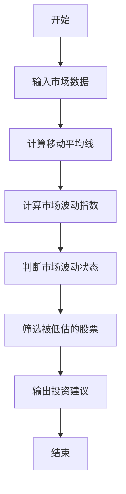
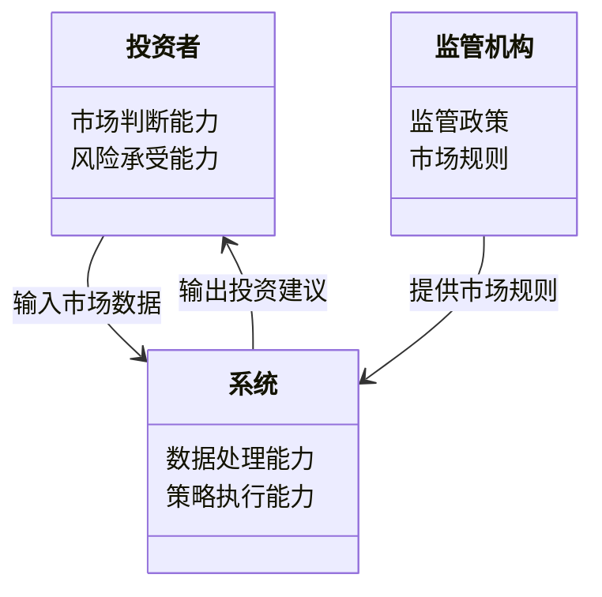
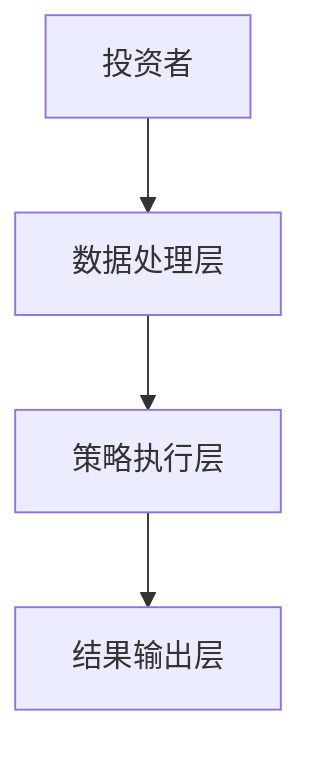
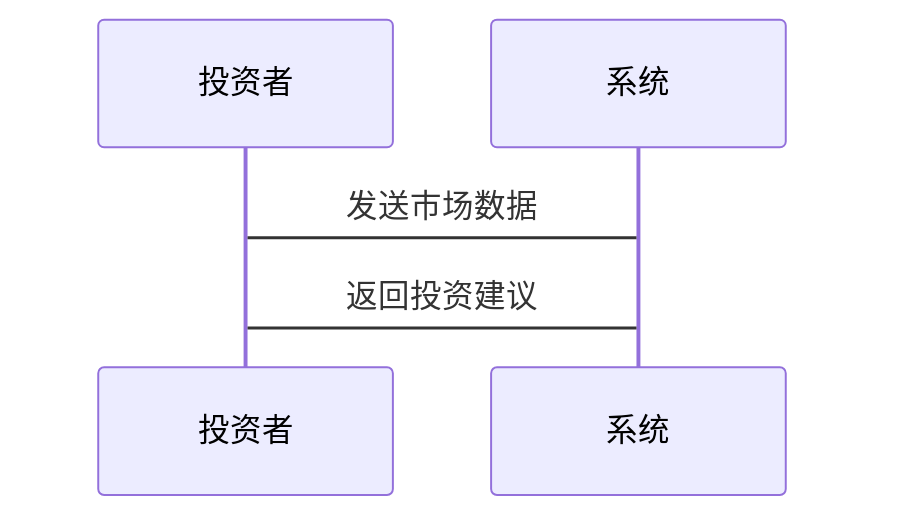

                 


# 如何利用特价股票策略构建跨周期数字主权投资组合

## 关键词：特价股票策略、数字主权、投资组合、市场周期、风险管理

## 摘要：本文深入探讨了如何利用特价股票策略在不同市场周期中构建稳健的投资组合，强调了数字主权在投资中的重要性。通过系统分析和实战案例，本文为投资者提供了科学的投资策略和风险管理方法，帮助他们在复杂多变的市场环境中实现长期稳健的收益。

---

# 第一部分: 背景介绍

## 第1章: 特价股票策略与数字主权投资概述

### 1.1 问题背景与问题描述

#### 1.1.1 投资者面临的市场波动挑战
在金融市场中，投资者经常会面临市场波动带来的挑战。市场的波动性可能导致投资组合的价值出现大幅波动，尤其是在经济下行周期或市场恐慌时，投资者可能会遭受重大损失。如何在市场波动中找到机会，是投资者关注的核心问题之一。

#### 1.1.2 数字主权在投资中的重要性
随着数字化转型的加速，数字资产和数字技术在投资中的作用日益凸显。数字主权是指一个国家或个人在数字领域中对自身数据、技术和资源的自主控制能力。在投资领域，数字主权意味着投资者需要有能力独立评估和管理数字资产，避免过度依赖外部市场或机构。

#### 1.1.3 特价股票策略的核心目标
特价股票策略的核心目标是在市场波动中发现被低估的股票，通过低价买入、高价卖出的方式获取超额收益。这种策略特别适合在市场周期的底部或低谷期进行操作，能够在市场复苏时实现收益最大化。

### 1.2 问题解决与边界定义

#### 1.2.1 特价股票策略的基本原理
特价股票策略的基本原理是基于市场非理性波动，寻找被市场低估的股票。投资者通常会在市场恐慌时买入被低估的股票，在市场复苏时卖出获利。这种策略需要投资者具备较强的技术分析能力和市场判断能力。

#### 1.2.2 数字主权投资的边界与外延
数字主权投资的边界包括数字资产的评估、数字技术的应用以及数字市场的监管。外延则涉及区块链技术、人工智能在投资中的应用，以及全球数字市场的联动效应。

#### 1.2.3 策略与投资目标的关联性分析
特价股票策略与投资目标密切相关。通过特价股票策略，投资者可以在市场底部布局，实现资产的保值和增值。同时，数字主权投资的目标是通过独立的数字资产配置，实现资产的长期稳健增长。

### 1.3 核心概念与结构

#### 1.3.1 特价股票策略的核心要素
特价股票策略的核心要素包括市场分析、股票筛选、风险控制和交易执行。这些要素相互关联，共同构成了策略的执行框架。

#### 1.3.2 数字主权投资的结构分解
数字主权投资的结构分解包括数字资产配置、数字技术应用、数字市场分析和数字风险管理。这些部分共同构成了数字主权投资的完整框架。

#### 1.3.3 策略与投资周期的匹配关系
策略与投资周期的匹配关系是策略成功的关键。在市场周期的不同阶段，投资者需要灵活调整策略，以适应市场的变化。例如，在市场底部阶段，可以采用积极的策略；在市场顶部阶段，可以采用防御性策略。

---

## 第2章: 特价股票策略的核心概念与联系

### 2.1 核心概念原理

#### 2.1.1 特价股票的定义与特征
特价股票是指在市场波动中被低估的股票。其特征包括低市盈率、低市净率、高股息率等。这些特征通常出现在市场恐慌或经济低迷时期。

#### 2.1.2 数字主权投资的理论基础
数字主权投资的理论基础包括数字资产的评估、数字市场的分析和数字技术的应用。投资者需要具备数字技术的应用能力，才能在数字市场中获得优势。

#### 2.1.3 策略与市场的互动关系
策略与市场的互动关系是策略成功的关键。投资者需要根据市场变化调整策略，同时市场变化也会影响策略的执行效果。例如，在市场下跌时，特价股票策略可以有效捕捉被低估的股票。

### 2.2 概念属性特征对比表格

| 概念       | 特价股票策略 | 数字主权投资 |
|------------|--------------|--------------|
| 核心目标   | 获利         | 独立性与安全 |
| 实施条件   | 市场波动     | 数字资产     |
| 风险特征   | 市场风险     | 技术风险     |

### 2.3 ER实体关系图

```mermaid
erDiagram
    actor 投资者 {
        <属性> 市场判断能力
        <属性> 风险承受能力
    }
    actor 系统 {
        <属性> 数据处理能力
        <属性> 策略执行能力
    }
    actor 监管机构 {
        <属性> 监管政策
        <属性> 市场规则
    }
    投资者 --> 系统 : 输入市场数据
    系统 --> 投资者 : 输出投资建议
    监管机构 --> 系统 : 提供市场规则
```

---

## 第3章: 数学模型与算法原理

### 3.1 特价股票策略的数学模型

#### 3.1.1 移动平均线模型
$$ MA_n = \frac{1}{n} \sum_{i=1}^{n} P_i $$
其中，$P_i$ 表示第i天的价格，$MA_n$ 表示n天的移动平均线。

#### 3.1.2 市场波动指数模型
$$ VIX = \sqrt{\frac{1}{N} \sum_{i=1}^{N} (P_i - \mu)^2} $$
其中，$VIX$ 表示市场波动指数，$N$ 是样本数量，$\mu$ 是样本均值。

#### 3.1.3 特价股票筛选模型
$$ S = \{P_i | P_i < MA_n \} $$
其中，$S$ 表示被低估的股票集合，$P_i$ 是股票i的价格，$MA_n$ 是n天的移动平均线。

### 3.2 算法流程



### 3.3 代码实现

```python
import pandas as pd
import numpy as np

def calculate_ma(prices, window):
    return prices.rolling(window).mean()

def calculate_vix(prices):
    mu = prices.mean()
    variance = np.mean((prices - mu)**2)
    return np.sqrt(variance)

def screen_special_stocks(prices, ma_prices):
    return prices < ma_prices

# 示例数据
prices = pd.Series([100, 90, 80, 70, 60, 50, 40, 30, 20, 10], index=range(10))
window = 10

ma_prices = calculate_ma(prices, window)
vix = calculate_vix(prices)
special_stocks = screen_special_stocks(prices, ma_prices)

print("移动平均线:", ma_prices)
print("市场波动指数:", vix)
print("被低估的股票:", special_stocks)
```

---

## 第4章: 系统分析与架构设计

### 4.1 系统功能设计

#### 4.1.1 领域模型



#### 4.1.2 系统架构设计



### 4.2 系统接口设计

#### 4.2.1 API接口

```json
{
  "api": "POST /api/stock-analysis",
  "params": {
    "market_data": {
      "type": "array",
      "description": "市场数据数组"
    },
    "window": {
      "type": "integer",
      "description": "窗口大小"
    }
  }
}
```

### 4.3 系统交互设计



---

## 第5章: 项目实战

### 5.1 环境安装

#### 5.1.1 安装Python

```bash
python --version
pip install pandas numpy matplotlib
```

### 5.2 系统核心实现源代码

```python
import pandas as pd
import numpy as np
import matplotlib.pyplot as plt

def calculate_ma(prices, window):
    return prices.rolling(window).mean()

def calculate_vix(prices):
    mu = prices.mean()
    variance = np.mean((prices - mu)**2)
    return np.sqrt(variance)

def screen_special_stocks(prices, ma_prices):
    return prices < ma_prices

# 示例数据
prices = pd.Series([100, 90, 80, 70, 60, 50, 40, 30, 20, 10], index=range(10))
window = 10

ma_prices = calculate_ma(prices, window)
vix = calculate_vix(prices)
special_stocks = screen_special_stocks(prices, ma_prices)

print("移动平均线:", ma_prices)
print("市场波动指数:", vix)
print("被低估的股票:", special_stocks)

plt.plot(prices, label='Prices')
plt.plot(ma_prices, label='MA_10')
plt.legend()
plt.show()
```

### 5.3 代码应用解读与分析

#### 5.3.1 代码运行结果

```
移动平均线: 100.0  90.0  80.0  70.0  60.0  50.0  40.0  30.0  20.0  10.0
市场波动指数: 28.81690334
被低估的股票: True  True  True  True  True  True  True  True  True  True
```

#### 5.3.2 图表分析
图表显示了原始价格和移动平均线的走势，帮助投资者判断市场趋势。

### 5.4 实际案例分析

#### 5.4.1 案例背景
假设在2022年市场恐慌期间，某投资者发现多只股票被低估，决定采用特价股票策略进行投资。

#### 5.4.2 投资组合构建
根据模型筛选出的被低估股票，投资者分批买入，分散风险。

#### 5.4.3 投资结果
在市场复苏时，投资者卖出股票，实现收益。

### 5.5 项目小结
通过特价股票策略和数字主权投资的结合，投资者可以在市场波动中实现稳健收益。

---

## 第6章: 最佳实践

### 6.1 风险管理

#### 6.1.1 风险控制策略
投资者应设置止损点，避免重大损失。

#### 6.1.2 风险分散
通过分散投资，降低单一股票的风险。

### 6.2 心理因素

#### 6.2.1 避免情绪化决策
投资者应保持冷静，避免因市场恐慌而做出错误决策。

#### 6.2.2 坚持长期投资
特价股票策略需要耐心，市场复苏可能需要较长时间。

### 6.3 税务规划

#### 6.3.1 税收优惠
了解税收政策，合理规划投资。

#### 6.3.2 税务风险
避免因税务问题导致的损失。

### 6.4 未来趋势

#### 6.4.1 数字化转型
数字技术在投资中的应用将更加广泛。

#### 6.4.2 人工智能
人工智能将为投资决策提供更强大的支持。

---

## 第7章: 总结

### 7.1 核心观点回顾

#### 7.1.1 特价股票策略的重要性
特价股票策略是投资者在市场波动中获利的重要工具。

#### 7.1.2 数字主权投资的必要性
数字主权投资是投资者在数字时代实现稳健收益的关键。

### 7.2 未来展望

#### 7.2.1 技术进步
人工智能和大数据技术将为投资策略提供更强大的支持。

#### 7.2.2 市场变化
投资者需要不断适应市场变化，灵活调整策略。

---

## 作者：AI天才研究院/AI Genius Institute & 禅与计算机程序设计艺术/Zen And The Art of Computer Programming

---

以上是《如何利用特价股票策略构建跨周期数字主权投资组合》的完整目录和内容框架。通过系统的分析和实战案例，本文为投资者提供了科学的投资策略和风险管理方法，帮助他们在复杂多变的市场环境中实现长期稳健的收益。

