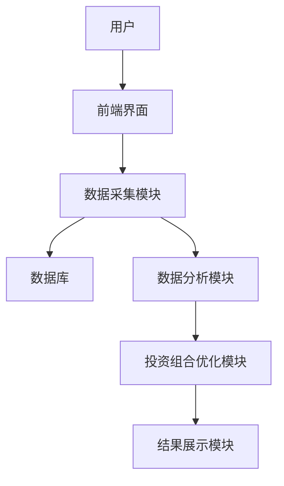
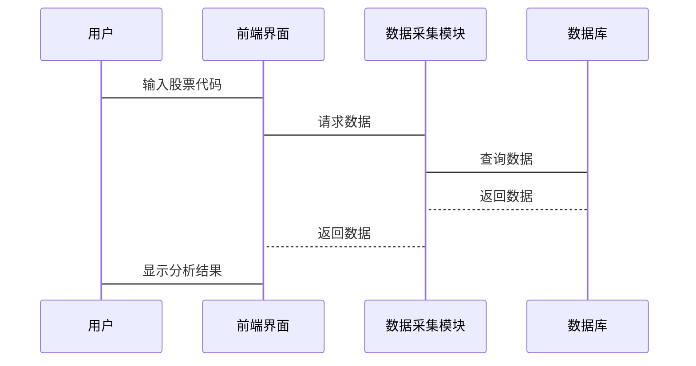

                 

# 如何利用特价股票策略构建长期增值组合

> 关键词：特价股票策略、长期增值组合、股票投资、风险管理、资产配置、投资组合优化

> 摘要：本文详细探讨了如何利用特价股票策略构建长期增值组合。从特价股票的基本概念和市场背景出发，分析了技术分析和基本面分析在特价股票投资中的应用，结合数学模型和算法优化，提出了构建和优化投资组合的策略。通过实际案例分析，展示了如何在风险可控的前提下实现资产的长期增值，并提供了风险管理的最佳实践和心态调整的建议。

---

# 第一部分: 特价股票策略的背景与基础

## 第1章: 特价股票策略概述

### 1.1 特价股票的基本概念

#### 1.1.1 什么是特价股票
特价股票是指在特定市场环境下，由于某种原因导致股票价格被低估，但公司基本面良好的股票。这类股票通常具有较大的增值潜力，是长期投资者的理想选择。

#### 1.1.2 特价股票的特点
- **低估值**：市盈率、市净率等指标低于行业平均水平。
- **高成长性**：公司未来盈利增长潜力大。
- **市场关注度低**：通常被市场忽视，存在被低估的机会。
- **风险可控**：相对于高增长股票，风险较低。

#### 1.1.3 特价股票与其他投资策略的对比
| 投资策略 | 短期交易 | 长期增值 | 风险 |
|----------|----------|----------|------|
| 技术分析 | 高       | 中       | 中   |
| 基本面分析 | 中       | 高       | 低   |
| 特价股票策略 | 中       | 高       | 中   |

### 1.2 特价股票的投资环境

#### 1.2.1 特价股票的市场背景
- **市场周期**：在熊市或市场低迷时期，更容易找到被低估的股票。
- **行业环境**：选择处于复苏期的行业，避免选择夕阳行业。
- **宏观经济因素**：关注利率、通货膨胀等宏观经济指标对股票价格的影响。

#### 1.2.2 特价股票的投资机会
- **行业龙头**：选择行业内具有竞争优势的公司。
- **市场低估区域**：关注被市场忽视的板块或地区。
- **政策支持**：政府政策支持的行业更容易出现低估的股票。

#### 1.2.3 特价股票的风险与挑战
- **市场波动**：短期内价格波动较大。
- **信息不对称**：投资者可能无法及时获取公司最新信息。
- **流动性风险**：某些股票流动性较差，难以迅速买卖。

---

## 第2章: 特价股票的分析方法

### 2.1 技术分析在特价股票中的应用

#### 2.1.1 K线图分析
K线图是技术分析的基础工具，通过分析股票的价格走势来预测未来的价格变动。

#### 2.1.2 移动平均线（MA）的应用
移动平均线可以帮助投资者判断股票价格的趋势和支撑位。

#### 2.1.3 相对强弱指数（RSI）的应用
RSI用于衡量股票的超买或超卖状态，帮助投资者判断买卖时机。

### 2.2 基本面分析在特价股票中的应用

#### 2.2.1 公司财务指标分析
- **市盈率（P/E）**：衡量股票的估值水平。
- **市净率（P/B）**：衡量股票相对于账面价值的高低。
- **ROE（净资产收益率）**：衡量公司的盈利能力。

#### 2.2.2 行业分析与竞争地位
- **行业地位**：公司在行业中的排名和竞争优势。
- **行业前景**：行业未来的增长潜力。

#### 2.2.3 宏观经济因素对特价股票的影响
- **利率**：低利率环境通常有利于股市上涨。
- **通货膨胀**：适度通胀有利于企业盈利增长。

### 2.3 组合构建策略

#### 2.3.1 分散投资的重要性
通过分散投资不同行业和板块的股票，降低整体投资组合的风险。

#### 2.3.2 风险管理的技巧
- **止损策略**：设定止损点，避免亏损过大。
- **仓位管理**：根据市场情况调整持仓比例。

#### 2.3.3 绩效评估与调整
定期评估投资组合的绩效，根据市场变化进行调整。

---

## 第3章: 特价股票组合的优化

### 3.1 现金流折现模型在特价股票中的应用

#### 3.1.1 现金流折现模型的定义
现金流折现模型（DCF）通过将未来现金流折现，评估公司的内在价值。

#### 3.1.2 现金流折现模型的计算步骤
1. 预测未来现金流。
2. 确定折现率。
3. 计算现值。
4. 与当前股价对比，判断是否低估。

#### 3.1.3 现金流折现模型的优缺点
- **优点**：能够准确评估公司的内在价值。
- **缺点**：预测未来现金流存在较大不确定性。

### 3.2 风险调整后的收益模型

#### 3.2.1 风险调整后的收益模型的定义
通过调整风险因素，评估股票的预期收益。

#### 3.2.2 风险调整后的收益模型的计算公式
$$ E(R_i) = R_f + β_i (R_m - R_f) $$

其中：
- \( R_f \)：无风险利率
- \( R_m \)：市场预期收益率
- \( β_i \)：股票的贝塔系数

### 3.3 特价股票组合的动态调整

#### 3.3.1 组合调整的时机与策略
- **定期回顾**：每季度或每半年回顾一次投资组合。
- **市场变化**：根据市场变化调整持仓比例。

#### 3.3.2 组合调整的数学模型
$$ w_i = \frac{a_i}{\sum a_i} $$
其中，\( w_i \) 是第 \( i \) 只股票的权重，\( a_i \) 是第 \( i \) 只股票的吸引力评分。

#### 3.3.3 组合调整的案例分析
通过具体案例分析，展示如何根据市场变化调整投资组合。

---

## 第4章: 特价股票的数学模型与算法

### 4.1 资产回报模型

#### 4.1.1 资产回报模型的定义
资产回报模型用于预测资产的未来回报。

#### 4.1.2 资产回报模型的数学公式
$$ R = \alpha + \beta \times (R_m - R_f) + \epsilon $$

其中：
- \( R \) 是资产的回报
- \( \alpha \) 是资产的超额回报
- \( \beta \) 是资产的贝塔系数
- \( R_m \) 是市场回报
- \( R_f \) 是无风险利率
- \( \epsilon \) 是误差项

### 4.2 风险模型

#### 4.2.1 风险模型的定义
风险模型用于衡量投资组合的风险。

#### 4.2.2 风险模型的数学公式
$$ \sigma_p = \sqrt{w_1^2 \sigma_1^2 + w_2^2 \sigma_2^2 + 2 w_1 w_2 \sigma_{1,2}} $$
其中，\( \sigma_p \) 是投资组合的标准差，\( w_i \) 是第 \( i \) 只股票的权重，\( \sigma_i \) 是第 \( i \) 只股票的标准差，\( \sigma_{1,2} \) 是两支股票的协方差。

### 4.3 特价股票组合的优化算法

#### 4.3.1 均值-方差优化
使用均值-方差优化算法，找到风险最小化、收益最大化的投资组合。

#### 4.3.2 非约束优化
在没有约束的情况下，优化投资组合的回报和风险。

#### 4.3.3 约束优化
在满足某些约束条件（如最大权重、最小权重）下，优化投资组合。

---

## 第5章: 特价股票组合的系统设计与实现

### 5.1 系统架构设计

#### 5.1.1 系统功能模块
- **数据采集模块**：采集股票数据。
- **数据分析模块**：对股票数据进行分析。
- **投资组合优化模块**：根据分析结果优化投资组合。

#### 5.1.2 系统架构图

### 5.2 系统接口设计

#### 5.2.1 数据接口
- **输入接口**：接收用户输入的股票代码和时间范围。
- **输出接口**：输出分析结果和优化建议。

#### 5.2.2 数据库接口
- **读取接口**：从数据库中读取历史数据。
- **写入接口**：将分析结果写入数据库。

### 5.3 系统交互设计

#### 5.3.1 用户与系统交互流程

---

## 第6章: 特价股票组合的实战案例与经验分享

### 6.1 实战案例分析

#### 6.1.1 案例背景
选择某行业的几只特价股票，分析其基本面和技术面。

#### 6.1.2 分析过程
- **技术分析**：绘制K线图和MA图。
- **基本面分析**：计算市盈率和ROE。

#### 6.1.3 投资决策
根据分析结果，构建投资组合并进行动态调整。

### 6.2 投资经验分享

#### 6.2.1 风险管理技巧
- **设定止损点**：避免亏损过大。
- **分散投资**：降低整体风险。

#### 6.2.2 心态调整
- **避免情绪化决策**：保持冷静，避免贪婪和恐惧。
- **长期视角**：关注长期价值，忽略短期波动。

---

## 第7章: 总结与展望

### 7.1 总结
本文详细探讨了如何利用特价股票策略构建长期增值组合，从理论到实践，为投资者提供了全面的指导。

### 7.2 展望
未来，随着人工智能和大数据技术的发展，特价股票策略将更加精准和高效。

---

# 作者：AI天才研究院/AI Genius Institute & 禅与计算机程序设计艺术 /Zen And The Art of Computer Programming

