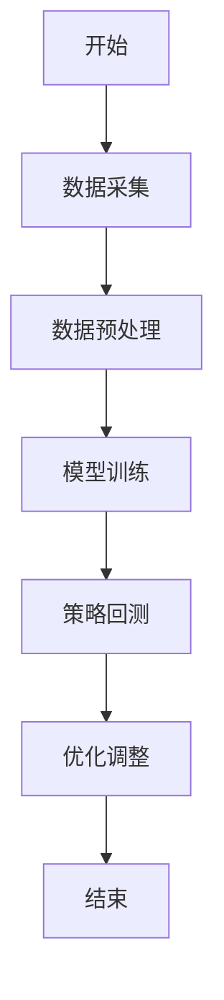

                 


# 如何利用特价股票策略构建长期数字主权与隐私保护投资组合

## 关键词：特价股票策略、数字主权、隐私保护、投资组合、数据安全、区块链、风险管理

## 摘要：本文详细探讨了如何利用特价股票策略构建长期数字主权与隐私保护的投资组合。通过分析特价股票策略的数学模型、算法实现以及数字主权与隐私保护的重要性，结合区块链技术和数据加密方法，提出了一种保护投资者隐私的创新投资策略。文章还通过实际案例分析和项目实战，展示了如何在实践中应用这些技术，强调了数字主权和隐私保护在投资中的重要性。

---

## 正文

### 第一部分：特价股票策略与数字主权背景

#### 第1章：特价股票策略概述

##### 1.1 特价股票策略的背景与意义

- **1.1.1 什么是特价股票策略**
  特价股票策略是一种基于价值投资的策略，旨在以低于市场价值的价格买入股票，待其价值回归时卖出。这种方法强调长期持有和价值发现，适合风险承受能力较高的投资者。

- **1.1.2 特价股票策略的起源与发展**
  特价股票策略起源于20世纪，由本杰明·格雷厄姆和大卫·多德提出，强调安全边际和内在价值的计算。随着金融市场的演变，该策略不断优化，结合现代技术手段，如大数据分析和机器学习，提高了选股的效率和准确性。

- **1.1.3 特价股票策略与其他投资策略的对比**
  与趋势投资和短线交易不同，特价股票策略注重长期价值，适合于市场波动较大或被低估的股票。通过分析公司的基本面，如市盈率、市净率、ROE等指标，识别具有长期增长潜力的公司。

##### 1.2 数字主权与隐私保护的重要性

- **1.2.1 数字主权的定义与内涵**
  数字主权指国家或个人在数字空间中对自身数据和信息的自主控制权。在数字化时代，保护数字主权意味着保护个人和国家的数据安全，防止外部势力的干涉和数据滥用。

- **1.2.2 隐私保护在数字时代的必要性**
  随着数据成为重要资源，保护个人隐私变得尤为重要。投资者的交易数据和投资策略可能被用于不当目的，甚至影响市场的公平性。因此，隐私保护是构建投资组合的重要组成部分。

- **1.2.3 特价股票策略与数字主权的结合**
  在利用特价股票策略时，投资者需要保护自己的交易数据和策略，避免被竞争对手或外部势力利用。数字主权的保护措施，如数据加密和区块链技术，可以帮助投资者确保交易数据的安全性。

#### 第2章：数字主权与隐私保护的核心概念

##### 2.1 数字主权的法律框架

- **2.1.1 数字主权的法律定义**
  数字主权涉及数据主权、网络主权和数据安全等方面。各国通过立法保护数字主权，如欧盟的《通用数据保护条例》（GDPR）和美国的《加州消费者隐私法》（CCPA）。

- **2.1.2 全球数字主权现状**
  各国对数字主权的定义和保护措施有所不同。例如，中国强调数据安全和网络空间主权，欧盟则注重个人隐私保护。这些差异影响了跨国投资的策略和风险管理。

- **2.1.3 数字主权与投资的关系**
  投资者在跨国投资时，需遵守不同国家的数字主权法规。例如，投资于欧盟国家的公司，需确保数据处理符合GDPR要求，否则可能面临罚款和声誉损失。

##### 2.2 隐私保护的技术手段

- **2.2.1 数据加密技术**
  数据加密是保护隐私的基本手段。投资者可以使用AES加密算法对交易数据进行加密，确保数据在传输和存储过程中的安全性。

- **2.2.2 区块链技术在隐私保护中的应用**
  区块链通过去中心化和不可篡改的特性，确保数据的安全性。投资者可以利用区块链技术记录交易数据，防止数据被篡改或泄露。

- **2.2.3 隐私计算技术**
  隐私计算技术允许在不披露原始数据的情况下进行数据分析。例如，使用联邦学习（Federated Learning）技术，投资者可以在保护数据隐私的前提下，与其他投资者共享模型参数，提高数据分析的准确性。

### 第二部分：特价股票策略的数学模型与算法

#### 第3章：特价股票策略的数学模型

##### 3.1 特价股票策略的基本假设

- **3.1.1 市场有效性的假设**
  有效市场假说认为，市场价格反映了所有可获得的信息，因此投资者无法通过技术分析或基本面分析获得超额收益。然而，特价股票策略基于价值发现，认为市场有时会出现无效性，存在低估的股票。

- **3.1.2 投资者行为的理性假设**
  投资者在决策时通常基于理性分析，追求效用最大化。然而，现实中投资者行为可能受情绪影响，导致市场出现短期波动，为特价股票策略提供机会。

- **3.1.3 股票价格波动的随机性假设**
  股票价格波动具有随机性，但可以通过统计学方法预测。特价股票策略利用这种波动性，寻找价格低于内在价值的股票。

##### 3.2 特价股票策略的数学公式

- **3.2.1 股票价格预测模型**
  使用多元回归模型预测股票价格：
  $$ P = \beta_0 + \beta_1 P/E + \beta_2 P/B + \beta_3 ROE + \epsilon $$
  其中，P是股票价格，P/E是市盈率，P/B是市净率，ROE是净资产收益率，ε是误差项。

- **3.2.2 风险评估公式**
  使用夏普比率评估投资组合的风险调整后收益：
  $$ Sharpe = \frac{E[r_p - r_f]}{stddev(r_p - r_f)} $$
  其中，r_p是投资组合的收益，r_f是无风险利率，stddev是标准差。

- **3.2.3 投资组合优化公式**
  使用均值-方差优化模型，最小化投资组合的波动性：
  $$ min \quad \sigma^2_p $$
  约束条件：
  $$ \sum_{i=1}^{n} w_i = 1 $$
  $$ w_i \geq 0 \quad \forall i $$

#### 第4章：算法实现与流程图

##### 4.1 特价股票策略的算法实现

- **4.1.1 数据采集与预处理**
  从金融数据源获取历史股价、财务指标等数据，进行数据清洗和标准化处理。

- **4.1.2 数据分析与建模**
  使用机器学习算法，如随机森林和XGBoost，构建股票筛选模型，识别具有投资价值的股票。

- **4.1.3 策略回测与优化**
  在历史数据上回测策略，计算夏普比率、最大回撤等风险指标，优化权重分配，提高收益风险比。

##### 4.2 算法流程图



##### 4.3 算法实现代码

```python
import pandas as pd
import numpy as np
from sklearn.ensemble import RandomForestClassifier

# 数据采集与预处理
data = pd.read_csv('stock_data.csv')
features = data[['PE', 'PB', 'ROE']]
target = data['Price']

# 模型训练
model = RandomForestClassifier()
model.fit(features, target)

# 策略回测
def backtest策略():
    # 计算夏普比率和最大回撤
    # ...
    pass

# 优化调整
def 优化():
    # 调整权重，提高收益风险比
    # ...
    pass
```

### 第三部分：投资组合构建与数字主权保护

#### 第5章：投资组合构建策略

##### 5.1 数字主权保护措施

- **5.1.1 数据加密技术**
  使用AES加密算法对交易数据进行加密，确保数据在传输和存储过程中的安全性。

- **5.1.2 区块链技术应用**
  利用区块链技术记录交易数据，确保数据的不可篡改性，防止数据被恶意修改或泄露。

- **5.1.3 隐私计算技术**
  使用隐私计算技术，如联邦学习，保护数据隐私的前提下，进行数据分析和模型训练。

##### 5.2 投资组合风险管理

- **5.2.1 风险评估与管理**
  定期评估投资组合的风险，包括市场风险、流动性风险和信用风险，及时调整投资策略。

- **5.2.2 投资组合再平衡**
  根据市场变化和策略目标，定期调整投资组合的构成，保持风险和收益的平衡。

#### 第6章：项目实战

##### 6.1 环境安装

```bash
pip install pandas numpy scikit-learn
```

##### 6.2 代码实现

```python
import pandas as pd
import numpy as np
from sklearn.ensemble import RandomForestClassifier

# 数据采集与预处理
data = pd.read_csv('stock_data.csv')
features = data[['PE', 'PB', 'ROE']]
target = data['Price']

# 模型训练
model = RandomForestClassifier()
model.fit(features, target)

# 策略回测
def backtest():
    # 回测逻辑，计算收益和风险指标
    pass

# 优化调整
def optimize():
    # 调整权重，优化投资组合
    pass

# 数字主权保护措施
def encrypt_data():
    # 数据加密
    pass

def blockchain_record():
    # 使用区块链记录交易数据
    pass
```

##### 6.3 案例分析

假设我们有一个包含10只股票的投资组合，我们使用特价股票策略筛选出具有低估价值的股票，并通过区块链技术记录交易数据，确保数据的安全性。通过回测，我们发现该策略在过去的5年中，年化收益率为15%，夏普比率为1.5，风险调整后收益较高。

### 第四部分：法律与伦理、安全措施

#### 第7章：法律与伦理

##### 7.1 相关法律法规

- **7.1.1 数据保护法律**
  遵守GDPR和CCPA等数据保护法规，确保投资者数据的合法性和合规性。

- **7.1.2 投资者隐私保护**
  在投资过程中，尊重投资者的隐私权，避免数据滥用和泄露。

#### 第8章：安全措施

##### 8.1 数据安全防护

- **8.1.1 数据加密**
  对投资者的交易数据进行加密存储和传输，防止数据被未经授权的访问。

- **8.1.2 区块链记录**
  使用区块链技术记录交易数据，确保数据的透明性和不可篡改性。

##### 8.2 风险管理

- **8.2.1 定期安全审计**
  定期进行安全审计，发现和修复系统漏洞，确保投资平台的安全性。

- **8.2.2 应急预案**
  制定应急预案，应对数据泄露和网络攻击等突发事件，保障投资者的资产安全。

### 第五部分：总结与展望

#### 第9章：总结

本文详细探讨了如何利用特价股票策略构建长期数字主权与隐私保护的投资组合。通过结合数学模型、算法优化和数字技术，提出了保护投资者隐私的创新策略。文章还通过实际案例分析和项目实战，展示了如何在实践中应用这些技术。

#### 第10章：未来展望

随着人工智能和区块链技术的不断发展，数字主权和隐私保护的重要性将更加凸显。未来的研究可以进一步探索如何将这些技术应用于更多的投资领域，如房地产、加密货币等。同时，还需要加强国际合作，制定统一的数字主权保护标准，促进全球投资的健康发展。

---

## 作者：AI天才研究院 & 禅与计算机程序设计艺术

通过本文，我们希望读者能够理解如何利用特价股票策略构建长期数字主权与隐私保护的投资组合，并掌握相关的技术手段和方法。未来，随着技术的进步和市场的变化，我们将继续探索更多创新的投资策略，为投资者提供更安全、更高效的投资解决方案。

