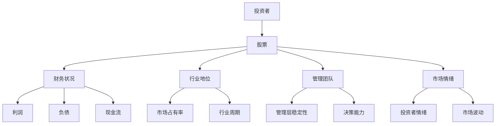
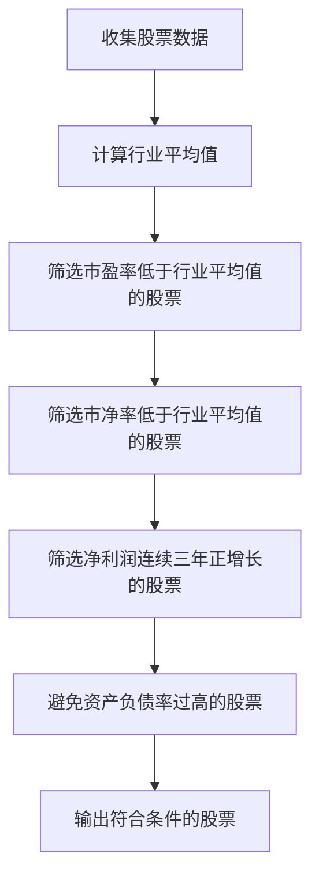
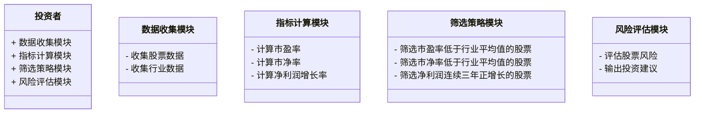

                 


# 如何利用特价股票策略进行价值陷阱规避

## 关键词：特价股票策略，价值陷阱，股票投资，风险管理，量化分析

## 摘要：  
在股票投资中，特价股票策略是一种以低价买入股票并长期持有的策略，旨在通过市场波动赚取超额收益。然而，这种策略也伴随着较高的风险，即投资者可能误入“价值陷阱”，即买入看似便宜实则基本面不佳的股票。本文通过系统分析特价股票策略的核心概念、价值陷阱的识别方法、量化分析的算法原理以及系统架构设计，帮助投资者规避价值陷阱，实现稳健投资。文章结合实际案例分析和数学模型，提供可操作的策略建议，帮助投资者在复杂的市场环境中做出明智的投资决策。

---

## 第一部分：特价股票策略概述

### 第1章：特价股票策略的核心概念

#### 1.1 特价股票策略的定义与背景

- **特价股票策略**：指以低于市场合理估值的价格买入股票，并长期持有的投资策略。  
- **策略背景**：  
  - 市场波动导致优质股票价格被低估，为投资者提供低价买入的机会。  
  - 适合长期投资者，尤其是机构投资者或有长期资金的个人投资者。  
- **核心要素**：  
  - 价格低于内在价值。  
  - 公司基本面稳健，具有长期增长潜力。  
  - 市场波动性提供买入机会。  
- **边界条件**：  
  - 避免买入处于下行周期的行业股票。  
  - 避免买入管理层不稳定的公司股票。  

#### 1.2 价值陷阱的定义与特征

- **价值陷阱**：  
  - 指那些价格看似便宜，但实际公司基本面不佳，或行业前景黯淡的股票。  
  - 投资者误以为是投资机会，实则可能造成本金损失。  
- **常见类型**：  
  - 行业衰退型：所在行业长期低迷，难以扭亏为盈。  
  - 管理层问题型：公司管理层存在问题，如内控不严、决策失误。  
  - 财务恶化型：公司财务状况恶化，如高负债、现金流持续为负。  
- **识别标志**：  
  - 市净率（P/B）过低，但公司盈利能力持续下降。  
  - 市盈率（P/E）远低于行业平均水平，但公司收入持续下滑。  
  - 股东权益持续减少，但股价并未反映这一情况。  

#### 1.3 特价股票策略与价值陷阱的关系

- **策略目标**：通过识别真正被低估的股票，避免买入价值陷阱。  
- **策略优势**：  
  - 低估值股票具有较高的安全边际。  
  - 市场波动时，低价股票更容易反弹。  
- **策略风险**：  
  - 难以准确判断公司基本面，误入价值陷阱。  
  - 市场长期低迷，股票价格无法回升。  

---

### 第2章：价值陷阱的识别与分析

#### 2.1 价值陷阱的核心属性

- **财务状况分析**：  
  - 利润：关注净利润率、毛利率等指标。  
  - 负债：关注资产负债率、流动负债与流动资产比例。  
  - 现金流：关注经营活动现金流是否为正。  
- **行业地位分析**：  
  - 市场占有率：公司是否是行业龙头。  
  - 行业周期：行业是否处于下行周期。  
- **管理团队分析**：  
  - 管理层稳定性：是否有频繁的高层变动。  
  - 决策能力：公司是否能及时调整战略。  
- **市场情绪分析**：  
  - 投资者情绪：市场情绪过于悲观时，股票价格可能被过度低估。  
  - 市场波动：短期市场波动可能导致价值陷阱的出现。  

#### 2.2 价值陷阱的识别方法

- **基于财务指标的识别模型**：  
  - 使用市盈率（P/E）、市净率（P/B）等指标判断股票是否被低估。  
  - 对比行业平均水平，判断公司是否属于价值陷阱。  
- **基于行业分析的识别模型**：  
  - 研究公司所在行业的前景，判断行业是否处于下行周期。  
  - 对比行业内其他公司，判断公司的市场地位是否稳固。  
- **基于市场情绪的识别模型**：  
  - 利用市场情绪指标（如VIX指数）判断市场是否处于恐慌状态。  
  - 分析媒体和投资者情绪，判断股票价格是否被过度低估。  

#### 2.3 价值陷阱的实体关系图



---

### 第3章：特价股票策略的数学模型与算法原理

#### 3.1 特价股票策略的量化分析模型

- **模型目标**：通过量化指标筛选出真正具有投资价值的低价股票，避免价值陷阱。  
- **关键指标**：  
  - 市盈率（P/E）：低于行业平均水平。  
  - 市净率（P/B）：低于行业平均水平。  
  - 净利润增长率：连续三年为正。  
  - 资产负债率：低于行业平均水平。  
- **筛选逻辑**：  
  - 优先选择市盈率和市净率均低于行业平均水平的股票。  
  - 确保公司净利润连续三年保持正增长。  
  - 避免选择资产负债率过高的公司。  

#### 3.2 算法原理

- **算法步骤**：  
  1. 收集目标行业的股票数据，包括市盈率、市净率、净利润增长率等指标。  
  2. 计算行业平均水平的市盈率和市净率。  
  3. 筛选出市盈率和市净率低于行业平均水平的股票。  
  4. 进一步筛选出净利润连续三年为正的股票。  
  5. 避免选择资产负债率过高的股票。  
- **数学模型**：  
  - 市盈率筛选条件：$P/E < 行业平均P/E$  
  - 市净率筛选条件：$P/B < 行业平均P/B$  
  - 净利润增长率筛选条件：$\text{净利润增长率} > 0\%$（连续三年）  

#### 3.3 算法流程图



---

### 第4章：系统分析与架构设计

#### 4.1 系统功能设计

- **目标**：构建一个基于量化分析的特价股票策略系统，帮助投资者识别价值陷阱。  
- **核心功能**：  
  - 数据收集：收集股票的财务数据、市场数据等。  
  - 指标计算：计算市盈率、市净率等关键指标。  
  - 筛选策略：根据量化模型筛选出符合条件的股票。  
  - 风险评估：评估股票的投资风险。  

#### 4.2 系统架构设计



---

### 第5章：项目实战

#### 5.1 环境安装

- **工具选择**：  
  - 数据分析工具：Python（Pandas、NumPy）。  
  - 数据可视化工具：Matplotlib。  
  - 数据源：Yahoo Finance API。  

#### 5.2 核心实现源代码

```python
import pandas as pd
import numpy as np
import yfinance as yf

# 下载股票数据
def get_stock_data(tickers):
    data = yf.download(tickers, start='2020-01-01', end='2023-12-31')
    return data

# 计算市盈率和市净率
def calculate_valuation(data):
    pe = data['Close'] / data['Earnings per Share']
    pb = data['Close'] / data['Book Value per Share']
    return pe, pb

# 筛选策略
def screen_stocks(pe, pb, industry_pe, industry_pb):
    filtered_pe = pe < industry_pe
    filtered_pb = pb < industry_pb
    return filtered_pe & filtered_pb

# 主函数
def main():
    tickers = ['AAPL', 'MSFT', 'GOOGL']
    data = get_stock_data(tickers)
    pe, pb = calculate_valuation(data)
    industry_pe = np.mean(pe)
    industry_pb = np.mean(pb)
    filtered = screen_stocks(pe, pb, industry_pe, industry_pb)
    print("符合条件的股票：", tickers[filtered])

if __name__ == "__main__":
    main()
```

#### 5.3 实际案例分析

- **案例分析**：  
  - 某公司股票价格低于行业平均水平，但公司净利润连续三年为负。  
  - 分析原因：公司处于亏损状态，可能是价值陷阱。  

#### 5.4 代码应用解读与分析

- **代码解读**：  
  - 数据收集模块：从Yahoo Finance API获取股票数据。  
  - 指标计算模块：计算市盈率和市净率。  
  - 筛选策略模块：根据量化模型筛选出符合条件的股票。  

---

### 第6章：最佳实践与小结

#### 6.1 最佳实践

- **风险管理**：  
  - 设置止损点，避免重大损失。  
  - 分散投资，降低风险。  
- **持续学习**：  
  - 关注行业动态，及时调整投资策略。  
  - 学习新的数据分析方法，提升投资能力。  

#### 6.2 小结

- 特价股票策略是一种有效的投资策略，但需要结合量化分析和基本面分析，避免误入价值陷阱。  
- 通过系统化的分析和筛选，投资者可以更好地识别真正具有投资价值的股票。  

---

## 作者：AI天才研究院/AI Genius Institute & 禅与计算机程序设计艺术 /Zen And The Art of Computer Programming

