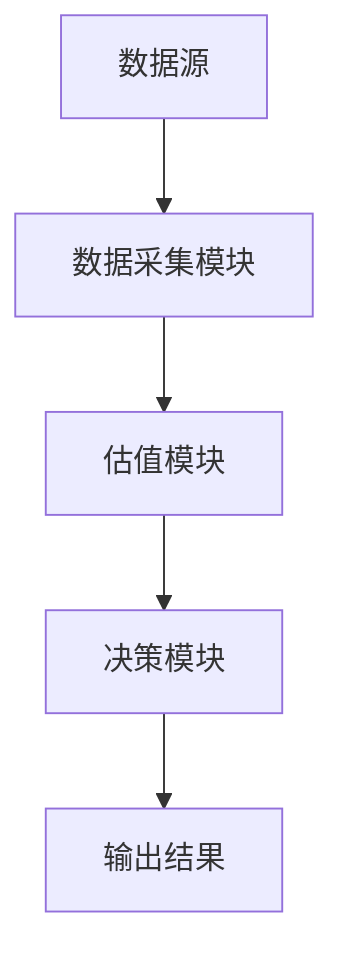

                 


# 如何利用特价股票策略进行全球产业链重构投资

> 关键词：特价股票策略，全球产业链重构，投资，算法，系统架构，案例分析

> 摘要：本文将详细探讨如何利用特价股票策略进行全球产业链重构投资。通过分析特价股票策略的核心概念、数学模型、算法原理以及系统架构，结合实际案例，为投资者提供一套完整的投资策略和实现方案。

---

# 第1章: 特价股票策略的背景与概念

## 1.1 特价股票策略的背景
### 1.1.1 特价股票的定义与特点
特价股票是指价格低于其内在价值的股票。其特点包括低估值、高潜在回报率和较高的安全边际。

### 1.1.2 特价股票策略的起源与发展
特价股票策略起源于价值投资理念，其发展经历了从传统估值方法到现代量化分析的演变。

### 1.1.3 特价股票策略在投资中的地位
特价股票策略是一种有效的投资策略，尤其在市场波动较大时表现优异。

## 1.2 全球产业链重构的背景
### 1.2.1 全球化与产业链分工的历史演变
全球产业链分工的演变推动了跨国投资机会的增加。

### 1.2.2 产业链重构的驱动因素
技术进步、地缘政治和经济全球化是推动产业链重构的主要因素。

### 1.2.3 特价股票策略与产业链重构的关系
特价股票策略通过优化投资组合，助力全球产业链重构。

## 1.3 特价股票策略与全球产业链重构的联系
### 1.3.1 特价股票策略在产业链重构中的作用
通过投资低估的产业链环节，推动产业链优化。

### 1.3.2 产业链重构对特价股票策略的影响
产业链重构提供了新的投资机会和挑战。

### 1.3.3 特价股票策略与全球投资布局的关系
全球投资布局为特价股票策略提供了更广阔的舞台。

---

# 第2章: 特价股票策略的核心概念与原理

## 2.1 特价股票策略的核心概念
### 2.1.1 特价股票的定义与分类
根据估值指标（如市盈率、市净率）将股票分为低估、合理和高估三类。

### 2.1.2 特价股票策略的基本原理
通过筛选低估值股票，捕捉市场低估的机会。

### 2.1.3 特价股票策略的关键要素
包括估值指标、行业分析和市场周期判断。

## 2.2 全球产业链重构的核心概念
### 2.2.1 产业链重构的定义与特征
指通过重新配置产业链资源，优化生产效率。

### 2.2.2 产业链重构的主要模式
包括垂直整合、外包和区域化布局。

### 2.2.3 产业链重构的驱动因素分析
技术进步、成本控制和市场需求变化是主要驱动因素。

## 2.3 特价股票策略与产业链重构的关系
### 2.3.1 特价股票策略如何影响产业链重构
通过投资低估值企业，推动产业链优化。

### 2.3.2 产业链重构如何影响特价股票策略
产业链重构提供新的投资机会，同时影响股票估值。

### 2.3.3 两者的协同效应与相互作用
通过协同效应，特价股票策略和产业链重构相互促进。

---

# 第3章: 特价股票策略的数学模型与算法原理

## 3.1 特价股票策略的数学模型
### 3.1.1 特价股票的价值评估模型
使用市盈率（P/E）和市净率（P/B）等指标进行估值。

$$ P/E = \frac{\text{股价}}{\text{每股收益}} $$

### 3.1.2 特价股票的风险评估模型
使用夏普比率衡量投资风险。

$$ \text{夏普比率} = \frac{R_p - R_f}{\sigma_p} $$

### 3.1.3 特价股票的收益预测模型
通过历史收益率和市场预期预测未来收益。

## 3.2 全球产业链重构的数学模型
### 3.2.1 产业链重构的成本模型
$$ \text{总成本} = \sum_{i=1}^{n} c_i \times q_i $$

### 3.2.2 产业链重构的收益模型
$$ \text{总收入} = \sum_{i=1}^{n} p_i \times q_i $$

### 3.2.3 产业链重构的风险模型
$$ \text{风险} = \sum_{i=1}^{n} w_i \times r_i $$

## 3.3 特价股票策略与产业链重构的协同模型
### 3.3.1 协同效应的数学表达
$$ \text{协同效应} = \sum_{i=1}^{n} a_i \times b_i $$

### 3.3.2 协同模型的算法实现
通过矩阵运算优化投资组合。

### 3.3.3 案例分析与模型验证
以某行业为例，验证模型的有效性。

---

# 第4章: 特价股票策略的系统分析与架构设计

## 4.1 系统分析
### 4.1.1 系统目标与范围
构建一个基于特价股票策略的投资系统，实现全球产业链重构投资。

### 4.1.2 系统功能需求分析
包括数据采集、估值分析和投资决策功能。

### 4.1.3 系统性能需求分析
要求系统具备高效的数据处理和分析能力。

## 4.2 系统架构设计
### 4.2.1 系统模块划分
包括数据采集模块、估值模块和决策模块。

### 4.2.2 系统架构图（Mermaid）


### 4.2.3 接口设计与交互
使用API接口实现模块间通信。

---

# 第5章: 特价股票策略的项目实战

## 5.1 环境安装与配置
安装Python、Pandas、Matplotlib等工具。

## 5.2 核心代码实现
### 5.2.1 数据获取与处理
```python
import pandas as pd
data = pd.read_csv('stock_data.csv')
```

### 5.2.2 估值分析
```python
def calculate_pe_ratio(data):
    pe = data['股价'] / data['每股收益']
    return pe
```

### 5.2.3 可视化展示
```python
import matplotlib.pyplot as plt
plt.plot(data['日期'], data['股价'])
plt.show()
```

## 5.3 案例分析
### 5.3.1 案例背景
以科技行业为例，分析某公司的股价波动。

### 5.3.2 投资策略制定
基于估值指标，制定投资计划。

### 5.3.3 实施与结果展示
展示投资组合的收益与风险。

---

# 第6章: 最佳实践与小结

## 6.1 最佳实践
### 6.1.1 小结
总结全文内容，强调特价股票策略的有效性。

### 6.1.2 注意事项
提示投资者注意市场波动和风险控制。

### 6.1.3 未来趋势
预测全球产业链重构投资的未来发展方向。

## 6.2 本章小结
强调本文的核心观点，为投资者提供参考。

---

# 附录: 数据来源与工具列表

## 附录A: 数据来源
包括股票数据来源和产业链数据来源。

## 附录B: 工具列表
包括Python、Pandas、Matplotlib等工具的安装与使用说明。

---

# 作者：AI天才研究院 & 禅与计算机程序设计艺术

---

通过以上目录大纲，文章将系统地介绍如何利用特价股票策略进行全球产业链重构投资，从理论到实践，为投资者提供一套完整的解决方案。

