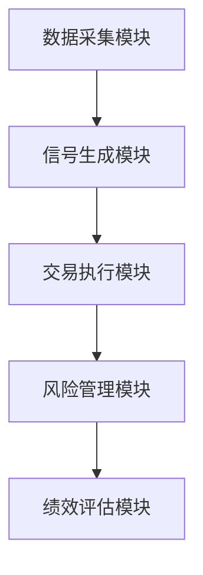

                 


# 如何利用特价股票策略进行全球价值链投资

关键词：特价股票策略，全球价值链投资，技术分析，基本面分析，投资组合优化

摘要：本文将详细介绍如何利用特价股票策略在全球价值链中进行投资。通过分析特价股票的定义、核心概念、技术分析与基本面分析，以及全球价值链投资的逻辑与策略，本文将为投资者提供一套系统化的投资方法。同时，本文将结合实际案例，展示如何在全球范围内识别和利用特价股票机会，并通过数学模型和算法优化投资组合。最后，本文将总结投资中的注意事项与最佳实践。

---

# 第一部分: 特价股票策略的背景与基础

## 第1章: 特价股票策略的定义与核心概念

### 1.1 特价股票的定义与特征

#### 1.1.1 什么是特价股票
特价股票是指那些市场价格显著低于其内在价值的股票。这些股票通常被市场低估，具有较大的增值潜力。特价股票的核心特征包括：

- **低估值**：市盈率（P/E）或市净率（P/B）远低于行业平均水平。
- **高安全边际**：市场价格与内在价值之间的差距较大，降低投资风险。
- **周期性机会**：通常出现在市场低迷或行业周期性低谷时。

#### 1.1.2 特价股票的特征
- **价格弹性**：相对于行业指数，特价股票的价格波动性较大，但具有较高的反弹潜力。
- **行业分布**：通常集中在周期性行业，如能源、材料、金融等。
- **市场关注度低**：这些股票往往被市场忽视，缺乏机构投资者的关注。

#### 1.1.3 特价股票的分类
- **周期性特价股票**：周期性行业的股票，如能源、材料。
- **非周期性特价股票**：非周期性行业的股票，如金融、公用事业。
- **成长型特价股票**：虽然价格被低估，但具有较高的成长潜力。

### 1.2 特价股票策略的背景与意义

#### 1.2.1 特价股票策略的起源
特价股票策略起源于价值投资理念，由本杰明·格雷厄姆和沃伦·巴菲特等投资大师提出。该策略强调以低于内在价值的价格买入股票，长期持有，等待市场回归理性。

#### 1.2.2 特价股票策略在投资中的作用
- **降低投资成本**：通过买入低估股票，以较低的价格获得较高的内在价值。
- **分散投资风险**：在全球价值链中，特价股票分布在不同行业和市场，有助于分散风险。
- **长期收益潜力**：低估股票的反弹潜力较高，长期收益往往超过市场平均水平。

#### 1.2.3 特价股票策略的优劣势分析
- **优势**：
  - 风险较低，安全边际高。
  - 长期收益潜力大。
- **劣势**：
  - 短期波动较大，可能面临较长的持有期。
  - 需要较高的市场分析能力。

---

## 第2章: 特价股票策略的核心原理

### 2.1 技术分析基础

#### 2.1.1 技术分析的基本概念
技术分析通过研究历史价格和成交量数据，预测未来的价格走势。技术分析的核心假设是价格反映市场信息，且历史价格走势具有重复性。

#### 2.1.2 移动平均线（MA）与相对强弱指数（RSI）
- **移动平均线（MA）**：通过计算一定时期内的平均价格，帮助识别价格趋势。常用的是20日、50日和200日均线。
  $$ MA_{n} = \frac{1}{n} \sum_{i=1}^{n} P_i $$
- **相对强弱指数（RSI）**：衡量价格的超买或超卖状态，范围在0到100之间。RSI公式如下：
  $$ RSI = \frac{100}{1 + \frac{A}{B}} $$
  其中，$A$ 是上涨幅度，$B$ 是下跌幅度。

#### 2.1.3 K线图与成交量分析
- **K线图**：展示股票价格在某一时间段内的开盘价、收盘价、最高价和最低价。
- **成交量分析**：成交量是价格变动的确认指标，价格突破需伴随成交量放大。

### 2.2 基本面分析基础

#### 2.2.1 基本面分析的核心指标
- **市盈率（P/E）**：股价与每股收益的比率，用于衡量股票的估值水平。
  $$ P/E = \frac{Price}{Earnings\ per\ share} $$
- **市净率（P/B）**：股价与每股净资产的比率，用于衡量股票的估值水平。
  $$ P/B = \frac{Price}{Book\ value\ per\ share} $$
- **股息率**：股价与每股股息的比率，用于衡量投资收益。
  $$ Dividend\ yield = \frac{Dividend}{Price} $$

#### 2.2.2 市盈率与市净率的应用
- **市盈率**：适用于盈利稳定的公司，尤其是成长型企业。
- **市净率**：适用于净资产较多的公司，如银行、房地产等。

#### 2.2.3 财务报表分析与投资决策
- **资产负债表**：分析公司的资产、负债和所有者权益。
- **利润表**：分析公司的收入、成本和利润。
- **现金流量表**：分析公司的现金流入和流出。

---

## 第3章: 特价股票的识别与筛选

### 3.1 市场低估的识别方法

#### 3.1.1 市场估值的多维度分析
- **相对估值法**：比较股票与行业或市场指数的估值水平。
- **绝对估值法**：通过现金流折现模型（DCF）计算股票的内在价值。

#### 3.1.2 市盈率与市净率的对比分析
- **市盈率**：适用于成长型企业。
- **市净率**：适用于净资产驱动型企业。

#### 3.1.3 行业平均值与个股估值的对比
- 比较个股的市盈率、市净率与行业平均值，识别低估股票。

### 3.2 特价股票的筛选标准

#### 3.2.1 基本面筛选标准
- **低市盈率**：P/E < 行业平均值。
- **低市净率**：P/B < 行业平均值。
- **高股息率**：股息率 > 行业平均值。

#### 3.2.2 技术面筛选标准
- **价格低于均线**：股价低于20日或50日均线。
- **成交量放大**：股价突破时成交量显著放大。
- **形态分析**：识别底部形态，如头肩底、双底等。

#### 3.2.3 综合筛选策略
- **多指标交叉筛选**：结合技术分析和基本面分析，筛选同时满足多项指标的股票。
- **行业分布均衡**：在全球价值链中，选择不同行业的低估股票，分散投资风险。

---

## 第4章: 特价股票策略的数学模型与公式

### 4.1 市场估值模型

#### 4.1.1 市盈率模型
$$ P/E = \frac{Price}{Earnings\ per\ share} $$
- **应用**：用于比较股票的估值水平。

#### 4.1.2 现金流折现模型（DCF）
$$ V = \sum_{t=1}^{n} \frac{CF_t}{(1 + r)^t} + \frac{TV}{(1 + r)^n} $$
- **应用**：用于计算股票的内在价值。

### 4.2 技术分析模型

#### 4.2.1 移动平均线模型
$$ MA_{n} = \frac{1}{n} \sum_{i=1}^{n} P_i $$
- **应用**：用于识别价格趋势和支撑位。

#### 4.2.2 相对强弱指数模型
$$ RSI = \frac{100}{1 + \frac{A}{B}} $$
- **应用**：用于识别超买或超卖状态。

### 4.3 综合估值模型

#### 4.3.1 综合估值指数（CVI）
$$ CVI = \alpha \times P/E + \beta \times P/B + \gamma \times Dividend\ yield $$
- **应用**：用于综合评估股票的估值水平。

---

# 第二部分: 全球价值链投资的逻辑与策略

## 第5章: 全球价值链投资的逻辑

### 5.1 全球价值链的定义与特点

#### 5.1.1 全球价值链的定义
全球价值链是指跨国公司在全球范围内进行生产、采购、销售等经济活动所形成的链条。它涉及多个国家和地区的产业链分工与协作。

#### 5.1.2 全球价值链的特点
- **分工明确**：不同国家和地区专注于不同的生产环节。
- **协作紧密**：跨国公司通过全球价值链实现资源整合和成本优化。
- **风险分散**：全球价值链能够分散 geopolitical 和经济风险。

### 5.2 全球价值链投资的逻辑

#### 5.2.1 全球价值链中的投资机会
- **跨国公司**：在全球范围内具有竞争优势的跨国公司。
- **新兴市场**：新兴市场国家的快速工业化和城市化带来的投资机会。

#### 5.2.2 全球价值链中的风险
- **geopolitical 风险**：贸易摩擦、地缘政治冲突等。
- **汇率风险**：汇率波动对投资收益的影响。

---

## 第6章: 特价股票策略在全球价值链中的应用

### 6.1 全球价值链中的特价股票筛选

#### 6.1.1 跨国公司的价值分析
- **核心竞争力**：分析公司的核心竞争优势。
- **全球市场份额**：分析公司在全球市场的份额。

#### 6.1.2 新兴市场的投资机会
- **低估值股票**：新兴市场中被低估的股票。
- **行业周期**：选择处于周期性低谷的行业。

### 6.2 全球价值链中的资产配置

#### 6.2.1 资产配置策略
- **行业分散**：在全球范围内选择不同行业的特价股票。
- **市场分散**：在不同国家和地区中选择特价股票，分散风险。

#### 6.2.2 资产配置模型
- **多因子模型**：结合价值因子、动量因子等进行资产配置。
- **风险平价模型**：根据风险水平进行资产配置。

---

# 第三部分: 系统化的投资策略

## 第7章: 系统化的投资策略设计

### 7.1 数据收集与处理

#### 7.1.1 数据来源
- **股票数据**：包括历史价格、成交量、财务数据等。
- **市场数据**：包括指数、行业数据等。

#### 7.1.2 数据清洗与预处理
- **数据清洗**：处理缺失值、异常值等。
- **数据转换**：将数据转换为适合分析的形式，如标准化、归一化。

### 7.2 信号生成与交易策略

#### 7.2.1 信号生成
- **技术信号**：基于技术指标生成买卖信号。
- **基本面信号**：基于基本面指标生成买卖信号。

#### 7.2.2 交易策略
- **价值投资策略**：长期持有低估股票。
- **趋势投资策略**：基于价格趋势进行买卖。

### 7.3 风险管理与绩效评估

#### 7.3.1 风险管理
- **止损策略**：设置止损点，控制单笔交易的最大损失。
- **仓位管理**：根据账户资金和风险承受能力，合理分配仓位。

#### 7.3.2 绩效评估
- **收益评估**：计算投资组合的收益和风险调整后的收益。
- **风险评估**：计算最大回撤、VaR等风险指标。

---

## 第8章: 系统化的投资策略实现

### 8.1 系统架构设计

#### 8.1.1 系统功能模块
- **数据采集模块**：采集股票数据、市场数据等。
- **信号生成模块**：基于技术分析和基本面分析生成买卖信号。
- **交易执行模块**：根据信号执行交易指令。
- **风险管理模块**：监控和管理投资组合风险。

#### 8.1.2 系统架构图


### 8.2 算法实现与代码示例

#### 8.2.1 技术分析算法
```python
def calculate_MA(prices, n):
    ma = []
    for i in range(len(prices)):
        if i >= n:
            ma.append(prices[i - n:i + 1].mean())
        else:
            ma.append(None)
    return ma
```

#### 8.2.2 基本面分析算法
```python
def calculate_P_E(stock_data):
    pe_ratio = stock_data['Price'] / stock_data['Earnings_per_share']
    return pe_ratio
```

---

## 第9章: 投资中的风险管理与心理控制

### 9.1 风险管理策略

#### 9.1.1 分散投资
- **行业分散**：在全球范围内选择不同行业的特价股票。
- **市场分散**：在不同国家和地区中选择特价股票，分散风险。

#### 9.1.2 仓位管理
- **固定比例**：根据账户资金，固定比例分配到不同资产。
- **动态调整**：根据市场变化，动态调整仓位比例。

### 9.2 心理控制与纪律性

#### 9.2.1 避免情绪化交易
- **制定交易计划**：明确买卖条件，避免随意交易。
- **坚持纪律**：严格按照交易计划执行，避免贪婪和恐惧。

#### 9.2.2 定期复盘与反思
- **复盘交易**：定期回顾交易记录，分析成功与失败的原因。
- **优化策略**：根据市场变化，不断优化投资策略。

---

## 第10章: 实战中的注意事项与最佳实践

### 10.1 实战中的注意事项

#### 10.1.1 数据质量
- **数据来源**：确保数据的准确性和及时性。
- **数据处理**：正确处理数据，避免错误分析。

#### 10.1.2 市场环境
- **宏观经济**：关注全球经济环境和政策变化。
- **行业动态**：关注行业趋势和公司基本面变化。

### 10.2 最佳实践

#### 10.2.1 定期调整投资组合
- **定期审查**：定期审查投资组合，剔除不符合条件的股票。
- **动态优化**：根据市场变化，动态优化投资策略。

#### 10.2.2 学习与成长
- **持续学习**：学习投资知识，提升分析能力。
- **经验总结**：总结投资经验，优化投资策略。

---

## 第11章: 总结与展望

### 11.1 总结

本文详细介绍了如何利用特价股票策略进行全球价值链投资。通过分析特价股票的定义、核心概念、技术分析与基本面分析，以及全球价值链投资的逻辑与策略，本文为投资者提供了一套系统化的投资方法。同时，本文结合实际案例，展示了如何在全球范围内识别和利用特价股票机会，并通过数学模型和算法优化投资组合。

### 11.2 展望

未来，随着全球化的深入和科技的发展，全球价值链投资将更加复杂和多样化。投资者需要不断学习和优化投资策略，以应对新的挑战和机遇。同时，随着人工智能和大数据技术的发展，特价股票策略也将更加精准和高效。

---

# 作者：AI天才研究院/AI Genius Institute & 禅与计算机程序设计艺术 /Zen And The Art of Computer Programming

---

通过本文，读者可以全面了解如何利用特价股票策略进行全球价值链投资，并在全球范围内实现财富增值。希望本文能够为投资者提供有价值的参考和启发。

