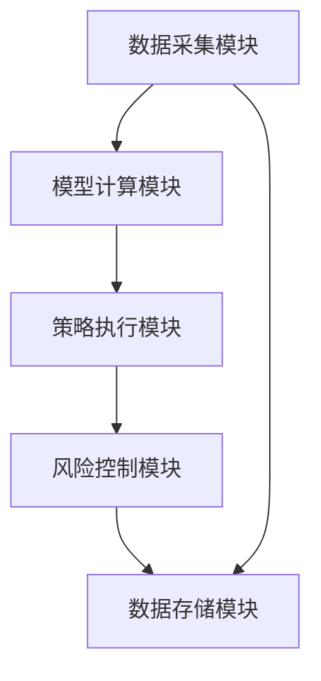
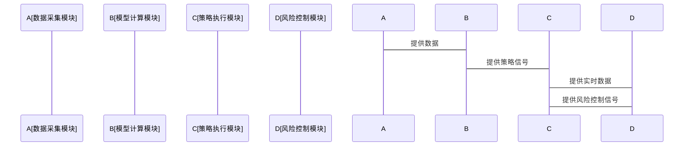

                 

# 如何利用特价股票策略进行全球宏观对冲

> 关键词：特价股票策略、全球宏观对冲、套利机会、宏观经济分析、对冲基金系统设计

> 摘要：本文详细探讨了如何利用特价股票策略进行全球宏观对冲。通过分析宏观经济环境、套利机会、数学模型和对冲基金系统设计，本文为读者提供了从理论到实践的全面指导。文章结合实际案例和最佳实践，帮助读者掌握如何在复杂多变的全球市场中运用特价股票策略进行有效的宏观对冲。

---

# 第1章: 特价股票策略与宏观对冲概述

## 1.1 宏观对冲的基本概念

### 1.1.1 宏观对冲的定义与特点
宏观对冲是一种投资策略，通过对宏观经济变量（如GDP、利率、汇率、通货膨胀等）的变化进行预测和交易，以实现收益。其特点包括：
- **全局性**：关注全球宏观经济环境。
- **多样性**：利用多种资产和市场进行对冲。
- **低相关性**：通过多元化降低风险。

### 1.1.2 特价股票策略的定义与特点
特价股票策略是指在特定市场条件下，利用股票价格的短期波动或市场套利机会进行投资的策略。其特点包括：
- **短期性**：通常在较短时间内完成交易。
- **高流动性**：主要集中在高流动性的市场或资产。
- **技术性**：依赖技术分析和算法交易。

### 1.1.3 宏观对冲与特价股票策略的关系
宏观对冲为特价股票策略提供了宏观经济背景和方向，而特价股票策略则为宏观对冲提供了具体的操作工具和市场机会。两者的结合能够帮助投资者在宏观层面捕捉市场趋势，同时在微观层面进行精准操作。

---

## 1.2 特价股票策略的核心要素

### 1.2.1 市场流动性分析
市场流动性是特价股票策略成功的关键因素之一。高流动性市场能够快速成交，降低交易成本。常用的流动性分析指标包括：
- **成交量**：反映市场活跃程度。
- **买卖价差**：衡量市场深度。
- **波动性**：反映市场稳定性。

### 1.2.2 市值与价格波动
市值与价格波动是特价股票策略的重要考量因素。通过分析股票的市值和价格波动，投资者可以识别潜在的套利机会。例如，小盘股通常具有更高的波动性和套利空间。

### 1.2.3 市场情绪与投资者行为
市场情绪和投资者行为直接影响股票价格的短期波动。通过分析市场情绪指标（如恐慌指数、投资者信心指数），投资者可以更好地把握市场趋势。

---

## 1.3 宏观经济环境对股票市场的影响

### 1.3.1 宏观经济指标对股票价格的影响
宏观经济指标（如GDP、利率、通货膨胀率）是影响股票价格的重要因素。例如，低利率环境通常会推高股票估值，而高通胀可能导致股票价格下跌。

### 1.3.2 全球经济周期与股票市场的关联
全球经济周期直接影响股票市场的表现。例如，在经济复苏阶段，股票市场通常表现良好；而在衰退阶段，股票市场可能大幅下跌。

### 1.3.3 宏观政策对股票市场的调控作用
政府和央行的宏观政策（如财政刺激、货币政策宽松）对股票市场有直接影响。例如，量化宽松政策通常会推高股票市场估值。

---

## 1.4 本章小结
本章介绍了宏观对冲和特价股票策略的基本概念及其关系，分析了特价股票策略的核心要素，包括市场流动性、市值与价格波动、市场情绪等。同时，探讨了宏观经济环境对股票市场的影响，为后续章节的策略实施奠定了基础。

---

# 第2章: 特价股票策略的原理与实施

## 2.1 特价股票策略的套利机会

### 2.1.1 市场套利的基本原理
套利是指利用不同市场或资产之间的价格差异进行无风险或低风险的交易。常见的套利机会包括：
- **跨市场套利**：利用不同市场之间的价格差异。
- **跨期套利**：利用不同时间点的价格差异。
- **统计套利**：基于统计学模型寻找短期价格偏差。

### 2.1.2 特价股票套利的常见模式
- **事件套利**：利用公司并购、重组等事件带来的股价波动。
- **短期价格偏差套利**：基于技术分析识别短期价格波动。
- **流动性套利**：利用高流动性的市场进行快速交易。

### 2.1.3 套利机会的识别与评估
套利机会的识别通常基于以下步骤：
1. **数据收集**：获取相关资产的价格和市场数据。
2. **价差计算**：计算不同资产或市场之间的价差。
3. **风险评估**：评估套利交易的风险（如流动性风险、市场风险）。

---

## 2.2 特价股票策略的数学模型

### 2.2.1 市场均衡模型
市场均衡模型假设市场中存在无套利机会，价格反映所有可用信息。例如，CAPM（资本资产定价模型）用于评估资产的预期回报。

$$ E(r_i) = r_f + \beta_i (E(r_m) - r_f) $$

其中：
- $E(r_i)$：资产i的预期回报率。
- $r_f$：无风险利率。
- $\beta_i$：资产i的贝塔系数。
- $E(r_m)$：市场预期回报率。

### 2.2.2 套利定价模型
套利定价模型（APT）用于评估资产的公平价值，基于多个因素（如通货膨胀、利率、经济增长）。

$$ E(r_i) = \sum_{j=1}^n \lambda_j F_{i,j} + r_f $$

其中：
- $\lambda_j$：因素j的风险溢价。
- $F_{i,j}$：资产i对因素j的敏感性。

### 2.2.3 时间序列分析模型
时间序列分析模型用于预测股票价格的短期波动。例如，ARIMA模型（自回归积分滑动平均模型）可以用于预测股票价格。

$$ ARIMA(p, d, q) $$

其中：
- p：自回归阶数。
- d：差分阶数。
- q：滑动平均阶数。

---

## 2.3 特价股票策略的实施步骤

### 2.3.1 数据收集与处理
数据收集是策略实施的基础。通常需要收集以下数据：
- 历史股票价格数据。
- 宏观经济指标数据。
- 市场情绪数据。

### 2.3.2 模型构建与验证
基于收集的数据，构建数学模型并进行验证。例如，使用ARIMA模型预测股票价格，并验证模型的准确性。

### 2.3.3 策略优化与风险控制
通过回测和优化算法（如均值-方差优化）来优化策略，并制定风险控制措施，如止损、头寸限制。

---

## 2.4 本章小结
本章详细讲解了特价股票策略的套利机会、数学模型和实施步骤。通过套利定价模型和时间序列分析模型，读者可以更好地理解如何利用数学工具进行策略设计和优化。

---

# 第3章: 全球宏观经济分析与股票市场预测

## 3.1 全球宏观经济指标分析

### 3.1.1 GDP与经济周期
GDP是衡量经济活动的重要指标。例如，GDP增长通常伴随着股市上涨，而GDP下降可能导致股市下跌。

### 3.1.2 利率与货币政策
利率水平和货币政策直接影响股市。例如，低利率环境通常会推高股市估值。

### 3.1.3 汇率与国际贸易
汇率波动和国际贸易政策对股市有直接影响。例如，本币贬值可能提升出口企业的竞争力，从而推高股价。

---

## 3.2 宏观经济因素对股票市场的影响

### 3.2.1 经济周期对股票市场的影响
经济周期分为扩张期和衰退期。在扩张期，股票市场通常表现良好；在衰退期，股票市场可能大幅下跌。

### 3.2.2 货币政策对股票市场的影响
货币政策（如量化宽松、加息）直接影响股市。例如，量化宽松政策通常会推高股市估值。

### 3.2.3 汇率波动对股票市场的影响
汇率波动影响出口企业的竞争力和外资流入。例如，本币贬值可能降低出口成本，提升股价。

---

## 3.3 全球宏观经济预测模型

### 3.3.1 ARIMA模型
ARIMA模型用于预测宏观经济指标，如GDP增长率。

$$ ARIMA(p, d, q) $$

### 3.3.2 趋势外推模型
趋势外推模型基于历史数据预测未来趋势。

### 3.3.3 情景分析模型
情景分析模型用于模拟不同宏观经济情景下的股市表现。

---

## 3.4 本章小结
本章分析了全球宏观经济指标对股票市场的影响，并介绍了常用的宏观经济预测模型。通过这些模型，投资者可以更好地理解全球经济环境，并制定相应的投资策略。

---

# 第4章: 特价股票策略的系统设计与实现

## 4.1 系统架构设计

### 4.1.1 系统模块划分
- 数据采集模块：负责收集宏观经济数据和股票市场数据。
- 模型计算模块：负责构建和运行数学模型。
- 策略执行模块：负责根据模型结果执行交易策略。
- 风险控制模块：负责实时监控和管理风险。

### 4.1.2 数据流设计
数据流设计包括数据的输入、处理和输出流程。例如，数据采集模块将数据传递给模型计算模块，模型计算模块将结果传递给策略执行模块。

### 4.1.3 系统功能设计
系统功能设计包括：
- 数据可视化：通过图表展示宏观经济指标和股票价格走势。
- 模型验证：通过回测验证策略的有效性。
- 策略优化：通过算法优化策略参数。

---

## 4.2 系统架构图

---

## 4.3 系统接口设计

### 4.3.1 数据接口
- 数据接口1：从金融数据供应商获取股票价格数据。
- 数据接口2：从宏观经济数据库获取经济指标数据。

### 4.3.2 策略接口
- 策略接口1：将模型计算结果传递给交易系统。
- 策略接口2：从交易系统获取实时市场数据。

---

## 4.4 系统交互流程

### 4.4.1 系统交互序列图

---

## 4.5 本章小结
本章详细讲解了特价股票策略的系统架构设计和实现。通过模块划分、数据流设计和系统交互流程，读者可以更好地理解如何将策略应用于实际投资中。

---

# 作者信息

作者：AI天才研究院/AI Genius Institute & 禅与计算机程序设计艺术 /Zen And The Art of Computer Programming

---

以上是《如何利用特价股票策略进行全球宏观对冲》的完整目录和内容概览。希望这篇文章能够为读者提供有价值的见解和指导，帮助他们在复杂多变的全球市场中运用特价股票策略进行有效的宏观对冲。

