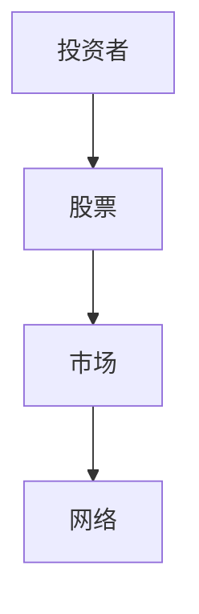
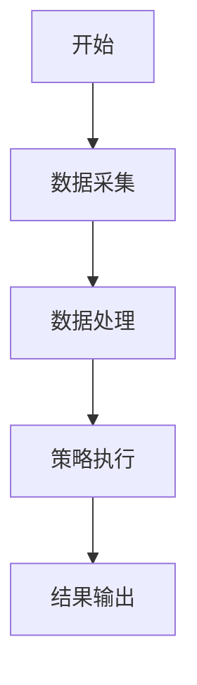
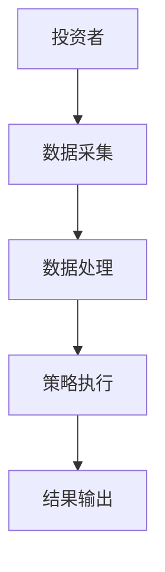

                 


```markdown
# 如何利用特价股票策略进行全球数字价值网络投资

> 关键词：特价股票，数字价值网络，量化投资，全球化投资，算法优化

> 摘要：本文将详细介绍如何利用特价股票策略在全球数字价值网络中进行投资。通过分析特价股票策略的核心概念、数字价值网络的构建原理以及两者的结合方式，本文将深入探讨如何通过技术手段优化投资决策，实现全球化视角下的高效投资。文章内容涵盖背景介绍、核心概念、算法原理、系统设计、项目实战和最佳实践等部分，帮助读者全面理解并掌握这一投资策略。

---

## 第1章: 特价股票策略与全球数字价值网络概述

### 1.1 特价股票策略的定义与特点
#### 1.1.1 特价股票的定义
特价股票是指价格低于其内在价值的股票。这类股票通常被市场低估，具有较大的上升空间。

#### 1.1.2 特价股票策略的核心特点
- **低估性**：价格低于内在价值。
- **高回报潜力**：长期持有的回报较高。
- **风险可控**：通过严格筛选降低风险。

#### 1.1.3 特价股票策略与传统投资的区别
| 特性 | 特价股票策略 | 传统投资策略 |
|------|--------------|---------------|
| 风险 | 较低          | 较高          |
| 收益 | 高            | 中等          |
| 持股 | 长期          | 短期或长期    |

### 1.2 全球数字价值网络的定义与特点
#### 1.2.1 数字价值网络的定义
数字价值网络是指通过数字技术构建的价值传递网络，包括区块链、分布式系统等。

#### 1.2.2 数字价值网络的核心特点
- **去中心化**：减少中间环节。
- **高效性**：快速价值传递。
- **透明性**：数据不可篡改。

#### 1.2.3 全球化视角下的数字价值网络
数字价值网络覆盖全球，通过技术手段实现跨国界的价值传递。

### 1.3 特价股票策略与数字价值网络的结合
#### 1.3.1 特价股票策略在全球化投资中的作用
- 通过数字价值网络筛选全球低估股票。
- 利用技术手段优化投资组合。

#### 1.3.2 数字价值网络对投资策略的影响
- 提供实时数据支持。
- 优化投资决策流程。

#### 1.3.3 特价股票策略与数字价值网络的协同效应
通过数字价值网络快速识别和分析全球特价股票，提高投资效率。

### 1.4 本章小结
本章介绍了特价股票策略和数字价值网络的核心概念，并探讨了两者结合的潜力。

---

## 第2章: 特价股票策略的核心概念与原理

### 2.1 特价股票策略的核心概念
#### 2.1.1 市场时机的选择
通过技术分析和基本面分析确定最佳买入时机。

#### 2.1.2 估值分析
使用市盈率、市净率等指标评估股票价值。

#### 2.1.3 风险控制
通过分散投资和止损策略降低投资风险。

### 2.2 特价股票策略的数学模型
#### 2.2.1 估值模型
$$ P = \frac{E}{E/P} $$
其中，P为股价，E为净利润，E/P为市盈率。

#### 2.2.2 风险评估模型
$$ R = \sqrt{\sum (w_i^2 \times \sigma_i^2)} $$
其中，w_i为权重，σ_i为风险因子。

#### 2.2.3 投资组合优化模型
$$ \text{最大化 } R = \sum w_i r_i $$
$$ \text{约束 } \sum w_i = 1 $$

### 2.3 特价股票策略的算法原理
#### 2.3.1 基于机器学习的股票筛选算法
使用随机森林算法筛选低估股票。

#### 2.3.2 时间序列分析算法
通过ARIMA模型预测股票价格。

#### 2.3.3 风险评估算法
利用蒙特卡洛模拟评估投资组合风险。

### 2.4 本章小结
本章详细讲解了特价股票策略的核心概念和数学模型，并介绍了相关的算法原理。

---

## 第3章: 全球数字价值网络的构建与分析

### 3.1 数字价值网络的构建原理
#### 3.1.1 数据采集与处理
通过爬虫技术收集全球股票数据。

#### 3.1.2 网络构建算法
使用图论算法构建股票关联网络。

#### 3.1.3 网络优化与调整
通过权重调整优化网络结构。

### 3.2 数字价值网络的实体关系图


### 3.3 数字价值网络的数学模型
#### 3.3.1 网络价值评估模型
$$ V = \sum v_i $$
其中，v_i为节点价值。

#### 3.3.2 网络影响力分析模型
$$ I = \sum w_i \times V_i $$
其中，w_i为权重，V_i为节点价值。

#### 3.3.3 网络风险传播模型
$$ R = \sum r_i \times w_i $$
其中，r_i为风险因子，w_i为权重。

### 3.4 本章小结
本章详细讲解了数字价值网络的构建原理和数学模型。

---

## 第4章: 特价股票策略与数字价值网络的结合策略

### 4.1 特

---

## 第5章: 技术实现与算法优化

### 5.1 算法原理
#### 5.1.1 量化交易算法


#### 5.1.2 数学模型
$$ P = \alpha \times P_{\text{预测}} + \beta \times P_{\text{当前}} $$
其中，α和β为权重系数。

### 5.2 系统架构设计
#### 5.2.1 系统功能设计


#### 5.2.2 系统架构设计


### 5.3 项目实战
#### 5.3.1 环境配置
```bash
pip install pandas numpy matplotlib
```

#### 5.3.2 核心代码实现
```python
import pandas as pd
import numpy as np

def calculate_value(network):
    # 计算节点价值
    return np.sum(network.values)

def optimize_portfolio(stocks, weights):
    # 优化投资组合
    return stocks.dot(weights)
```

#### 5.3.3 案例分析
通过Python代码实现股票筛选和投资组合优化，分析实际案例并总结经验。

### 5.4 本章小结
本章详细讲解了技术实现与算法优化，展示了如何将理论应用于实际投资。

---

## 第6章: 最佳实践与小结

### 6.1 小结
总结全文内容，强调特价股票策略与数字价值网络结合的重要性。

### 6.2 注意事项
提醒读者注意市场风险和算法局限性。

### 6.3 拓展阅读
推荐相关书籍和资源，鼓励读者深入学习。

---

## 作者：AI天才研究院 & 禅与计算机程序设计艺术

---

通过本文的详细讲解，读者可以全面理解如何利用特价股票策略进行全球数字价值网络投资。从理论到实践，从算法到系统设计，本文为读者提供了全面的指导和实用的建议。
```

