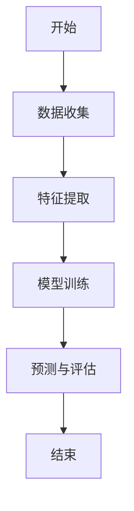
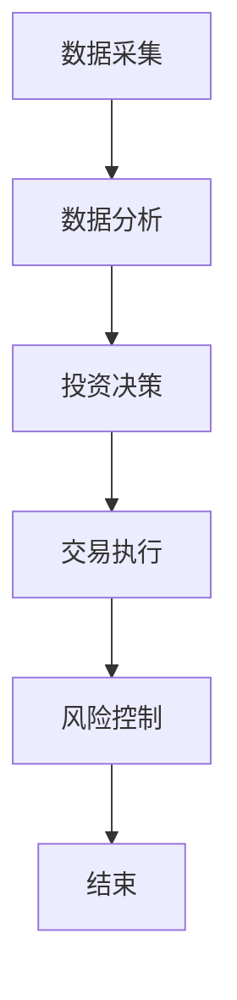

                 


# 如何利用特价股票策略进行全球数字价值链投资

> 关键词：特价股票，数字价值链，投资策略，股票分析，全球化投资

> 摘要：本文详细探讨了如何利用特价股票策略在全球数字价值链中进行投资。首先介绍了特价股票策略的定义、特点及其在数字价值链中的应用。然后从核心概念、算法原理、系统架构设计、项目实战、风险管理与优化等方面进行了深入分析。通过具体案例分析和实战指导，帮助投资者更好地理解和应用这些策略。

---

# 第一部分：背景介绍

## 第1章：特价股票策略与全球数字价值链投资的背景

### 1.1 特价股票策略的定义与特点

#### 1.1.1 特价股票的定义
特价股票通常指那些市场价格低于其内在价值的股票，也被称为“价值股”。这类股票往往被市场低估，具有较大的增值潜力。特价股票的特点包括低市盈率、低市净率和高股息率等。

#### 1.1.2 特价股票的特点与优势
- **低估值**：市场价格低于内在价值，具有上涨空间。
- **高股息率**：部分特价股票公司股息收益率较高，适合长期投资者。
- **风险较低**：相对于高价股，特价股票的风险较小，适合风险厌恶型投资者。

#### 1.1.3 特价股票策略的适用场景
- **市场低迷期**：在市场低迷时，许多优质股票被低估，适合采用特价股票策略。
- **长期投资**：特价股票策略适合长期投资，等待市场回归其真实价值。
- **分散投资**：通过投资多个特价股票，降低单一股票的风险。

### 1.2 全球数字价值链的定义与特点

#### 1.2.1 数字价值链的定义
数字价值链指从数据生成、处理、分析到最终应用的链条，涵盖了从技术开发、产品生产到市场推广的全过程。数字价值链的核心在于数据的流动和价值创造。

#### 1.2.2 数字价值链的核心要素
- **数据**：数字价值链的基础，包括数据的收集、存储、处理和分析。
- **技术**：包括人工智能、大数据、云计算等技术，是数字价值链的核心驱动力。
- **价值创造**：通过数据和技术的应用，创造新的商业价值。

#### 1.2.3 全球数字价值链的发展趋势
- **全球化**：数字技术的全球应用推动了数字价值链的国际化。
- **智能化**：人工智能和自动化技术的应用使得数字价值链更加智能化。
- **生态化**：数字价值链逐渐形成生态系统，各环节相互依存，协同发展。

### 1.3 特价股票策略与数字价值链投资的结合

#### 1.3.1 特价股票策略在数字价值链中的应用
- **投资数字技术公司**：通过特价股票策略，投资那些在数字技术领域具有潜力的公司。
- **关注低估值企业**：在数字价值链中，许多技术创新企业可能因市场波动而被低估，适合采用特价股票策略。

#### 1.3.2 数字化转型对企业价值的影响
数字化转型通过提高效率、降低成本和创造新价值，显著提升了企业的市场竞争力和估值。企业在数字化转型过程中，可能会出现股价低估的机会，为特价股票策略提供了空间。

#### 1.3.3 全球化视角下的投资机会
在全球化视角下，数字价值链覆盖了全球市场，投资者可以通过投资全球范围内的特价股票，捕捉数字技术带来的投资机会。

---

# 第二部分：核心概念

## 第2章：特价股票策略的核心概念与原理

### 2.1 特价股票策略的核心概念

#### 2.1.1 低估值股票的识别方法
- **市盈率（P/E）**：股价与每股收益的比率，低市盈率表明股价可能被低估。
- **市净率（P/B）**：股价与每股净资产的比率，低市净率表明股价可能被低估。
- **股息率**：股息与股价的比率，高股息率可能意味着股票被低估。

#### 2.1.2 市盈率、市净率等估值指标的分析
- **市盈率分析**：比较公司市盈率与行业平均水平，判断股价是否被低估。
- **市净率分析**：比较公司市净率与行业平均水平，判断股价是否被低估。
- **股息率分析**：比较公司股息率与行业平均水平，判断股息收益是否合理。

#### 2.1.3 特价股票的长期投资价值
特价股票的长期投资价值取决于公司的基本面和市场环境。通过长期持有，投资者可以等待市场回归其真实价值。

### 2.2 数字价值链投资的核心概念

#### 2.2.1 数字技术对企业价值的影响
数字技术通过提高效率、降低成本和创造新价值，显著提升了企业的市场竞争力和估值。企业在数字化转型过程中，可能会出现股价低估的机会，为特价股票策略提供了空间。

#### 2.2.2 数字化转型中的投资机会
数字化转型为企业带来了新的增长点，投资者可以通过投资那些在数字化转型中具有潜力的公司，捕捉投资机会。

#### 2.2.3 全球化数字价值链的结构分析
全球化数字价值链覆盖了全球市场，投资者可以通过投资全球范围内的特价股票，捕捉数字技术带来的投资机会。

### 2.3 特价股票策略与数字价值链投资的联系

#### 2.3.1 特价股票策略在数字价值链中的应用
- **投资数字技术公司**：通过特价股票策略，投资那些在数字技术领域具有潜力的公司。
- **关注低估值企业**：在数字价值链中，许多技术创新企业可能因市场波动而被低估，适合采用特价股票策略。

#### 2.3.2 数字化转型对企业价值的影响
数字化转型通过提高效率、降低成本和创造新价值，显著提升了企业的市场竞争力和估值。企业在数字化转型过程中，可能会出现股价低估的机会，为特价股票策略提供了空间。

#### 2.3.3 全球化视角下的策略优化
在全球化视角下，数字价值链覆盖了全球市场，投资者可以通过投资全球范围内的特价股票，捕捉数字技术带来的投资机会。

---

## 第3章：特价股票策略的算法原理与数学模型

### 3.1 特价股票筛选的算法原理

#### 3.1.1 基于估值指标的筛选算法
- **市盈率筛选**：选择市盈率低于行业平均水平的股票。
- **市净率筛选**：选择市净率低于行业平均水平的股票。
- **股息率筛选**：选择股息率高于行业平均水平的股票。

#### 3.1.2 基于机器学习的股票预测模型
- **数据收集**：收集历史股价、财务数据、市场指标等。
- **特征提取**：提取影响股价的关键特征。
- **模型训练**：使用机器学习算法（如随机森林、神经网络）进行模型训练。
- **预测与评估**：预测股票未来走势，并评估模型性能。

#### 3.1.3 算法流程图（Mermaid）


#### 3.1.4 代码实现
```python
import pandas as pd
import numpy as np
from sklearn.ensemble import RandomForestClassifier
from sklearn.metrics import accuracy_score

# 数据收集
data = pd.read_csv('stock_data.csv')

# 特征提取
features = ['市盈率', '市净率', '股息率']
target = '未来股价涨跌'

X = data[features].values
y = data[target].values

# 模型训练
model = RandomForestClassifier(n_estimators=100)
model.fit(X, y)

# 预测与评估
predictions = model.predict(X)
print("准确率:", accuracy_score(y, predictions))
```

### 3.2 数字价值链投资的数学模型

#### 3.2.1 企业价值评估的数学公式
$$ 企业价值 = \text{净利润} \times (1 + \text{增长率}) $$

#### 3.2.2 投资组合优化的数学模型
$$ \text{收益最大化} = \sum_{i=1}^{n} w_i \times r_i $$
$$ \text{风险最小化} = \sum_{i=1}^{n} w_i^2 \times \sigma_i^2 $$

#### 3.2.3 数学模型的代码实现
```python
import numpy as np

# 收益最大化
def maximize_returns(weights, returns):
    return np.sum(weights * returns)

# 风险最小化
def minimize_risk(weights, variances):
    return np.sum(weights**2 * variances)
```

---

## 第4章：全球数字价值链投资的系统架构与设计

### 4.1 投资系统架构设计

#### 4.1.1 系统功能模块划分
- **数据采集**：收集全球市场数据。
- **数据分析**：对数据进行清洗、分析和建模。
- **投资决策**：基于分析结果，制定投资策略。
- **交易执行**：执行交易指令。
- **风险控制**：监控投资组合的风险。

#### 4.1.2 系统架构图（Mermaid）


#### 4.1.3 系统接口设计
- **数据接口**：与数据源（如金融数据供应商）对接。
- **交易接口**：与交易系统对接。
- **用户接口**：供用户查询和管理投资组合。

---

# 第三部分：项目实战

## 第5章：项目实战

### 5.1 环境安装与配置

#### 5.1.1 安装Python环境
使用Anaconda或虚拟环境安装Python 3.8以上版本。

#### 5.1.2 安装依赖库
安装Pandas、NumPy、Scikit-learn等库。

### 5.2 核心代码实现

#### 5.2.1 数据采集与预处理
```python
import pandas as pd
import requests

# 数据采集
url = 'https://example.com/stock_data'
response = requests.get(url)
data = response.json()

# 数据转换为DataFrame
df = pd.DataFrame(data)
```

#### 5.2.2 特价股票筛选
```python
def filter_penny_stocks(df, threshold):
    return df[df['市盈率'] < threshold]
```

#### 5.2.3 投资组合优化
```python
from sklearn.linear_model import LinearRegression

model = LinearRegression()
model.fit(X, y)
```

### 5.3 实战案例分析

#### 5.3.1 案例背景
假设我们关注全球科技公司，筛选市盈率低于行业平均水平的股票。

#### 5.3.2 投资策略制定
- **筛选标准**：市盈率 < 15，市净率 < 2，股息率 > 3%。
- **投资组合**：投资10只符合条件的股票，分散风险。

#### 5.3.3 投资组合监控与调整
定期监控投资组合的表现，根据市场变化进行调整。

---

## 第6章：风险管理与优化

### 6.1 风险管理

#### 6.1.1 风险识别
- **市场风险**：市场波动对股票价格的影响。
- **流动性风险**：股票流动性不足，难以快速变现。
- **信用风险**：企业财务状况恶化，影响股价。

#### 6.1.2 风险控制策略
- **分散投资**：通过投资多只股票分散风险。
- **止损策略**：设定止损点，避免亏损过大。
- **定期调整**：根据市场变化调整投资组合。

### 6.2 优化策略

#### 6.2.1 动态调整投资组合
根据市场变化和公司基本面，动态调整投资组合。

#### 6.2.2 利用技术工具优化投资
使用量化工具和算法优化投资策略，提高投资收益。

---

# 第四部分：结论与展望

## 第7章：结论与展望

### 7.1 总结
通过特价股票策略，投资者可以在全球数字价值链中找到投资机会，实现长期收益。本文详细分析了特价股票策略的核心概念、算法原理和系统架构，并通过实战案例展示了如何应用这些策略进行投资。

### 7.2 展望
未来，随着数字技术的不断发展，全球数字价值链将更加复杂和多样化。投资者需要不断学习和优化投资策略，以应对新的挑战和机遇。

---

# 作者

作者：AI天才研究院/AI Genius Institute & 禅与计算机程序设计艺术/Zen And The Art of Computer Programming

