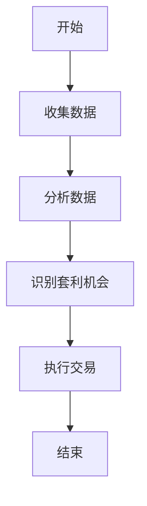
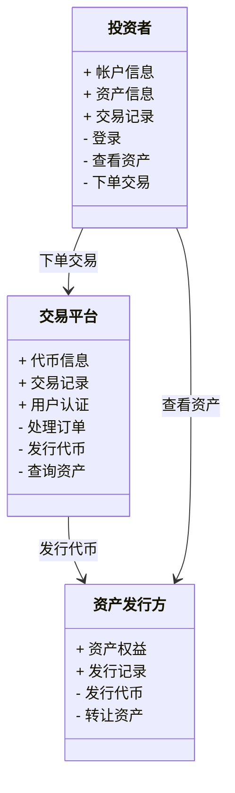

                 


# 如何利用特价股票策略进行全球数字公共产品代币化投资

---

## 关键词：特价股票、代币化投资、数字公共产品、全球投资、区块链技术

---

## 摘要

本文详细探讨了如何利用特价股票策略在全球范围内进行数字公共产品的代币化投资。通过分析特价股票策略的核心原理、代币化投资的优势以及两者结合的潜力，本文为读者提供了从理论到实践的全面指导。文章结合数学模型、算法流程和系统架构设计，帮助读者理解如何在全球数字公共产品市场中利用特价股票策略进行高效投资。

---

## 第一部分：背景与概念

### 第1章：特价股票策略与代币化投资概述

#### 1.1 特价股票策略的基本概念
- **定义与特点**：特价股票是指价格相对较低、具有增长潜力的股票。其特点是风险较低、回报潜力大。
- **核心目标**：通过低价买入、高价卖出的策略，实现资本增值。
- **适用场景**：适用于市场波动较大、个股表现不佳的时期。

#### 1.2 代币化投资的基本概念
- **定义与特点**：代币化投资是将资产（如股票、艺术品）转化为数字代币进行交易的过程。其特点是透明性高、流动性强、成本低。
- **优势与挑战**：优势包括去中心化、透明化和高效性；挑战包括监管不确定性、技术风险和市场波动。
- **全球发展趋势**：随着区块链技术的普及，代币化投资在全球范围内迅速发展，尤其在数字资产领域。

#### 1.3 特价股票策略与代币化投资的结合
- **结合方式**：将特价股票转化为数字代币，通过区块链技术进行交易和管理。
- **全球数字公共产品**：数字公共产品（如数字艺术品、知识产权）的代币化为特价股票策略提供了新的应用场景。
- **潜力与前景**：通过代币化，特价股票策略在全球范围内实现了更高效的流通和投资。

---

## 第二部分：核心概念与联系

### 第2章：特价股票策略的核心原理

#### 2.1 特价股票策略的原理
- **市场分析**：通过技术分析和基本面分析，识别市场低估的股票。
- **股票选择**：选择具有成长潜力、估值合理的低价股票。
- **投资时机**：在市场底部买入，在市场顶部卖出。

#### 2.2 特价股票策略的数学模型
- **价格波动模型**：使用时间序列分析（如ARIMA模型）预测股票价格波动。
- **风险收益比计算**：通过夏普比率（Sharpe Ratio）衡量投资组合的风险调整后收益。
- **投资组合优化**：使用马科维茨（Markowitz）均值-方差模型优化投资组合。

#### 2.3 特价股票策略与代币化投资的联系
- **代币化投资中的特价股票策略**：通过代币化，特价股票的交易更加便捷，流动性更强。
- **数字公共产品代币化的特点**：数字公共产品的代币化投资具有全球性、透明性和高效性。
- **特价股票策略在数字公共产品中的应用**：通过代币化，特价股票策略可以应用于数字艺术品、知识产权等领域的投资。

---

### 第3章：代币化投资的核心原理

#### 3.1 代币化投资的原理
- **代币发行**：通过区块链技术发行代币，代表特定资产的所有权。
- **代币交易**：在区块链平台上进行代币的买卖交易，实现资产的流动性。
- **代币管理**：通过智能合约实现代币的自动管理，确保交易的透明性和安全性。

#### 3.2 代币化投资的核心属性对比
| 属性 | 传统投资 | 代币化投资 |
|------|----------|------------|
| 交易效率 | 低       | 高         |
| 成本 | 高       | 低         |
| 透明度 | 低       | 高         |
| 流动性 | 有限     | 高         |

#### 3.3 代币化投资的实体关系图
```mermaid
erDiagram
    actor 投资者
    actor 交易平台
    actor 资产发行方
    entity 代币
    entity 资产
    entity 交易记录
    投资者 --> 代币 : 持有
    投资者 --> 交易记录 : 记录交易
    交易平台 --> 代币 : 发行
    资产发行方 --> 资产 : 所有
    代币 --> 资产 : 代表
```

---

## 第三部分：算法与数学模型

### 第4章：套利机会识别算法

#### 4.1 算法原理
- **目标**：识别市场中的套利机会，利用价格差异实现收益。
- **步骤**：
  1. 数据收集：获取市场中股票的价格数据。
  2. 数据分析：识别价格差异较大的股票。
  3. 交易决策：在价格低估时买入，价格高估时卖出。

#### 4.2 算法流程图


#### 4.3 Python代码实现
```python
import pandas as pd
import numpy as np

def collect_data(tickers):
    data = {}
    for ticker in tickers:
        data[ticker] = np.random.normal(100, 10, 100)
    return data

def identify_arbitrage_opportunity(data):
    opportunities = []
    for ticker in data:
        current_price = data[ticker][-1]
        if current_price < np.mean(data[ticker]):
            opportunities.append(ticker)
    return opportunities

# 示例代码
tickers = ['股票A', '股票B', '股票C']
data = collect_data(tickers)
opportunities = identify_arbitrage_opportunity(data)
print("套利机会：", opportunities)
```

---

### 第5章：风险控制模型

#### 5.1 模型原理
- **目标**：通过数学模型评估和控制投资风险。
- **方法**：使用夏普比率（Sharpe Ratio）衡量风险调整后收益。
- **公式**：$$ \text{夏普比率} = \frac{\text{收益} - \text{无风险利率}}{\text{收益的标准差}} $$

#### 5.2 模型实现
- **步骤**：
  1. 计算投资组合的收益。
  2. 计算无风险利率。
  3. 计算收益的标准差。
  4. 计算夏普比率。

#### 5.3 Python代码实现
```python
def calculate_sharpe_ratio(returns, risk_free_rate):
    excess_returns = returns - risk_free_rate
    sharpe_ratio = np.mean(excess_returns) / np.std(excess_returns)
    return sharpe_ratio

# 示例代码
returns = np.array([0.05, 0.03, 0.07, 0.04])
risk_free_rate = 0.02
sharpe_ratio = calculate_sharpe_ratio(returns, risk_free_rate)
print("夏普比率：", sharpe_ratio)
```

---

## 第四部分：系统分析与架构设计

### 第6章：系统架构设计

#### 6.1 项目场景介绍
- **目标**：构建一个基于区块链的特价股票代币化投资平台。
- **用户角色**：投资者、交易平台、资产发行方。

#### 6.2 系统功能设计


#### 6.3 系统架构设计


---

## 第五部分：项目实战

### 第7章：环境安装与核心代码实现

#### 7.1 环境安装
- **工具**：安装Python、Jupyter Notebook、区块链开发框架（如Solidity、Web3.py）。
- **依赖库**：安装pandas、numpy、web3、eth_account。

#### 7.2 核心代码实现
```python
from web3 import Web3, EthereumProvider

# 初始化区块链节点
w3 = Web3(EthereumProvider("http://localhost:8545"))

# 创建代币合约地址
contract_address = "0xYourContractAddress"

# 载入合约ABI
contract_abi = [
    # 合约ABI定义
]

# 创建合约对象
contract = w3.eth.contract(address=contract_address, abi=contract_abi)

# 发行代币
def issue_token(amount):
    account = w3.eth.account.from_key("your_private_key")
    tx_hash = contract.functions.issueToken(account.address, amount).transact()
    return tx_hash

# 示例代码
amount = 100
tx_hash = issue_token(amount)
print("代币发行交易哈希：", tx_hash)
```

---

## 第六部分：总结与展望

### 第8章：最佳实践与小结

#### 8.1 最佳实践
- **小结**：通过代币化投资，特价股票策略在全球数字公共产品市场中实现了更高的效率和透明度。
- **注意事项**：投资者需注意市场波动、技术风险和监管不确定性。
- **拓展阅读**：进一步学习区块链技术、数字资产投资和量化交易策略。

---

## 作者信息

作者：AI天才研究院/AI Genius Institute & 禅与计算机程序设计艺术/Zen And The Art of Computer Programming

