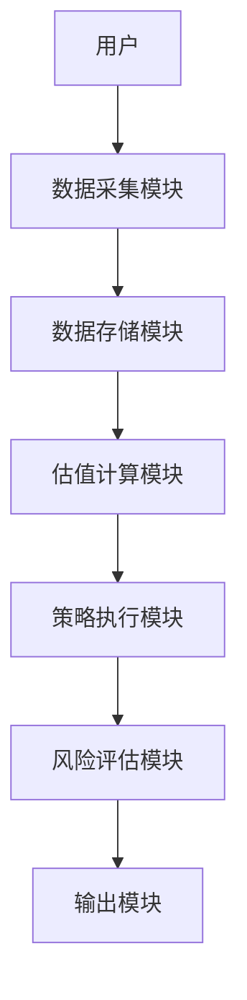
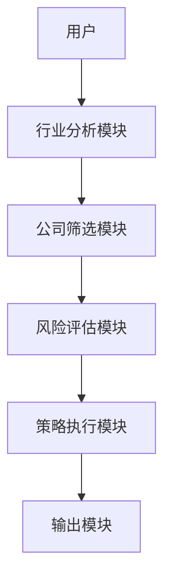
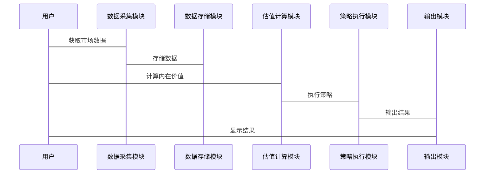

                 


# 如何利用特价股票策略进行全球数字基础设施投资

## 关键词：特价股票策略、数字基础设施、投资策略、股票分析、算法优化

## 摘要：本文探讨了如何利用特价股票策略在全球范围内进行数字基础设施投资。通过分析数字基础设施的核心要素，结合特价股票的筛选标准，本文详细阐述了如何通过算法优化和系统设计来实现高效的投资决策。文章从背景介绍、核心概念、算法原理、系统架构到项目实战，全面解析了这一投资策略的实施路径，并提供了具体的Python代码和案例分析。

---

# 第一部分: 特价股票策略与全球数字基础设施投资概述

## 第1章: 特价股票策略与数字基础设施投资的背景

### 1.1 特价股票策略的定义与特点

#### 1.1.1 特价股票的定义
特价股票是指市场价格低于其内在价值的股票。这类股票通常被市场低估，具有较大的增值潜力。其核心在于发现市场中的估值错配，通过长期持有或短期操作实现收益。

#### 1.1.2 特价股票的核心特点
- **低估值**：市盈率、市净率等指标低于行业平均水平。
- **高潜力**：公司基本面良好，行业地位稳固，未来增长可期。
- **逆周期性**：在市场低迷时更容易出现特价股票。

#### 1.1.3 特价股票与传统股票投资的区别
| 特性       | 特价股票策略         | 传统股票策略       |
|------------|----------------------|--------------------|
| 投资逻辑   | 估值修复驱动         | 基本面驱动         |
| 持股时间   | 中长期               | 短期或长期         |
| 风险偏好   | 中高风险             | 低至中风险         |

### 1.2 全球数字基础设施投资的背景

#### 1.2.1 数字化转型的全球趋势
随着云计算、人工智能、物联网等技术的快速发展，全球正在进行大规模的数字化转型。数字基础设施成为支撑这一转型的核心。

#### 1.2.2 数字基础设施的组成部分
- **数据中心**：数据存储和计算的核心设施。
- **网络架构**：高速、安全的网络连接。
- **云计算服务**：弹性计算资源的提供。
- **5G技术**：高速、低延迟的通信网络。

#### 1.2.3 数字基础设施投资的重要性
数字基础设施是数字经济的基石，投资其建设和升级能够带来长期的收益和竞争优势。

### 1.3 特价股票策略在数字基础设施投资中的应用

#### 1.3.1 特价股票策略的适用场景
- **市场低迷期**：数字基础设施相关股票可能被低估。
- **行业整合期**：并购活动可能导致股价低估。
- **新技术周期**：新技术出现前，相关股票可能价格被压制。

#### 1.3.2 数字基础设施投资中的机会
- **技术领先企业**：如云计算巨头、通信设备供应商。
- **新兴技术公司**：如5G设备制造商、人工智能芯片公司。
- **基础设施服务商**：如数据中心运营商。

#### 1.3.3 特价股票策略的优势与挑战
- **优势**：能够以较低成本获得优质资产。
- **挑战**：需要准确判断市场周期和公司价值。

## 第2章: 特价股票策略与数字基础设施投资的核心概念

### 2.1 特价股票策略的核心概念

#### 2.1.1 市场估值与内在价值
市场估值是股票的市场价格，内在价值是基于公司基本面的合理估值。特价股票策略的核心在于发现两者之间的差异。

#### 2.1.2 股票价格波动的规律
股票价格受市场情绪、宏观经济、公司业绩等多种因素影响，呈现出周期性波动。

#### 2.1.3 特价股票的识别方法
- **市盈率法**：市盈率低于行业平均水平。
- **市净率法**：市净率低于历史平均水平。
- **股息率法**：股息率较高，且稳定增长。

### 2.2 数字基础设施投资的核心要素

#### 2.2.1 数字基础设施的关键领域
- **数据存储**：包括数据中心、云存储等。
- **网络传输**：包括5G、光纤通信等。
- **计算能力**：包括高性能计算、边缘计算等。

#### 2.2.2 数字基础设施的投资周期
数字基础设施的投资周期较长，通常需要5-10年的时间来建设和升级。

#### 2.2.3 数字基础设施的风险与收益分析
- **风险**：技术过时、政策变化、市场需求不足。
- **收益**：长期稳定的现金流，较高的资产回报率。

### 2.3 特价股票策略与数字基础设施投资的结合

#### 2.3.1 特价股票策略在数字基础设施投资中的应用
- **行业分析**：选择具有增长潜力的数字基础设施领域。
- **公司筛选**：寻找估值被低估的相关企业。
- **时机选择**：在市场低迷时介入。

#### 2.3.2 数字基础设施投资中的特价股票筛选标准
| 标准       | 描述                       |
|------------|----------------------------|
| 市盈率     | 低于行业平均水平           |
| 市净率     | 低于历史平均水平           |
| 股息率     | 高于行业平均水平           |
| 市场地位   | 具备行业领先地位           |

#### 2.3.3 特价股票策略的长期与短期效果
- **长期**：通过价值回归实现资产增值。
- **短期**：市场情绪好转时，股价可能快速反弹。

## 第3章: 特价股票策略与数字基础设施投资的系统架构

### 3.1 特价股票策略的系统架构

#### 3.1.1 系统功能设计
- **数据采集**：获取市场数据，包括股价、市盈率、市净率等。
- **估值计算**：基于财务数据计算内在价值。
- **策略执行**：根据策略筛选出目标股票。
- **风险评估**：评估投资风险，制定风险管理策略。

#### 3.1.2 系统架构设计


#### 3.1.3 系统接口设计
- **数据接口**：与数据源（如股票行情API）对接。
- **用户接口**：提供可视化界面，供用户查看筛选结果和策略执行情况。

### 3.2 数字基础设施投资的系统架构

#### 3.2.1 项目介绍
数字基础设施投资系统旨在帮助投资者识别和管理数字基础设施相关的投资机会。

#### 3.2.2 系统功能设计
- **行业分析**：分析数字基础设施行业的市场趋势。
- **公司筛选**：根据财务指标筛选潜在投资标的。
- **风险评估**：评估投资风险，制定风险管理策略。
- **策略执行**：根据策略执行投资操作。

#### 3.2.3 系统架构设计


### 3.3 系统交互流程

#### 3.3.1 交互流程


---

# 第四部分: 项目实战与最佳实践

## 第4章: 项目实战

### 4.1 环境安装与配置

#### 4.1.1 安装Python
```bash
python --version
pip install --upgrade pip
```

#### 4.1.2 安装数据分析库
```bash
pip install pandas numpy matplotlib
```

### 4.2 核心代码实现

#### 4.2.1 数据采集代码
```python
import pandas as pd
import numpy as np

# 示例数据
data = {
    '股票代码': ['AAPL', 'MSFT', 'GOOGL'],
    '市盈率': [15.0, 18.0, 22.0],
    '市净率': [3.0, 4.0, 5.0],
    '股息率': [2.0, 3.0, 2.5]
}
df = pd.DataFrame(data)
print(df)
```

#### 4.2.2 估值计算代码
```python
def calculate_intrinsic_value(revenue, profit_margin, discount_rate):
    return revenue * profit_margin / (discount_rate / 100)
```

### 4.3 案例分析与解读

#### 4.3.1 案例分析
假设我们要分析一家云计算公司的股票：

- **市盈率**：20
- **行业平均市盈率**：25
- **股息率**：2%

根据数据，该公司的市盈率低于行业平均水平，股息率高于行业平均水平，因此可能是一只特价股票。

#### 4.3.2 投资决策
基于以上分析，建议投资者关注该公司的股价变化，等待合适时机介入。

### 4.4 项目小结

#### 4.4.1 核心观点总结
- 特价股票策略的核心在于发现市场低估的股票。
- 数字基础设施投资需要长期视角和系统化的策略。

#### 4.4.2 投资策略建议
- 定期筛选市场中的特价股票。
- 关注数字基础设施领域的技术发展和市场趋势。

## 第5章: 最佳实践与注意事项

### 5.1 投资中的注意事项

#### 5.1.1 市场风险
- 特价股票策略在市场低迷时可能面临更大的波动。
- 数字基础设施投资需要关注行业政策和市场趋势。

#### 5.1.2 公司风险
- 公司基本面变化可能影响股票价值。
- 需要关注公司的财务健康状况和管理团队。

#### 5.1.3 投资组合风险
- 需要分散投资，避免过度集中。
- 定期评估投资组合的绩效和风险。

### 5.2 投资中的最佳实践

#### 5.2.1 长期视角
- 数字基础设施投资需要长期视角，关注公司的长期增长潜力。

#### 5.2.2 系统化策略
- 采用系统化的方法筛选和管理投资标的，减少人为情绪干扰。

#### 5.2.3 持续学习
- 关注行业动态和技术发展，不断提升自己的投资能力。

---

# 结语

利用特价股票策略进行全球数字基础设施投资是一种高效的投资方式。通过系统化的分析和策略执行，投资者可以在市场中发现低估的股票，实现长期稳定的收益。然而，这也需要投资者具备扎实的金融知识和系统化的投资方法。希望本文能够为投资者提供有价值的指导和启发。

---

# 作者：AI天才研究院/AI Genius Institute & 禅与计算机程序设计艺术 /Zen And The Art of Computer Programming

