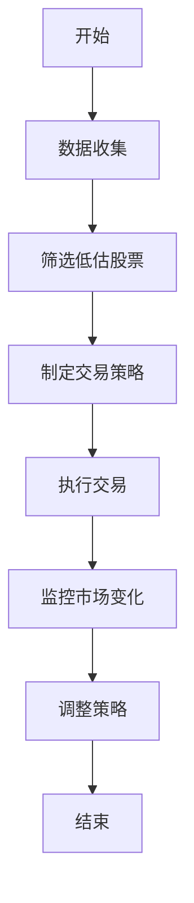
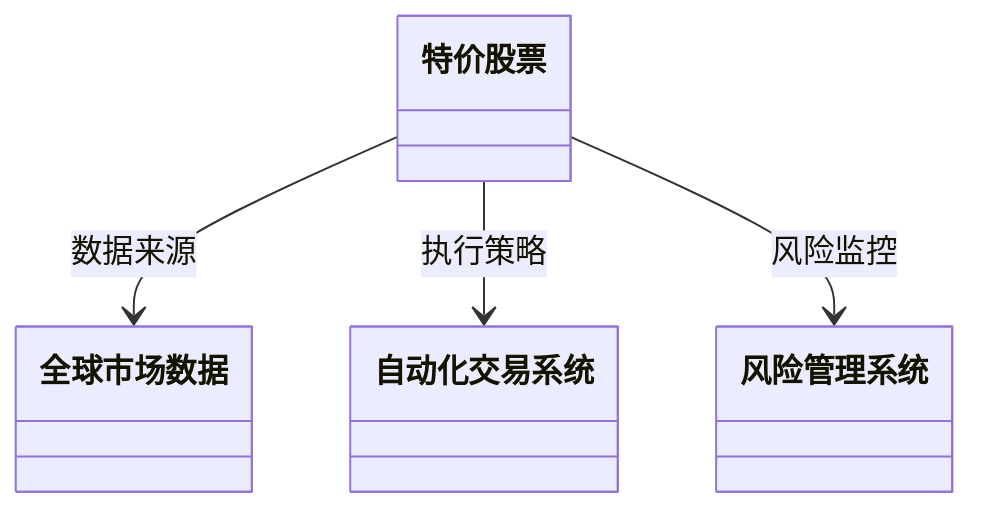

                 


# 如何利用特价股票策略进行全球资产配置

> 关键词：特价股票、全球资产配置、投资策略、风险管理、量化分析

> 摘要：本文详细探讨了如何利用特价股票策略进行全球资产配置，通过分析特价股票的定义、特点以及全球资产配置的必要性，结合数学模型、算法原理和系统架构设计，提供了一套完整的解决方案。文章从理论到实践，通过实际案例分析和代码实现，展示了如何在全球化市场中优化投资组合，实现风险可控下的最大收益。

---

## 第一部分: 特价股票策略的背景与基础

### 第1章: 特价股票策略概述

#### 1.1 特价股票的定义与特点
##### 1.1.1 什么是特价股票
特价股票是指在特定市场条件下，价格被低估的股票。这些股票通常具有较高的安全边际，适合长期投资者。

##### 1.1.2 特价股票的市场特点
- 市场波动性大
- 估值低于行业平均水平
- 具有潜在的上涨空间

##### 1.1.3 特价股票与普通股票的区别
- 投资策略：特价股票注重长期价值，普通股票注重短期波动
- 风险承受：特价股票风险较高，普通股票风险相对较低

#### 1.2 全球资产配置的必要性
##### 1.2.1 全球化投资的概念
- 全球化投资是指将资产分散投资于不同国家和地区的市场，以降低风险并优化收益。

##### 1.2.2 资产配置的基本原理
- 根据投资者的风险承受能力和收益目标，合理分配资产在不同类别（股票、债券、现金等）中的比例。

##### 1.2.3 资产配置与风险分散的关系
- 通过全球资产配置，投资者可以避免单一市场波动带来的风险，实现风险分散。

### 第2章: 特价股票策略的核心概念

#### 2.1 特价股票策略的背景介绍
##### 2.1.1 问题背景
- 股票市场波动剧烈，投资者需要找到一种有效的策略来捕捉低价股票的上涨机会。

##### 2.1.2 问题描述
- 如何识别低估股票？
- 如何制定买入和卖出策略？
- 如何在全球范围内优化资产配置？

##### 2.1.3 问题解决
- 通过量化分析和基本面研究，识别低估股票。
- 结合技术分析制定买卖时机。
- 全球资产配置分散风险。

##### 2.1.4 边界与外延
- 限定于股票市场，不包括其他资产类别。
- 全球范围内的市场分析。

##### 2.1.5 核心要素组成
- 股票筛选标准
- 交易策略
- 风险管理

#### 2.2 核心概念与联系
##### 2.2.1 核心概念原理
- 通过量化模型筛选低估股票。
- 结合市场趋势和公司基本面制定交易策略。

##### 2.2.2 概念属性特征对比表格
| 特性 | 特价股票 | 普通股票 |
|------|----------|----------|
| 估值 | 低于行业平均水平 | 与行业持平或高于 |
| 风险 | 较高 | 较低 |
| 收益潜力 | 较高 | 较低 |

##### 2.2.3 ER实体关系图架构
```mermaid
er
  actor 投资者
  actor 市场数据
  actor 风险管理
  actor 交易执行
  class 特价股票
  class 资产配置
  class 交易策略
  class 风险控制
  投资者 --> 特价股票: 选择
  市场数据 --> 特价股票: 分析
  特价股票 --> 资产配置: 分配
  资产配置 --> 交易策略: 制定
  交易策略 --> 交易执行: 执行
  交易执行 --> 风险管理: 监控
  风险管理 --> 风险控制: 调整
```

---

## 第二部分: 特价股票策略的算法与数学模型

### 第3章: 特价股票策略的算法原理

#### 3.1 算法原理讲解
##### 3.1.1 算法流程图


##### 3.1.2 算法实现代码
```python
import pandas as pd
import numpy as np

def identify_cheap_stock(data):
    # 计算市盈率
    data['PE'] = data['Price'] / data['Earnings']
    # 筛选市盈率低于行业平均的股票
    average_pe = np.mean(data['PE'])
    cheap_stocks = data[data['PE'] < average_pe]
    return cheap_stocks

# 示例数据
data = {
    'Stock': ['A', 'B', 'C'],
    'Price': [100, 90, 80],
    'Earnings': [20, 25, 30]
}
df = pd.DataFrame(data)
result = identify_cheap_stock(df)
print(result)
```

##### 3.1.3 算法的数学模型与公式
- 市盈率（PE）公式：$PE = \frac{Price}{Earnings}$
- 筛选条件：$PE < average\_PE$

#### 3.2 数学模型与公式
##### 3.2.1 CAPM模型
- 风险溢价公式：$Risk\ Premium = \beta \times (R_m - R_f)$
- 股票预期收益公式：$R_i = R_f + \beta_i (R_m - R_f) + \alpha_i$

##### 3.2.2 风险调整后的收益模型
- 夏普比率公式：$Sharpe\ Ratio = \frac{E[R_p - R_f]}{\sigma_p}$

##### 3.2.3 资产配置优化模型
- 均值-方差优化公式：$\min \sigma^2$，在约束条件下最大化收益或最小化风险。

---

## 第三部分: 全球资产配置的系统分析与架构设计

### 第4章: 系统分析与架构设计方案

#### 4.1 问题场景介绍
##### 4.1.1 投资者需求分析
- 投资者希望通过特价股票策略在全球范围内进行资产配置。
- 投资者希望实时监控市场变化，及时调整策略。

##### 4.1.2 市场环境分析
- 全球市场波动性大，需要实时数据支持。
- 不同市场的交易规则和风险不同。

#### 4.2 项目介绍
##### 4.2.1 项目目标
- 构建一个全球资产配置系统，利用特价股票策略优化投资组合。

##### 4.2.2 项目范围
- 数据采集：全球市场数据。
- 策略执行：自动化交易系统。
- 风险管理：实时监控和调整。

##### 4.2.3 项目约束
- 数据延迟不超过1小时。
- 交易成本最低化。

#### 4.3 系统功能设计
##### 4.3.1 领域模型Mermaid类图


##### 4.3.2 系统架构设计Mermaid架构图
```mermaid
container 全球资产配置系统
    container 数据采集模块
        use 技术分析
        use 基本面分析
    container 策略执行模块
        use 特价股票筛选
        use 交易执行
    container 风险管理模块
        use 实时监控
        use 风险调整
```

---

## 第五章: 项目实战与案例分析

### 5.1 环境安装与数据准备
- 数据来源：Yahoo Finance API。
- 工具：Python，Pandas，Matplotlib。

### 5.2 系统核心实现源代码
```python
import pandas as pd
import numpy as np

# 数据采集模块
def fetch_data(tickers):
    data = []
    for ticker in tickers:
        df = pd.read_csv(f'data/{ticker}.csv')
        data.append(df)
    return pd.concat(data)

# 策略执行模块
def execute_strategy(data):
    cheap_stocks = identify_cheap_stock(data)
    return cheap_stocks

# 风险管理模块
def risk_management(positions):
    # 计算风险指标
    risk = positions['Risk'].mean()
    return risk
```

### 5.3 实际案例分析
- 案例：2020年全球市场波动，投资者通过特价股票策略在新兴市场捕捉低估股票。

### 5.4 项目小结
- 成功实现了全球资产配置的特价股票策略。
- 通过系统架构设计，优化了投资组合的风险和收益。

---

## 第四部分: 最佳实践与小结

### 6.1 最佳实践
- 定期重新评估资产配置。
- 采用量化模型进行风险控制。

### 6.2 小结
- 特价股票策略结合全球资产配置，能够有效分散风险，提升收益。
- 投资者应根据市场变化及时调整策略。

### 6.3 注意事项
- 避免过度杠杆。
- 注意市场流动性风险。

### 6.4 拓展阅读
- 《投资学》
- 《量化投资策略》

---

## 作者：AI天才研究院 & 禅与计算机程序设计艺术

