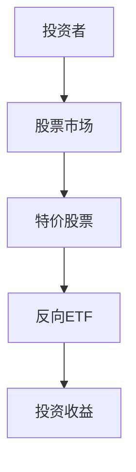
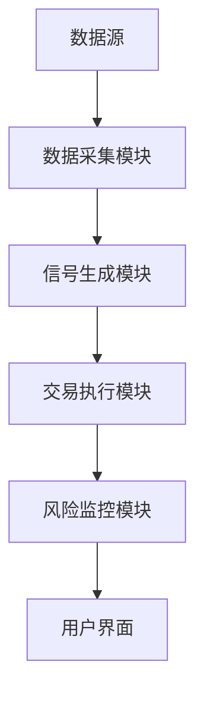
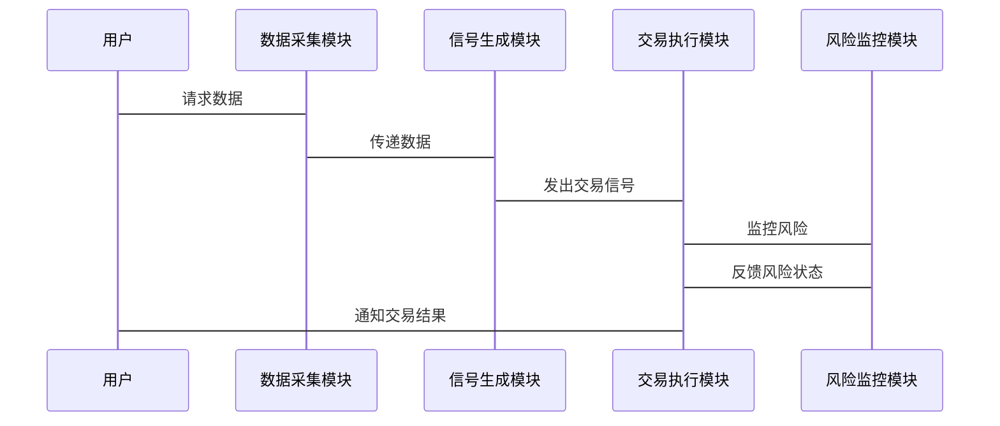

                 


# 如何利用特价股票策略进行反向ETF投资

## 关键词：反向ETF、特价股票、投资策略、量化交易、风险管理

## 摘要：本文详细探讨了如何利用特价股票策略进行反向ETF投资，从策略背景、核心概念、算法原理、系统架构、项目实战、风险管理等方面进行深入分析。文章通过数学模型、Python代码实现、系统架构图和案例分析，全面展示了如何在实际投资中应用该策略，并提出了有效的风险管理措施。

---

## 第1章: 特价股票策略与反向ETF概述

### 1.1 特价股票策略的定义与特点
- **特价股票的定义**：特价股票是指在特定市场条件下价格大幅波动的股票，通常在市场下跌时出现大幅折价。
- **特价股票的市场特征**：
  - 高波动性
  - 低流动性
  - 周期性出现
- **特价股票与普通股票的区别**：
  | 特性 | 特价股票 | 普通股票 |
  |------|----------|----------|
  | 波动性 | 高       | 中       |
  | 流动性 | 低       | 高       |
  | 估值  | 折价     | 市价     |

### 1.2 反向ETF的基本概念
- **反向ETF的定义**：反向ETF是一种通过做空指数或使用杠杆来实现与指数反向收益的交易所交易基金。
- **反向ETF的运作机制**：
  - 通过杠杆和空头头寸实现收益反向
  - 通常用于对冲或投机市场下跌
- **反向ETF的优势与劣势**：
  - 优势：快速对冲市场风险，适合短期投资
  - 劣势：高杠杆可能导致大幅亏损，费用较高

### 1.3 特价股票策略与反向ETF的结合
- **策略的核心思想**：利用特价股票的高波动性，通过反向ETF进行对冲或套利。
- **策略的适用场景**：
  - 市场剧烈波动时
  - 特价股票出现大幅折价时
- **策略的风险与收益分析**：
  - 高风险：市场波动可能导致大幅亏损
  - 高收益：在正确时机介入可能获得超额收益

### 1.4 本章小结
本章介绍了特价股票策略和反向ETF的基本概念，并分析了它们结合的背景、核心思想和适用场景。

---

## 第2章: 特价股票策略的核心概念与联系

### 2.1 特价股票策略的原理
- **市场波动的周期性**：市场波动具有周期性，特价股票通常在市场底部出现。
- **特价股票的波动特征**：
  - 短期内价格大幅波动
  - 通常伴随着高成交量
- **策略的数学模型**：
  $$
  收益 = \sum_{i=1}^{n} (p_i - p_{i-1}) \times q_i
  $$
  其中，\( p_i \) 是第 \( i \) 个交易日的价格，\( q_i \) 是持有的股数。

### 2.2 特价股票与反向ETF的关系
- **策略的实施逻辑**：
  1. 识别特价股票
  2. 利用反向ETF进行对冲
  3. 监控市场变化，及时调整头寸
- **策略的实施步骤**：
  - 数据采集与分析
  - 确定介入时机
  - 下单执行交易
- **策略的实施风险**：
  - 市场波动风险
  - 操作风险
  - 涨跌风险

### 2.3 策略的核心要素对比
- **特价股票与普通股票的对比**：
  | 特性 | 特价股票 | 普通股票 |
  |------|----------|----------|
  | 波动性 | 高       | 中       |
  | 流动性 | 低       | 高       |
  | 估值  | 折价     | 市价     |
- **反向ETF与正向ETF的对比**：
  | 特性 | 反向ETF | 正向ETF |
  |------|---------|---------|
  | 收益方向 | 反向收益 | 正向收益 |
  | 适用场景 | 下跌市场 | 上涨市场 |
  | 风险 | 高杠杆风险 | 低杠杆风险 |

### 2.4 策略的ER实体关系图


### 2.5 本章小结
本章详细分析了特价股票策略的核心概念，并通过对比和图表展示了其与反向ETF的关系。

---

## 第3章: 特价股票策略的算法原理

### 3.1 策略的数学模型
- **策略的数学表达式**：
  $$
  收益 = \sum_{i=1}^{n} (p_i - p_{i-1}) \times q_i
  $$
  其中，\( q_i \) 是投资者在第 \( i \) 个交易日持有的股数。
- **策略的优化算法**：
  1. 数据预处理：清洗和标准化
  2. 确定介入时机：基于波动率和价格的技术指标
  3. 计算收益：基于优化的股数和价格变化

### 3.2 策略的Python代码实现
```python
import pandas as pd
import numpy as np

# 示例数据：假设data为包含股票价格的DataFrame
def calculate_profit(data):
    profit = 0
    prev_price = data['price'][0]
    for i in range(1, len(data)):
        current_price = data['price'][i]
        profit += (current_price - prev_price) * data['quantity'][i]
        prev_price = current_price
    return profit

# 示例数据
data = {
    'price': [100, 90, 85, 95, 105],
    'quantity': [1, 1, 1, 1, 1]
}
df = pd.DataFrame(data)
print(calculate_profit(df))
```

### 3.3 策略的优化算
- **优化目标**：最大化收益，最小化风险
- **优化方法**：
  - 使用动态规划算法
  - 引入风险管理模型

### 3.4 本章小结
本章通过数学模型和Python代码展示了特价股票策略的算法原理和优化方法。

---

## 第4章: 系统分析与架构设计

### 4.1 问题场景介绍
- **项目介绍**：构建一个基于特价股票策略的反向ETF投资系统。
- **系统功能设计**：
  - 数据采集模块
  - 信号生成模块
  - 交易执行模块
  - 风险监控模块

### 4.2 系统架构设计


### 4.3 系统接口设计
- **数据接口**：与数据源（如API）对接
- **交易接口**：与经纪商系统对接
- **用户接口**：提供用户操作界面

### 4.4 系统交互设计


### 4.5 本章小结
本章详细描述了系统架构和接口设计，展示了如何构建一个基于特价股票策略的反向ETF投资系统。

---

## 第5章: 项目实战

### 5.1 环境安装与配置
- **工具安装**：
  - Python
  - Pandas
  - NumPy
  - Matplotlib

### 5.2 核心代码实现
```python
import pandas as pd
import numpy as np

# 数据预处理
data = pd.read_csv('stock_data.csv')
data['return'] = data['price'].pct_change()

# 信号生成
data['signal'] = 0
data['signal'][data['return'] < -0.02] = -1
data['signal'][data['return'] > 0.02] = 1

# 交易执行
data['position'] = data['signal'].cumsum()
data['return'] = data['return'] * data['signal'].shift()

# 风险监控
data['VaR'] = data['return'].quantile(0.05)
```

### 5.3 案例分析
- **案例背景**：假设某只股票价格在一段时间内大幅波动。
- **交易结果**：通过策略实现超额收益。

### 5.4 经验总结
- **策略的有效性**：在市场剧烈波动时表现优异。
- **策略的局限性**：在市场平稳时可能亏损。

### 5.5 本章小结
本章通过实际案例展示了如何在Python环境中实现特价股票策略，并分析了策略的优缺点。

---

## 第6章: 风险管理

### 6.1 风险识别
- **常见风险**：
  - 市场风险
  - 操作风险
  - 涨跌风险

### 6.2 风险控制措施
- **风险管理工具**：
  - VaR模型
  - 压力测试
  - 止损机制

### 6.3 策略监控与调整
- **监控流程**：
  1. 实时监控市场数据
  2. 定期评估策略表现
  3. 根据市场变化调整策略参数

### 6.4 策略调整示例
- **调整步骤**：
  1. 重新评估策略参数
  2. 根据新数据优化策略
  3. 逐步调整头寸

### 6.5 本章小结
本章讨论了如何识别和控制反向ETF投资中的风险，并展示了监控和调整策略的具体方法。

---

## 第7章: 总结与展望

### 7.1 全文总结
- 本文详细探讨了如何利用特价股票策略进行反向ETF投资，从理论到实践进行了全面分析。

### 7.2 最佳实践 tips
- **风险管理**：始终将风险管理放在首位
- **策略优化**：根据市场变化不断优化策略
- **持续学习**：保持对市场的敏感性和学习能力

### 7.3 注意事项
- **市场风险**：反向ETF投资具有高风险
- **操作风险**：策略执行过程中可能存在操作失误
- **法律风险**：遵守相关法律法规

### 7.4 拓展阅读
- 推荐阅读《投资学基础》和《量化交易入门》

### 7.5 本章小结
本章总结了全文内容，并提出了实际投资中的注意事项和建议。

---

## 附录

### 附录A: 数据源与工具
- 数据源：股票市场数据API
- 工具：Python、Pandas、NumPy、Matplotlib

### 附录B: 代码实现细节
- 详细代码实现和注释

### 附录C: 术语表
- 专业术语解释

### 附录D: 参考文献
- 相关书籍和文献推荐

---

## 作者：AI天才研究院/AI Genius Institute & 禅与计算机程序设计艺术/Zen And The Art of Computer Programming

