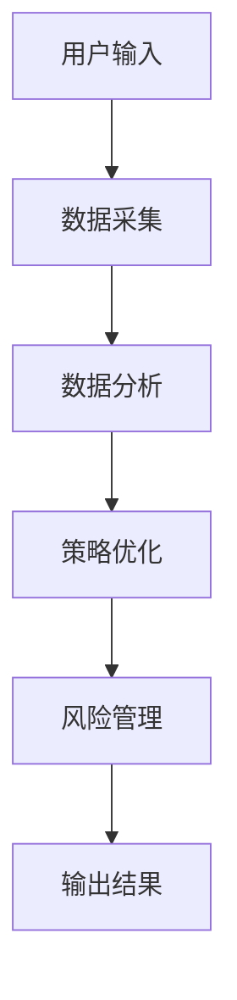
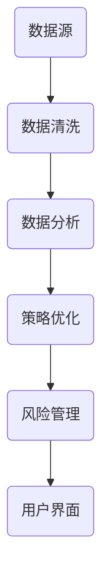

                 


# 如何利用特价股票策略进行反周期投资

> **关键词**: 特价股票策略, 反周期投资, 市场波动, 投资者心理, 股票筛选, 风险管理, 投资组合优化

> **摘要**: 本文将深入探讨如何利用特价股票策略进行反周期投资。通过分析市场波动、投资者行为和经济周期，结合数学模型和算法原理，系统性地介绍特价股票策略的核心概念、实现方法和实际应用。文章将从背景介绍、数学建模、系统设计到实战案例，全面解析如何通过特价股票策略在经济下行周期中捕捉投资机会，实现收益最大化。

---

# 第一部分: 特价股票策略与反周期投资概述

## 第1章: 特价股票策略的背景与概念

### 1.1 特价股票的定义与特点

#### 1.1.1 什么是特价股票
特价股票是指那些由于市场波动、投资者情绪或其他外部因素导致股价短期被低估的股票。这类股票通常具有较高的安全边际，能够在市场反转时带来超额收益。

#### 1.1.2 特价股票的特点
- **低估值**: 市盈率、市净率等估值指标显著低于行业平均水平。
- **高波动性**: 股价在短期内波动较大，为投资者提供了介入和退出的机会。
- **逆周期性**: 在经济下行周期中，部分特价股票可能因行业特性或公司基本面改善而表现优于市场。

#### 1.1.3 特价股票与普通股票的区别
| 属性         | 特价股票                   | 普通股票                  |
|--------------|---------------------------|---------------------------|
| 估值         | 通常低于市场价值           | 估值较为合理或溢价         |
| 波动性       | 高波动性                   | 波动性较低或适中           |
| 市场环境     | 经济下行周期中更容易出现     | 市场环境较稳定或上行周期为主 |

### 1.2 反周期投资的基本概念

#### 1.2.1 什么是反周期投资
反周期投资是指在经济周期的低谷期（如经济衰退或市场下跌）中，通过投资那些在经济下行中表现相对稳定的资产或股票，以在市场反转时获得超额收益的投资策略。

#### 1.2.2 反周期投资的核心目标
- 在经济下行周期中寻找被市场低估的资产。
- 通过逆周期投资策略，在市场底部布局，等待经济复苏时获得收益。

#### 1.2.3 反周期投资的适用场景
- 经济衰退或市场崩盘阶段。
- 行业周期性低谷阶段（如房地产、能源等行业）。

---

## 第2章: 特价股票策略的核心概念

### 2.1 特价股票策略的原理

#### 2.1.1 市场波动与特价股票机会
市场波动是特价股票策略的核心驱动力。在市场波动加剧时，许多优质股票可能会被过度抛售，导致股价远低于其内在价值，从而为投资者提供了介入的机会。

#### 2.1.2 投资者行为与特价股票定价
投资者情绪的波动对股价有着显著影响。在市场恐慌时，投资者可能会非理性地抛售股票，导致股价短期下跌，从而形成特价股票的投资机会。

#### 2.1.3 市场周期对特价股票的影响
在经济周期的不同阶段，特价股票的表现有所不同。例如，在经济衰退阶段，部分行业（如公用事业、消费品等）的股票可能会因为防御性特征而表现相对稳定。

### 2.2 特价股票策略的关键要素

#### 2.2.1 市场分析
- **宏观经济指标**: GDP、失业率、通胀率等。
- **行业周期**: 行业所处的周期阶段（上升期或下降期）。

#### 2.2.2 股票筛选标准
- **估值指标**: 市盈率（P/E）、市净率（P/B）等。
- **质量指标**: 资产负债率、ROE（净资产收益率）等。
- **成长性指标**: 收入增长率、净利润增长率等。

#### 2.2.3 投资组合构建
- **分散投资**: 避免过度集中在单一行业或股票。
- **动态调整**: 根据市场变化和公司基本面调整投资组合。

---

## 第3章: 特价股票策略与反周期投资的联系

### 3.1 特价股票策略在反周期投资中的作用

#### 3.1.1 特价股票作为反周期投资的工具
在经济下行周期中，特价股票因其低估值特性，成为反周期投资的理想工具。投资者可以通过投资特价股票，在市场底部布局，等待经济复苏时获得超额收益。

#### 3.1.2 特价股票策略如何帮助投资者规避风险
通过筛选低估值股票，投资者可以降低投资组合的波动性，同时在市场反转时获得较高的收益。

#### 3.1.3 特价股票策略在经济下行周期中的优势
- **防御性**: 在经济衰退时，部分行业的特价股票表现相对稳定。
- **进攻性**: 在市场反转时，特价股票可能带来较高的收益。

### 3.2 反周期投资中的特价股票策略应用

#### 3.2.1 特价股票策略在不同经济周期的表现
- **经济上行周期**: 特价股票表现相对平淡。
- **经济下行周期**: 特价股票表现优于市场，为投资者提供收益机会。

#### 3.2.2 特价股票策略与宏观经济指标的关系
通过分析宏观经济指标（如GDP增长率、通胀率等），投资者可以更好地把握特价股票的投资机会。

#### 3.2.3 特价股票策略在投资组合中的配置
- **配置比例**: 通常占投资组合的30%-50%。
- **行业选择**: 优先选择防御性行业（如公用事业、消费品等）。

---

# 第二部分: 特价股票策略的数学模型与算法原理

## 第4章: 特价股票策略的数学模型

### 4.1 市场波动模型

#### 4.1.1 市场波动的度量方法
- **波动率指标**: 常用标准差或方差来衡量市场的波动性。
- **VaR模型**: 通过VaR（Value at Risk）模型量化市场风险。

#### 4.1.2 市场波动与股票价格的关系
股票价格的波动性与其估值水平密切相关。通常，低估值股票的波动性较高，而高估值股票的波动性较低。

#### 4.1.3 市场波动预测模型
基于历史数据和统计方法，可以建立市场波动的预测模型。例如，使用ARIMA模型进行短期波动预测。

### 4.2 特价股票定价模型

#### 4.2.1 特价股票定价的基本假设
- 股票的内在价值可以通过基本面指标（如现金流、净利润等）进行评估。
- 市场价格围绕内在价值波动。

#### 4.2.2 基于市场波动的定价公式
$$ P_{\text{target}} = V_{\text{intrinsic}} \times (1 - \alpha \times \sigma) $$
其中，$P_{\text{target}}$ 是目标价格，$V_{\text{intrinsic}}$ 是内在价值，$\alpha$ 是波动性调整系数，$\sigma$ 是市场波动率。

#### 4.2.3 特价股票定价的数学推导
假设某股票的内在价值为 $V$，市场波动率为 $\sigma$，则特价股票的定价公式为：
$$ P = V \times e^{-\sigma t} $$
其中，$t$ 是时间变量。

---

## 第5章: 反周期投资的算法原理

### 5.1 投资者行为分析算法

#### 5.1.1 投资者行为对股票价格的影响
投资者情绪的波动会导致股票价格的非理性波动。例如，在市场恐慌时，投资者可能会非理性抛售股票，导致股价短期下跌。

#### 5.1.2 投资者行为预测模型
基于历史交易数据，可以建立投资者行为预测模型。例如，使用LSTM（长短期记忆网络）模型预测投资者情绪。

#### 5.1.3 基于行为的反周期投资策略
根据投资者行为预测结果，动态调整投资组合。例如，在市场恐慌时，增加特价股票的配置比例。

### 5.2 市场周期识别算法

#### 5.2.1 市场周期的定义与分类
市场周期通常分为四个阶段：繁荣、衰退、萧条和复苏。

#### 5.2.2 基于技术指标的周期识别方法
- **MACD指标**: 通过MACD指标判断市场的买卖信号。
- **RSI指标**: 通过RSI指标判断市场的超买或超卖状态。

#### 5.2.3 市场周期与特价股票策略的结合
在市场衰退阶段，优先选择低估值股票；在市场复苏阶段，逐步卖出高价股票。

---

# 第三部分: 特价股票策略的系统分析与架构设计

## 第6章: 特价股票策略的系统分析

### 6.1 系统功能设计

#### 6.1.1 系统目标
- 实现特价股票的筛选与分析。
- 提供反周期投资策略的优化建议。

#### 6.1.2 系统功能模块划分
- 数据采集模块
- 数据分析模块
- 策略优化模块
- 风险管理模块

#### 6.1.3 系统功能流程图


### 6.2 系统架构设计

#### 6.2.1 系统架构图


#### 6.2.2 数据流设计
- 数据从数据源进入系统，经过清洗、分析后，进入策略优化模块。
- 策略优化结果经过风险管理模块后，输出最终的投资建议。

#### 6.2.3 系统接口设计
- 数据接口: 与金融数据源（如Yahoo Finance）对接。
- 用户接口: 提供用户友好的操作界面。

---

## 第7章: 特价股票策略的项目实战

### 7.1 环境搭建

#### 7.1.1 开发环境选择
- **编程语言**: Python
- **开发工具**: Jupyter Notebook
- **数据源**: Yahoo Finance API

#### 7.1.2 数据源获取
使用Yahoo Finance API获取历史股价数据。

#### 7.1.3 工具安装与配置
- 安装Python库：pandas、numpy、matplotlib、yfinance。

### 7.2 系统核心实现

#### 7.2.1 数据处理与分析代码
```python
import pandas as pd
import numpy as np
import matplotlib.pyplot as plt
import yfinance as yf

# 下载数据
data = yf.download('AAPL', start='2020-01-01', end='2023-01-01')
# 计算波动率
data['Return'] = data['Adj Close'].pct_change()
volatility = data['Return'].std()
print(f"苹果股票的年化波动率为: {volatility * 252 ** 0.5}")
```

#### 7.2.2 策略实现代码
```python
def select_cheap_stocks(data, threshold=0.2):
    # 计算市盈率
    data['PE'] = data['Adj Close'] / data['EPS']
    # 筛选市盈率低于阈值的股票
    cheap_stocks = data[data['PE'] < threshold]
    return cheap_stocks

# 调用函数
cheap_stocks = select_cheap_stocks(data)
print("以下是符合条件的特价股票:")
print(cheap_stocks)
```

#### 7.2.3 系统测试与优化
通过回测验证策略的有效性，并根据回测结果优化策略参数。

---

# 第四部分: 总结与展望

## 第8章: 总结与展望

### 8.1 总结
本文详细介绍了如何利用特价股票策略进行反周期投资。通过分析市场波动、投资者行为和经济周期，结合数学模型和算法原理，系统性地介绍了特价股票策略的核心概念、实现方法和实际应用。

### 8.2 展望
未来的研究可以进一步探索以下方向：
- 更加复杂的市场波动预测模型。
- 结合人工智能技术优化投资策略。
- 开发更高效的反周期投资系统。

---

# 作者：AI天才研究院/AI Genius Institute & 禅与计算机程序设计艺术 /Zen And The Art of Computer Programming

