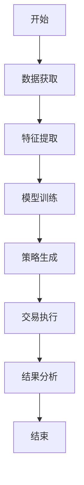
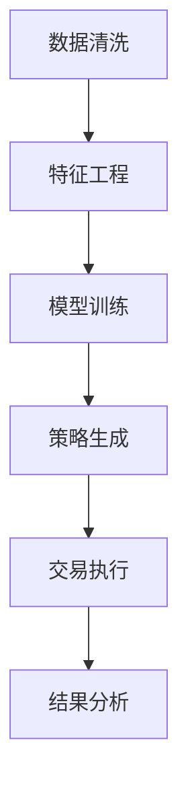
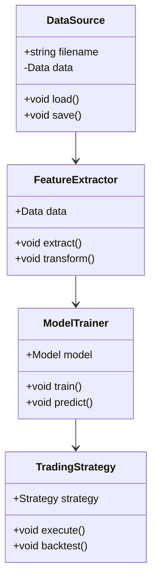
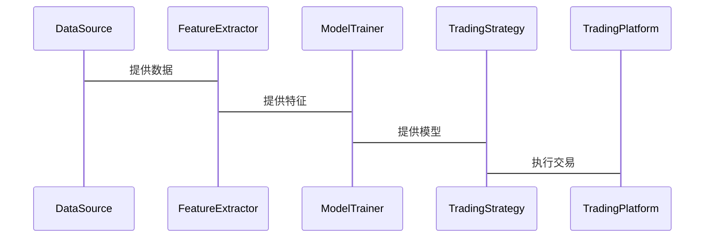

                 


# 如何利用特价股票策略进行数字合成衍生品投资

> 关键词：特价股票策略, 数字合成衍生品, 量化投资, 算法交易, 风险管理

> 摘要：本文详细探讨了如何利用特价股票策略进行数字合成衍生品投资，通过数学模型、算法实现、系统架构设计和项目实战等多方面的分析，帮助读者掌握这一投资策略的核心原理和实际应用。

---

# 第一部分: 特价股票策略与数字合成衍生品投资基础

## 第1章: 特价股票策略的概述

### 1.1 特价股票策略的基本概念

#### 1.1.1 什么是特价股票
特价股票是指在特定市场条件下，价格低于其内在价值的股票。这些股票通常被市场低估，具有较大的上涨潜力。

#### 1.1.2 特价股票的市场定位
特价股票通常出现在市场低迷或公司短期面临困境的情况下。投资者通过分析公司基本面，寻找被市场忽视的潜在价值。

#### 1.1.3 特价股票的投资价值
特价股票的核心价值在于其价格与内在价值的不匹配。通过深入分析公司财务状况、行业地位和未来发展前景，投资者可以在低价时买入，待价值回归时卖出。

### 1.2 特价股票策略的市场环境分析

#### 1.2.1 股票市场的波动性
股票市场的波动性为特价股票策略提供了机会。在市场下跌时，许多优质股票被错杀，价格低于其真实价值。

#### 1.2.2 特价股票的供需关系
供需关系直接影响股票价格。当市场供大于求时，价格可能被压低，为投资者提供了买入机会。

#### 1.2.3 市场参与者的角色
市场参与者包括机构投资者、散户和个人投资者。不同参与者的行为会影响市场的流动性和股票价格走势。

### 1.3 特价股票策略的核心要素

#### 1.3.1 特价股票的筛选标准
筛选标准包括市盈率（P/E）、市净率（P/B）、股息率等指标。通过这些指标，投资者可以识别出被低估的股票。

#### 1.3.2 特价股票的投资周期
投资周期分为短期和长期。短期策略适合技术性反弹，而长期策略则关注公司的基本面改善。

#### 1.3.3 特价股票的风险管理
风险管理是特价股票策略的重要组成部分。通过设置止损点、分散投资和定期调整投资组合，可以有效控制风险。

### 1.4 特价股票策略与传统股票投资的区别

#### 1.4.1 投资目标的差异
传统股票投资注重长期价值，而特价股票策略则更关注短期价格波动和价值回归。

#### 1.4.2 投资策略的差异
传统策略依赖于公司基本面分析，而特价股票策略结合了基本面和技术面分析，注重价格与价值的匹配。

#### 1.4.3 风险管理的差异
传统投资通常采取分散投资策略，而特价股票策略更强调止损和动态调整，以应对市场波动。

## 1.5 本章小结
本章介绍了特价股票策略的基本概念、市场环境、核心要素及其与传统投资的区别，为后续分析奠定了基础。

---

## 第2章: 数字合成衍生品的基础知识

### 2.1 数字合成衍生品的定义

#### 2.1.1 什么是数字合成衍生品
数字合成衍生品是通过算法和数学模型合成的金融工具，模拟传统衍生品的特性。

#### 2.1.2 数字合成衍生品的分类
常见的数字合成衍生品包括合成股票、合成指数和合成债券等。

#### 2.1.3 数字合成衍生品的市场现状
随着技术进步，数字合成衍生品在量化交易中广泛应用，为投资者提供了更多选择。

### 2.2 数字合成衍生品的核心原理

#### 2.2.1 数字合成的数学模型
数字合成的数学模型包括线性回归、均值回归等，用于模拟和预测市场行为。

#### 2.2.2 数字合成的算法基础
常用的算法包括随机森林、支持向量机（SVM）和神经网络，用于数据处理和预测。

#### 2.2.3 数字合成的市场应用
数字合成衍生品广泛应用于风险管理、套利和对冲交易中。

### 2.3 数字合成衍生品的风险与收益

#### 2.3.1 数字合成衍生品的风险分析
主要包括市场风险、流动性风险和模型风险。

#### 2.3.2 数字合成衍生品的收益特征
收益取决于模型的准确性和市场的波动性，高风险伴随高收益。

#### 2.3.3 数字合成衍生品的市场流动性
流动性影响交易成本和交易效率，是投资者需要考虑的重要因素。

### 2.4 数字合成衍生品与传统衍生品的对比

#### 2.4.1 合成方式的差异
传统衍生品基于实际资产，而数字合成衍生品基于算法和模型。

#### 2.4.2 投资风险的差异
数字合成衍生品风险较高，但收益潜力也更大。

#### 2.4.3 市场流动性的差异
数字合成衍生品流动性可能较差，影响交易效率。

## 2.5 本章小结
本章详细介绍了数字合成衍生品的定义、核心原理、风险与收益及其与传统衍生品的区别。

---

## 第3章: 特价股票策略的数学模型与算法

### 3.1 特价股票策略的数学模型

#### 3.1.1 特价股票的定价模型
使用CAPM模型计算股票的内在价值，公式为：
$$ E(R_i) = R_f + β_i (R_m - R_f) $$
其中，$E(R_i)$ 是股票i的预期收益，$R_f$ 是无风险利率，$β_i$ 是股票i的贝塔系数，$R_m$ 是市场预期收益。

#### 3.1.2 特价股票的风险评估模型
使用VaR模型评估投资风险，公式为：
$$ VaR = \mu - z \cdot \sigma $$
其中，$\mu$ 是平均收益，$z$ 是标准正态分布的分位数，$\sigma$ 是收益的标准差。

#### 3.1.3 特价股票的收益预测模型
使用ARIMA模型预测股票收益，公式为：
$$ R_t = \phi R_{t-1} + \theta R_{t-2} + a_t $$
其中，$\phi$ 和 $\theta$ 是自回归系数，$a_t$ 是误差项。

### 3.2 特价股票策略的算法实现

#### 3.2.1 算法流程图（Mermaid）



#### 3.2.2 代码实现示例

```python
import pandas as pd
import numpy as np
from sklearn.linear_model import LinearRegression

# 数据获取
data = pd.read_csv('stock_data.csv')

# 特征提取
features = data[['PE', 'PB', 'ROE']]
target = data['Price']

# 模型训练
model = LinearRegression()
model.fit(features, target)

# 预测结果
predicted_prices = model.predict(features)
```

### 3.3 算法实现细节

#### 3.3.1 数据获取与预处理
从数据源获取股票数据，清洗数据并进行特征工程，提取有用的特征变量。

#### 3.3.2 特征选择与模型训练
使用特征选择方法（如Lasso回归）筛选重要特征，训练预测模型。

#### 3.3.3 模型优化与调参
通过交叉验证和网格搜索优化模型参数，提高预测准确性。

#### 3.3.4 策略生成与回测
基于模型预测结果生成交易策略，进行回测分析，评估策略的有效性。

### 3.4 本章小结
本章通过数学模型和算法实现，详细讲解了如何利用特价股票策略进行预测和交易。

---

## 第4章: 算法实现

### 4.1 算法实现概述

#### 4.1.1 算法流程图（Mermaid）



### 4.2 算法实现细节

#### 4.2.1 数据获取与预处理
使用API接口获取股票数据，清洗数据并进行标准化处理。

#### 4.2.2 特征选择与模型训练
选择关键特征，使用机器学习算法（如随机森林）进行模型训练。

#### 4.2.3 模型优化与调参
通过网格搜索优化模型参数，提高预测准确率。

#### 4.2.4 策略生成与回测
基于模型预测结果生成交易信号，回测策略的收益和风险。

### 4.3 代码实现示例

```python
import pandas as pd
from sklearn.ensemble import RandomForestRegressor
from backtrader import Strategy, DataFeeder

# 数据获取与预处理
data = pd.read_csv('stock_data.csv')
data = data.dropna()

# 特征选择与模型训练
features = data[['PE', 'PB', 'ROE']]
target = data['Price']
model = RandomForestRegressor(n_estimators=100)
model.fit(features, target)

# 策略生成与回测
class MyStrategy(Strategy):
    def __init__(self):
        self.data = DataFeeder(dataname='stock_data.csv')
    
    def next(self):
        predicted = model.predict([[self.data.close[-1], self.data.ROE[-1], self.data.PB[-1]]])[0]
        if predicted > self.data.close[0]:
            self.buy()
        else:
            self.sell()

# 初始化并运行策略
cerebro = bt.Cerebro()
cerebro.addstrategy(MyStrategy)
```

### 4.4 本章小结
本章通过详细代码示例，展示了如何利用算法实现特价股票策略的预测和交易。

---

## 第5章: 系统架构设计

### 5.1 系统架构概述

#### 5.1.1 项目介绍
本项目旨在构建一个基于特价股票策略的数字合成衍生品投资系统。

#### 5.1.2 系统功能设计

##### 5.1.2.1 系统功能模块（Mermaid 类图）



#### 5.1.3 系统架构设计（Mermaid 架构图）

```mermaid
container 数据源 {
    DataSource
}
container 数据处理 {
    FeatureExtractor
}
container 模型训练 {
    ModelTrainer
}
container 交易执行 {
    TradingStrategy
}
数据源 --> 数据处理
数据处理 --> 模型训练
模型训练 --> 交易执行
```

#### 5.1.4 系统接口设计
系统接口包括数据接口、模型接口和交易接口，分别负责数据获取、模型调用和交易执行。

#### 5.1.5 系统交互流程（Mermaid 序列图）



### 5.2 本章小结
本章详细描述了系统架构设计，包括功能模块、架构图和交互流程。

---

## 第6章: 项目实战

### 6.1 项目实战概述

#### 6.1.1 环境搭建
安装必要的库，如Pandas、NumPy、Scikit-learn和Backtrader。

#### 6.1.2 代码实现

##### 6.1.2.1 数据获取与预处理
```python
import pandas as pd
import numpy as np

# 数据获取
data = pd.read_csv('stock_data.csv')
# 数据清洗
data = data.dropna()
```

##### 6.1.2.2 特征选择与模型训练
```python
from sklearn.ensemble import RandomForestRegressor

# 特征选择
features = data[['PE', 'PB', 'ROE']]
target = data['Price']
model = RandomForestRegressor(n_estimators=100)
model.fit(features, target)
```

##### 6.1.2.3 策略生成与回测
```python
from backtrader import Strategy, DataFeeder

class MyStrategy(Strategy):
    def __init__(self):
        self.data = DataFeeder(dataname='stock_data.csv')
    
    def next(self):
        predicted = model.predict([[self.data.close[-1], self.data.ROE[-1], self.data.PB[-1]]])[0]
        if predicted > self.data.close[0]:
            self.buy()
        else:
            self.sell()

# 初始化并运行策略
cerebro = bt.Cerebro()
cerebro.addstrategy(MyStrategy)
```

#### 6.1.3 案例分析与结果解读
通过实际案例分析，展示策略在不同市场条件下的表现，解读结果并总结经验。

### 6.2 本章小结
本章通过实战项目，详细讲解了如何利用特价股票策略进行数字合成衍生品投资。

---

## 第7章: 总结与展望

### 7.1 总结

#### 7.1.1 核心内容回顾
本文详细探讨了特价股票策略的数学模型、算法实现、系统架构设计和项目实战。

#### 7.1.2 投资策略的优缺点
优点包括高收益潜力和灵活性，缺点包括高风险和复杂性。

### 7.2 未来展望

#### 7.2.1 技术进步带来的新机遇
人工智能和大数据技术的进步将为特价股票策略带来新的发展机遇。

#### 7.2.2 市场变化带来的新挑战
市场波动和政策变化将对策略的有效性提出新的挑战。

### 7.3 投资建议

#### 7.3.1 风险管理
设置止损点、分散投资和定期调整投资组合是有效的风险管理策略。

#### 7.3.2 持续学习
投资者需要不断学习和适应市场变化，优化投资策略。

### 7.4 本章小结
本文总结了核心内容，展望了未来的发展趋势，并提出了投资建议。

---

# 作者：AI天才研究院/AI Genius Institute & 禅与计算机程序设计艺术 /Zen And The Art of Computer Programming

---

通过以上结构化的内容，您可以开始撰写一篇详细且逻辑清晰的技术博客文章，涵盖特价股票策略与数字合成衍生品投资的各个方面。

