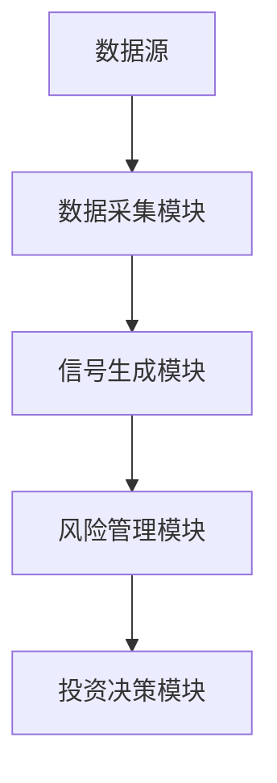
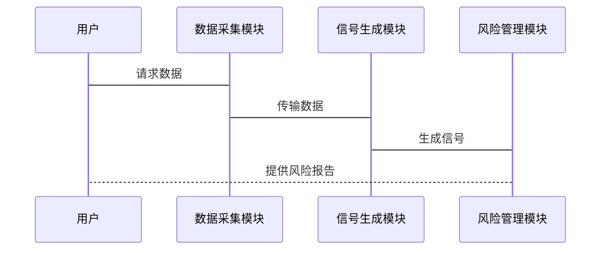

                 


# 如何利用特价股票策略进行数字衍生品投资

## 关键词：特价股票策略、数字衍生品、投资、股票交易、风险管理、数学模型

## 摘要：本文详细介绍了如何利用特价股票策略进行数字衍生品投资。从特价股票策略的基本概念和数字衍生品的定义入手，分析了特价股票策略在投资中的核心原理和应用。通过系统架构设计和项目实战，展示了如何将特价股票策略应用于实际投资中。最后，总结了投资中的注意事项和最佳实践。

---

## 第一章: 特价股票策略与数字衍生品投资基础

### 1.1 特价股票策略的背景与定义

#### 1.1.1 特价股票的定义
特价股票是指那些价格低于其内在价值，或者相对于市场平均水平来说被低估的股票。这些股票通常具有较高的潜在回报，但可能暂时被市场低估或忽视。

#### 1.1.2 特价股票的核心特点
- **低估值**：股票价格低于其内在价值。
- **高潜力**：具有较高的增长潜力。
- **市场波动性**：价格波动较大，容易被市场忽视或低估。

#### 1.1.3 特价股票的分类与市场分析
- **按行业分类**：科技、金融、能源等。
- **按市值分类**：大盘股、中盘股、小盘股。
- **按价格波动性分类**：高波动性、中波动性、低波动性。

### 1.2 数字衍生品投资的基本概念

#### 1.2.1 数字衍生品的定义
数字衍生品是指以数字资产（如比特币、以太坊等）为基础，通过金融工程技术设计的衍生品。它们包括期货、期权、掉期等。

#### 1.2.2 数字衍生品的主要类型
- **期货**：约定在未来某一时间以特定价格买卖资产的合约。
- **期权**：买方有权在特定时间内以特定价格买入或卖出资产的权利。
- **掉期**：双方约定在未来某一时间交换资产或现金流的协议。

#### 1.2.3 数字衍生品与传统金融衍生品的区别
- **标的资产**：数字衍生品基于数字资产，传统衍生品基于传统金融资产。
- **市场波动性**：数字衍生品市场波动更大，传统衍生品市场相对稳定。
- **监管**：数字衍生品监管较少，传统衍生品监管严格。

### 1.3 特价股票策略在数字衍生品投资中的作用

#### 1.3.1 特价股票策略的背景与意义
- **市场机会**：通过特价股票策略，投资者可以在市场低估时买入，获得超额收益。
- **风险控制**：通过量化分析和风险管理，降低投资风险。

#### 1.3.2 特价股票策略在投资组合中的应用
- **分散投资**：通过投资多种特价股票，分散风险。
- **增强收益**：通过精选优质特价股票，提高投资回报率。

#### 1.3.3 特价股票策略的风险与收益分析
- **收益**：潜在的高回报。
- **风险**：市场波动大，价格波动风险高。

---

## 第二章: 特价股票策略的核心原理

### 2.1 特价股票策略的数学模型

#### 2.1.1 特价股票价格波动的数学模型
股票价格波动可以用随机游走模型或均值回归模型来描述。

##### 随机游走模型
$$ P_{t+1} = P_t + \epsilon $$
其中，$\epsilon$ 是随机扰动项。

##### 均值回归模型
$$ P_{t+1} = \alpha + \beta P_t + \epsilon $$
其中，$\alpha$ 是截距，$\beta$ 是回归系数，$\epsilon$ 是随机扰动项。

#### 2.1.2 市场情绪对特价股票的影响公式
市场情绪可以通过投资者情绪指数（如恐慌指数VIX）来衡量。

$$ S_{t} = \alpha + \beta \times VIX_{t} + \gamma \times P_{t} $$
其中，$S_t$ 是市场情绪指数，$\alpha$ 是截距，$\beta$ 和 $\gamma$ 是回归系数，$P_t$ 是股票价格。

#### 2.1.3 特价股票价格预测的数学公式
$$ P_{t+1} = \alpha + \beta \times S_t + \gamma \times P_t + \epsilon $$
其中，$P_t$ 是当前价格，$S_t$ 是市场情绪指数，$\alpha$、$\beta$、$\gamma$ 是回归系数，$\epsilon$ 是误差项。

### 2.2 特价股票策略的技术分析方法

#### 2.2.1 移动平均线（MA）分析
- **短期MA**：5日、10日移动平均线。
- **长期MA**：50日、100日移动平均线。
- **交叉信号**：短期MA上穿长期MA，产生买入信号。

#### 2.2.2 相对强弱指数（RSI）分析
RSI指标用于衡量股票的超买或超卖状态。

$$ RSI = \frac{\text{平均上涨幅度}}{\text{平均下跌幅度}} \times 100 $$
- RSI > 70：超买，可能回调。
- RSI < 30：超卖，可能反弹。

#### 2.2.3 布林带（Bollinger Bands）分析
布林带用于衡量股票价格的波动范围。

$$ BB_{upper} = \mu + n \times \sigma $$
$$ BB_{lower} = \mu - n \times \sigma $$
其中，$\mu$ 是价格的平均值，$\sigma$ 是标准差，$n$ 是系数（通常为2）。

### 2.3 特价股票策略的量化分析

#### 2.3.1 数据采集与处理
- 数据来源：股票市场数据API（如Yahoo Finance、Alpha Vantage）。
- 数据清洗：处理缺失值、异常值。

#### 2.3.2 量化指标的计算与应用
- **市盈率（P/E）**：$P/E = \frac{\text{股价}}{\text{每股收益}}$。
- **市净率（P/B）**：$P/B = \frac{\text{股价}}{\text{每股净资产}}$。
- **股息率**：$股息率 = \frac{\text{每股股息}}{\text{股价}} \times 100\%$。

#### 2.3.3 数据可视化与分析工具
- **可视化工具**：Matplotlib、Seaborn、Plotly。
- **分析工具**：Pandas、NumPy、Scikit-learn。

---

## 第三章: 特价股票策略的系统架构设计

### 3.1 系统功能模块划分

#### 3.1.1 数据采集模块
- 功能：从API获取实时股票数据。
- 输入：API接口、时间范围。
- 输出：历史数据、实时数据。

#### 3.1.2 信号生成模块
- 功能：根据技术指标生成买入/卖出信号。
- 输入：价格数据、市场情绪数据。
- 输出：交易信号（买入、卖出）。

#### 3.1.3 风险管理模块
- 功能：管理投资风险，制定止损策略。
- 输入：投资组合、市场波动性。
- 输出：风险报告、调整建议。

### 3.2 系统架构设计

#### 3.2.1 系统架构图（Mermaid）


#### 3.2.2 系统交互流程图（Mermaid）


### 3.3 系统接口设计

#### 3.3.1 数据接口设计
- **输入接口**：API接口、数据格式（JSON、CSV）。
- **输出接口**：数据存储（数据库、文件）。

#### 3.3.2 模块间接口设计
- 数据采集模块 -> 信号生成模块：传递价格数据。
- 信号生成模块 -> 风险管理模块：传递交易信号。

#### 3.3.3 用户接口设计
- **输入**：用户输入投资金额、风险偏好。
- **输出**：交易信号、风险报告。

### 3.4 系统实现代码

#### 3.4.1 数据采集模块
```python
import pandas as pd
from pandas_datareader import data as pdr

def get_data(ticker, start, end):
    df = pdr.get_dataYahooFinance(ticker, start, end)
    return df
```

#### 3.4.2 信号生成模块
```python
import pandas as pd
import numpy as np

def generate_signals(df):
    df['SMA_20'] = df['Close'].rolling(20).mean()
    df['SMA_50'] = df['Close'].rolling(50).mean()
    df['Signal'] = 0
    df['Signal'][(df['SMA_20'] > df['SMA_50'])] = 1
    df['Signal'][(df['SMA_20'] < df['SMA_50'])] = -1
    return df
```

#### 3.4.3 风险管理模块
```python
def manage_risk(positions, volatility):
    risk_report = {}
    risk_report['volatility'] = volatility
    risk_report['stop_loss'] = positions['Close'].mean() * 0.95
    return risk_report
```

### 3.5 项目实战与分析

#### 3.5.1 数据采集与预处理
```python
import pandas as pd
from pandas_datareader import data as pdr

# 获取数据
df = pdr.get_dataYahooFinance('AAPL', '2020-01-01', '2023-12-31')

# 数据清洗
df = df.dropna()
df = df.reset_index()
```

#### 3.5.2 信号生成与策略应用
```python
import pandas as pd
import numpy as np

# 生成信号
df['SMA_20'] = df['Close'].rolling(20).mean()
df['SMA_50'] = df['Close'].rolling(50).mean()
df['Signal'] = 0
df['Signal'][(df['SMA_20'] > df['SMA_50'])] = 1
df['Signal'][(df['SMA_20'] < df['SMA_50'])] = -1

# 计算收益
df['Return'] = df['Close'].pct_change() * df['Signal'].shift(1)
```

#### 3.5.3 风险管理与策略优化
```python
import pandas as pd
import numpy as np

# 计算波动率
volatility = df['Return'].std()

# 管理风险
risk_report = manage_risk(df, volatility)
print(risk_report)
```

### 3.6 本章小结

---

## 第四章: 投资中的注意事项与最佳实践

### 4.1 注意事项
- **市场风险**：数字衍生品市场波动大，需谨慎操作。
- **流动性风险**：确保有足够的流动性，避免资金被锁定。
- **操作风险**：确保交易系统稳定，避免技术故障。

### 4.2 最佳实践
- **持续学习**：关注市场动态，学习新的投资策略。
- **风险管理**：制定合理的风险管理计划，控制仓位。
- **技术分析**：结合技术分析和基本面分析，提高决策的准确性。

### 4.3 拓展阅读
- 《The Intelligent Investor》：本杰明·格雷厄姆的选股智慧。
- 《Quantitative Equity Portfolio Management》：量化投资的经典著作。

---

## 作者：AI天才研究院/AI Genius Institute & 禅与计算机程序设计艺术 /Zen And The Art of Computer Programming

---

以上是《如何利用特价股票策略进行数字衍生品投资》的完整目录和部分正文内容。

