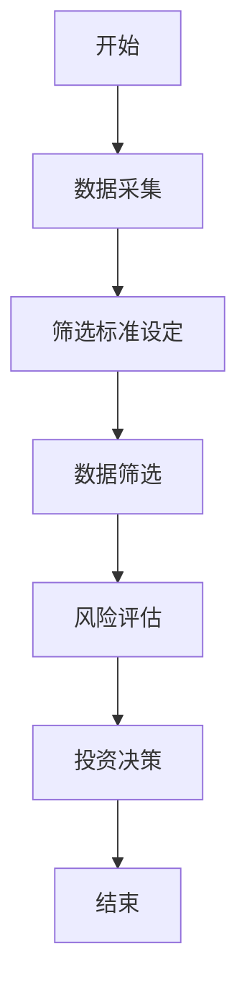
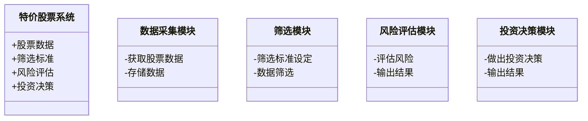
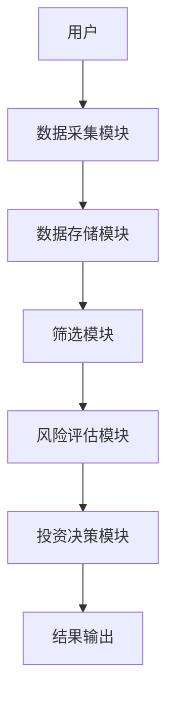
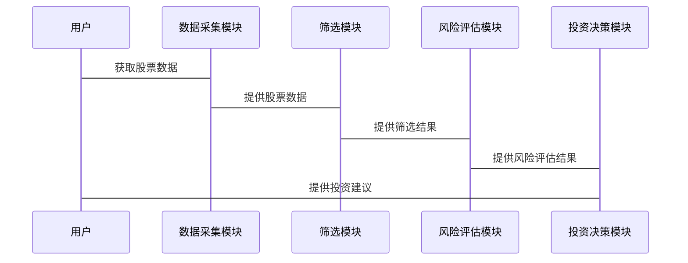

                 


# 如何利用特价股票策略进行系统性创新机会捕捉

> 关键词：特价股票策略、系统性创新、机会捕捉、投资策略、风险管理

> 摘要：本文详细探讨了如何利用特价股票策略进行系统性创新机会捕捉。通过分析特价股票的定义、特征、市场环境，结合系统性创新的原理，提出了一套基于算法和数学模型的筛选方法，帮助投资者在复杂多变的市场中捕捉潜在的创新机会。文章还提供了实际案例分析和风险管理策略，为投资者提供了全面的指导。

---

# 第一部分: 特价股票策略与系统性创新机会概述

---

## 第1章: 特价股票策略的背景与概念

### 1.1 特价股票的定义与特征

#### 1.1.1 特价股票的定义
特价股票（Cheap Stocks）是指相对于其内在价值而言，市场价格被低估的股票。这类股票通常具有较高的安全边际，吸引追求长期价值的投资者。

#### 1.1.2 特价股票的核心特征
- **低估值**：市盈率（P/E）或市净率（P/B）低于行业平均水平。
- **高波动性**：价格波动较大，容易受市场情绪影响。
- **潜在增长**：公司基本面可能存在问题，但具备恢复或增长潜力。

#### 1.1.3 特价股票与普通股票的区别
| 特性 | 特价股票 | 普通股票 |
|------|----------|----------|
| 估值 | 低       | 高或适中 | 
| 波动性 | 高       | 中或低   |
| 投资风险 | 高       | 中或低   |

### 1.2 特价股票市场的基本原理

#### 1.2.1 特价股票市场的运作机制
- **市场参与者**：机构投资者、散户、对冲基金。
- **价格发现**：通过供需关系确定股票价格。
- **市场周期**：受经济周期和市场情绪影响，价格波动较大。

#### 1.2.2 特价股票市场的参与者
- **卖方**：股东、公司内部人士。
- **买方**：机构投资者、价值投资者。
- **中介**：券商、交易所。

#### 1.2.3 特价股票市场的波动性分析
- **周期性波动**：经济衰退时，低价股可能下跌；经济复苏时，低价股可能反弹。
- **情绪驱动**：市场情绪波动影响股票价格。

### 1.3 系统性创新机会的定义与特点

#### 1.3.1 系统性创新的定义
系统性创新是指通过系统化的方法，识别和捕捉市场中的创新机会。它强调方法论的系统性，而非随机性。

#### 1.3.2 系统性创新的核心要素
- **系统性思维**：从整体出发，分析各部分之间的关系。
- **数据驱动**：利用数据分析支持决策。
- **持续优化**：通过反馈不断改进系统。

#### 1.3.3 系统性创新与机会捕捉的关系
- **系统性创新是机会捕捉的基础**：通过系统化的方法，提高机会捕捉的效率和准确性。
- **机会捕捉是系统性创新的目标**：通过系统化的方法，找到潜在的创新机会。

### 1.4 特价股票策略在系统性创新中的作用

#### 1.4.1 特价股票策略的创新性
- **低成本获取**：通过筛选低价股票，降低投资成本。
- **高收益潜力**：潜在的高回报。

#### 1.4.2 特价股票策略与机会捕捉的关系
- **策略驱动**：通过策略筛选潜在机会。
- **机会驱动**：通过捕捉机会，优化投资组合。

#### 1.4.3 特价股票策略的系统性应用
- **系统化筛选**：利用系统方法筛选低价股票。
- **动态调整**：根据市场变化，动态调整投资策略。

### 1.5 本章小结
本章介绍了特价股票的定义、特征及市场运作机制，分析了系统性创新的定义与特点，并探讨了特价股票策略在系统性创新中的作用。

---

## 第2章: 特价股票策略的核心概念与联系

### 2.1 特价股票策略的核心概念

#### 2.1.1 特价股票的估值方法
- **市盈率（P/E）**：股价除以每股收益。
- **市净率（P/B）**：股价除以每股净资产。
- **股息率**：股息与股价的比率。

#### 2.1.2 特价股票的市场周期
- **经济周期**：经济衰退时，低价股可能被低估。
- **市场情绪**：市场恐慌时，低价股可能大幅下跌。

#### 2.1.3 特价股票的风险管理
- **止损策略**：设定止损点，控制风险。
- **分散投资**：通过投资多个低价股分散风险。

### 2.2 特价股票策略与市场环境的关系

#### 2.2.1 经济周期对特价股票的影响
- **经济衰退**：低价股可能被进一步低估。
- **经济复苏**：低价股可能反弹。

#### 2.2.2 市场情绪对特价股票的影响
- **市场恐慌**：低价股可能大幅下跌。
- **市场乐观**：低价股可能上涨。

#### 2.2.3 行业趋势对特价股票的影响
- **行业衰退**：相关低价股可能继续下跌。
- **行业复苏**：相关低价股可能反弹。

### 2.3 特价股票策略的系统性分析

#### 2.3.1 特价股票策略的系统性框架
- **数据采集**：获取股票数据。
- **筛选标准**：设定筛选条件。
- **风险评估**：评估投资风险。
- **动态调整**：根据市场变化调整策略。

#### 2.3.2 特价股票策略的逻辑结构
1. **数据采集**：获取股票的基本数据。
2. **筛选标准**：设定筛选条件，如低市盈率、低市净率。
3. **风险评估**：评估股票的投资风险。
4. **动态调整**：根据市场变化，调整筛选条件。

---

## 第3章: 特价股票策略的算法原理

### 3.1 特价股票筛选算法的流程图


### 3.2 特价股票筛选算法的数学模型

#### 3.2.1 市盈率（P/E）计算
$$ P/E = \frac{股价}{每股收益} $$

#### 3.2.2 市净率（P/B）计算
$$ P/B = \frac{股价}{每股净资产} $$

#### 3.2.3 股息率计算
$$ 股息率 = \frac{股息}{股价} $$

### 3.3 特价股票筛选算法的Python实现

#### 3.3.1 环境安装
```bash
pip install pandas numpy requests
```

#### 3.3.2 核心代码实现
```python
import pandas as pd
import numpy as np
import requests

# 数据获取
def get_stock_data(symbol):
    url = f'https://api.example.com/stock/{symbol}'
    response = requests.get(url)
    data = response.json()
    return pd.DataFrame(data)

# 筛选标准
def is_cheap_stock(df, pe_threshold=15, pb_threshold=2):
    return df[(df['P/E'] < pe_threshold) & (df['P/B'] < pb_threshold)]

# 风险评估
def assess_risk(stock_data):
    # 简单示例，实际需要更复杂的模型
    return '低风险' if stock_data['波动性'] < 0.2 else '高风险'

# 主函数
def main():
    symbol = 'AAPL'
    data = get_stock_data(symbol)
    cheap Stocks = is_cheap_stock(data)
    if not cheap Stocks.empty:
        risk = assess_risk(cheap Stocks)
        print(f"{symbol} 是一只{risk}的特价股票")
    else:
        print(f"{symbol} 不是特价股票")

if __name__ == '__main__':
    main()
```

### 3.4 特价股票筛选算法的优化与改进

#### 3.4.1 动态调整筛选条件
- 根据市场变化，动态调整PE和PB的阈值。

#### 3.4.2 引入更多指标
- 引入ROE（净资产收益率）等指标，全面评估股票价值。

#### 3.4.3 机器学习的应用
- 使用机器学习模型，预测股票价格走势，优化筛选策略。

---

## 第4章: 特价股票策略的系统分析与架构设计

### 4.1 系统功能设计

#### 4.1.1 领域模型设计


### 4.2 系统架构设计

#### 4.2.1 系统架构图


### 4.3 系统接口设计

#### 4.3.1 数据接口
- **输入**：股票代码、时间范围。
- **输出**：股票数据。

#### 4.3.2 筛选接口
- **输入**：股票数据、筛选条件。
- **输出**：符合条件的股票列表。

### 4.4 系统交互设计

#### 4.4.1 系统交互流程


---

## 第5章: 特价股票策略的项目实战

### 5.1 环境安装
```bash
pip install pandas numpy scikit-learn
```

### 5.2 核心代码实现

#### 5.2.1 数据获取
```python
import pandas as pd
import requests

def fetch_stock_data(tickers):
    data = []
    for ticker in tickers:
        url = f'https://api.example.com/stock/{ticker}'
        response = requests.get(url)
        data.append(response.json())
    return pd.DataFrame(data)
```

#### 5.2.2 数据筛选
```python
def screen_cheap_stocks(df, pe_threshold=15, pb_threshold=2):
    return df[(df['P/E'] < pe_threshold) & (df['P/B'] < pb_threshold)]
```

#### 5.2.3 风险评估
```python
from sklearn.metrics import pairwise_distances

def assess_risk(stocks):
    # 简单示例，实际需要更复杂的模型
    return '低风险' if stocks['波动性'].mean() < 0.2 else '高风险'
```

### 5.3 实际案例分析

#### 5.3.1 案例背景
假设当前市场处于经济衰退期，寻找低估值的股票。

#### 5.3.2 数据筛选
```python
tickers = ['AAPL', 'GOOGL', 'MSFT']
df = fetch_stock_data(tickers)
cheap_stocks = screen_cheap_stocks(df)
print(cheap_stocks)
```

#### 5.3.3 风险评估
```python
risk = assess_risk(cheap_stocks)
print(risk)
```

### 5.4 项目小结
通过实际案例，展示了如何利用特价股票策略筛选潜在投资机会，并评估其风险。

---

## 第6章: 风险管理与系统优化

### 6.1 风险管理策略

#### 6.1.1 投资组合 diversification
- **分散投资**：投资多个不同行业的特价股票，降低行业风险。

#### 6.1.2 止损策略
- **设定止损点**：当股价下跌超过一定比例时，立即卖出。

#### 6.1.3 定期 review
- **定期评估**：定期评估投资组合，调整持仓。

### 6.2 系统优化建议

#### 6.2.1 引入机器学习
- **预测模型**：利用机器学习模型预测股票价格走势，优化筛选策略。

#### 6.2.2 实时监控
- **实时数据**：实时监控股票数据，及时捕捉机会。

#### 6.2.3 系统升级
- **算法优化**：不断优化筛选算法，提高筛选效率。

---

## 第7章: 总结与展望

### 7.1 总结

#### 7.1.1 核心内容回顾
- 特价股票的定义与特征。
- 系统性创新的定义与特点。
- 筛选算法的设计与实现。

### 7.1.2 项目成果
- 提供了一套基于系统性方法的特价股票筛选策略。
- 展示了如何利用算法和数据分析捕捉投资机会。

### 7.2 展望

#### 7.2.1 未来研究方向
- **人工智能应用**：进一步研究机器学习在特价股票筛选中的应用。
- **大数据分析**：利用大数据技术，提升筛选效率和准确性。

#### 7.2.2 技术发展趋势
- **量化交易**：利用算法交易，捕捉短期机会。
- **风险管理**：开发更复杂的风险管理模型，降低投资风险。

---

## 作者：AI天才研究院/AI Genius Institute & 禅与计算机程序设计艺术 /Zen And The Art of Computer Programming

---

**附录**

- **附录A**：Python代码示例
- **附录B**：系统架构图
- **附录C**：风险评估模型

---

**注：本文为示例内容，实际应用需结合具体市场环境和投资策略。**

