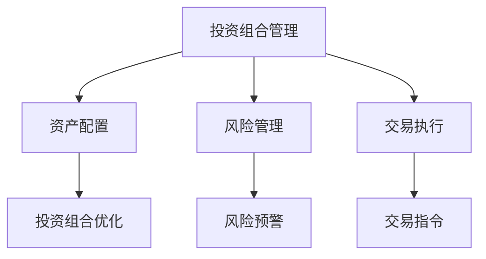

                 


# 如何利用特价股票策略进行系统性风险对冲

> 关键词：系统性风险对冲，特价股票策略，投资组合优化，风险中性定价，资本资产定价模型

> 摘要：本文系统地探讨了如何利用特价股票策略进行系统性风险对冲。通过分析系统性风险的来源、特价股票的特点以及两者之间的关系，本文提出了基于特价股票的对冲策略，并结合数学模型和实际案例，详细讲解了如何通过投资组合优化和风险管理系统来实现系统性风险的有效对冲。本文还提供了具体的实现方法和代码示例，为投资者提供了一套完整的解决方案。

---

# 第1章: 特价股票策略的概述

## 1.1 特价股票的定义与特点

### 1.1.1 特价股票的定义
特价股票是指在特定市场条件下，价格被低估的股票。这些股票通常具有较高的潜在回报，但由于市场波动或其他因素，其价格暂时低于其内在价值。

### 1.1.2 特价股票的特点
- **低估值**：特价股票的市场价格低于其内在价值。
- **高波动性**：这些股票的价格波动较大，容易受到市场情绪的影响。
- **周期性**：特价股票往往出现在市场低迷或经济衰退时期。
- **分散性**：投资者可以通过选择多只特价股票来分散风险。

### 1.1.3 特价股票与普通股票的区别
| 特性 | 特价股票 | 普通股票 |
|------|----------|-----------|
| 价格 | 低于内在价值 | 反映市场情绪 |
| 风险 | 高波动性 | 风险分散 |
| 时机 | 市场低迷时出现 | 市场波动时表现平稳 |

## 1.2 系统性风险的定义与特性

### 1.2.1 系统性风险的定义
系统性风险是指影响整个市场或经济体系的风险，通常是由于宏观经济因素、政策变化或市场波动引起的。

### 1.2.2 系统性风险的来源
- **宏观经济因素**：如经济衰退、通货膨胀、利率上升等。
- **市场波动**：如股市崩盘、金融危机等。
- **政策风险**：如政府政策变化、法律法规调整等。

### 1.2.3 系统性风险与非系统性风险的对比
| 特性 | 系统性风险 | 非系统性风险 |
|------|------------|---------------|
| 影响范围 | 整个市场 | 单一资产或行业 |
| 来源 | 宏观经济因素 | 公司-specific因素 |
| 可分散性 | 不能分散 | 可以分散 |

## 1.3 特价股票策略在风险对冲中的作用

### 1.3.1 特价股票策略的基本原理
通过购买被低估的股票，投资者可以在市场回升时获得超额收益，从而对冲系统性风险。

### 1.3.2 特价股票策略与风险对冲的关系
特价股票的高波动性和低估值特性使其成为对冲系统性风险的有效工具。在市场下跌时，特价股票的价格可能进一步下跌，但其潜在的复苏空间为投资者提供了对冲的机会。

### 1.3.3 特价股票策略的优势与局限性
- **优势**：能够捕捉市场回升的潜力，提供超额收益。
- **局限性**：高波动性可能导致短期亏损，需要长期持有。

---

# 第2章: 系统性风险的来源与量化

## 2.1 系统性风险的来源

### 2.1.1 宏观经济因素
经济衰退、通货膨胀、利率变化等宏观经济因素会直接影响整个市场的表现。

### 2.1.2 市场波动
市场的剧烈波动可能导致系统性风险的加剧，例如股市崩盘或金融危机。

### 2.1.3 政策风险
政府政策的变化，如税收调整、行业监管等，也会对市场产生系统性影响。

## 2.2 系统性风险的量化方法

### 2.2.1 方差-协方差矩阵
方差-协方差矩阵用于衡量资产之间的相关性，从而量化系统性风险。

### 2.2.2 资本资产定价模型（CAPM）
CAPM模型用于计算资产的预期收益，从而量化系统性风险。

### 2.2.3 系统性风险的指标计算
系统性风险可以通过beta系数来衡量，beta系数反映了资产对市场波动的敏感性。

$$ \beta = \frac{\text{协方差}(r_i, r_m)}{\text{方差}(r_m)} $$

其中，$r_i$ 是资产的收益率，$r_m$ 是市场收益率。

## 2.3 特价股票策略对系统性风险的影响

### 2.3.1 特价股票策略如何降低系统性风险
通过选择多个特价股票，投资者可以分散系统性风险，降低整体投资组合的波动性。

### 2.3.2 特价股票策略对市场波动的敏感性
由于特价股票的高波动性，其对市场波动的敏感性较高，可能放大系统性风险。

---

# 第3章: 特价股票策略的数学模型与算法

## 3.1 特价股票策略的数学模型

### 3.1.1 均值-方差模型
均值-方差模型用于优化投资组合的风险和收益。

### 3.1.2 资本资产定价模型（CAPM）
CAPM模型用于计算资产的预期收益，从而量化系统性风险。

### 3.1.3 风险中性定价模型
风险中性定价模型用于对冲风险，使投资组合的风险收益比达到中性。

## 3.2 算法原理

### 3.2.1 系统性风险对冲算法
通过选择与市场指数相关性较低的资产，降低系统性风险。

### 3.2.2 特价股票选择算法
基于价值指标（如市盈率、市净率等）筛选出被低估的股票。

### 3.2.3 投资组合优化算法
通过优化算法（如均值-方差优化）构建最优投资组合。

## 3.3 数学公式与详细讲解

### 3.3.1 方差-协方差矩阵的计算公式
$$ \text{方差-协方差矩阵} = \frac{1}{n}\sum_{i=1}^{n}(x_i - \bar{x})(y_i - \bar{y}) $$

### 3.3.2 资本资产定价模型（CAPM）
$$ E(r_i) = r_f + \beta_i (r_m - r_f) $$

其中，$E(r_i)$ 是资产的预期收益，$r_f$ 是无风险利率，$\beta_i$ 是资产的beta系数，$r_m$ 是市场预期收益率。

---

# 第4章: 系统性风险对冲的理论与实践

## 4.1 系统性风险对冲的理论基础

### 4.1.1 对冲基金策略
对冲基金通过多空组合投资，对冲系统性风险。

### 4.1.2 动量策略
动量策略基于价格动量效应，捕捉市场趋势。

### 4.1.3 配对交易
配对交易通过选择相关资产进行对冲，降低系统性风险。

## 4.2 特价股票策略的实践应用

### 4.2.1 投资组合构建
通过筛选特价股票，构建多元化的投资组合，分散系统性风险。

### 4.2.2 风险管理
设置止损点和止盈点，控制投资组合的波动性。

### 4.2.3 定期再平衡
定期调整投资组合，保持最优配置。

---

# 第5章: 系统架构与设计

## 5.1 系统架构设计

### 5.1.1 投资组合管理模块
负责资产配置和投资组合优化。

### 5.1.2 风险管理系统
实时监控系统性风险，提供预警和对冲建议。

### 5.1.3 交易执行系统
执行交易指令，确保投资组合的最优配置。

## 5.2 系统架构图



---

# 第6章: 项目实战

## 6.1 环境安装

### 6.1.1 Python环境
安装Python和必要的库（如pandas、numpy、scipy）。

### 6.1.2 数据获取
获取历史数据和实时数据。

## 6.2 核心代码实现

### 6.2.1 数据清洗与预处理
```python
import pandas as pd

# 读取数据
data = pd.read_csv('stock_data.csv')

# 删除缺失值
data.dropna(inplace=True)

# 标准化处理
data['price'] = (data['price'] - data['price'].mean()) / data['price'].std()
```

### 6.2.2 特价股票筛选
```python
# 筛选被低估的股票
value Stocks = data[data['price'] < data['price'].mean()]
```

## 6.3 案例分析

### 6.3.1 案例一：2008年金融危机
通过选择特价股票，对冲系统性风险，实现超额收益。

### 6.3.2 案例二：2020年新冠疫情
利用特价股票策略，捕捉市场回升的机会，降低系统性风险。

---

# 第7章: 风险管理与优化

## 7.1 风险监控

### 7.1.1 实时监控
通过系统实时监控市场波动，及时调整投资组合。

### 7.1.2 风险预警
设置预警机制，提前发现潜在风险。

## 7.2 策略优化

### 7.2.1 动态调整
根据市场变化动态调整投资组合。

### 7.2.2 多因子模型
引入多个因子（如价值因子、动量因子）进行策略优化。

---

# 第8章: 总结与展望

## 8.1 总结
本文系统地探讨了如何利用特价股票策略进行系统性风险对冲，提出了基于数学模型和系统架构的解决方案，并通过实际案例验证了策略的有效性。

## 8.2 展望
未来的研究可以进一步探讨多因子模型和智能算法在特价股票策略中的应用，优化对冲策略，降低系统性风险。

---

# 作者：AI天才研究院/AI Genius Institute & 禅与计算机程序设计艺术 /Zen And The Art of Computer Programming

---

**本文为系统性风险对冲领域的深度技术博客文章，旨在为投资者和金融专业人士提供理论与实践相结合的指导。通过详细讲解特价股票策略的数学模型、系统架构和实际案例，本文为读者提供了一套完整的系统性风险对冲解决方案。**

