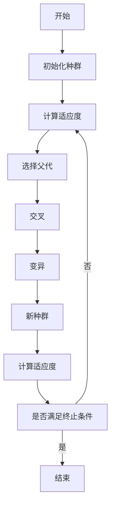
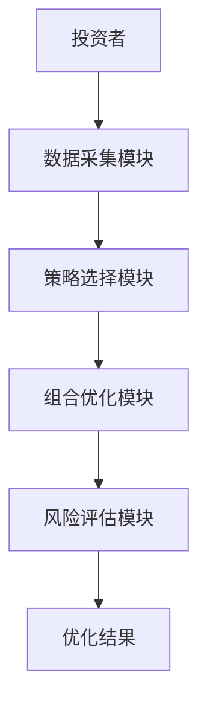

                 


# 如何利用特价股票策略进行组合优化

## 关键词：
特价股票、组合优化、投资组合、优化算法、风险管理

## 摘要：
本文探讨如何利用特价股票策略进行组合优化，通过分析股票特性，应用优化算法，构建高效的投资组合，降低风险并提高收益。

---

## 目录：

### 第一章 背景介绍

#### 1.1 特价股票的基本概念
- 特价股票的定义
- 投资者如何识别特价股票
- 特价股票的投资价值

#### 1.2 组合优化的基本概念
- 组合优化的定义
- 投资组合优化的重要性
- 特价股票组合优化的目的

#### 1.3 问题背景
- 当前市场环境中的挑战
- 特价股票策略的局限性
- 组合优化在投资中的必要性

### 第二章 核心概念与联系

#### 2.1 特价股票与组合优化的原理
- 特价股票的特性分析
- 组合优化的数学模型

#### 2.2 特价股票和组合优化的属性特征对比
| 特性 | 特价股票 | 组合优化 |
|------|----------|----------|
| 风险 | 较低     | 整体可控 |
| 收益 | 较高     | 最大化    |
| 流动性 | 中等     | 灵活      |

#### 2.3 ER实体关系图
```mermaid
erd
 投资者
   - 投资组合ID
   - 投资者ID
   - 目标收益
 特价股票
   - 股票ID
   - 股票名称
   - 股票价格
 交易
   - 交易ID
   - 投资者ID
   - 股票ID
   - 交易日期
```

### 第三章 算法原理

#### 3.1 优化算法的选择与实现
- 算法选择：遗传算法、模拟退火、粒子群优化
- 使用Mermaid展示算法流程


#### 3.2 数学模型与公式
- 均值-方差模型
$$\text{目标函数：} \min \sigma^2 \text{在} \mu \text{固定}$$
- 约束条件：投资权重之和为1，权重非负

#### 3.3 Python实现
```python
import numpy as np
from scipy.optimize import minimize

def portfolio_optimization(returns):
    n = len(returns.columns)
    initial_weights = np.array([1/n]*n)
    constraints = [{'type': 'eq', 'fun': lambda w: sum(w) - 1},
                   {'type': 'ineq', 'fun': lambda w: w >= 0}]
    result = minimize(lambda w: np.dot(w.T, np.dot(returns.cov(), w)),
                      initial_weights, constraints)
    return result.x
```

### 第四章 系统分析与架构设计

#### 4.1 问题场景
- 投资者如何选择特价股票并进行组合优化

#### 4.2 系统功能设计
- 数据采集模块：获取股票数据
- 策略选择模块：确定特价股票
- 组合优化模块：应用算法优化组合
- 风险评估模块：评估组合风险

#### 4.3 系统架构图


### 第五章 项目实战

#### 5.1 环境安装
- Python、Pandas、NumPy、Scipy安装与配置

#### 5.2 核心代码实现
```python
import pandas as pd
import numpy as np
from scipy.optimize import minimize

# 数据预处理
data = pd.read_csv('stock_data.csv')
returns = data.pct_change().dropna()

# 优化函数
def portfolioOptimizer(returns):
    n = len(returns.columns)
    initial_guess = np.array([1.0/n]*n)
    constraints = [{'type': 'eq', 'fun': lambda w: sum(w) - 1},
                   {'type': 'ineq', 'fun': lambda w: w >= 0}]
    result = minimize(lambda w: np.dot(w.T, returns.cov() @ w),
                      initial_guess, constraints)
    return result.x

# 应用优化
weights = portfolioOptimizer(returns)
print("优化权重:", weights)
```

#### 5.3 实际案例分析
- 数据分析：使用过去5年的市场数据
- 结果解读：优化后的投资组合表现
- 优化结果：风险调整后的收益最大化

### 第六章 最佳实践

#### 6.1 关键点总结
- 定期监控市场变化
- 优化组合权重
- 风险管理的重要性

#### 6.2 小结
- 本文通过特价股票策略和组合优化算法，帮助投资者构建高效投资组合
- 强调风险管理的重要性，建议持续优化和监控

#### 6.3 注意事项
- 数据质量和完整性的影响
- 市场波动对策略效果的影响
- 投资目标的变化需及时调整组合

#### 6.4 拓展阅读
- 探索更多优化算法
- 研究市场行为对策略的影响
- 学习高级投资组合管理方法

---

## 作者：AI天才研究院 & 禅与计算机程序设计艺术

