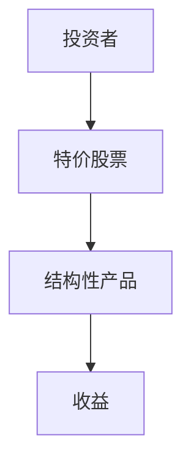
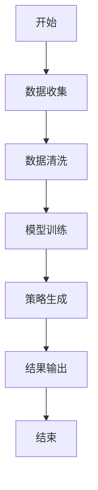
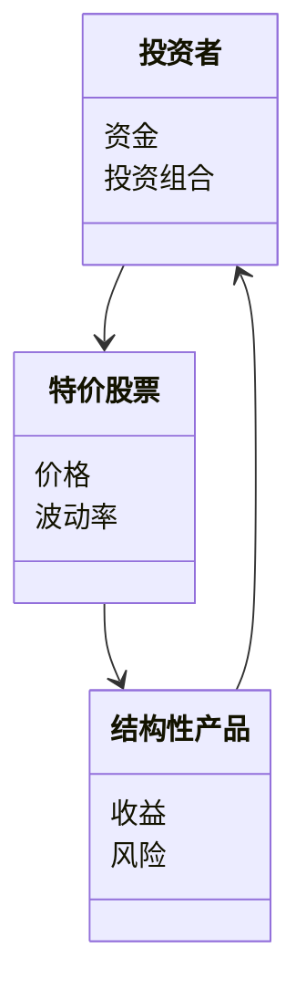
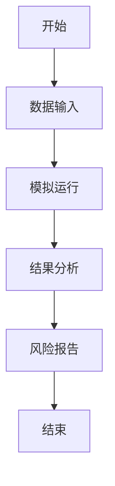

                 


# 如何利用特价股票策略进行结构性产品投资

> 关键词：特价股票策略，结构性产品投资，股票策略，投资系统设计，风险评估

> 摘要：本文详细探讨了如何利用特价股票策略进行结构性产品投资。首先，我们介绍了特价股票和结构性产品的基本概念。然后，我们分析了特价股票策略的核心要素和数学模型。接着，我们设计了结构性产品投资的系统架构，并通过实际案例展示了如何将特价股票策略应用于结构性产品投资中。最后，我们总结了投资过程中需要注意的风险管理和最佳实践。

---

## 第1章: 特价股票与结构性产品概述

### 1.1 特价股票的定义与特点
特价股票是指价格相对较低，但具有上涨潜力的股票。其特点包括：
- **低估值**：通常市盈率、市净率等指标低于行业平均水平。
- **高增长潜力**：公司可能处于成长期或行业上升期。
- **高波动性**：价格波动较大，适合短期交易。

### 1.2 结构性产品的定义与类型
结构性产品是一种金融工具，结合了衍生品（如期权）和固定收益证券的特点。常见类型包括：
- **收益增强型**：提供固定收益的基础上，附加股票或指数的收益。
- **风险可控型**：通过期权等工具对冲部分市场风险。
- **杠杆型**：通过杠杆放大收益或亏损。

### 1.3 特价股票策略在结构性产品中的应用前景
- **优势**：利用特价股票的低估值和高增长潜力，结构性产品可以在市场波动中获得超额收益。
- **挑战**：结构性产品复杂性高，投资者需具备较高的市场敏感性和风险管理能力。

---

## 第2章: 特价股票策略的核心概念

### 2.1 特价股票策略的背景与问题背景
- **问题背景**：市场波动大，投资者寻找高收益低风险的投资策略。
- **问题描述**：如何利用特价股票的特性，优化结构性产品的收益和风险。
- **问题解决**：通过数学模型和算法优化投资组合。
- **边界与外延**：限定于中短期投资，不考虑长期持有。

### 2.2 特价股票策略的核心要素
- **价格敏感性**：股票价格对市场变化的敏感程度。
- **波动性分析**：通过波动率预测股票价格的变化趋势。
- **估值模型**：使用DCF等模型评估股票的内在价值。

### 2.3 特价股票策略的核心要素对比表格
| 特性         | 高波动股票 | 低波动股票 |
|--------------|------------|------------|
| 波动率        | 高         | 低         |
| 收益潜力      | 高         | 中         |
| 风险承受能力  | 高         | 低         |

### 2.4 ER实体关系图（Mermaid流程图）


---

## 第3章: 特价股票策略的数学模型与算法原理

### 3.1 特价股票策略的数学模型
- **均值-方差模型**：用于优化投资组合的收益和风险。
  $$ E[r] = \mu \cdot w $$
  $$ Var(r) = \sigma^2 \cdot w^2 $$
- **CAPM模型**：用于评估资产的预期收益。
  $$ E(r_i) = r_f + \beta_i (E(r_m) - r_f) $$

### 3.2 算法原理与流程图


### 3.3 算法实现与代码
```python
import numpy as np
import pandas as pd

# 数据收集与清洗
data = pd.read_csv('stock_data.csv')
data_cleaned = data.dropna()

# 模型训练
from sklearn.linear_model import LinearRegression
model = LinearRegression()
model.fit(data_cleaned[['price', 'volatility']], data_cleaned['return'])

# 策略生成
def generate_strategy(price, volatility, model):
    predicted_return = model.predict([[price, volatility]])
    return predicted_return[0]
```

---

## 第4章: 结构性产品投资系统分析

### 4.1 系统功能设计
- **领域模型（Mermaid类图）**


### 4.2 系统架构设计
- **系统架构（Mermaid架构图）**
```mermaid
container 系统架构 {
    数据层
    业务逻辑层
    表现层
}
```

---

## 第5章: 结构性产品投资的风险评估与管理

### 5.1 风险评估方法
- **风险评估模型**：使用蒙特卡洛模拟预测不同市场条件下的收益和风险。
- **风险评估流程图**


### 5.2 风险管理策略
- **风险控制措施**：设置止损点和止盈点。
- **风险预警机制**：实时监控市场波动和产品表现。
- **风险应对方案**：根据预警结果调整投资组合。

---

## 第6章: 特价股票策略的项目实战

### 6.1 项目环境安装
- **环境配置**：安装Python、Pandas、NumPy、Scikit-learn等工具。

### 6.2 核心代码实现
```python
import numpy as np
import pandas as pd

# 数据预处理
data = pd.read_csv('structured_product_data.csv')
data = data.dropna()

# 训练模型
from sklearn.tree import DecisionTreeRegressor
model = DecisionTreeRegressor()
model.fit(data[['price', 'volatility']], data['return'])

# 应用策略
def apply_strategy(price, volatility, model):
    predicted_return = model.predict([[price, volatility]])
    return predicted_return[0]
```

---

## 总结

通过本文的详细讲解，读者可以了解如何利用特价股票策略进行结构性产品投资。从理论到实践，我们探讨了策略的核心要素、数学模型、系统设计和实际应用。投资过程中需要注意风险管理，结合最佳实践，以实现稳健的投资收益。

---

作者：AI天才研究院 & 禅与计算机程序设计艺术

