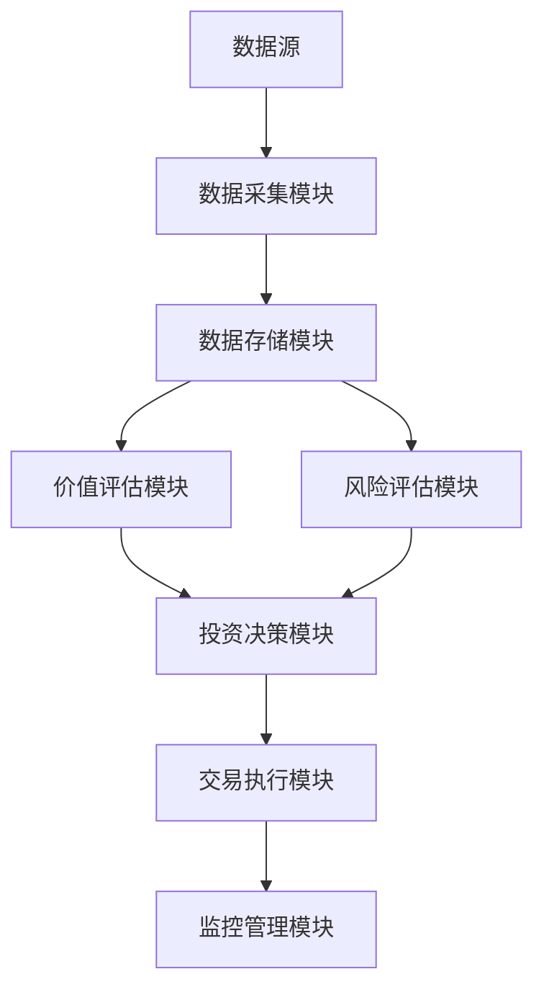
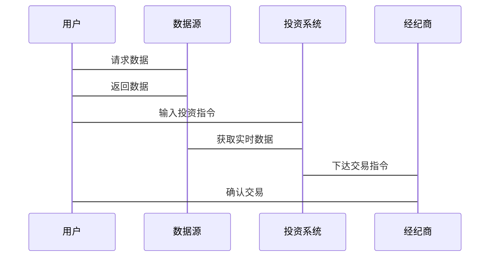

                 


# 如何利用特价股票策略进行资产配置

## 关键词：特价股票，资产配置，价值投资，基本面分析，技术分析，风险管理

## 摘要：本文深入探讨了如何利用特价股票策略进行资产配置，从背景介绍、核心概念到算法与数学模型，再到系统分析、项目实战，最后总结最佳实践。通过详细分析，帮助读者理解特价股票策略的原理和应用，提供实际操作的指导。

---

# 第一部分: 特价股票策略与资产配置背景

# 第1章: 特价股票策略与资产配置概述

## 1.1 特价股票的定义与特点

### 1.1.1 什么是特价股票

特价股票是指市场价格低于其内在价值的股票。通常，这些股票被市场低估，具有长期增值的潜力。特价股票的核心在于识别市场中的错价机会，通过分析公司的基本面和技术面，找到被低估的投资标的。

### 1.1.2 特价股票的市场特征

- **低估价格**：市场价格低于内在价值。
- **高回报潜力**：长期来看，这些股票可能有较大的上涨空间。
- **波动性**：由于市场情绪影响，这些股票可能波动较大。
- **低关注度**：相对于热门股票，特价股票可能关注度较低。

### 1.1.3 特价股票与普通股票的区别

| 特征                | 特价股票             | 普通股票             |
|---------------------|----------------------|----------------------|
| 价格                 | 低于内在价值         | 接近或高于内在价值   |
| 投资潜力             | 较高                 | 较低                 |
| 波动性               | 较高                 | 较低                 |
| 关注度               | 较低                 | 较高                 |

## 1.2 资产配置的基本概念

### 1.2.1 资产配置的定义

资产配置是指将资金分配到不同的资产类别（如股票、债券、房地产等）中，以实现投资目标（如收益最大化、风险最小化）的过程。

### 1.2.2 资产配置的重要性

- **分散风险**：通过投资不同资产，降低单一资产带来的风险。
- **优化收益**：根据市场情况调整资产比例，抓住收益机会。
- **长期稳健**：通过合理的配置，实现长期稳定的资产增值。

### 1.2.3 特价股票在资产配置中的作用

- **增加收益**：通过投资特价股票，捕捉低估机会，提高整体收益。
- **分散风险**：将部分资金投入特价股票，降低整体投资组合的风险。
- **灵活调整**：根据市场变化，及时调整特价股票的投资比例。

## 1.3 特价股票策略的核心价值

### 1.3.1 特价股票策略的优势

- **高回报潜力**：通过识别低估股票，获得超额收益。
- **逆向投资**：在市场恐慌时买入，市场狂热时卖出。
- **长期视角**：注重公司的基本面，长期持有优质资产。

### 1.3.2 特价股票策略的风险

- **市场波动风险**：短期价格波动可能会影响投资回报。
- **公司基本面变化**：公司业绩不佳可能导致股价继续下跌。
- **市场情绪影响**：市场情绪波动可能影响股价的短期走势。

### 1.3.3 特价股票策略与其他投资策略的对比

| 策略类型             | 价值投资           | 技术分析             | 资产配置中的特价股票策略 |
|----------------------|--------------------|----------------------|--------------------------|
| 核心思想             | 寻找低估资产         | 通过技术指标预测价格 | 综合价值与技术分析       |
| 投资期限             | 长期               | 短期或中期           | 灵活调整                 |
| 风险承受             | 较高               | 较低                 | 中等                     |

## 1.4 本章小结

本章介绍了特价股票的定义、特点及其在资产配置中的作用。通过对比其他投资策略，强调了特价股票策略的优势和风险。下一章将深入探讨价值投资理念和分析方法，为后续的策略制定奠定基础。

---

# 第二部分: 特价股票策略的核心概念与分析方法

# 第2章: 资产配置中的价值投资理念

## 2.1 价值投资的基本原理

### 2.1.1 价值投资的定义

价值投资是一种投资策略，强调以低于内在价值的价格购买优质资产，长期持有，等待市场重新认识到其真实价值。

### 2.1.2 价值投资的核心思想

- **安全边际**：买入价格低于内在价值，确保有一定的安全空间。
- **长期视角**：关注公司的长期盈利能力，而非短期价格波动。
- **独立思考**：不随市场情绪盲目操作，保持独立判断。

### 2.1.3 价值投资与特价股票策略的关系

价值投资是特价股票策略的核心理念，通过寻找被市场低估的股票，实现长期的超额收益。

## 2.2 基本面分析方法

### 2.2.1 基本面分析的定义

基本面分析是通过研究公司的财务状况、行业地位、盈利能力等因素，评估其内在价值。

### 2.2.2 基本面分析的关键指标

- **市盈率（P/E）**：股价与每股收益的比率。
- **市净率（P/B）**：股价与每股净资产的比率。
- **股息率**：股息与股价的比率。
- **ROE（净资产收益率）**：衡量公司盈利能力的重要指标。

### 2.2.3 基本面分析在特价股票策略中的应用

通过分析公司的基本面指标，识别那些市盈率、市净率较低，但ROE较高的公司，这些公司可能就是被低估的特价股票。

## 2.3 技术分析方法

### 2.3.1 技术分析的定义

技术分析是通过研究历史价格和成交量数据，预测未来价格走势。

### 2.3.2 常用的技术分析指标

- **移动平均线（MA）**：用于识别价格趋势。
- **相对强弱指数（RSI）**：用于判断超买超卖状态。
- **MACD（移动平均收敛散度）**：用于判断价格趋势和力量变化。

### 2.3.3 技术分析在特价股票策略中的应用

结合技术分析，识别价格超跌反弹的机会，进一步筛选出具有技术优势的特价股票。

## 2.4 综合分析方法

### 2.4.1 综合分析的定义

综合分析是将基本面分析和技术分析相结合，全面评估股票的投资价值。

### 2.4.2 综合分析的优势

- **全面评估**：结合基本面和技术面，减少单一分析的局限性。
- **提高准确性**：通过双重验证，增加投资决策的可靠性。

### 2.4.3 综合分析在特价股票策略中的应用

通过综合分析，识别那些基本面良好且技术形态走强的股票，进一步提高投资的成功率。

## 2.5 本章小结

本章详细介绍了价值投资理念、基本面分析和技术分析在特价股票策略中的应用。综合分析方法的提出，为后续的策略制定提供了理论基础。

---

# 第三部分: 特价股票策略的算法与数学模型

# 第3章: 特价股票的价值评估模型

## 3.1 价值评估模型的定义

价值评估模型是通过数学公式计算股票的内在价值，帮助投资者判断股票是否被低估。

## 3.2 常用的价值评估模型

### 3.2.1 股息折现模型（DDM）

股息折现模型用于评估能够持续派发股息的股票的价值。公式如下：

$$ V = \frac{D}{k - g} $$

其中：
- \( V \) 表示股票的内在价值
- \( D \) 表示预期的股息
- \( k \) 表示折现率
- \( g \) 表示股息增长率

### 3.2.2 现金流量折现模型（DCF）

现金流量折现模型用于评估公司未来现金流的现值。公式如下：

$$ V = \sum_{t=1}^{n} \frac{CF_t}{(1 + r)^t} + \frac{TV}{(1 + r)^n} $$

其中：
- \( V \) 表示股票的内在价值
- \( CF_t \) 表示第 \( t \) 年的现金流
- \( r \) 表示折现率
- \( TV \) 表示终值

### 3.2.3 市盈率模型

市盈率模型用于评估股票的相对价值。公式如下：

$$ PE = \frac{P}{E} $$

其中：
- \( PE \) 表示市盈率
- \( P \) 表示股价
- \( E \) 表示每股收益

## 3.3 价值评估模型在特价股票策略中的应用

通过价值评估模型，计算股票的内在价值，判断其是否被低估。例如，如果一只股票的市盈率远低于行业平均水平，可能就是一只特价股票。

## 3.4 本章小结

本章介绍了常用的股票价值评估模型，并说明了如何利用这些模型判断股票是否被低估，为后续的策略制定提供了数学基础。

---

# 第四部分: 系统分析与架构设计

# 第4章: 特价股票策略的投资系统架构

## 4.1 投资系统功能设计

### 4.1.1 系统功能概述

投资系统需要具备数据采集、价值评估、风险评估、交易执行和监控管理等功能。

### 4.1.2 系统功能模块

- 数据采集模块：采集股票的市场数据、财务数据等。
- 价值评估模块：计算股票的内在价值，判断是否为特价股票。
- 风险评估模块：评估投资组合的风险。
- 交易执行模块：根据策略执行交易指令。
- 监控管理模块：监控投资组合的表现，及时调整策略。

## 4.2 系统架构设计

### 4.2.1 系统架构图



### 4.2.2 系统接口设计

- 数据接口：与数据源（如Yahoo Finance、 Bloomberg）对接，获取实时数据。
- 交易接口：与经纪商系统对接，执行交易指令。
- 用户接口：提供用户查询和管理投资组合的功能。

## 4.3 系统交互设计

### 4.3.1 系统交互流程



## 4.4 本章小结

本章详细描述了投资系统的功能模块、架构设计和交互流程，为后续的系统实现提供了清晰的指导。

---

# 第五部分: 项目实战

# 第5章: 特价股票策略的实战应用

## 5.1 环境安装

### 5.1.1 系统环境

- 操作系统：Windows/Mac/Linux
- 开发工具：Python、Jupyter Notebook
- 数据源：Yahoo Finance、Bloomberg

### 5.1.2 必要的Python库

- pandas：数据处理
- numpy：数值计算
- matplotlib：数据可视化
- yfinance：数据获取

## 5.2 系统核心实现源代码

### 5.2.1 数据获取代码

```python
import yfinance as yf
import pandas as pd

# 下载股票数据
def get_data(ticker, start, end):
    data = yf.download(ticker, start=start, end=end)
    return data

# 示例：获取苹果股票数据
data = get_data('AAPL', '2020-01-01', '2023-01-01')
print(data.head())
```

### 5.2.2 价值评估代码

```python
def calculate_intrinsic_value(ticker):
    # 获取数据
    data = get_data(ticker, '2020-01-01', '2023-01-01')
    # 计算市盈率
    pe = data['Close'] / data['EPS']
    # 计算市净率
    pb = data['Close'] / data['BVPS']
    # 判断是否为特价股票
    if pe < pe_mean and pb < pb_mean:
        return True
    else:
        return False

# 示例：判断苹果股票是否为特价股票
is_discount = calculate_intrinsic_value('AAPL')
print(f"苹果股票是否为特价股票：{is_discount}")
```

## 5.3 实际案例分析

### 5.3.1 案例背景

假设当前市场中，某公司的市盈率为10，行业平均市盈率为15，市净率为1.5，行业平均市净率为2。该公司的ROE为15%，行业平均ROE为10%。

### 5.3.2 分析过程

- 市盈率低于行业平均，市净率也低于行业平均，ROE高于行业平均，说明该公司的股票可能被低估。

### 5.3.3 投资决策

基于以上分析，可以判断该公司的股票为特价股票，建议买入。

## 5.4 本章小结

本章通过实际案例，展示了如何利用特价股票策略进行投资决策。通过代码实现和案例分析，帮助读者更好地理解策略的应用。

---

# 第六部分: 最佳实践与总结

# 第6章: 特价股票策略的最佳实践

## 6.1 投资策略中的注意事项

- **分散投资**：避免将所有资金投入到一只股票中。
- **长期视角**：耐心持有，等待价值回归。
- **持续学习**：市场变化快，需不断学习新知识。

## 6.2 风险管理方法

- **止损策略**：设定止损点，避免亏损过大。
- **仓位控制**：根据风险承受能力，合理分配仓位。
- **定期复盘**：定期评估投资组合的表现，及时调整策略。

## 6.3 持续优化建议

- **动态调整**：根据市场变化，及时调整投资策略。
- **技术进步**：利用新技术（如人工智能）提升分析效率。
- **经验总结**：总结每次投资的得失，不断优化策略。

## 6.4 本章小结

本章总结了特价股票策略的最佳实践，包括投资注意事项、风险管理方法和持续优化建议。通过这些方法，可以提高投资成功的概率，实现资产的长期稳健增值。

---

# 作者：AI天才研究院/AI Genius Institute & 禅与计算机程序设计艺术 /Zen And The Art of Computer Programming

---

感谢您的阅读！希望这篇文章能为您提供有价值的信息，帮助您更好地理解如何利用特价股票策略进行资产配置。

