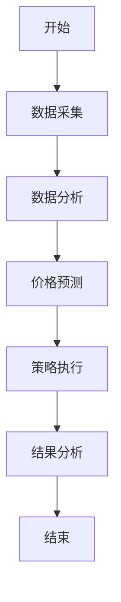
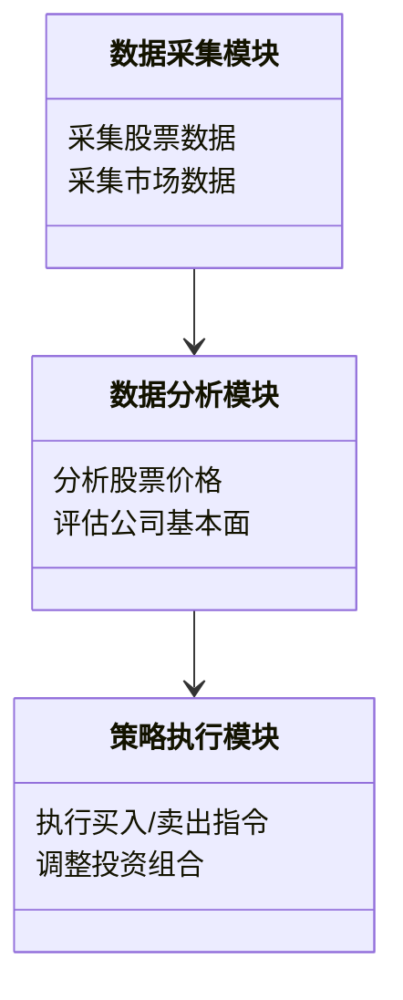

                 


# 如何利用特价股票策略进行跨境资产配置

> 关键词：特价股票策略，跨境资产配置，算法原理，系统架构，项目实战

> 摘要：本文将详细介绍如何利用特价股票策略进行跨境资产配置。首先，我们将介绍特价股票策略的基本概念和跨境资产配置的重要性。然后，我们从数学模型和算法原理的角度深入分析特价股票策略。接下来，我们将设计一个跨境资产配置的系统架构，并通过实际案例进行项目实战。最后，我们将总结最佳实践和注意事项，以帮助读者更好地理解和应用这些策略。

---

## 第一部分: 特价股票策略与跨境资产配置背景

### 第1章: 特价股票策略与跨境资产配置概述

#### 1.1 特价股票策略的定义与特点
特价股票策略是指在特定市场条件下，利用股票价格的波动性，以低于市场价或合理价买入股票，并在合适时机卖出以获得利润的策略。其核心特点包括：

1. **价格敏感性**：依赖于股票价格的波动，寻找价格低点买入，高点卖出。
2. **风险可控性**：通过分析市场趋势和公司基本面，降低投资风险。
3. **灵活性**：可以根据市场变化快速调整策略。

#### 1.2 跨境资产配置的基本概念
跨境资产配置是指在多个国家或地区的金融市场中分散投资，以降低风险并优化收益。其优势包括：

1. **风险分散**：通过投资不同市场的资产，降低单一市场波动带来的风险。
2. **收益多样化**：不同市场和资产类别可能有不同的表现，从而提高整体收益。
3. **全球化视角**：利用不同市场的差异，捕捉更多的投资机会。

#### 1.3 特价股票策略在跨境资产配置中的作用
将特价股票策略应用于跨境资产配置，可以通过以下方式实现收益和风险的优化：

1. **捕捉全球市场机会**：在不同市场中寻找被低估的股票，利用价格差异进行套利或投资。
2. **分散风险**：通过在多个市场中配置资产，降低单一市场风险。
3. **提高收益潜力**：利用不同市场的价格波动，获得更高的收益。

---

## 第二部分: 特价股票策略的数学模型与算法原理

### 第2章: 特价股票策略的数学模型与算法原理

#### 2.1 特价股票策略的数学模型
特价股票策略的数学模型主要基于股票价格的波动性和市场趋势的预测。以下是一个简化的数学模型：

$$
P_{\text{target}} = P_{\text{current}} \times (1 - \alpha)
$$

其中：
- $P_{\text{target}}$ 是目标价格
- $P_{\text{current}}$ 是当前价格
- $\alpha$ 是折扣率（0 < $\alpha$ < 1）

#### 2.2 特价股票策略的算法原理
以下是特价股票策略的算法流程图：



---

## 第三部分: 跨境资产配置的系统架构设计

### 第3章: 跨境资产配置的系统架构设计

#### 3.1 系统功能模块设计
以下是跨境资产配置系统的功能模块：



---

## 第四部分: 特价股票策略的项目实战

### 第4章: 特价股票策略的项目实战

#### 4.1 环境安装与配置
以下是环境安装的步骤：

1. **数据采集工具**：使用Python的`pandas`和`requests`库。
2. **数据分析工具**：使用`numpy`和`pandas`进行数据分析。
3. **策略执行工具**：使用`backtrader`进行回测和执行策略。

#### 4.2 系统核心实现
以下是代码实现：

```python
import pandas as pd
import numpy as np

# 数据采集模块
def fetch_data(ticker):
    # 模拟数据获取
    return pd.DataFrame({'date': range(100), 'price': np.random.randn(100) * 10 + 50})

# 数据分析模块
def analyze_stock(ticker, data):
    # 计算价格移动平均线
    data['MA'] = data['price'].rolling(5).mean()
    return data

# 策略执行模块
def execute_strategy(data, threshold):
    positions = []
    for i in range(len(data)):
        if data['price'][i] < data['MA'][i] * (1 - threshold):
            positions.append(1)
        else:
            positions.append(0)
    return positions

# 主程序
if __name__ == "__main__":
    ticker = 'AAPL'
    data = fetch_data(ticker)
    analyzed_data = analyze_stock(ticker, data)
    strategy = execute_strategy(analyzed_data, 0.1)
    print(strategy)
```

---

## 第五部分: 特价股票策略的最佳实践与注意事项

### 第5章: 特价股票策略的最佳实践与注意事项

#### 5.1 特价股票策略的最佳实践
1. **持续学习市场趋势**：及时了解全球经济和市场的变化。
2. **分散投资**：避免过度集中于某一只股票或市场。
3. **风险管理**：设定止损点，避免重大损失。

#### 5.2 跨境资产配置的注意事项
1. **汇率风险**：关注汇率波动对投资收益的影响。
2. **法律风险**：遵守不同国家的法律法规。
3. **流动性风险**：确保资金的流动性。

---

## 第六部分: 总结

### 第6章: 总结

通过本文的详细介绍，我们了解了如何利用特价股票策略进行跨境资产配置。从背景介绍到数学模型，从系统架构到项目实战，我们全面分析了这一策略的优势和实现方法。未来，随着技术的进步和市场的变化，特价股票策略在跨境资产配置中的应用将更加广泛和深入。

---

**作者：AI天才研究院/AI Genius Institute & 禅与计算机程序设计艺术 /Zen And The Art of Computer Programming**

