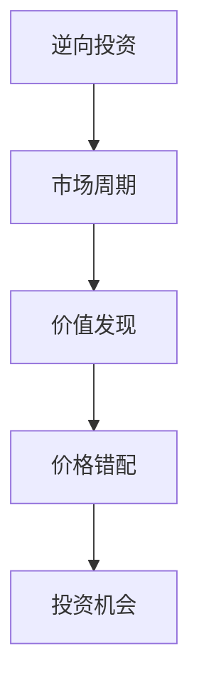
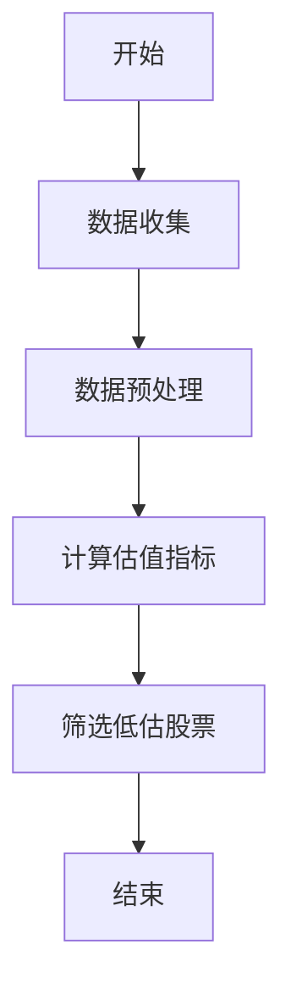
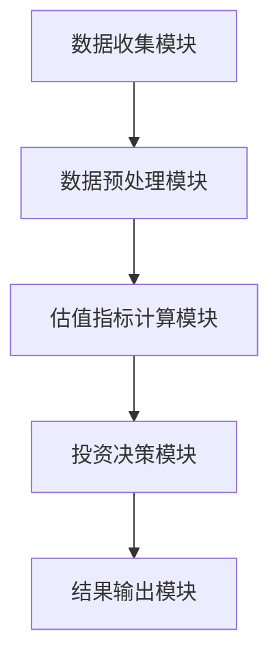
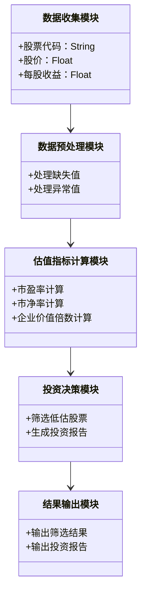
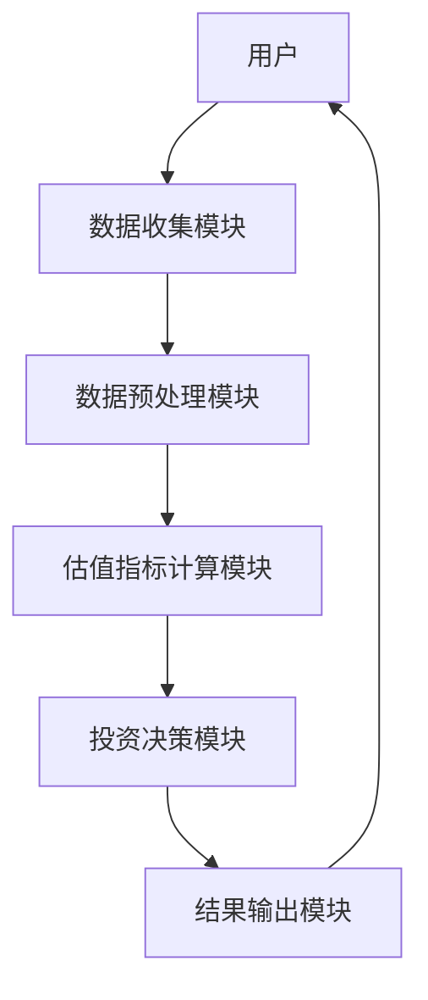

                 


```markdown
# 如何利用特价股票策略进行逆向产业投资

## 关键词：逆向投资，特价股票，产业投资，价值评估，风险管理

## 摘要：本文详细探讨了如何利用特价股票策略进行逆向产业投资。首先介绍了逆向投资的基本概念和特价股票策略的背景，分析了逆向投资的核心原理和价值评估方法。接着，详细讲解了特价股票筛选的数学模型和算法，包括市盈率、市净率等指标的计算。然后，通过系统分析与架构设计，展示了如何构建一个完整的逆向投资系统，包括数据收集、分析模块和决策模块。最后，通过实际案例分析和最佳实践，帮助读者更好地理解和应用逆向投资策略。

---

# 第一部分: 逆向投资与特价股票策略的背景

## 第1章: 逆向投资与特价股票策略概述

### 1.1 逆向投资的基本概念
- 1.1.1 逆向投资的定义与特点
- 1.1.2 特价股票策略的背景与意义
- 1.1.3 逆向产业投资的核心理念

### 1.2 逆向投资的哲学与心理学基础
- 1.2.1 逆向思维的哲学基础
- 1.2.2 投资者心理与市场情绪分析
- 1.2.3 逆向投资与市场周期的关系

### 1.3 特价股票策略的适用场景
- 1.3.1 市场低迷期的逆向投资机会
- 1.3.2 特价股票的定义与筛选标准
- 1.3.3 逆向产业投资的行业选择

## 1.4 本章小结

---

# 第二部分: 特价股票策略的核心概念与分析框架

## 第2章: 逆向投资的核心概念与联系

### 2.1 逆向投资的核心原理
- 2.1.1 市场定价偏差的理论基础
- 2.1.2 价值发现与价格错配的机制
- 2.1.3 逆向投资的决策模型

### 2.2 投资策略与行业分析的关联
- 2.2.1 行业周期分析与投资机会
- 2.2.2 企业基本面分析框架
- 2.2.3 逆向投资中的行业选择策略

### 2.3 逆向投资与价值评估的对比分析
- 2.3.1 价值评估方法的优缺点对比
- 2.3.2 逆向投资中的估值模型选择
- 2.3.3 行业分析与估值的关系

## 2.4 核心概念与联系的 Mermaid 流程图


---

# 第三部分: 特价股票策略的算法与数学模型

## 第3章: 逆向投资中的数学模型与算法

### 3.1 特价股票筛选的数学模型
- 3.1.1 市盈率（P/E）计算公式
$$ P/E = \frac{\text{股价}}{\text{每股收益}} $$

- 3.1.2 市净率（P/B）计算公式
$$ P/B = \frac{\text{股价}}{\text{每股净资产}} $$

- 3.1.3 企业价值倍数（EV/EBITDA）计算公式
$$ EV/EBITDA = \frac{\text{企业价值}}{\text{息税折旧及摊销前利润}} $$

### 3.2 逆向投资中的算法流程


### 3.3 算法实现的 Python 代码示例
```python
import pandas as pd

# 假设 data 是包含股票信息的 DataFrame
def calculate_pe(data):
    data['PE'] = data['股价'] / data['每股收益']
    return data

def calculate_pb(data):
    data['PB'] = data['股价'] / data['每股净资产']
    return data

def calculate_ev_ebitda(data):
    data['EV'] = data['股价'] * data['流通股数']
    data['EBITDA'] = data['营业收入'] + data['营业利润'] + data['折旧'] + data['摊销']
    data['EV_EBITDA'] = data['EV'] / data['EBITDA']
    return data

# 示例代码
data = pd.read_csv('股票数据.csv')
data = calculate_pe(data)
data = calculate_pb(data)
data = calculate_ev_ebitda(data)
data.to_csv('估值结果.csv', index=False)
```

### 3.4 算法实现的详细解释
- 数据收集：从可靠的金融数据源获取股票的基本信息，包括股价、每股收益、每股净资产等。
- 数据预处理：处理缺失值、异常值，确保数据的完整性和准确性。
- 计算估值指标：分别计算市盈率、市净率和企业价值倍数，评估股票的内在价值。
- 筛选低估股票：根据设定的筛选标准，选择市盈率、市净率和企业价值倍数均低于行业平均水平的股票。

---

# 第四部分: 系统分析与架构设计

## 第4章: 系统分析与架构设计

### 4.1 系统分析
- 问题场景介绍：在市场低迷期，如何通过逆向投资策略筛选出具有投资价值的股票。
- 项目介绍：构建一个基于特价股票策略的逆向投资系统，帮助投资者快速识别低估股票。

### 4.2 系统架构设计


### 4.3 系统功能设计


### 4.4 系统交互设计


---

# 第五部分: 项目实战与最佳实践

## 第5章: 项目实战

### 5.1 环境配置
- 安装必要的Python库：pandas、numpy、scipy等。

### 5.2 数据收集与预处理
- 从Yahoo Finance或Google Finance获取股票数据。
- 处理缺失值和异常值。

### 5.3 估值指标计算
- 使用Python代码计算市盈率、市净率和企业价值倍数。
- 筛选出市盈率、市净率和企业价值倍数均低于行业平均水平的股票。

### 5.4 投资决策与结果输出
- 根据筛选结果生成投资报告。
- 输出筛选结果和投资建议。

### 5.5 实际案例分析
- 以2020年新冠疫情后的市场为例，分析如何通过逆向投资策略筛选出具有投资价值的股票。

## 第6章: 最佳实践与注意事项

### 6.1 风险管理
- 设定止损点，控制投资风险。
- 分散投资，避免过度集中。

### 6.2 心态调整
- 保持耐心，逆向投资需要时间验证。
- 避免随市场情绪盲目操作。

### 6.3 持续学习
- 关注行业动态和市场变化。
- 不断优化投资策略和模型。

### 6.4 小结
逆向投资是一种有效的投资策略，但需要结合市场环境和企业基本面进行综合分析。通过特价股票策略，投资者可以在市场低迷期找到具有投资价值的股票，实现长期收益。

---

# 作者：AI天才研究院/AI Genius Institute & 禅与计算机程序设计艺术 /Zen And The Art of Computer Programming
```

