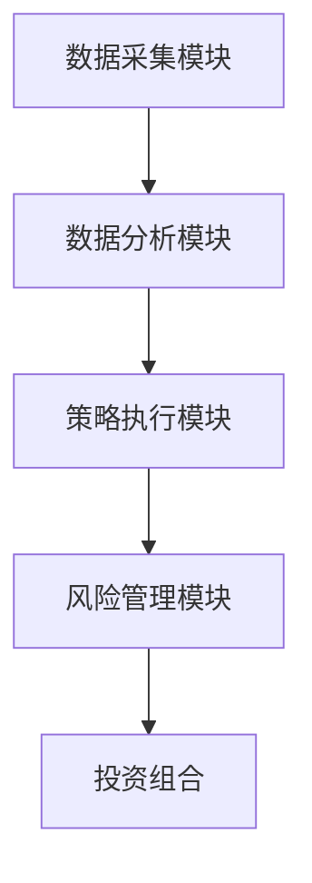
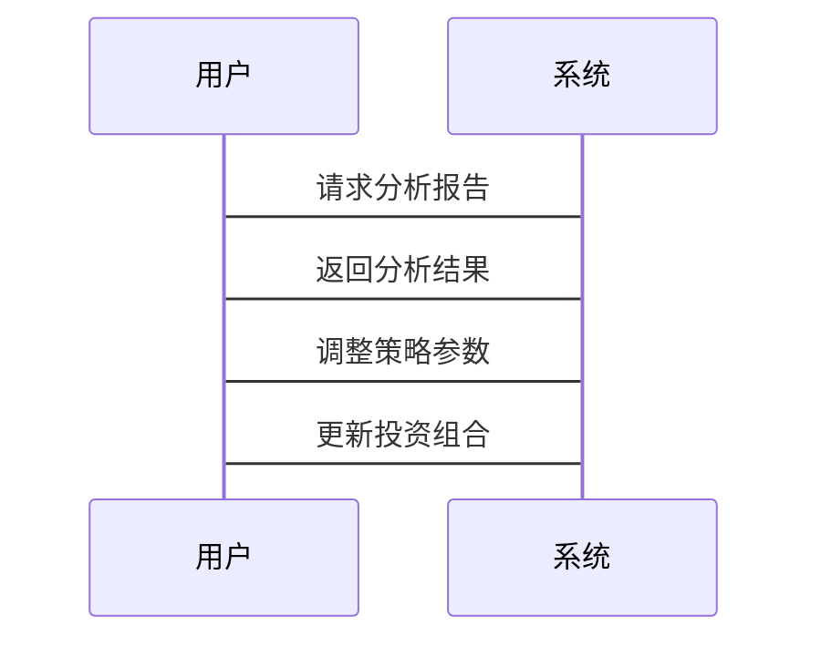
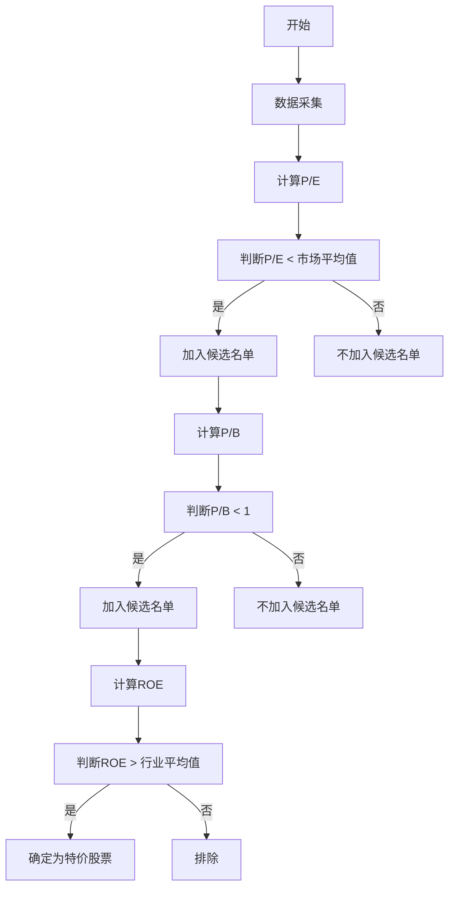

                 


# 如何利用特价股票策略进行逆向思维投资

## 关键词：特价股票策略、逆向思维投资、股票投资、风险管理、投资策略

## 摘要：  
本文详细探讨了如何利用特价股票策略进行逆向思维投资。通过分析特价股票的定义、特点以及逆向思维的核心原理，结合实际案例和系统设计，为投资者提供一套完整的投资策略和风险管理方法。文章还深入讲解了数学模型、算法原理和系统架构，帮助读者从理论到实践全面掌握逆向思维投资的技巧。

---

# 第一部分: 特价股票策略与逆向思维投资概述

## 第1章: 特价股票策略的基本概念

### 1.1 特价股票的定义与特点

#### 1.1.1 什么是特价股票  
特价股票是指在特定市场环境下，由于市场波动、公司基本面变化或其他外部因素，导致股票价格显著低于其内在价值的股票。这些股票通常被视为被市场低估的投资机会。

#### 1.1.2 特价股票的特点  
- **价格低廉**：相对于公司的真实价值，股票价格被市场低估。  
- **高潜力**：一旦市场重新评估其价值，股票价格可能迅速反弹。  
- **风险较高**：由于价格低廉，市场可能对公司前景持怀疑态度。  

#### 1.1.3 特价股票与普通股票的区别  
| 属性         | 特价股票                     | 普通股票                     |
|--------------|------------------------------|------------------------------|
| 价格         | 低于内在价值                 | 接近或高于内在价值             |
| 投资风险     | 较高                        | 较低                        |
| 潜在收益     | 较高                        | 较稳                        |

### 1.2 逆向思维投资的基本原理

#### 1.2.1 逆向思维的定义  
逆向思维是一种与市场主流观点相反的思维方式，即在市场恐慌时寻找机会，或在市场狂热时保持冷静。

#### 1.2.2 逆向思维在投资中的应用  
逆向思维的核心在于“买别人恐惧，卖别人贪婪”。当市场情绪低落时，投资者可以通过逆向思维寻找被市场忽视的特价股票。

#### 1.2.3 逆向思维与传统投资的对比  
| 方面         | 逆向思维投资                 | 传统投资                     |
|--------------|------------------------------|------------------------------|
| 投资时机     | 在市场低谷时买入              | 在市场高点时买入              |
| 风险承担     | 愿意承担短期波动风险          | 风险厌恶，追求稳定性            |
| 收益来源     | 低价买入，高价卖出            | 稳定收益，避免大幅波动          |

### 1.3 特价股票策略的优势

#### 1.3.1 价格优势  
特价股票的低价格为投资者提供了较高的安全边际，能够在市场波动中减少损失。

#### 1.3.2 市场机会  
在市场低迷时，特价股票通常被忽视，为逆向投资者提供了挖掘潜力股的机会。

#### 1.3.3 投资风险的降低  
通过逆向思维，投资者可以在市场恐慌时买入，避免在市场高点追高。

---

## 第2章: 特价股票策略的核心要素

### 2.1 投资目标的设定

#### 2.1.1 短期目标与长期目标  
- **短期目标**：在市场波动中，通过低价买入高价卖出，获取短期收益。  
- **长期目标**：通过持续投资于被低估的股票，积累长期财富。  

#### 2.1.2 目标与策略的匹配  
投资目标应与策略相匹配。例如，短期目标可能更适合波段操作，而长期目标则更适合价值投资。

#### 2.1.3 目标实现的路径  
- 确定投资时间框架。  
- 选择适合的股票筛选方法。  
- 制定买入和卖出的时机。  

### 2.2 投资策略的选择

#### 2.2.1 价值投资策略  
价值投资策略强调购买低于其内在价值的股票，等待市场重新评估其价值。  

#### 2.2.2 成本平均策略  
通过分批买入，降低平均成本，减少市场波动的影响。  

#### 2.2.3 风险控制策略  
通过设置止损点和分散投资，降低投资风险。  

### 2.3 特价股票的筛选标准

#### 2.3.1 基本面分析  
- **市盈率（P/E）**：P/E < 市场平均值。  
- **市净率（P/B）**：P/B < 1。  
- **ROE（净资产收益率）**：ROE > 行业平均水平。  

#### 2.3.2 技术分析  
- **支撑位与阻力位**：识别价格支撑位，判断买入时机。  
- **趋势线**：价格走势形成上升趋势线，表明股价可能反弹。  

#### 2.3.3 市场情绪分析  
- **市场恐慌指数**：恐慌指数上升时，市场可能低估股票。  
- **成交量**：成交量突然下降，可能表明市场情绪低落。  

---

## 第3章: 逆向思维在股票投资中的应用

### 3.1 逆向思维的逻辑框架

#### 3.1.1 市场情绪的反向操作  
市场情绪可以通过投资者的行为和市场指标（如恐慌指数、成交量）来衡量。逆向投资者在市场情绪低落时买入，市场情绪高涨时卖出。

#### 3.1.2 市场趋势的反向预测  
逆向思维要求投资者预测市场趋势的反转点。例如，在市场底部时买入，在市场顶部时卖出。

#### 3.1.3 个股走势的反向判断  
通过分析个股的技术指标和基本面，判断其价格是否被市场低估或高估。

### 3.2 逆向思维的实战技巧

#### 3.2.1 独特视角的培养  
逆向投资者需要具备独立思考能力，避免被市场情绪左右。  

#### 3.2.2 市场热点的反向操作  
在市场热点板块中，逆向投资者可以寻找被市场忽视的冷门股。  

#### 3.2.3 非理性决策的规避  
避免从众心理，坚持自己的投资策略，不被市场短期波动所干扰。  

### 3.3 逆向思维的风险管理

#### 3.3.1 风险识别与评估  
- 识别市场风险：如市场下跌、流动性风险等。  
- 评估个股风险：如公司财务状况、行业风险等。  

#### 3.3.2 风险控制的策略  
- 设置止损点：当股价跌破设定价格时，立即卖出。  
- 分散投资：将资金分散投资于多个股票，降低风险。  

#### 3.3.3 风险应对的方案  
- 在市场恐慌时，逐步增加仓位。  
- 在市场狂热时，逐步减少仓位。  

---

## 第4章: 特价股票策略的实施步骤

### 4.1 确定投资目标

#### 4.1.1 投资目标的设定  
根据自身的风险承受能力和投资期限，设定短期或长期目标。  

#### 4.1.2 确定投资策略  
选择适合自己的投资策略，如价值投资、成本平均等。  

#### 4.1.3 制定投资计划  
包括买入和卖出的时机、资金分配等。  

### 4.2 特价股票的筛选

#### 4.2.1 基本面分析  
通过财务报表和行业分析，筛选出被低估的股票。  

#### 4.2.2 技术分析  
通过技术指标，判断股票的买卖时机。  

#### 4.2.3 市场情绪分析  
结合市场情绪，选择合适的买入时机。  

### 4.3 投资组合的构建

#### 4.3.1 股票筛选  
根据筛选标准，选出若干只特价股票。  

#### 4.3.2 资金分配  
根据风险承受能力和预期收益，分配资金比例。  

#### 4.3.3 组合优化  
通过分散投资和风险对冲，优化投资组合。  

### 4.4 风险管理与调整

#### 4.4.1 定期评估  
定期检查投资组合的表现，评估是否偏离目标。  

#### 4.4.2 动态调整  
根据市场变化和个人情况，调整投资策略。  

#### 4.4.3 风险控制  
设置止损点，避免重大损失。  

---

## 第5章: 逆向思维投资的系统设计

### 5.1 系统架构设计

#### 5.1.1 系统功能模块  
- 数据采集：收集股票价格、财务数据等。  
- 数据分析：进行基本面和技术分析。  
- 策略执行：根据分析结果，生成买卖信号。  
- 风险管理：监控投资组合风险。  

#### 5.1.2 系统架构图  


### 5.2 系统接口设计

#### 5.2.1 数据接口  
- 从数据源获取股票数据。  
- 接收分析结果，生成买卖信号。  

#### 5.2.2 用户接口  
- 展示分析结果和投资建议。  
- 允许用户调整策略参数。  

### 5.3 系统交互设计

#### 5.3.1 交互流程图  


---

## 第6章: 逆向思维投资的数学模型与算法

### 6.1 数学模型

#### 6.1.1 市盈率模型  
$$ P/E = \frac{\text{股价}}{\text{每股收益}} $$  

#### 6.1.2 市净率模型  
$$ P/B = \frac{\text{股价}}{\text{每股净资产}} $$  

#### 6.1.3 净资产收益率模型  
$$ ROE = \frac{\text{净利润}}{\text{净资产}} $$  

### 6.2 算法流程图



---

## 第7章: 逆向思维投资的实际案例分析

### 7.1 案例分析

#### 7.1.1 案例背景  
假设市场处于低谷，某公司基本面良好，但股价被低估。

#### 7.1.2 分析过程  
- 计算P/E、P/B、ROE等指标。  
- 判断是否符合特价股票的筛选标准。  

#### 7.1.3 投资决策  
- 买入该股票，等待市场回升。  

### 7.2 案例结果

#### 7.2.1 收益情况  
- 股价回升，投资者获得收益。  

#### 7.2.2 经验总结  
- 逆向思维需要耐心和信心。  
- 风险管理是投资成功的关键。  

---

## 第8章: 逆向思维投资的系统实现

### 8.1 系统实现

#### 8.1.1 环境安装  
- 安装Python、Pandas、Matplotlib等工具。  

#### 8.1.2 核心代码实现  
```python
import pandas as pd
import numpy as np

# 假设df为股票数据
df = pd.read_csv('stock_data.csv')

# 计算市盈率
df['P/E'] = df['股价'] / df['每股收益']

# 筛选P/E < 市场平均值的股票
market_pe = df['P/E'].mean()
selected_stocks = df[df['P/E'] < market_pe]

print(selected_stocks)
```

### 8.2 代码解读与分析

#### 8.2.1 数据采集  
使用Pandas读取股票数据。  

#### 8.2.2 数据分析  
计算市盈率，判断是否低于市场平均值。  

#### 8.2.3 策略执行  
筛选出符合条件的股票，生成买卖信号。  

### 8.3 案例分析与解读

#### 8.3.1 案例背景  
某公司股价被低估，基本面良好。  

#### 8.3.2 策略执行  
代码筛选出该股票，建议买入。  

#### 8.3.3 投资结果  
股价回升，投资者获利。  

---

## 第9章: 逆向思维投资的最佳实践

### 9.1 小结

#### 9.1.1 核心要点  
- 理解特价股票的定义和特点。  
- 掌握逆向思维的核心原理。  
- 熟悉投资策略的选择和实施步骤。  

### 9.2 注意事项

#### 9.2.1 风险提示  
- 市场风险：市场波动可能影响股票价格。  
- 个股风险：公司基本面变化可能影响股价。  
- 操作风险：投资决策可能因误判而失败。  

### 9.3 拓展阅读

#### 9.3.1 推荐书籍  
- 《投资学原理》  
- 《逆向思考的艺术》  

#### 9.3.2 在线资源  
- 金融投资论坛  
- 数据分析工具教程  

---

## 作者：AI天才研究院 & 禅与计算机程序设计艺术

---

通过以上详细的内容，读者可以系统地了解如何利用特价股票策略进行逆向思维投资，从理论到实践，逐步掌握投资的技巧和方法。

