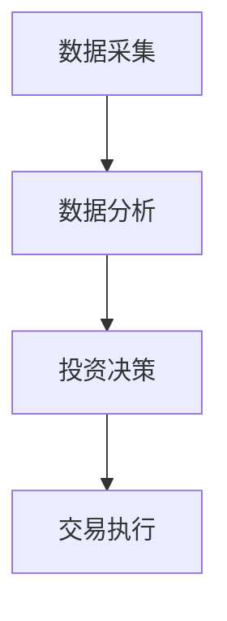

                 


# 如何利用特价股票策略进行逆向投资

> 关键词：逆向投资，特价股票，价值投资，市场周期，风险管理

> 摘要：本文将详细介绍如何利用特价股票策略进行逆向投资，从理论基础到实际操作，涵盖市场周期分析、投资者心理、数学模型构建、系统架构设计以及实战案例等多方面内容，帮助读者全面理解并掌握逆向投资的策略与技巧。

---

## 第一部分: 特价股票策略与逆向投资概述

### 第1章: 特价股票策略与逆向投资概述

#### 1.1 逆向投资的基本概念

##### 1.1.1 逆向投资的定义
逆向投资是一种投资策略，强调在市场低迷或恐慌时买入被低估的资产，在市场繁荣或过度乐观时卖出。其核心思想是“买别人恐慌，卖别人贪婪”。

##### 1.1.2 特价股票策略的核心思想
特价股票策略关注市场中被低估的股票，通常通过市盈率（P/E）、市净率（P/B）等指标筛选出价格远低于其内在价值的股票。

##### 1.1.3 逆向投资与价值投资的区别
| 方面 | 逆向投资 | 价值投资 |
|------|----------|----------|
| 时间选择 | 市场恐慌时 | 公司价值被低估时 |
| 风险承受 | 高风险承受能力 | 中等风险承受能力 |
| 持股时间 | 长期持有 | 长期持有 |

#### 1.2 逆向投资的背景与现状

##### 1.2.1 特价股票策略的历史发展
逆向投资的起源可以追溯到格雷厄姆和多德的价值投资理论，强调安全边际和对公司内在价值的分析。

##### 1.2.2 当前市场环境下的逆向投资机会
近年来，市场波动加剧，逆向投资在市场低谷时提供了良好的机会。

##### 1.2.3 逆向投资在不同市场周期的表现
- **牛市**：逆向投资者通常表现不佳，因为市场情绪高涨，股价被高估。
- **熊市**：逆向投资者有机会以低价买入优质股票。

#### 1.3 逆向投资的核心要素

##### 1.3.1 市场情绪分析的重要性
市场情绪是逆向投资的重要指标，恐慌和贪婪情绪往往导致市场偏离理性定价。

##### 1.3.2 公司基本面分析的关键指标
- 市盈率（P/E）
- 市净率（P/B）
- 股息率

##### 1.3.3 投资组合的构建与优化
- 分散投资
- 定期再平衡

#### 1.4 逆向投资的风险与挑战

##### 1.4.1 市场波动对逆向投资的影响
市场波动可能导致短期亏损，需要投资者具备长期持有的耐心。

##### 1.4.2 信息不对称的问题
逆向投资者需要克服信息不对称，准确评估公司价值。

##### 1.4.3 逆向投资中的常见误区
- 过度自信
- 忽略风险管理

#### 1.5 本章小结
逆向投资是一种高风险高回报的投资策略，需要投资者具备扎实的市场分析能力和长期持有的耐心。

---

## 第二部分: 特价股票策略的理论基础

### 第2章: 市场周期与逆向投资策略

#### 2.1 市场周期分析

##### 2.1.1 市场周期的定义与阶段划分
市场周期通常分为四个阶段：
1. **复苏期**：市场逐渐复苏，股价开始上升。
2. **上升期**：市场繁荣，股价快速上涨。
3. **衰退期**：市场开始下跌，股价大幅波动。
4. **底部期**：市场底部，股价达到最低点。

##### 2.1.2 不同阶段下的投资策略
- **复苏期**：寻找基本面良好的股票。
- **上升期**：避免追高，寻找估值合理的股票。
- **衰退期**：逐步增加仓位，布局低估股票。
- **底部期**：积极买入，长期持有。

##### 2.1.3 市场周期与逆向投资的关系
逆向投资在市场底部期和衰退期更具优势，而在上升期和复苏期则应谨慎。

#### 2.2 投资者心理与逆向投资

##### 2.2.1 投资者心理的周期性变化
- **贪婪**：市场上涨时，投资者倾向于追高。
- **恐慌**：市场下跌时，投资者倾向于抛售。

##### 2.2.2 恐慌与贪婪对市场的影响
恐慌导致市场低估，贪婪导致市场高估。

##### 2.2.3 逆向投资如何利用市场情绪
- 在恐慌时买入，贪婪时卖出。

#### 2.3 经典逆向投资理论

##### 2.3.1 Graham-Dodd价值投资法
Graham-Dodd价值投资法强调买入低于内在价值的股票，并长期持有。

##### 2.3.2 技术分析中的逆向指标
- **相对强弱指数（RSI）**：RSI低于30时，市场可能处于超卖状态。
- **移动平均收敛散度（MACD）**：MACD在0轴下方时，市场可能处于下跌趋势。

##### 2.3.3 行为金融学对逆向投资的启示
行为金融学研究表明，投资者情绪受心理偏差影响，导致市场波动。

#### 2.4 逆向投资的数学模型

##### 2.4.1 市场情绪指数的构建
市场情绪指数可以通过以下步骤构建：
1. 收集市场数据（如股价、成交量）。
2. 计算情绪指标（如RSI、MACD）。
3. 综合指标形成市场情绪指数。

##### 2.4.2 价值评估模型的数学表达
$$ V = \frac{E}{P/E} $$
其中，\( V \) 表示内在价值，\( E \) 表示净利润，\( P/E \) 表示市盈率。

##### 2.4.3 市场周期的量化分析
通过时间序列分析，量化市场周期的波动。

#### 2.5 本章小结
逆向投资需要结合市场周期和投资者心理，利用数学模型和指标进行量化分析。

---

## 第三部分: 特价股票策略的实践操作

### 第3章: 特价股票的筛选与评估

#### 3.1 特价股票的筛选标准

##### 3.1.1 市盈率（P/E）分析
$$ P/E = \frac{\text{股价}}{\text{每股收益}} $$
选择P/E低于行业平均水平的股票。

##### 3.1.2 市净率（P/B）分析
$$ P/B = \frac{\text{股价}}{\text{每股净资产}} $$
选择P/B低于1的股票。

##### 3.1.3 股息率与股息支付率
$$ 股息率 = \frac{\text{每股股息}}{\text{股价}} $$
选择股息率较高的股票。

#### 3.2 特价股票的评估方法

##### 3.2.1 相对估值法
- 市盈率法
- 市净率法

##### 3.2.2 绝对估值法
- 现金流折现法
- 股权自由现金流模型

#### 3.3 特价股票的风险评估

##### 3.3.1 行业风险
选择行业前景良好的股票。

##### 3.3.2 公司财务状况
分析资产负债表、利润表和现金流量表。

##### 3.3.3 市场风险
分散投资，避免过度集中。

#### 3.4 本章小结
通过多指标综合评估，筛选出真正低估的股票。

---

## 第四部分: 逆向投资系统的构建与实现

### 第4章: 逆向投资系统的设计与实现

#### 4.1 逆向投资系统的整体架构

##### 4.1.1 系统功能模块
1. 数据采集模块
2. 数据分析模块
3. 投资决策模块
4. 交易执行模块

##### 4.1.2 系统架构图


#### 4.2 数据采集模块的实现

##### 4.2.1 数据源选择
- 股票市场数据（如Yahoo Finance）
- 经济指标数据（如GDP、CPI）

##### 4.2.2 数据预处理
- 数据清洗
- 数据转换

#### 4.3 数据分析模块的实现

##### 4.3.1 市场情绪分析
- 使用NLP技术分析市场新闻和社交媒体情绪。

##### 4.3.2 价值评估模型
- 使用回归分析预测股票价值。

#### 4.4 投资决策模块的实现

##### 4.4.1 决策规则
- 当市场情绪指数低于阈值时，买入股票。
- 当股票价格低于内在价值时，增加仓位。

#### 4.5 交易执行模块的实现

##### 4.5.1 自动化交易系统
- 使用量化交易平台（如Interactive Brokers）执行交易。

##### 4.5.2 交易策略优化
- 回测交易策略，优化参数。

#### 4.6 本章小结
构建一个完整的逆向投资系统，能够帮助投资者系统化地进行投资决策。

---

## 第五部分: 项目实战与经验分享

### 第5章: 逆向投资实战案例

#### 5.1 案例背景介绍
- 选择一个市场周期的低谷期。
- 筛选出一批低估股票。

#### 5.2 项目核心实现

##### 5.2.1 环境安装
- 安装Python和必要的库（如pandas、numpy、matplotlib）。

##### 5.2.2 核心代码实现
```python
import pandas as pd
import numpy as np

def calculate_value(ticker):
    # 获取股价数据
    price = get_price(ticker)
    # 获取净利润数据
    eps = get_eps(ticker)
    # 计算内在价值
    value = price / (eps * 0.8)
    return value

# 筛选股票
def screen_stocks(tickers):
    selected = []
    for ticker in tickers:
        if calculate_value(ticker) > price * 0.9:
            selected.append(ticker)
    return selected
```

##### 5.2.3 代码解读与分析
- `calculate_value`函数计算股票的内在价值。
- `screen_stocks`函数筛选出价值被低估的股票。

#### 5.3 实际案例分析
- 选择2022年市场低谷期的某公司股票。
- 计算其内在价值，判断是否低估。

#### 5.4 本章小结
通过实战案例，验证逆向投资策略的有效性。

---

## 第六部分: 总结与展望

### 第6章: 总结与展望

#### 6.1 本章总结
逆向投资是一种有效的投资策略，通过市场周期分析和价值评估模型，能够在市场低谷时发现机会。

#### 6.2 未来展望
随着人工智能和大数据技术的发展，逆向投资将更加系统化和自动化。

#### 6.3 最佳实践 tips
- 保持耐心，长期持有。
- 定期审视投资组合，调整持仓。
- 重视风险管理，避免过度杠杆。

#### 6.4 注意事项
- 避免盲目跟风。
- 确保数据来源可靠。
- 保持对市场的持续学习和研究。

#### 6.5 拓展阅读
推荐书籍：
- 《证券分析》——本杰明·格雷厄姆
- 《投资学》——彼得·林奇

---

## 作者信息

作者：AI天才研究院/AI Genius Institute & 禅与计算机程序设计艺术/Zen And The Art of Computer Programming

---

希望这篇文章能为您提供有价值的见解和实践指导！

