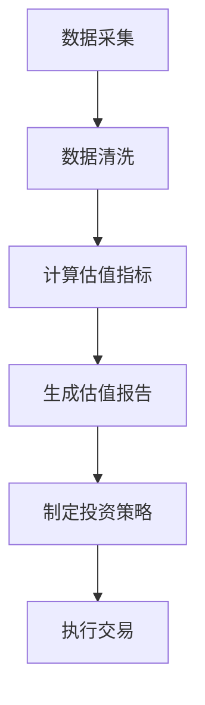

                 


# 如何利用特价股票策略进行逆向数字产业生态投资

## 关键词：特价股票策略，逆向投资，数字产业生态，股票估值，投资策略

## 摘要：  
本文详细探讨了如何利用特价股票策略进行逆向投资，特别是在数字产业生态中的应用。通过分析数字产业生态的结构和关键领域，结合特价股票策略的数学模型和算法原理，提供了一套系统化的投资方法。文章还通过实际案例分析和项目实战，展示了如何在数字产业中找到被低估的投资机会，并通过逆向投资实现长期收益。

---

## 第一部分: 特价股票策略与逆向投资基础

### 第1章: 特价股票策略与逆向投资概述

#### 1.1 特价股票策略的定义与特点
##### 1.1.1 特价股票的定义
特价股票指的是那些市场价格低于其内在价值的股票。通常，这些股票可能因为市场波动、行业低迷或公司短期问题而被低估。

##### 1.1.2 逆向投资的基本概念
逆向投资是一种投资策略，即在市场恐慌或低迷时买入，而在市场繁荣时卖出。这种方法利用市场的非理性行为，寻找被低估的投资机会。

##### 1.1.3 数字产业生态的背景与现状
数字产业生态涵盖互联网、人工智能、大数据等领域。随着技术的进步，这些领域成为经济增长的重要驱动力。然而，市场波动和竞争加剧使得部分优质公司股票被低估，为逆向投资提供了机会。

#### 1.2 数字产业生态的核心领域
数字产业生态包括互联网、人工智能、大数据、云计算等领域。每个领域都有其独特的市场动态和投资机会。例如，互联网行业的龙头公司可能因市场调整而股价被低估，这为逆向投资者提供了机会。

---

### 第2章: 特价股票策略的数学模型与算法原理

#### 2.1 特价股票筛选的数学模型
##### 2.1.1 市盈率（P/E）计算公式
市盈率 = 股价 / 每股净利润（ earnings per share, EPS）  
$$ P/E = \frac{Price}{EPS} $$

##### 2.1.2 市净率（P/B）计算公式
市净率 = 股价 / 每股净资产（ book value per share, BVPS）  
$$ P/B = \frac{Price}{BVPS} $$

##### 2.1.3 股息率计算公式
股息率 = 每股股息（ dividends per share, DPS） / 股价  
$$ Dividend\ Yield = \frac{DPS}{Price} $$

#### 2.2 逆向投资的算法流程
##### 2.2.1 数据采集与清洗
- 从多个数据源收集股票数据，包括历史价格、财务报表等。
- 清洗数据，去除缺失或异常值。

##### 2.2.2 股票估值模型构建
- 使用市盈率、市净率等指标进行估值。
- 构建多因子模型，综合考虑多个指标。

##### 2.2.3 投资决策逻辑
- 当股票价格低于估值时，考虑买入。
- 当股票价格高于估值时，考虑卖出。

#### 2.3 mermaid 流程图展示


---

## 第二部分: 数字产业生态的系统分析

### 第3章: 数字产业生态的系统分析

#### 3.1 数字产业生态的领域模型
##### 3.1.1 互联网行业
互联网行业的公司可能因市场波动而被低估，例如某些龙头企业的股价可能因行业调整而下跌。

##### 3.1.2 人工智能行业
人工智能行业具有高增长潜力，但部分公司因研发投入大而暂时亏损，股价可能被低估。

##### 3.1.3 大数据行业
大数据行业受政策影响较大，部分公司可能因政策调整而导致股价下跌，但其长期前景看好。

#### 3.2 数字产业生态的架构设计
##### 3.2.1 产业链分析
数字产业生态由上游技术供应商、中游平台运营商和下游应用企业组成。逆向投资者需分析整个产业链的估值情况。

##### 3.2.2 核心企业识别
识别产业链中的核心企业，分析其财务状况和市场地位，判断其股价是否被低估。

##### 3.2.3 生态系统图谱
构建数字产业生态的图谱，识别各领域的龙头企业，并分析其估值情况。

---

### 第4章: 特价股票策略的系统实现

#### 4.1 系统功能设计
##### 4.1.1 数据采集模块
- 从多个数据源采集股票数据。
- 数据清洗和预处理。

##### 4.1.2 估值计算模块
- 计算市盈率、市净率等指标。
- 生成估值报告。

##### 4.1.3 投资决策模块
- 根据估值报告制定投资策略。
- 执行交易指令。

#### 4.2 系统架构设计
##### 4.2.1 分层架构
- 数据层：存储股票数据。
- 业务层：处理数据和计算估值。
- 表示层：展示结果。

##### 4.2.2 模块化设计
- 每个模块独立开发，便于维护和扩展。

##### 4.2.3 接口设计
- 定义清晰的接口，方便模块间通信。

---

## 第三部分: 项目实战与案例分析

### 第5章: 项目实战与案例分析

#### 5.1 实战环境搭建
##### 5.1.1 数据源选择
- 使用Yahoo Finance等数据源。

##### 5.1.2 工具安装
- 安装Python和相关库（如Pandas、NumPy）。

##### 5.1.3 系统配置
- 配置数据源和接口。

#### 5.2 核心代码实现
##### 5.2.1 数据清洗代码
```python
import pandas as pd

# 读取数据
df = pd.read_csv('stock_data.csv')

# 删除缺失值
df = df.dropna()

# 去除异常值
df = df[ df['price'] < df['price'].quantile(0.99) ]
```

##### 5.2.2 估值模型实现
```python
def calculate_pe(df):
    df['pe'] = df['price'] / df['eps']
    return df

df = calculate_pe(df)
```

##### 5.2.3 投资决策逻辑
```python
def generate_strategy(df):
    df['signal'] = 0
    df.loc[df['pe'] < df['pe'].mean(), 'signal'] = 1
    return df

df = generate_strategy(df)
```

### 第6章: 案例分析

#### 6.1 案例背景
以某互联网公司为例，分析其股价波动和估值情况。

#### 6.2 数据分析
- 计算市盈率和市净率。
- 对比行业平均值，判断是否低估。

#### 6.3 投资决策
- 当市盈率低于行业平均时，建议买入。
- 当市盈率高于行业平均时，建议卖出。

---

## 第四部分: 总结与展望

### 第7章: 总结与展望

#### 7.1 全文总结
本文详细探讨了如何利用特价股票策略进行逆向投资，特别是在数字产业生态中的应用。通过数学模型和算法原理，提供了系统化的投资方法。

#### 7.2 未来展望
未来，随着技术的进步，数字产业生态将更加复杂。投资者需要不断优化模型，适应市场变化。

---

## 附录

### 附录A: 相关工具与资源

#### 1. 数据源
- Yahoo Finance
- Google Finance

#### 2. 工具
- Python
- Pandas
- NumPy

---

作者：AI天才研究院 & 禅与计算机程序设计艺术

