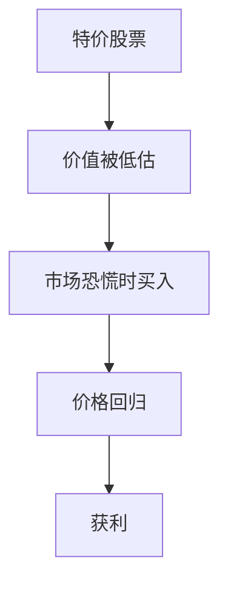
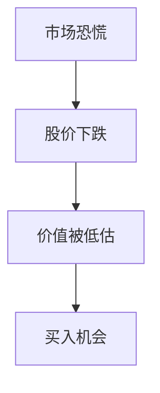

                 


# 如何利用特价股票策略进行逆向数字产业链投资

> 关键词：特价股票策略，逆向投资，数字产业链，股票投资，数据分析

> 摘要：本文深入探讨了如何利用特价股票策略进行逆向数字产业链投资，通过分析数字产业链的结构和关键指标，结合算法原理和系统设计，提供了一套完整的投资策略和实战案例。

---

## 第一部分: 特价股票策略与逆向投资基础

### 第1章: 特价股票策略与逆向投资概述

#### 1.1 特价股票策略的定义与特点

##### 1.1.1 特价股票的定义
特价股票是指市场中被低估的股票，通常价格远低于其内在价值。这些股票可能因为市场情绪、短期波动或其他外部因素被市场忽视或低估。

##### 1.1.2 特价股票策略的核心特点
- **价值发现**：寻找被市场低估的股票，挖掘其潜在价值。
- **逆向思维**：在市场低迷时买入，利用价格回归原理获利。
- **长期视角**：注重基本面分析，关注公司的长期发展潜力。

##### 1.1.3 逆向投资的基本概念
逆向投资是一种投资策略，强调在市场恐慌时买入，在市场狂热时卖出。其核心是寻找市场非理性行为下的价值机会。



#### 1.2 数字产业链的定义与特点

##### 1.2.1 数字产业链的构成
数字产业链包括从上游技术提供商到下游应用企业的整个价值链，涵盖硬件、软件、服务等多个环节。

##### 1.2.2 数字产业链的核心环节
- **技术开发**：包括芯片制造、云计算等。
- **数据处理**：数据收集、存储和分析。
- **应用场景**：如电子商务、金融科技等。

##### 1.2.3 数字产业链的投资机会
数字技术的快速发展为投资者提供了丰富的投资机会，特别是在人工智能、大数据等领域。

---

### 第2章: 特价股票策略的原理与逻辑

#### 2.1 特价股票策略的原理

##### 2.1.1 市场情绪与股价波动
市场情绪波动会影响股价，当市场恐慌时，优质股票可能被错杀，形成特价股票。

##### 2.1.2 价值发现与价格回归
通过基本面分析，发现股票的真实价值，等待价格回归。

##### 2.1.3 逆向投资的核心逻辑
逆向投资的核心是利用市场的非理性行为，寻找价值洼地。



#### 2.2 数字产业链的逆向投资逻辑

##### 2.2.1 产业链上下游分析
分析数字产业链的上下游关系，寻找被低估的环节。

##### 2.2.2 逆向投资的产业链切入点
关注产业链中被市场忽视但具有潜在价值的企业。

##### 2.2.3 数字产业链中的价值洼地
在数字产业链中，某些环节可能因为市场波动被低估，成为逆向投资的机会。

---

### 第3章: 数字产业链的关键指标与分析方法

#### 3.1 数字产业链的关键指标

##### 3.1.1 市盈率（P/E）
市盈率 = 股价 / 每股净利润。

##### 3.1.2 市净率（P/B）
市净率 = 股价 / 每股净资产。

##### 3.1.3 股息率（Dividend Yield）
股息率 = 每股股息 / 股价。

#### 3.2 数字产业链的分析方法

##### 3.2.1 财务数据分析
分析公司的盈利能力、成长性和财务健康状况。

##### 3.2.2 行业趋势分析
关注行业发展趋势和技术变革对公司的影响。

##### 3.2.3 竞争优势分析
评估公司在行业中的竞争优势和市场地位。

---

### 第4章: 特价股票策略的算法与数学模型

#### 4.1 特价股票筛选算法

##### 4.1.1 数据收集
从股票数据库中收集相关数据，包括股价、市盈率、市净率等。

##### 4.1.2 数据处理
对数据进行清洗和预处理，计算关键指标。

##### 4.1.3 筛选策略
根据设定的指标，筛选出符合条件的特价股票。

```python
import pandas as pd
import numpy as np

# 假设df是股票数据，包含'PE'和'PB'列
df['PE'] = df['PE'].fillna(0)
df['PB'] = df['PB'].fillna(0)

# 筛选PE < 15且PB < 2的股票
cheap_stocks = df[(df['PE'] < 15) & (df['PB'] < 2)]
```

---

## 第五部分: 项目实战与总结

### 第5章: 数字产业链投资实战

#### 5.1 环境安装
安装必要的Python库，如pandas、numpy、matplotlib。

#### 5.2 核心实现
编写代码实现数据收集、处理和分析。

```python
import pandas as pd
import matplotlib.pyplot as plt

# 数据收集
df = pd.read_csv('stock_data.csv')

# 数据处理
df['PE'] = df['Earnings'] / df['Price']
df['PB'] = df['Book Value'] / df['Price']

# 可视化
plt.scatter(df['PE'], df['PB'], c='blue')
plt.xlabel('PE')
plt.ylabel('PB')
plt.title('PE vs PB Scatter Plot')
plt.show()
```

#### 5.3 案例分析
分析具体行业的特价股票，构建投资组合。

#### 5.4 监控与调整
定期监控投资组合的表现，根据市场变化进行调整。

### 第6章: 最佳实践与总结

#### 6.1 投资策略注意事项
- **风险控制**：设定止损点，避免重大损失。
- **分散投资**：不要将所有资金投入单一股票或行业。

#### 6.2 小结
通过特价股票策略和逆向投资，可以在数字产业链中找到优质的投资机会。

#### 6.3 注意事项
- 保持对市场的敏感性，及时调整策略。
- 定期回顾投资组合，评估表现。

#### 6.4 拓展阅读
推荐进一步学习股票分析的书籍和工具。

---

## 作者信息

作者：AI天才研究院/AI Genius Institute & 禅与计算机程序设计艺术 /Zen And The Art of Computer Programming

---

这篇文章通过系统的分析和实战案例，详细介绍了如何利用特价股票策略进行逆向数字产业链投资。从理论到实践，从分析到代码实现，为读者提供了一套完整的投资策略和方法。

