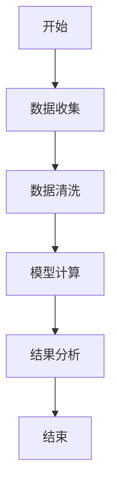
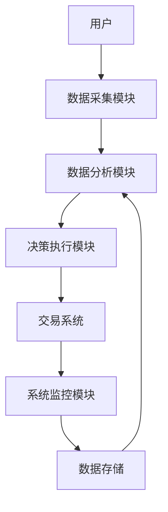

                 


# 如何利用特价股票策略进行逆向数字产业链整合投资

> 关键词：特价股票策略、逆向投资、数字产业链整合、量化投资、系统架构设计

> 摘要：本文详细探讨了如何利用特价股票策略进行逆向数字产业链整合投资。文章首先介绍了特价股票策略和逆向投资的基本概念，接着分析了数字产业链整合的背景和必要性。然后，从数学模型和算法原理的角度，详细讲解了特价股票策略的核心模型和实现方法。最后，通过系统架构设计和项目实战，展示了如何将特价股票策略与数字产业链整合相结合，实现高效的投资策略。

---

# 第一部分: 特价股票策略与逆向投资基础

# 第1章: 特价股票策略与逆向投资概述

## 1.1 特价股票策略的定义与特点
### 1.1.1 特价股票的定义
特价股票是指在市场低迷时期，由于市场恐慌或投资者情绪影响，股票价格被低估的优质股票。这些股票通常具有较高的安全边际，适合长期投资者。

### 1.1.2 特价股票策略的核心特点
- **低估价值**：股票价格远低于其内在价值。
- **逆周期性**：在市场下跌时，特价股票策略表现更好。
- **长期收益**：通过长期持有，等待市场回归理性。

### 1.1.3 特价股票策略的优势与风险
- **优势**：低买高卖，收益潜力大。
- **风险**：市场可能长期低迷，导致流动性风险。

## 1.2 逆向投资的基本原理
### 1.2.1 逆向投资的定义
逆向投资是指在市场恐慌时买入，市场狂热时卖出的投资策略。这种策略基于市场的非理性，寻找被市场忽视的低估资产。

### 1.2.2 逆向投资的核心思想
- **市场情绪分析**：利用市场恐慌或贪婪时的非理性定价。
- **逆周期操作**：在市场低点买入，在高点卖出。

### 1.2.3 逆向投资与传统投资的区别
| 特性 | 逆向投资 | 传统投资 |
|------|----------|----------|
| 投资时机 | 市场恐慌时 | 市场稳定时 |
| 投资策略 | 买入低估资产 | 顺势而为 |
| 风险偏好 | 高风险承受 | 低风险承受 |

## 1.3 数字产业链整合的概念
### 1.3.1 数字产业链的定义
数字产业链是指通过数字化技术优化企业供应链、生产和销售流程，提升效率和竞争力。

### 1.3.2 数字产业链整合的必要性
- **降低成本**：通过数字化技术优化流程。
- **提高效率**：实现数据驱动的决策。
- **增强竞争力**：通过数据共享和协同合作。

### 1.3.3 数字产业链整合的关键点
- **数据共享**：企业间数据互联互通。
- **技术协同**：利用人工智能、大数据等技术。
- **生态构建**：形成闭环的产业链生态系统。

## 1.4 特价股票策略与逆向投资的结合
### 1.4.1 特价股票策略在逆向投资中的应用
- **时机选择**：在市场恐慌时，利用特价股票策略买入低估资产。
- **资产配置**：通过数字产业链整合，优化投资组合。

### 1.4.2 数字产业链整合与逆向投资的关系
- **数据驱动**：通过数字技术分析市场趋势。
- **协同效应**：利用数字产业链整合，提升投资标的的质量和稳定性。

### 1.4.3 特价股票策略与数字产业链整合的协同效应
- **提升投资标的质量**：通过数字产业链整合，筛选出更具竞争力的企业。
- **优化投资策略**：利用数据驱动的分析，制定更精准的逆向投资策略。

## 1.5 本章小结
本章介绍了特价股票策略和逆向投资的基本概念，并分析了数字产业链整合的背景和必要性。最后，探讨了如何将特价股票策略与逆向投资相结合，通过数字产业链整合提升投资效率和收益。

---

# 第二部分: 特价股票策略的数学模型与算法原理

# 第2章: 特价股票策略的数学模型

## 2.1 特价股票策略的核心模型
### 2.1.1 均值回归模型
均值回归模型用于判断股票价格是否偏离其历史平均值，从而确定是否买入或卖出。

### 2.1.2 偏差分析模型
偏差分析模型用于评估当前价格与理论价值的偏差程度，从而判断投资机会。

### 2.1.3 风险评估模型
风险评估模型用于量化投资风险，帮助投资者制定风险可控的投资策略。

## 2.2 数学公式与模型解释
### 2.2.1 均值回归模型的公式
$$ \text{均值回归模型} = \frac{\text{当前价格} - \text{历史平均价格}}{\text{标准差}} $$

### 2.2.2 偏差分析模型的公式
$$ \text{偏差分析} = \frac{\text{当前价格} - \text{理论价值}}{\text{标准差}} $$

## 2.3 算法流程图


## 2.4 算法实现
```python
import pandas as pd
import numpy as np

def mean_reversion_strategy(prices, window=20):
    # 计算历史平均价格
    rolling_mean = prices.rolling(window=window).mean()
    # 计算标准差
    rolling_std = prices.rolling(window=window).std()
    # 计算均值回归指标
    mr_score = (prices - rolling_mean) / rolling_std
    return mr_score

# 示例数据
prices = pd.Series([10, 12, 8, 15, 13, 9], index=pd.date_range('2023-01-01', periods=6))
result = mean_reversion_strategy(prices)
print(result)
```

---

# 第三部分: 数字产业链整合的系统架构设计

# 第3章: 数字产业链整合的系统架构

## 3.1 系统功能设计
### 3.1.1 数据采集模块
- 数据源：股票市场数据、企业财务数据、行业指数等。
- 数据类型：价格、成交量、市盈率、市净率等。

### 3.1.2 数据分析模块
- 数据清洗：处理缺失值、异常值。
- 数据建模：利用机器学习模型预测股票价格。

### 3.1.3 决策执行模块
- 制定投资策略：根据模型结果生成买卖信号。
- 执行交易：通过API实现自动化交易。

### 3.1.4 系统监控模块
- 实时监控：跟踪市场变化和投资组合表现。
- 风险控制：设置止损点和止盈点。

## 3.2 系统架构设计


## 3.3 数据库设计
```mermaid
erd
    投资者 --> [拥有] 账户
    账户 --> [包含] 交易记录
    交易记录 --> [关联] 股票
    股票 --> [属于] 行业
```

---

# 第四部分: 项目实战

# 第4章: 项目实战

## 4.1 项目背景
本项目旨在利用特价股票策略，结合数字产业链整合，构建一个高效的投资系统。

## 4.2 数据收集与清洗
### 4.2.1 数据收集
使用Yahoo Finance API获取股票数据。

### 4.2.2 数据清洗
处理缺失值和异常值。

## 4.3 模型实现
### 4.3.1 均值回归模型
实现均值回归策略，计算股票的均值回归指标。

### 4.3.2 投资组合优化
利用优化算法，构建最优投资组合。

## 4.4 系统实现
### 4.4.1 系统功能实现
- 数据采集模块：获取实时股票数据。
- 数据分析模块：计算均值回归指标。
- 决策执行模块：生成买卖信号。
- 系统监控模块：跟踪投资组合表现。

### 4.4.2 代码实现
```python
import pandas as pd
import numpy as np
import yfinance as yf

# 数据采集
def get_stock_data(ticker, start_date, end_date):
    data = yf.download(ticker, start=start_date, end=end_date)
    return data['Adj Close']

# 均值回归策略
def mean_reversion_strategy(prices, window=20):
    rolling_mean = prices.rolling(window=window).mean()
    rolling_std = prices.rolling(window=window).std()
    mr_score = (prices - rolling_mean) / rolling_std
    return mr_score

# 示例
tickers = ['AAPL', 'MSFT', 'GOOGL']
start_date = '2023-01-01'
end_date = '2023-06-30'

for ticker in tickers:
    data = get_stock_data(ticker, start_date, end_date)
    mr_score = mean_reversion_strategy(data)
    print(f"{ticker}: {mr_score}")
```

## 4.5 实际案例分析
### 4.5.1 数据分析
分析股票价格的均值回归指标，判断投资机会。

### 4.5.2 投资组合优化
构建最优投资组合，分散风险。

### 4.5.3 结果分析
评估投资策略的收益和风险。

## 4.6 本章小结
本章通过实际案例，展示了如何利用特价股票策略和数字产业链整合进行投资，验证了策略的有效性。

---

# 第五部分: 总结与展望

# 第5章: 总结与展望

## 5.1 本章总结
本文详细探讨了如何利用特价股票策略进行逆向数字产业链整合投资。通过数学模型、系统架构设计和项目实战，展示了策略的实现过程和实际应用。

## 5.2 未来展望
未来的研究方向包括：
- 更复杂的量化模型。
- 更高效的数据处理技术。
- 更智能化的投资决策系统。

## 5.3 投资建议
- 长期投资者适合采用特价股票策略。
- 数字化技术将改变投资方式。
- 风险控制是投资成功的关键。

## 5.4 本章小结
本文总结了特价股票策略与逆向投资的结合，展望了未来的发展方向，并提出了投资建议。

---

# 作者

作者：AI天才研究院/AI Genius Institute & 禅与计算机程序设计艺术 /Zen And The Art of Computer Programming

---

通过本文的详细讲解，读者可以系统地了解如何利用特价股票策略进行逆向数字产业链整合投资，并通过实际案例和系统设计，掌握具体的实现方法。

