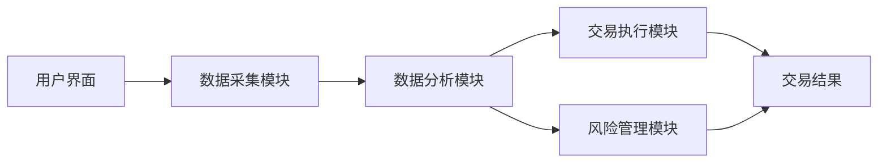

                 


# 如何利用特价股票策略进行逆周期资产配置

> 关键词：特价股票策略、逆周期资产配置、股票投资、风险管理、价值投资、技术分析

> 摘要：本文详细探讨了如何利用特价股票策略在逆周期环境下进行资产配置。通过分析特价股票的定义、特点以及逆周期资产配置的背景与意义，结合数学模型、系统架构和实际案例，为读者提供了一套完整的策略实施框架，帮助投资者在市场波动中抓住投资机会，实现稳健收益。

---

## 第一部分: 特价股票策略与逆周期资产配置概述

### 第1章: 特价股票策略的基本概念

#### 1.1 特价股票的定义与特点
##### 1.1.1 特价股票的定义
特价股票是指那些价格低于其内在价值的股票。通常，这些股票可能因为市场波动、行业周期或公司特定因素而被低估。投资者通过识别这些股票，可以在市场复苏时获得超额收益。

##### 1.1.2 特价股票的特点
- **低估值**：市盈率（P/E）或市净率（P/B）低于行业平均水平。
- **高分红**：部分特价股票公司会回馈股东，提供稳定的股息收入。
- **行业周期性**：通常出现在行业低谷期，随着周期回升而反弹。

##### 1.1.3 特价股票与普通股票的区别
| 属性         | 特价股票                     | 普通股票                     |
|--------------|------------------------------|------------------------------|
| 估值         | 低于内在价值                 | 接近或高于内在价值             |
| 风险         | 较高（市场波动大）             | 较低                         |
| 收益潜力     | 高（周期性回升）               | 中等                         |
| 适用场景     | 逆周期投资                   | 长期持有或趋势投资             |

#### 1.2 逆周期资产配置的背景与意义
##### 1.2.1 逆周期资产配置的定义
逆周期资产配置是指在经济周期的低谷期（逆周期）调整资产组合，以应对市场下跌风险并抓住潜在的反弹机会。

##### 1.2.2 逆周期资产配置的背景
- 经济周期波动：市场会经历复苏、繁荣、衰退和萧条阶段。
- 投资者行为：恐慌性抛售导致市场低估，提供低价买入机会。

##### 1.2.3 逆周期资产配置的意义
- **风险控制**：通过降低波动性资产的比例，减少回撤。
- **收益增强**：在市场低谷时买入，市场回升时卖出，实现超额收益。

---

### 第2章: 特价股票策略的核心原理

#### 2.1 特价股票策略的理论基础
##### 2.1.1 市场周期理论
市场周期包括复苏、繁荣、衰退和萧条四个阶段。在萧条阶段，市场低估，适合买入特价股票。

##### 2.1.2 价值投资理论
价值投资强调购买低于内在价值的股票，等待市场重新评估其价值。

##### 2.1.3 技术分析理论
通过技术指标（如RSI、MACD）识别超卖信号，判断买入时机。

#### 2.2 特价股票策略的核心要素
##### 2.2.1 市场波动性
市场波动为特价股票策略提供了买卖机会。

##### 2.2.2 股票估值
准确的估值是判断是否为特价股票的关键。

##### 2.2.3 风险控制
通过止损和分散投资降低风险。

---

## 第二部分: 特价股票策略的实施与分析

### 第3章: 特价股票策略的实施步骤

#### 3.1 确定投资目标
##### 3.1.1 投资目标的设定
- 短期目标：抓住市场反弹机会。
- 长期目标：构建稳健的资产组合。

#### 3.2 选择合适的股票
##### 3.2.1 股票筛选标准
- 低市盈率（P/E）和低市净率（P/B）。
- 高股息率。

##### 3.2.2 股票估值方法
- 市盈率（P/E）= 股价 / 每股净利润。
- 市净率（P/B）= 股价 / 每股净资产。

#### 3.3 制定交易计划
##### 3.3.1 入场时机的选择
- 技术指标显示超卖信号。
- 市场情绪恐慌时。

##### 3.3.2 仓位管理策略
- 分批买入，分散风险。

##### 3.3.3 止损与止盈机制
- 止损：设置最大亏损比例（如10%）。
- 止盈：设定目标收益比例（如20%）。

---

### 第4章: 特价股票策略的数学模型与公式

#### 4.1 股票估值模型
##### 4.1.1 市盈率（P/E）模型
$$ P/E = \frac{\text{股价}}{\text{每股净利润}} $$

##### 4.1.2 市净率（P/B）模型
$$ P/B = \frac{\text{股价}}{\text{每股净资产}} $$

#### 4.2 股票风险评估
##### 4.2.1 风险调整后的收益（RAR）
$$ RAR = \frac{\text{预期收益 - 无风险利率}}{\text{标准差}} $$

---

### 第5章: 特价股票策略的系统架构

#### 5.1 系统功能设计
##### 5.1.1 数据采集模块
- 采集股票价格、财务数据。

##### 5.1.2 数据分析模块
- 使用技术指标（如RSI、MACD）和估值模型筛选特价股票。

##### 5.1.3 交易执行模块
- 根据策略生成买卖指令。

#### 5.2 系统架构设计


---

### 第6章: 特价股票策略的项目实战

#### 6.1 环境安装
- 数据源：Yahoo Finance API。
- 工具：Python（Pandas、Matplotlib）。

#### 6.2 核心代码实现
```python
import pandas as pd
import matplotlib.pyplot as plt

# 数据采集
df = pd.read_csv('stock_data.csv')

# 计算市盈率
df['P/E'] = df['股价'] / df['每股净利润']

# 筛选特价股票
low_pe_stocks = df[df['P/E'] < df['P/E'].mean()]

# 可视化
low_pe_stocks[['股价', 'P/E']].plot(kind='scatter', x='股价', y='P/E')
plt.show()
```

#### 6.3 案例分析
- 选取某行业低估股票，分析其在市场回升中的表现。

---

### 第7章: 最佳实践与总结

#### 7.1 投资策略小结
- 逆周期投资需结合市场周期和个股估值。
- 分散投资，降低风险。

#### 7.2 注意事项
- 避免情绪化投资。
- 定期调整投资组合。

#### 7.3 拓展阅读
- 建议阅读《价值 investing》和《投资学原理》。

---

## 作者：AI天才研究院 & 禅与计算机程序设计艺术

---

通过以上详细的内容结构，本文系统地介绍了如何利用特价股票策略进行逆周期资产配置，从理论到实践，帮助投资者在市场波动中制定有效的投资策略。

