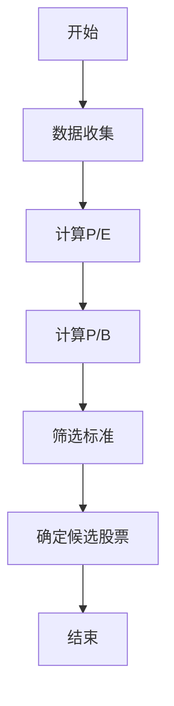

                 


```markdown
# 如何利用特价股票策略进行长期财富积累

> 关键词：特价股票策略、长期财富积累、股票投资、股票筛选、风险管理

> 摘要：本文详细探讨了如何利用特价股票策略进行长期财富积累。通过分析特价股票的定义、分类、特点以及与其他投资策略的区别，结合数学模型和算法，介绍了如何筛选和评估特价股票。同时，通过系统设计、项目实战和最佳实践，提供了从理论到实践的完整指导，帮助读者掌握特价股票策略的核心原理和实际应用。

---

## 第1章: 特价股票策略的背景与基础

### 1.1 特价股票的定义与特点
#### 1.1.1 什么是特价股票
特价股票是指价格相对较低的股票，通常具有较高的增长潜力。这类股票可能来自小型公司或处于困境中的公司，但具备长期增值的潜力。

#### 1.1.2 特价股票的分类
特价股票可以根据市场资本化、行业、地理位置等因素进行分类，常见的分类包括小盘股、中盘股和大盘股。

#### 1.1.3 特价股票与普通股票的区别
通过对比表格和ER图，详细说明特价股票与普通股票在价格、市值、风险和收益等方面的差异。

### 1.2 特价股票市场的基本分析
#### 1.2.1 特价股票市场的构成
分析特价股票市场的构成，包括主要参与者、交易机制和市场波动。

#### 1.2.2 特价股票市场的波动性分析
探讨特价股票市场的波动性，包括短期波动和长期趋势的影响因素。

#### 1.2.3 特价股票市场的风险与机会
评估特价股票市场的风险，包括市场波动、公司基本面变化等，并分析潜在的投资机会。

### 1.3 特价股票策略的核心概念
#### 1.3.1 特价股票策略的定义
明确特价股票策略的定义，即通过筛选和投资特价股票来实现长期财富积累的方法。

#### 1.3.2 特价股票策略的目标
介绍策略的主要目标，如实现资本增值、分散投资风险等。

#### 1.3.3 特价股票策略的实施步骤
详细说明策略实施的步骤，包括市场分析、股票筛选、投资组合构建等。

### 1.4 特价股票策略与长期财富积累的关系
#### 1.4.1 长期投资与财富积累
探讨长期投资在财富积累中的重要性，强调耐心和持续性。

#### 1.4.2 特价股票策略在财富积累中的作用
分析特价股票策略如何帮助投资者实现资产增值，包括捕捉低价股票的上涨潜力。

#### 1.4.3 特价股票策略的长期性与稳定性
讨论策略的长期性和稳定性，强调在市场波动中的应对策略。

---

## 第2章: 特价股票筛选的数学模型

### 2.1 特价股票筛选的基本原理
#### 2.1.1 特价股票筛选的逻辑
介绍筛选逻辑，包括基本面和技术面分析的结合。

#### 2.1.2 特价股票筛选的数学模型
详细讲解筛选模型，包括市盈率（P/E）、市净率（P/B）等指标。

#### 2.1.3 特价股票筛选的算法流程
通过mermaid流程图展示筛选流程，包括数据收集、筛选标准、结果评估等步骤。

### 2.2 特价股票筛选的数学公式
#### 2.2.1 市盈率（P/E）公式
$$ P/E = \frac{股票价格}{每股收益} $$

#### 2.2.2 市净率（P/B）公式
$$ P/B = \frac{股票价格}{每股净资产} $$

#### 2.2.3 市盈率与市净率的对比分析
通过对比分析，说明如何选择合适的筛选指标。

### 2.3 特价股票筛选的流程图


---

## 第3章: 特价股票策略的系统设计

### 3.1 系统功能设计
#### 3.1.1 系统功能模块
包括数据采集模块、筛选模块、分析模块和报告生成模块。

#### 3.1.2 功能模块的实现逻辑
详细说明每个模块的功能实现，包括数据来源、处理方法和输出结果。

### 3.2 系统架构设计
#### 3.2.1 系统架构图
使用mermaid绘制系统架构图，展示各模块之间的关系和数据流。

#### 3.2.2 系统组件的交互流程
通过序列图展示系统组件的交互流程，包括数据请求、处理和反馈。

### 3.3 系统接口设计
#### 3.3.1 接口定义
包括API接口的定义，如数据接口、筛选接口等。

#### 3.3.2 接口实现
详细说明接口的实现方式，包括输入输出格式和错误处理机制。

---

## 第4章: 特价股票策略的项目实战

### 4.1 环境安装
#### 4.1.1 系统要求
列出运行系统所需的环境要求，包括操作系统、编程语言和相关库。

#### 4.1.2 工具安装
指导读者安装必要的工具，如Python、数据处理库等。

### 4.2 系统核心实现
#### 4.2.1 数据采集模块
提供Python代码示例，展示如何从数据源获取股票数据。

#### 4.2.2 筛选模块
编写代码实现特价股票的筛选逻辑，包括P/E和P/B指标的计算。

#### 4.2.3 分析模块
展示如何对筛选出的股票进行进一步分析，如趋势分析和风险评估。

### 4.3 案例分析
#### 4.3.1 案例背景
介绍一个具体的投资案例，包括选择的股票、筛选标准和投资策略。

#### 4.3.2 投资结果
分析投资结果，包括收益、风险和经验教训。

---

## 第5章: 特价股票策略的最佳实践

### 5.1 成功经验总结
#### 5.1.1 策略的有效性
总结特价股票策略的有效性，包括成功的案例和经验。

#### 5.1.2 风险管理的重要性
强调风险管理在策略实施中的重要性，包括止损机制和资产分配。

### 5.2 小结
回顾全文，总结关键点和主要结论。

### 5.3 注意事项
提醒读者在实施策略时需要注意的事项，如市场风险、数据准确性等。

### 5.4 拓展阅读
推荐相关书籍和资源，帮助读者进一步深入学习。

---

## 作者：AI天才研究院/AI Genius Institute & 禅与计算机程序设计艺术 /Zen And The Art of Computer Programming
```

---

### 总结
这篇文章详细探讨了如何利用特价股票策略进行长期财富积累，从背景介绍到系统设计，再到项目实战和最佳实践，提供了全面的指导。通过清晰的结构和详细的内容，帮助读者掌握特价股票策略的核心原理和实际应用。

