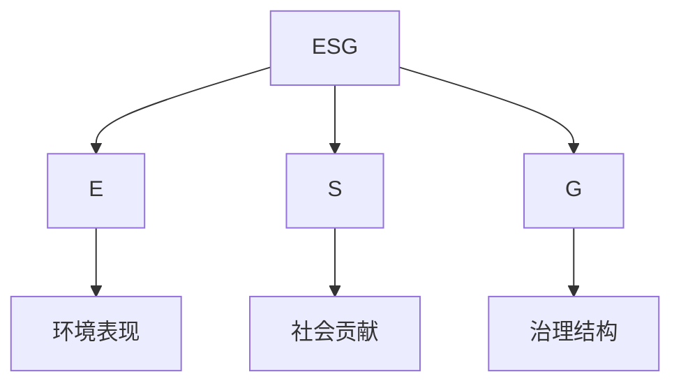
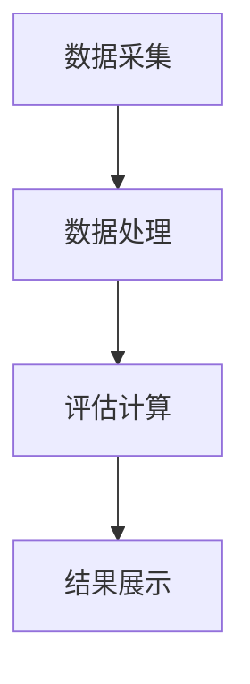

                 


# 如何在估值中考虑企业的社会责任投资

## 关键词：企业估值，社会责任投资，ESG，环境、社会和治理（E、S、G），可持续发展

## 摘要：随着全球对企业社会责任的关注度不断提高，企业在估值过程中需要考虑社会责任投资（ESG）因素。本文详细探讨了如何将环境、社会和治理因素整合到企业估值模型中，分析了社会责任投资对企业发展和价值的影响，并通过案例分析展示了具体的应用方法。

---

# 第1章 企业社会责任投资的背景与意义

## 1.1 企业社会责任投资的背景

### 1.1.1 社会责任投资的定义与内涵
社会责任投资（ESG）是指企业在追求经济利益的同时，还需考虑其对环境、社会和公司治理的影响。ESG分别代表：
- **环境（E）**：企业对环境保护的贡献，如减少碳排放、资源节约等。
- **社会（S）**：企业在社会中的责任，如员工福利、社区贡献等。
- **治理（G）**：公司治理结构的透明度和有效性，如董事会结构、高管薪酬等。

### 1.1.2 全球化背景下的社会责任投资趋势
随着全球化和可持续发展理念的普及，越来越多的投资者关注企业是否具备社会责任感。社会责任投资不仅是道德要求，更是企业长期发展的关键因素。

### 1.1.3 企业社会责任投资的驱动因素
- **监管要求**：政府出台的环保法规和社会责任相关法律。
- **市场压力**：消费者和投资者对社会责任的关注增加。
- **企业自身利益**：社会责任投资有助于提升企业形象和长期竞争力。

## 1.2 企业估值中的社会责任投资问题

### 1.2.1 传统企业估值的局限性
传统估值模型（如DCF模型）主要关注财务指标，忽视了企业对环境、社会和治理的影响。这种局限性可能导致估值结果与实际价值不符。

### 1.2.2 社会责任投资对估值的影响
社会责任投资通过影响企业的风险、收益和资本成本，间接影响企业价值。例如，良好的环境表现可以降低企业的环保成本，提升品牌形象。

### 1.2.3 企业社会责任投资与可持续发展的关系
社会责任投资是实现可持续发展的重要手段。企业通过减少环境影响、改善社会福祉和优化治理结构，可以为社会创造长期价值。

---

# 第2章 企业社会责任投资的核心概念与联系

## 2.1 核心概念的定义与解释

### 2.1.1 企业社会责任（ESG）的定义
企业社会责任是指企业在追求经济利益的同时，还需承担对环境、社会和公司治理的责任。ESG是衡量企业社会责任的重要指标。

### 2.1.2 环境（E）、社会（S）、治理（G）的内涵
- **环境（E）**：企业对环境保护的贡献，如减少碳排放、资源节约等。
- **社会（S）**：企业在社会中的责任，如员工福利、社区贡献等。
- **治理（G）**：公司治理结构的透明度和有效性，如董事会结构、高管薪酬等。

### 2.1.3 社会责任投资（SRI）与企业估值的关系
社会责任投资（SRI）通过关注企业的ESG表现，影响企业的风险和收益，从而影响企业估值。

## 2.2 核心概念的属性特征对比

### 2.2.1 ESG三要素的特征对比表

| **属性** | **环境（E）** | **社会（S）** | **治理（G）** |
|----------|---------------|---------------|---------------|
| **关注点** | 环境影响       | 社会影响       | 公司治理       |
| **衡量指标** | 碳排放、资源利用 | 员工福利、社区贡献 | 董事会结构、高管薪酬 |
| **影响因素** | 环境政策、技术进步 | 社会责任项目、员工满意度 | 监管要求、股东压力 |

### 2.2.2 ESG与传统财务指标的对比分析
- **传统财务指标**：如净利润、营业收入、ROE等，关注企业的财务表现。
- **ESG指标**：关注企业的非财务表现，尤其是对环境、社会和治理的影响。

## 2.3 ESG实体关系图



---

# 第3章 企业社会责任投资的评估方法

## 3.1 定量评估方法

### 3.1.1 加权评分法
加权评分法是一种常用的定量评估方法，通过给每个ESG因素赋予一定的权重，计算企业的综合评分。

$$ \text{综合评分} = \sum (\text{权重}_i \times \text{评分}_i) $$

### 3.1.2 环境影响评估模型
环境影响评估模型用于衡量企业对环境的影响，常用碳排放量、能源消耗等指标进行评估。

$$ \text{环境影响指数} = \frac{\text{企业碳排放}}{\text{行业平均碳排放}} $$

### 3.1.3 社会价值评估指标
社会价值评估指标用于衡量企业对社会的贡献，常用员工满意度、社区贡献等指标进行评估。

$$ \text{社会价值指数} = \frac{\text{员工满意度}}{\text{行业平均满意度}} $$

## 3.2 定性评估方法

### 3.2.1 案例分析法
通过分析企业的实际案例，评估其社会责任投资的表现。

### 3.2.2 专家评分法
邀请行业专家对企业的社会责任投资表现进行评分。

### 3.2.3 内容分析法
通过对企业的社会责任报告、新闻报道等内容进行分析，评估其社会责任投资的表现。

## 3.3 综合评估方法

### 3.3.1 层次分析法（AHP）
层次分析法是一种常用的综合评估方法，通过构建层次结构，计算各因素的权重，进行综合评估。

### 3.3.2 模糊综合评价法
模糊综合评价法适用于评估对象模糊的情况，通过构建模糊评价矩阵，进行综合评估。

### 3.3.3 综合指数法
综合指数法通过将各因素的评分加权求和，计算综合指数。

---

# 第4章 企业估值模型中社会责任投资的整合

## 4.1 传统企业估值模型的回顾

### 4.1.1 现金流贴现模型（DCF）
现金流贴现模型是常用的估值方法，通过预测企业的未来现金流，计算其现值。

$$ \text{企业价值} = \sum_{t=1}^{n} \frac{\text{现金流}_t}{(1 + r)^t} $$

### 4.1.2 市盈率法
市盈率法通过比较企业的市盈率与行业平均市盈率，评估企业的价值。

$$ \text{目标股价} = \text{净利润} \times \text{目标市盈率} $$

### 4.1.3 市净率法
市净率法通过比较企业的市净率与行业平均市净率，评估企业的价值。

$$ \text{目标股价} = \text{净资产} \times \text{目标市净率} $$

## 4.2 社会责任投资对估值的影响

### 4.2.1 社会责任投资对风险的影响
良好的社会责任投资可以降低企业的风险，从而降低资本成本。

### 4.2.2 社会责任投资对收益的影响
社会责任投资可以提升企业的品牌形象和客户忠诚度，从而增加收益。

### 4.2.3 社会责任投资对资本成本的影响
社会责任投资可以降低企业的融资成本，从而降低资本成本。

## 4.3 社会责任投资整合的数学模型

### 4.3.1 环境影响调整模型
$$ \text{调整后的现金流} = \text{原始现金流} \times (1 - \text{环境影响系数}) $$

### 4.3.2 社会责任加成模型
$$ \text{社会责任加成} = \text{社会责任投资} \times \text{社会责任加成率} $$

---

# 第5章 系统分析与架构设计方案

## 5.1 问题场景介绍
随着社会责任投资的重要性日益增加，企业需要一个系统化的解决方案来评估和整合社会责任投资因素。

## 5.2 系统功能设计

### 5.2.1 数据采集模块
- 收集企业的环境、社会和治理数据。
- 数据来源包括企业社会责任报告、政府公开数据等。

### 5.2.2 评估计算模块
- 使用定量和定性方法评估企业的社会责任投资表现。
- 生成综合评分和指数。

### 5.2.3 结果展示模块
- 展示企业的社会责任投资表现。
- 提供可视化报告和图表。

## 5.3 系统架构设计



## 5.4 系统接口设计

### 5.4.1 数据接口
- 数据输入接口：接收企业的环境、社会和治理数据。
- 数据输出接口：输出评估结果和报告。

### 5.4.2 用户接口
- 管理员接口：管理系统的设置和用户权限。
- 用户接口：用户查询企业的社会责任投资表现。

---

# 第6章 项目实战

## 6.1 环境安装
- 安装Python和相关库（如Pandas、Matplotlib）。

## 6.2 系统核心实现源代码

### 6.2.1 数据采集与处理
```python
import pandas as pd

# 数据采集
data = pd.read_csv('企业社会责任数据.csv')

# 数据处理
data['环境评分'] = data['环境评分'].astype(float)
data['社会评分'] = data['社会评分'].astype(float)
data['治理评分'] = data['治理评分'].astype(float)
```

### 6.2.2 评估计算
```python
def 计算综合评分(data):
    权重 = [0.4, 0.3, 0.3]
    综合评分 = []
    for i in range(len(data)):
        综合评分_i = 0
        for j in range(3):
            综合评分_i += 权重[j] * data.iloc[i, j + 1]
        综合评分.append(综合评分_i)
    return 综合评分

data['综合评分'] = 计算综合评分(data)
```

### 6.2.3 结果展示
```python
import matplotlib.pyplot as plt

plt.bar(data['企业名称'], data['综合评分'])
plt.title('企业社会责任综合评分')
plt.xlabel('企业名称')
plt.ylabel('综合评分')
plt.show()
```

## 6.3 实际案例分析
以某制造企业为例，分析其社会责任投资表现。

## 6.4 项目小结
通过实际案例分析，验证了社会责任投资对估值的影响。

---

# 第7章 总结与展望

## 7.1 本章小结
本文详细探讨了如何在估值中考虑企业的社会责任投资，分析了社会责任投资对企业发展和价值的影响，并通过案例分析展示了具体的应用方法。

## 7.2 未来展望
随着社会责任投资的重要性日益增加，未来的研究可以进一步探索如何将社会责任投资与企业估值模型更紧密地结合。

---

# 注意事项

- 企业应根据自身特点和行业特点，选择合适的社会责任投资评估方法。
- 社会责任投资的评估需要结合定量和定性方法，确保评估结果的准确性。
- 企业在实施社会责任投资时，应注重长期利益，而不仅仅是短期收益。

---

# 拓展阅读

- KPMG. (2023). 《企业社会责任报告》
- 联合国全球契约. (2023). 《企业社会责任指南》

---

# 作者

作者：AI天才研究院/AI Genius Institute & 禅与计算机程序设计艺术 /Zen And The Art of Computer Programming

