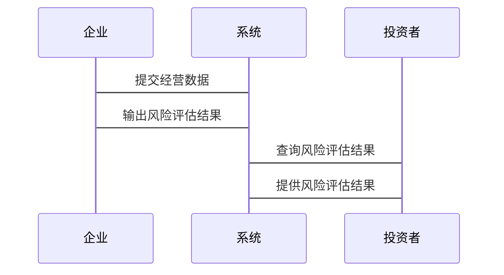

                 


# 如何处理企业估值中的地缘政治风险

## 关键词：地缘政治风险，企业估值，风险管理，政治稳定性，经济依赖度，风险评估，风险对冲

## 摘要：  
地缘政治风险是企业在全球市场中面临的重要挑战之一。随着国际关系的复杂化，企业估值受到地缘政治风险的影响日益显著。本文从地缘政治风险的定义、分类、评估方法、对企业财务指标的具体影响以及应对策略等方面进行详细分析。通过系统性的方法和实际案例，本文旨在帮助企业识别、评估和应对地缘政治风险，从而在企业估值过程中实现更准确的决策。

---

## 第1章 地缘政治风险概述

### 1.1 地缘政治风险的定义与特征

#### 1.1.1 地缘政治风险的核心概念
地缘政治风险是指由于国家之间的政治冲突、贸易摩擦、政策变化、资源争夺等引起的对企业经营环境的不确定性。这种风险通常涉及主权国家之间的关系，具有高度的不确定性和复杂性。

#### 1.1.2 地缘政治风险的分类与层次
地缘政治风险可以分为以下几类：
- **国家层面风险**：包括主权违约、政治动荡、政策变化等。
- **区域层面风险**：涉及特定地区冲突、贸易壁垒、供应链中断等。
- **全球层面风险**：如全球经济波动、国际组织政策变化等。

#### 1.1.3 地缘政治风险的动态特征
地缘政治风险具有动态变化的特点，通常受到国际关系、经济利益、文化冲突等多种因素的影响。例如，中美贸易摩擦就是一个典型的地缘政治风险案例。

### 1.2 地缘政治风险对企业估值的影响

#### 1.2.1 企业估值的基本概念与框架
企业估值是通过对企业的财务状况、市场地位、未来盈利能力等多方面因素进行综合评估，确定企业的价值。地缘政治风险作为外部因素，直接影响企业的经营环境和未来盈利能力。

#### 1.2.2 地缘政治风险如何影响企业估值
地缘政治风险可能导致以下影响：
- **收入下降**：由于贸易限制或市场需求减少，企业收入可能下降。
- **成本增加**：供应链中断可能导致原材料成本上升。
- **资产减值**：政治冲突可能导致企业资产贬值。
- **融资成本上升**：地缘政治风险可能导致企业的融资成本增加。

#### 1.2.3 地缘政治风险的传导机制
地缘政治风险通过以下途径影响企业估值：
1. **直接影响**：如政治冲突导致企业停产或市场关闭。
2. **间接影响**：如贸易壁垒导致企业供应链成本增加。
3. **市场情绪影响**：投资者对地缘政治风险的担忧可能导致企业股价下跌。

### 1.3 地缘政治风险的全球案例分析

#### 1.3.1 近期重大地缘政治事件回顾
- 美国对中国的贸易限制。
- 俄乌冲突对企业供应链的影响。
- 疫情期间的全球供应链中断。

#### 1.3.2 地缘政治风险对企业估值的实际影响
以中美贸易摩擦为例，许多企业由于关税增加、市场限制等因素，其估值受到了显著影响。例如，某些出口型企业由于无法进入美国市场，其收入大幅下降，导致企业估值下降。

#### 1.3.3 典型案例的启示与总结
通过分析这些案例，我们可以得出以下结论：
- 企业需要提前识别潜在的地缘政治风险。
- 企业需要制定灵活的应对策略，以应对地缘政治风险的变化。

---

## 第2章 地缘政治风险的评估框架

### 2.1 地缘政治风险评估的基本原则

#### 2.1.1 风险评估的系统性原则
地缘政治风险评估需要从多个维度进行综合考虑，包括政治、经济、社会等多个方面。

#### 2.1.2 风险评估的动态性原则
地缘政治风险是动态变化的，企业需要定期更新风险评估结果。

#### 2.1.3 风险评估的可操作性原则
评估方法需要简单易行，能够被企业实际操作。

### 2.2 地缘政治风险的评估指标体系

#### 2.2.1 政治稳定性指标
- **政府稳定性**：评估政府的稳定性，包括政治制度、政策连续性等。
- **社会稳定性**：评估社会动荡的可能性，包括民族矛盾、宗教冲突等。

#### 2.2.2 经济依赖度指标
- **出口依赖度**：评估企业对特定市场的依赖程度。
- **原材料依赖度**：评估企业对特定国家的原材料依赖程度。

#### 2.2.3 地缘战略重要性指标
- **地理位置**：评估企业的地理位置是否处于地缘政治敏感区域。
- **行业重要性**：评估企业所在行业的地缘政治重要性。

### 2.3 地缘政治风险的量化方法

#### 2.3.1 定性分析方法
- **专家访谈**：通过与行业专家的访谈，评估地缘政治风险。
- **情景分析**：通过模拟不同地缘政治情景，评估风险的影响。

#### 2.3.2 定量分析方法
- **风险评分模型**：通过给各个风险因素打分，计算总体风险评分。
- **概率-影响矩阵**：评估风险发生的概率及其对企业的影响程度。

#### 2.3.3 综合评估模型
综合评估模型通常包括以下几个步骤：
1. **确定风险因素**：识别影响企业地缘政治风险的关键因素。
2. **评估风险概率**：评估每个风险因素发生的概率。
3. **评估风险影响**：评估每个风险因素对企业的影响程度。
4. **计算总体风险评分**：综合概率和影响，计算总体风险评分。

### 2.4 本章小结

---

## 第3章 地缘政治风险对企业财务的影响

### 3.1 地缘政治风险对企业收入的影响

#### 3.1.1 政治冲突对企业收入的直接影响
政治冲突可能导致企业的生产经营活动被迫中断，从而导致收入下降。

#### 3.1.2 贸易壁垒对企业收入的间接影响
贸易壁垒可能导致企业的出口受限，从而影响收入。

### 3.2 地缘政治风险对企业成本的影响

#### 3.2.1 原材料成本的波动
地缘政治冲突可能导致原材料供应中断，从而推高原材料成本。

#### 3.2.2 供应链中断的影响
地缘政治风险可能导致供应链中断，从而增加企业的库存成本和运输成本。

#### 3.2.3 人力资源成本的变化
地缘政治冲突可能导致员工流动性增加，从而影响人力资源成本。

### 3.3 地缘政治风险对企业现金流的影响

#### 3.3.1 资金流动的不确定性
地缘政治风险可能导致企业的资金流动受到限制，从而影响现金流。

#### 3.3.2 货币政策的变化
地缘政治风险可能导致货币政策的变化，从而影响企业的财务状况。

#### 3.3.3 资本市场波动的影响
地缘政治风险可能导致资本市场的波动，从而影响企业的股价和融资成本。

### 3.4 本章小结

---

## 第4章 地缘政治风险的应对策略

### 4.1 企业层面的应对策略

#### 4.1.1 供应链多元化战略
企业可以通过多元化供应链来降低地缘政治风险的影响。

#### 4.1.2 市场多元化战略
企业可以通过开拓新的市场来降低对单一市场的依赖。

#### 4.1.3 风险对冲工具的应用
企业可以通过购买保险、使用金融衍生品等工具来对冲地缘政治风险。

### 4.2 行业层面的应对策略

#### 4.2.1 行业协会的作用
行业协会可以为企业提供地缘政治风险的信息和预警。

#### 4.2.2 行业标准的制定
行业可以制定统一的风险评估标准，帮助企业在应对地缘政治风险时更加协调。

#### 4.2.3 行业间合作机制的建立
行业间可以通过合作机制，共同应对地缘政治风险。

### 4.3 国家层面的应对策略

#### 4.3.1 政府政策支持
政府可以通过制定相关政策，帮助企业应对地缘政治风险。

#### 4.3.2 外交手段的运用
政府可以通过外交手段，缓解地缘政治冲突，为企业创造更加稳定的经营环境。

#### 4.3.3 国际合作与协调
政府可以通过国际合作与协调，共同应对地缘政治风险。

### 4.4 本章小结

---

## 第5章 系统分析与架构设计方案

### 5.1 地缘政治风险评估的系统架构

#### 5.1.1 问题场景介绍
企业在进行估值时，需要考虑地缘政治风险的影响。为了准确评估这些风险，企业需要构建一个系统化的地缘政治风险评估框架。

#### 5.1.2 系统功能设计
- **风险识别模块**：识别影响企业的地缘政治风险因素。
- **风险评估模块**：评估每个风险因素的概率和影响。
- **风险应对模块**：制定应对策略。

#### 5.1.3 系统架构设计


#### 5.1.4 系统接口设计
- **输入接口**：接收企业的经营数据和外部环境数据。
- **输出接口**：输出地缘政治风险评估结果和应对策略。

#### 5.1.5 系统交互设计


### 5.2 项目实战

#### 5.2.1 环境安装
- 需要安装的工具：Python、Jupyter Notebook、Mermaid工具。

#### 5.2.2 系统核心实现源代码
```python
def geopolitical_risk_assessment(factors):
    # factors: 列表，包含地缘政治风险因素
    # 返回风险评分
    scores = []
    for factor in factors:
        # 评估每个因素的风险评分
        score = assess_factor(factor)
        scores.append(score)
    # 计算总体风险评分
    total_score = sum(scores) / len(scores)
    return total_score

def assess_factor(factor):
    # 根据因素的重要性进行评分
    if factor == '政治冲突':
        return 0.9
    elif factor == '贸易壁垒':
        return 0.7
    elif factor == '供应链中断':
        return 0.8
    else:
        return 0.5
```

#### 5.2.3 代码应用解读与分析
- 代码实现了地缘政治风险评估的核心功能，包括风险因素的识别和评分。
- 通过调用`geopolitical_risk_assessment`函数，企业可以评估不同地缘政治风险因素的影响程度。

#### 5.2.4 实际案例分析
以中美贸易摩擦为例，企业可以使用上述代码评估不同风险因素的影响，制定相应的应对策略。

### 5.3 本章小结

---

## 第6章 最佳实践与总结

### 6.1 最佳实践 tips
- 定期进行地缘政治风险评估，及时调整应对策略。
- 与行业协会和政府机构保持密切沟通，获取最新信息。
- 采用多元化的供应链和市场策略，降低地缘政治风险的影响。

### 6.2 小结
地缘政治风险是企业估值中的重要挑战。通过系统化的风险评估和应对策略，企业可以有效降低地缘政治风险的影响，实现更加准确的估值。

### 6.3 注意事项
- 地缘政治风险是动态变化的，企业需要持续关注国际局势的变化。
- 风险评估模型需要根据实际情况进行调整和优化。

### 6.4 拓展阅读
- 推荐阅读《风险管理与企业战略》、《地缘政治与全球经济》等书籍。

---

## 作者：AI天才研究院/AI Genius Institute & 禅与计算机程序设计艺术 /Zen And The Art of Computer Programming

---

通过以上内容，我们可以看到，地缘政治风险是企业估值中不可忽视的重要因素。企业需要通过系统化的风险评估和应对策略，有效降低地缘政治风险的影响，确保企业的稳健发展。

