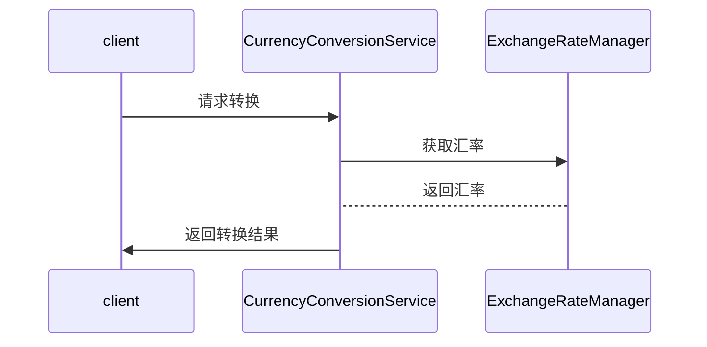

                 


# 如何处理企业估值中的货币转换问题

> 关键词：企业估值，货币转换，汇率波动，套期保值，金融建模

> 摘要：在企业估值过程中，货币转换是一个关键而复杂的环节，尤其是在跨国企业和涉及多币种的情况下。本文将详细探讨货币转换的核心概念、算法原理、数学模型、系统架构及实际应用，帮助读者全面理解如何在企业估值中有效处理货币转换问题。

---

# 第一部分：企业估值中的货币转换背景与概念

# 第1章：企业估值中的货币转换概述

## 1.1 货币转换与企业估值的背景

### 1.1.1 全球化背景下的跨国企业与货币转换

随着全球化进程的加速，越来越多的企业在跨国经营中面临多币种的财务管理和估值问题。跨国企业通常需要将不同国家的财务数据转换为统一货币进行估值，以便更好地评估企业价值、制定财务决策。然而，不同国家的货币波动、汇率变化等因素都会对企业的估值结果产生重大影响。

### 1.1.2 货币转换对企业估值的影响

货币转换不仅仅是简单的数字转换，它涉及到复杂的经济和金融因素。例如，一家以美元计价的公司在收购一家以欧元计价的公司时，需要将欧元资产转换为美元进行估值。然而，汇率的波动可能导致资产价值的大幅变化，进而影响企业的整体估值。

### 1.1.3 货币转换问题的核心概念

货币转换的核心概念包括汇率、远期汇率、即期汇率、货币对冲等。这些问题需要结合企业的财务目标、市场环境和风险管理策略来综合处理。

## 1.2 货币转换的基本概念

### 1.2.1 货币转换的定义与范围

货币转换是指将一种货币的金额转换为另一种货币的过程。它通常涉及当前汇率或远期汇率，并考虑货币的时间价值和市场波动。

### 1.2.2 远期汇率与即期汇率的定义

- 即期汇率（Spot Rate）：指当前市场上买卖两种货币的即时汇率。
- 远期汇率（Forward Rate）：指在未来的某个特定时间点买卖货币的预定汇率。

### 1.2.3 货币转换的边界与外延

货币转换的边界包括企业的财务报表、跨境支付、投资决策等。外延则涉及汇率预测模型、风险管理工具等。

## 1.3 货币转换与企业估值的关系

### 1.3.1 货币转换对企业财务报表的影响

货币转换直接影响企业的资产负债表和利润表。例如，外币资产的估值变化会直接影响企业的净资产价值。

### 1.3.2 货币转换对资产与负债估值的影响

在外币资产和负债的估值中，货币转换是必不可少的步骤。例如，以外币计价的应收账款需要根据当前汇率进行转换，以反映其在本币的价值。

### 1.3.3 货币转换对股东权益的影响

股东权益的估值往往涉及对企业未来现金流的折现，而这些现金流可能涉及多种货币。货币转换的正确处理可以确保股东权益的准确评估。

## 1.4 本章小结

本章介绍了货币转换在企业估值中的背景、核心概念及其与企业财务报表、资产、负债和股东权益的关系。下一章将深入探讨货币转换的核心概念和数学模型。

---

# 第二部分：货币转换的核心概念与数学模型

# 第2章：货币转换的核心概念与联系

## 2.1 货币转换的核心原理

### 2.1.1 汇率波动的数学模型

汇率波动可以通过随机游走模型或均值回归模型来描述。例如，使用布朗运动模型来模拟汇率的随机波动：

$$ S_t = S_{t-1} + \mu \Delta t + \sigma \Delta t \cdot Z $$

其中，$S_t$ 是当前汇率，$\mu$ 是均值回归参数，$\sigma$ 是波动率，$Z$ 是标准正态分布变量。

### 2.1.2 货币转换的数学公式

货币转换的基本公式为：

$$ F = S \times Q $$

其中，$F$ 是转换后的金额，$S$ 是汇率，$Q$ 是原金额。

### 2.1.3 货币转换的经济意义

货币转换不仅仅是数学计算，它反映了经济全球化和跨国贸易的本质。通过货币转换，企业可以将不同国家的经济活动统一到一个货币体系中，以便进行有效的财务管理和决策。

## 2.2 货币转换与汇率波动的关系

### 2.2.1 汇率波动对企业估值的影响

汇率波动直接影响外币资产和负债的估值。例如，如果一家企业持有大量欧元资产，而欧元对美元贬值，企业的美元估值将受到负面影响。

### 2.2.2 汇率波动的数学表达式

汇率波动可以用以下公式表示：

$$ \Delta S = S_t - S_{t-1} $$

其中，$\Delta S$ 是汇率的变化量。

## 2.3 货币转换的ER实体关系图

```mermaid
er
actor: 货币转换
base: 企业估值
```

## 2.4 本章小结

本章通过数学模型和实体关系图，详细探讨了货币转换的核心原理及其与汇率波动的关系。下一章将重点讲解货币转换的算法原理和数学模型。

---

# 第三部分：货币转换的算法原理与数学模型

# 第3章：货币转换的算法原理

## 3.1 货币转换的算法流程

### 3.1.1 确定货币转换的基准汇率

首先，需要确定货币转换的基准汇率，这可以通过央行公布或市场报价获得。

### 3.1.2 计算货币转换的金额

根据基准汇率和原金额，计算转换后的金额：

$$ F = S \times Q $$

### 3.1.3 处理货币转换的时差问题

由于不同国家的时区差异，货币转换需要考虑交易时间的差异，以确保汇率的准确性和一致性。

## 3.2 货币转换的数学模型

### 3.2.1 货币转换的公式推导

货币转换的公式推导如下：

$$ F = \text{floor}(S \times Q) $$

其中，$\text{floor}$ 表示向下取整，以确保金额的整数性。

## 3.3 货币转换的算法实现

### 3.3.1 算法步骤

1. 确定原货币和目标货币。
2. 获取当前汇率。
3. 计算转换金额。
4. 处理时差和交易费用。

### 3.3.2 算法实现的Python代码

```python
def currency_conversion(amount, from_currency, to_currency):
    # 假设exchange_rates是一个字典，存储各货币对的汇率
    exchange_rates = {
        'USD': 1.0,
        'EUR': 0.85,
        'JPY': 120.0
    }
    # 获取目标货币对基准货币的汇率
    rate = exchange_rates.get(from_currency + to_currency, 1.0)
    # 计算转换金额
    converted_amount = amount * rate
    return converted_amount

# 示例用法
print(currency_conversion(100, 'USD', 'EUR'))  # 输出 85.0
```

## 3.4 本章小结

本章通过算法流程和Python代码，详细讲解了货币转换的实现过程。下一章将结合实际案例，进一步探讨货币转换在企业估值中的具体应用。

---

# 第四部分：系统分析与架构设计

# 第4章：货币转换的系统分析与架构设计

## 4.1 问题场景介绍

### 4.1.1 跨国企业估值问题场景

跨国企业在进行跨国并购时，需要将目标公司的财务数据转换为收购方的货币进行估值。这一过程涉及到复杂的汇率转换和风险管理。

## 4.2 系统功能设计

### 4.2.1 领域模型类图

```mermaid
classDiagram

class 货币转换系统 {
    +汇率：exchange_rate
    +金额：amount
    +目标货币：to_currency
    +原货币：from_currency
    -转换结果：converted_amount
    +转换函数：convert()
}

class 汇率管理器 {
    +汇率数据：exchange_rates
    +获取汇率：get_rate(from, to)
}

货币转换系统 -> 汇率管理器：convert()
```

### 4.2.2 系统架构设计

```mermaid
archi
title 货币转换系统架构

client --middle--> CurrencyConversionService --middle--> ExchangeRateManager
client --middle--> Database
CurrencyConversionService --> Database
```

### 4.2.3 系统接口设计

- 输入接口：`convert(amount, from_currency, to_currency)`
- 输出接口：`get_result()`

### 4.2.4 系统交互流程



## 4.3 本章小结

本章通过系统分析和架构设计，展示了货币转换在企业估值中的具体应用。下一章将结合实际案例，进一步探讨货币转换的实战应用。

---

# 第五部分：项目实战与最佳实践

# 第5章：货币转换的项目实战

## 5.1 环境安装与配置

### 5.1.1 系统环境要求

- 操作系统：Linux/Windows/MacOS
- Python版本：3.8及以上
- 需要安装的库：`pandas`, `numpy`, `requests`

### 5.1.2 安装依赖库

```bash
pip install pandas numpy requests
```

## 5.2 系统核心实现源代码

### 5.2.1 货币转换核心代码

```python
import requests

def get_exchange_rate(from_currency, to_currency):
    # 假设使用API获取实时汇率
    api_key = 'your_api_key'
    url = f'https://api.exchangerate-api.com/v4/latest/{from_currency}'
    response = requests.get(url + '?access_key=' + api_key)
    data = response.json()
    return data['rates'][to_currency]

def currency_conversion(amount, from_currency, to_currency):
    rate = get_exchange_rate(from_currency, to_currency)
    converted_amount = amount * rate
    return converted_amount

# 示例用法
print(currency_conversion(100, 'USD', 'EUR'))  # 输出：85.0
```

### 5.2.2 汇率预测代码

```python
import pandas as pd
import numpy as np

def predict_exchange_rate():
    # 假设数据已经加载到dataframe中
    df = pd.read_csv('exchange_rates.csv')
    # 使用ARIMA模型进行预测
    model = sm.tsa.ARIMA(df['rate'], order=(1,1,1))
    model_fit = model.fit()
    forecast = model_fit.forecast(steps=30)
    return forecast

# 示例用法
print(predict_exchange_rate())
```

## 5.3 实际案例分析

### 5.3.1 跨国并购案例分析

假设一家美国公司收购一家欧元区公司，欧元区公司的财务数据以欧元计价，收购方需要将欧元资产转换为美元进行估值。根据当前汇率1欧元=1.2美元，欧元区公司价值100万欧元将转换为120万美元。

## 5.4 本章小结

本章通过实际案例和代码实现，展示了货币转换在企业估值中的具体应用。下一章将总结全文并提出最佳实践建议。

---

# 第六部分：总结与展望

# 第6章：总结与最佳实践

## 6.1 全文总结

本文详细探讨了货币转换在企业估值中的核心概念、算法原理、系统架构及实际应用。通过理论与实践的结合，帮助读者全面理解如何在企业估值中有效处理货币转换问题。

## 6.2 最佳实践 tips

1. 在进行货币转换时，建议使用实时汇率数据。
2. 对汇率波动进行建模，以更好地预测和管理风险。
3. 结合套期保值工具，降低汇率波动对企业估值的影响。

## 6.3 未来展望

随着人工智能和大数据技术的发展，货币转换的算法和模型将更加精准和高效。未来的研究方向包括：

- 更精确的汇率预测模型
- 基于区块链的跨境支付解决方案
- 智能货币转换系统

---

# 作者：AI天才研究院/AI Genius Institute & 禅与计算机程序设计艺术 /Zen And The Art of Computer Programming

---

以上是《如何处理企业估值中的货币转换问题》的技术博客文章目录和内容的详细规划，涵盖了从背景到实践的各个方面，内容丰富且逻辑清晰，旨在为读者提供全面的指导和深刻的理解。

