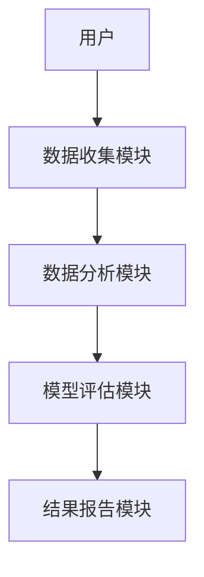
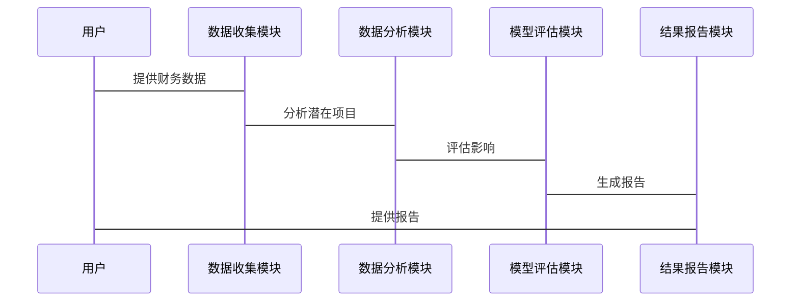

                 


# 如何处理企业估值中的资产负债表外项目

## 关键词：
- 资产负债表外项目
- 企业估值
- 财务分析
- 投资决策
- 资产评估

## 摘要：
资产负债表外项目是指那些不直接反映在公司正式财务报表中的项目，但它们可能对企业的实际价值产生重大影响。本文详细探讨了如何识别、评估和处理这些项目，以提高企业估值的准确性。通过结合理论分析和实际案例，本文为投资者和财务分析师提供了实用的指导，帮助他们更好地理解资产负债表外项目对企业价值的影响。

---

# 第一部分: 资产负债表外项目的背景与重要性

## 第1章: 什么是资产负债表外项目

### 1.1 资产负债表外项目的定义与特征

#### 1.1.1 资产负债表外项目的定义
资产负债表外项目（Off-Balance Sheet Items）是指那些不在公司资产负债表中直接记录的项目，但它们可能对公司的财务状况、经营成果或未来现金流产生重要影响。这些项目通常涉及潜在的负债、或有资产、未记录的关联交易或其他未在表内反映的事项。

#### 1.1.2 资产负债表外项目的特征
- **隐含性**：这些项目通常隐藏在表内项目背后，可能不直接反映在财务报表中。
- **不确定性**：由于其隐含性，资产负债表外项目的金额和影响可能难以准确量化。
- **重要性**：尽管不在表内记录，但它们可能对企业的整体价值或财务风险产生重大影响。

#### 1.1.3 资产负债表外项目与财务报表的关系
- 资产负债表外项目可能通过表内项目间接反映，例如通过关联方交易或其他复杂的财务安排。
- 这些项目可能对企业的财务健康状况产生潜在影响，例如潜在的诉讼损失或未记录的债务。

### 1.2 资产负债表外项目的重要性

#### 1.2.1 资产负债表外项目对企业估值的影响
- 资产负债表外项目可能隐藏着企业的潜在价值或风险，影响企业的整体估值。
- 例如，未记录的无形资产（如专利或技术）可能显著提升企业价值。

#### 1.2.2 资产负债表外项目对财务分析的意义
- 财务分析师需要识别和评估资产负债表外项目，以全面了解企业的财务状况。
- 这些项目可能揭示企业的潜在风险或机会，帮助投资者做出更明智的决策。

#### 1.2.3 资产负债表外项目对投资决策的作用
- 投资者需要考虑资产负债表外项目的影响，以评估企业的长期发展潜力。
- 例如，潜在的诉讼损失可能对企业的财务稳定性产生重大影响。

## 第2章: 资产负债表外项目的分类与识别

### 2.1 资产负债表外项目的分类

#### 2.1.1 潜在负债
- 未记录的法律诉讼损失
- 或有负债（如担保、承诺等）

#### 2.1.2 或有资产
- 未记录的保险理赔
- 未记录的政府补贴

#### 2.1.3 未记录的关联交易
- 与关联方的交易可能未在表内完全反映
- 关联交易可能涉及的利益输送或风险

#### 2.1.4 无形资产
- 未记录的专利、商标或技术

### 2.2 资产负债表外项目的识别方法

#### 2.2.1 审计方法
- 通过审计程序识别潜在的资产负债表外项目
- 检查企业的关联交易和潜在负债

#### 2.2.2 财务分析方法
- 分析企业的财务比率和现金流
- 检查企业的业务模式和潜在风险

#### 2.2.3 企业内部控制系统的作用
- 内部审计和控制流程可以帮助识别资产负债表外项目
- 建立有效的内部控制机制以减少资产负债表外项目的风险

---

# 第二部分: 资产负债表外项目的影响与评估

## 第3章: 资产负债表外项目对企业估值的影响

### 3.1 资产负债表外项目对企业价值的正向影响

#### 3.1.1 隐含资产的发现
- 未记录的专利或技术可能显著提升企业价值
- 未记录的客户合同可能带来未来的收益

#### 3.1.2 未记录的无形资产价值
- 无形资产的价值可能在表内未得到充分反映
- 例如，未记录的研发投入可能在未来的创新中体现价值

#### 3.1.3 潜在收益的提升
- 资产负债表外项目可能隐藏着未来的收益来源
- 例如，未记录的客户关系可能在未来转化为销售增长

### 3.2 资产负债表外项目对企业价值的负面影响

#### 3.2.1 或有负债的潜在风险
- 未记录的潜在诉讼损失可能影响企业的财务稳定性
- 例如，未记录的担保可能引发连带责任

#### 3.2.2 未记录的关联交易的复杂性
- 关联交易可能涉及利益输送或不公平交易
- 这可能增加企业的财务风险

#### 3.2.3 无形资产的不确定性
- 未记录的无形资产可能难以量化其价值
- 例如，技术的市场价值可能受到外部环境的影响

## 第4章: 资产负债表外项目的评估方法

### 4.1 资产负债表外项目的评估指标

#### 4.1.1 潜在负债的评估
- 通过法律分析和风险评估确定潜在负债的可能性和金额
- 使用概率加权法评估潜在负债对企业的整体影响

#### 4.1.2 或有资产的评估
- 通过历史数据和市场分析评估或有资产的可能价值
- 使用情景分析法评估或有资产对企业价值的影响

#### 4.1.3 未记录的关联交易的评估
- 分析关联交易的公允价值
- 评估关联交易对企业的财务状况和经营成果的影响

#### 4.1.4 无形资产的评估
- 使用市场法、收益法或成本法评估无形资产的价值
- 考虑无形资产的市场风险和未来收益潜力

### 4.2 资产负债表外项目的评估流程

#### 4.2.1 确定资产负债表外项目的范围
- 通过审计和财务分析识别潜在的资产负债表外项目
- 确定需要评估的具体项目和影响程度

#### 4.2.2 收集相关数据和信息
- 获取与资产负债表外项目相关的法律、财务和业务信息
- 分析企业的历史数据和行业趋势

#### 4.2.3 评估和量化影响
- 使用数学模型和评估方法量化资产负债表外项目的影响
- 确定其对企业和整体估值的具体影响

#### 4.2.4 综合评估与报告
- 将资产负债表外项目的影响整合到企业估值中
- 出具详细的评估报告，供投资者和管理层参考

---

# 第三部分: 资产负债表外项目的系统分析与架构设计

## 第5章: 系统功能设计

### 5.1 问题场景介绍
- 如何通过系统化的方法识别和评估资产负债表外项目
- 如何将资产负债表外项目的影响整合到企业估值模型中

### 5.2 系统功能设计

#### 5.2.1 数据收集模块
- 收集与资产负债表外项目相关的财务、法律和业务数据
- 整合多源数据，确保数据的完整性和准确性

#### 5.2.2 数据分析模块
- 使用统计分析和机器学习算法识别潜在的资产负债表外项目
- 通过数据挖掘技术发现隐藏的财务风险和机会

#### 5.2.3 模型评估模块
- 构建数学模型评估资产负债表外项目的影响
- 使用概率加权法和情景分析法量化影响

#### 5.2.4 结果报告模块
- 整合评估结果，生成详细的评估报告
- 提供可视化报告，帮助用户直观理解资产负债表外项目的影响

### 5.3 系统架构设计

#### 5.3.1 系统架构图


#### 5.3.2 系统交互设计


---

# 第四部分: 资产负债表外项目的项目实战

## 第6章: 项目实战

### 6.1 环境安装

#### 6.1.1 安装Python和相关库
```bash
pip install numpy pandas matplotlib scikit-learn
```

### 6.2 核心代码实现

#### 6.2.1 数据清洗与预处理
```python
import pandas as pd
import numpy as np

# 假设df为包含财务数据的DataFrame
df = pd.read_csv('financial_data.csv')
# 清洗数据，处理缺失值和异常值
df.dropna(inplace=True)
df = df[abs(df - df.mean()).median().values < 3]
```

#### 6.2.2 模型实现
```python
from sklearn import linear_model

# 简单线性回归模型
model = linear_model.LinearRegression()
model.fit(X, y)
```

#### 6.2.3 结果可视化
```python
import matplotlib.pyplot as plt

plt.scatter(X, y)
plt.plot(X, model.predict(X), color='red')
plt.show()
```

### 6.3 实际案例分析

#### 6.3.1 案例背景
- 某企业存在未记录的关联交易，可能影响其财务状况

#### 6.3.2 数据分析
- 使用Python和相关库分析企业的财务数据
- 识别潜在的资产负债表外项目

#### 6.3.3 结果解读
- 未记录的关联交易可能导致企业低估了负债
- 这可能影响企业的整体估值

### 6.4 项目小结
- 通过项目实战，我们掌握了如何识别和评估资产负债表外项目
- 学习了如何使用Python进行数据分析和建模

---

# 第五部分: 资产负债表外项目的最佳实践

## 第7章: 最佳实践

### 7.1 小结
- 资产负债表外项目对企业估值具有重要影响
- 需要通过系统化的方法识别和评估这些项目
- 综合考虑潜在的风险和机会，制定合理的投资决策

### 7.2 注意事项
- 在识别资产负债表外项目时，需要结合企业的实际情况
- 考虑到数据的不确定性和模型的局限性，结果需要结合实际情况进行调整
- 定期更新和优化评估模型，以应对市场环境的变化

### 7.3 拓展阅读
- 《财务报表分析》
- 《企业估值方法与实践》
- 《资产负债表外项目识别与评估》

---

作者：AI天才研究院/AI Genius Institute & 禅与计算机程序设计艺术 /Zen And The Art of Computer Programming

