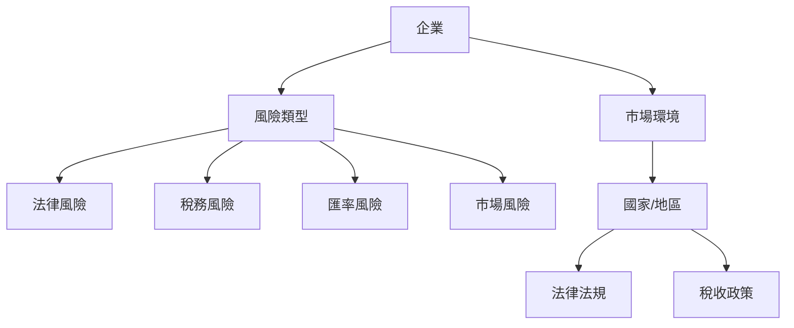
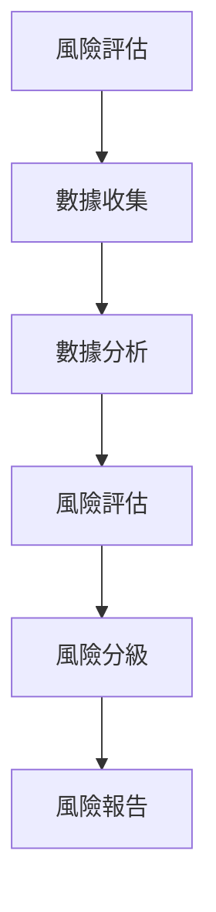
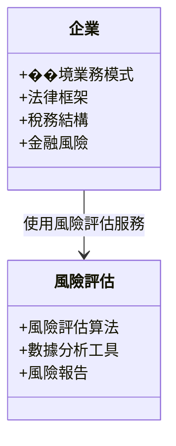
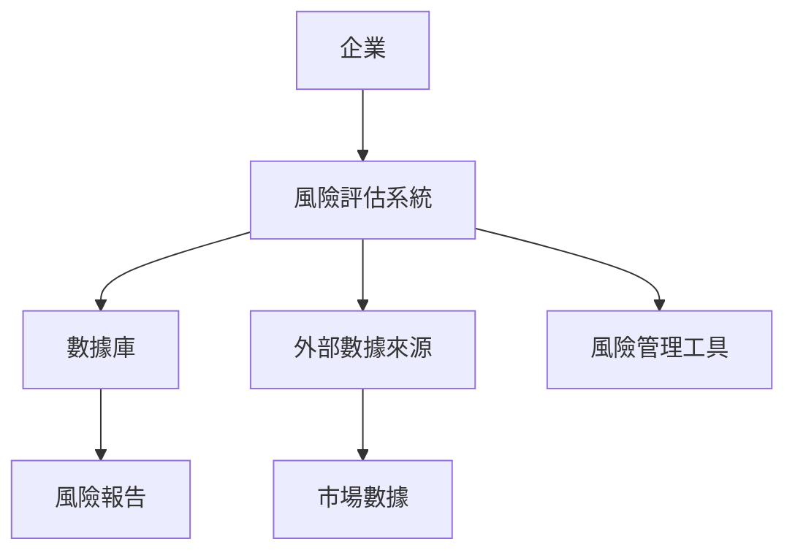
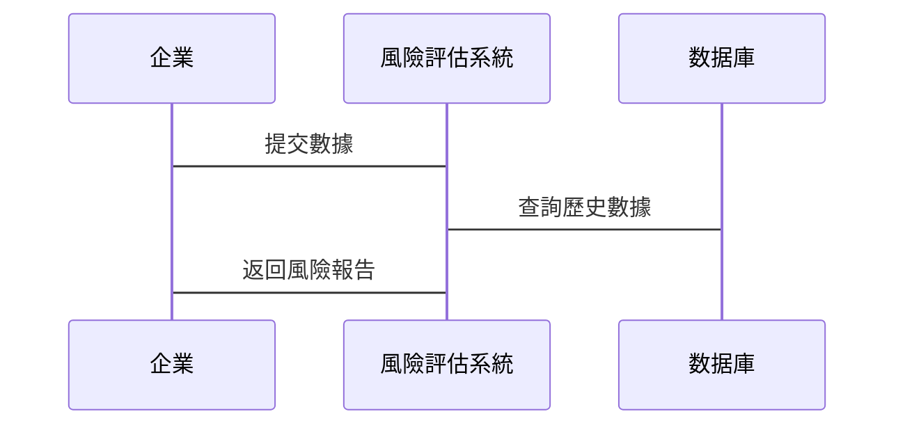

                 


# 如何处理企业估值中的跨境业务风险

> 关键词：企業估值，跨境業務風險，法律風險，稅務風險，匯率風險

> 摘要：本文將探討如何在企業估值中有效管理和對應跨境業務風險。我們將從跨境業務風險的核心概念開始，逐步探討其算法原理、風險評估方法、稅務規劃策略以及法律和合規性考量。最後，我們將通過實際案例分析，展示如何在跨境業務中進行風險管理和價值評估。

---

# 第一章: 背景介紹

## 1.1 跨境業務風險的背景介紹

### 1.1.1 現代企業的全球化特征  
隨著全球化的發展，越來越多的企業開展跨境業務，這為企業帶來了新的增長機會，但也增加了複雜的風險。跨境業務涉及多個司法管轄區，涉及不同的法律、稅務和市場環境，這使得企業估值變得更具挑戰性。

### 1.1.2 跨境業務風險的問題背景  
跨境業務風險是指企業在不同國家或地區開展業務時可能面臨的各種潛在風險，包括法律、稅務、匯率和市場風險等。這些風險可能影響企業的盈利能力和估值結果。

### 1.1.3 跨境業務風險对企业估值的影響  
企業估值是企業價值評估的核心部分，而跨境業務風險會直接影響估值的準確性和可靠性。例如，匯率波動可能影響外幣資產的價值，而稅務風險可能影響企業的利潤和稅後收益。

## 1.2 跨境業務風險的核心概念

### 1.2.1 跨境業務風險的定義  
跨境業務風險是指企業在不同國家或地區開展業務時，由于法律、稅務、匯率、市場等因素的不確定性而可能面臨的損失或機會成本。

### 1.2.2 跨境業務風險的邊界與外延  
跨境業務風險的邊界包括企業的國際交易、海外子公司的運營、跨-border的金融投資等。其外延則涉及稅務、法律、市場和金融風險等多個方面。

### 1.2.3 跨境業務風險的核心要素  
跨境業務風險的核心要素包括：  
1. **法律風險**：不同國家的法律法規差異可能影響企業的運營和合同履行。  
2. **稅務風險**：跨境交易可能涉及複雜的稅務問題，如双重征稅和稅收抵免。  
3. **匯率風險**：外匯匯率的波動可能影響企業的財務狀況。  
4. **市場風險**：不同國家的市場條件和競爭環境可能影響企業的盈利能力。

---

# 第二章: 跨境業務風險的核心概念與联系

## 2.1 跨境業務風險的屬性特征

### 2.1.1 法律風險  
企業在開展跨境業務時需要遵守不同國家的法律法規，這可能包括合同法、勞工法、商標法等。法律風險可能來源於合同履行的不确定性或法律訴訟。

### 2.1.2 稅務風險  
跨境業務涉及跨國稅務問題，企業可能需要面對複雜的稅務規劃和稅務 compliance。例如，不同國家的稅率差異和稅收政策可能影響企業的稅後利潤。

### 2.1.3 汇率風險  
外匯匯率的波動可能影響企業的外幣資產和負債價值，進而影響企業的估值。

### 2.1.4 市場風險  
不同國家的市場條件、消費者行為和競爭環境可能影響企業的市場份額和盈利能力。

---

## 2.2 跨境業務風險的核心要素

### 2.2.1 企業的跨境業務模式  
企業的跨境業務模式可能包括出口、進口、海外投資、國際並購等。每種模式涉及的風險和估值方法都有所不同。

### 2.2.2 跨境業務的法律框架  
不同國家的法律法規對企業的運營和合規性有不同要求，企業需要了解並遵守這些規則。

### 2.2.3 跨境業務的稅務結構  
跨境業務涉及複雜的稅務問題，企業需要制定合理的稅務規劃以降低稅務風險。

### 2.2.4 跨境業務的金融風險  
金融風險包括匯率風險和利率風險，這些風險可能影響企業的財務狀況。

---

## 2.3 跨境業務風險的ER實體關係圖



---

## 2.4 本章小結  
本章介紹了跨境業務風險的核心概念，包括法律、稅務、匯率和市場風險等要素，並通過實體關係圖展示了這些風險之間的相互關係。

---

# 第三章: 跨境業務風險的算法原理與數學模型

## 3.1 跨境業務風險評估的算法原理

### 3.1.1 風險評估的定性方法  
定性方法包括對風險進行分類和評級，例如低風險、中風險和高風險。

### 3.1.2 風險評估的定量方法  
定量方法包括使用統計模型和數學模型來評估風險，例如威險值（VaR）模型。

### 3.1.3 組合風險評估模型  
組合風險模型用於評估多種風險的相互作用對企業估值的影響。

---

## 3.2 跨境業務風險的數學模型

### 3.2.1 稅務風險模型  
$$ 稅務成本 = 營業收入 \times 稅率 $$

### 3.2.2 汇率風險模型  
$$ 決策成本 = 現金流量 \times 汇率波動率 $$

### 3.2.3 市場風險模型  
$$ 市場風險 = 資產價值 \times 市場波動性 $$

---

## 3.3 算法原理的MERMAID流程圖



---

## 3.4 本章小結  
本章介紹了跨境業務風險評估的算法原理和數學模型，並通過流程圖展示了風險評估的過程。

---

# 第四章: 跨境業務風險的系統分析與架构设计方案

## 4.1 系統功能設計（領域模型）



---

## 4.2 系統架构設計



---

## 4.3 系統接口設計

### 4.3.1 風險評估接口  
API interface for risk assessment.

---

## 4.4 系統交互設計



---

## 4.5 本章小結  
本章介紹了跨境業務風險的系統分析與架构设计方案，包括領域模型、系統架构和接口設計。

---

# 第五章: 跨境業務風險的項目實戰

## 5.1 環境安裝

### 5.1.1 安裝Python
```
pip install python
```

### 5.1.2 安裝數據分析工具
```
pip install pandas numpy
```

---

## 5.2 系統核心實現源代碼

### 5.2.1 風險評估算法實現
```python
import pandas as pd
import numpy as np

def calculate_risk(revenue, tax_rate, exchange_rate):
    tax_cost = revenue * tax_rate
    fx_risk = revenue * exchange_rate * 0.05
    return tax_cost + fx_risk
```

---

## 5.3 案例分析與詳細解讀

### 5.3.1 案例分析  
假設一家企業在美國和歐洲開展業務，營業收入為1000萬美元，稅率為20%，匯率波動率為5%。根據上述算法，企業的稅務成本為$200萬，匯率風險為$50萬，總風險成本為$250萬。

---

## 5.4 本章小結  
本章介紹了跨境業務風險的項目實戰，包括環境安裝、系統核心實現和案例分析。

---

# 第六章: 跨境業務風險的最佳實踐與小結

## 6.1 最佳實踐Tips

### 6.1.1 定期進行風險評估  
企業應該定期評估跨境業務風險，並根據市場變化調整風險管理策略。

### 6.1.2 使用專業工具  
使用專業的數據分析工具和風險評估軟件可以提高風險管理效率。

### 6.1.3 興建风险管理團隊  
企業應該興建專業的風險管理團隊，以應對複雜的跨境業務風險。

---

## 6.2 小結  
本文介紹了如何處理企業估值中的跨境業務風險，包括風險的核心概念、算法原理、系統設計和項目實戰。企業應該充分考慮這些風險，並采取有效的管理策略來降低風險對估值的影響。

---

# 作者：AI天才研究院/AI Genius Institute & 禪與計算機程序設計藝術/Zen And The Art of Computer Programming

