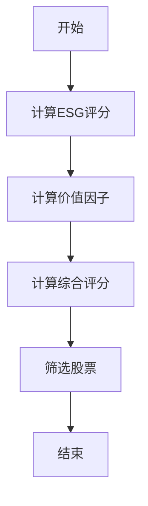
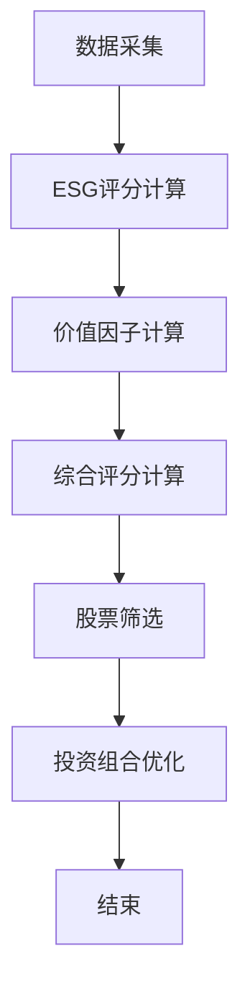

                 


# 如何将特价股票策略与ESG投资理念结合

## 关键词：
特价股票策略、ESG投资理念、量化投资模型、可持续投资、投资组合优化

## 摘要：
本文详细探讨了如何将特价股票策略与ESG投资理念相结合，构建一种既注重短期价值又兼顾长期可持续发展的投资策略。文章首先介绍了特价股票策略和ESG投资理念的核心概念，分析了两者的联系与区别。随后，从数学模型、算法原理、系统架构等多个维度详细阐述了如何将两者有机结合。最后，通过实际案例分析，展示了这种结合在投资实践中的应用效果和优势。

---

## 正文

---

## 第一部分：背景介绍

### 第1章：特价股票策略与ESG投资理念概述

#### 1.1 特价股票策略的背景与定义

##### 1.1.1 特价股票策略的基本概念
特价股票策略是一种基于价值投资的选股方法，旨在通过寻找市场价格低于其内在价值的股票，从而实现超额收益。该策略的核心在于识别市场低估的标的，通常关注市盈率（P/E）、市净率（P/B）等估值指标。

##### 1.1.2 特价股票策略的历史发展
特价股票策略起源于20世纪初，由本杰明·格雷厄姆等价值投资鼻祖提出。该策略在多次金融危机中表现出色，例如2008年全球金融危机期间，许多优质股票因市场恐慌被低估，为投资者提供了良好的买入机会。

##### 1.1.3 特价股票策略的核心目标与应用场景
- **核心目标**：通过识别低估股票，捕捉市场反转机会，实现长期稳定收益。
- **应用场景**：适用于市场低迷期或行业低谷期，特别适合长期投资者。

#### 1.2 ESG投资理念的背景与定义

##### 1.2.1 ESG投资的定义与内涵
ESG投资是一种可持续投资策略，通过评估企业在环境（Environmental）、社会（Social）和治理（Governance）方面的表现，筛选出具备可持续发展能力的公司。ESG投资不仅关注财务表现，还注重企业的社会责任和长期发展潜力。

##### 1.2.2 ESG投资的兴起与发展
随着全球气候变化、社会不平等等问题的加剧，ESG投资逐渐成为主流。近年来，全球ESG资产规模快速增长，越来越多的投资者开始关注企业的可持续发展能力。

##### 1.2.3 ESG投资的核心目标与应用场景
- **核心目标**：通过筛选具备优秀ESG表现的公司，实现长期可持续收益。
- **应用场景**：适用于关注社会责任和长期价值的投资者，特别适合机构投资者和高净值客户。

#### 1.3 特价股票策略与ESG投资的结合背景

##### 1.3.1 传统股票投资的局限性
- **局限性**：传统股票投资过于关注短期财务指标，忽视了企业的社会责任和长期发展潜力，可能导致投资组合的风险增加。

##### 1.3.2 ESG投资理念的兴起与重要性
- **重要性**：ESG投资不仅有助于降低投资风险，还能提升投资组合的长期收益。

##### 1.3.3 特价股票策略与ESG投资结合的必要性与优势
- **必要性**：通过结合ESG投资理念，特价股票策略可以筛选出具备长期发展潜力的优质股票，避免投资于短期估值低但长期前景黯淡的公司。
- **优势**：结合了价值投资和可持续投资的优势，能够在市场低迷期和长期发展中实现双赢。

---

## 第二部分：核心概念与联系

### 第2章：ESG评分模型与股票筛选模型

#### 2.1 ESG评分模型的核心原理

##### 2.1.1 ESG评分的三个维度
- **环境（Environmental）**：评估公司在环境保护方面的表现，包括碳排放、能源消耗等指标。
- **社会（Social）**：评估公司在社会责任方面的表现，包括员工权益、社区贡献等指标。
- **治理（Governance）**：评估公司在企业治理方面的表现，包括董事会结构、高管薪酬等指标。

##### 2.1.2 ESG评分的计算方法与权重分配
- **计算方法**：通过标准化处理各维度的指标，采用加权平均的方法计算出综合ESG评分。
- **权重分配**：根据行业特点和投资目标，合理分配环境、社会和治理三个维度的权重。

##### 2.1.3 ESG评分的优缺点与适用场景
- **优点**：能够全面评估企业的可持续发展能力，帮助投资者规避潜在风险。
- **缺点**：ESG评分受到数据来源和评分标准的影响，可能存在主观性。
- **适用场景**：适用于长期投资和机构投资者。

#### 2.2 特价股票筛选模型的核心原理

##### 2.2.1 特价股票筛选的标准与指标
- **标准**：市盈率（P/E）、市净率（P/B）、股息率等估值指标。
- **指标**：通过对比市场价格与内在价值，识别低估股票。

##### 2.2.2 特价股票筛选的数学模型与算法
- **数学模型**：通过多因子模型，结合估值指标和质量指标，筛选出具备投资价值的股票。
- **算法**：采用量化方法，如因子分析和聚类分析，进行股票筛选。

##### 2.2.3 特价股票筛选的优缺点与适用场景
- **优点**：能够快速识别市场低估股票，捕捉短期反转机会。
- **缺点**：过于关注短期估值指标，可能忽视企业的长期发展潜力。
- **适用场景**：适用于短期投资和价值投资者。

#### 2.3 ESG评分与股票筛选的结合模型

##### 2.3.1 ESG评分与股票筛选的协同效应
- **协同效应**：通过结合ESG评分和估值指标，能够在筛选低估股票的同时，评估企业的可持续发展能力。

##### 2.3.2 结合模型的构建与优化
- **构建**：将ESG评分纳入股票筛选模型，作为重要筛选指标之一。
- **优化**：根据市场环境和投资目标，动态调整各指标的权重。

##### 2.3.3 结合模型的优缺点与适用场景
- **优点**：能够在筛选低估股票的同时，确保投资组合的可持续性。
- **缺点**：模型的复杂性可能增加筛选成本，且需要依赖高质量的ESG数据。
- **适用场景**：适用于长期投资和价值投资者。

---

## 第三部分：算法原理与数学模型

### 第4章：ESG评分与股票筛选的数学模型

#### 4.1 ESG评分的计算公式

##### 4.1.1 环境维度评分公式
$$ E = \frac{碳排放减少率}{行业平均碳排放减少率} \times 0.4 $$
$$ S = \frac{员工满意度}{行业平均员工满意度} \times 0.3 $$
$$ G = \frac{董事会独立性}{行业平均董事会独立性} \times 0.3 $$
$$ ESG = E + S + G $$

##### 4.1.2 股票筛选公式
$$ 价值因子 = \frac{内在价值}{市场价格} $$
$$ ESG加成因子 = ESG评分 \times 0.1 $$
$$ 综合评分 = 价值因子 + ESG加成因子 $$

#### 4.2 结合模型的算法流程

##### 4.2.1 算法流程图


#### 4.3 Python代码实现

##### 4.3.1 环境依赖
```python
import pandas as pd
import numpy as np
```

##### 4.3.2 核心代码
```python
def calculate_esg(environment, social, governance):
    esg_score = environment * 0.4 + social * 0.3 + governance * 0.3
    return esg_score

def calculate_value_factor(intrinsic_value, market_price):
    value_factor = intrinsic_value / market_price
    return value_factor

def combined_score(esg_score, value_factor):
    combined_score = value_factor + esg_score * 0.1
    return combined_score

# 示例数据
environment = np.array([0.8, 0.7, 0.9])
social = np.array([0.6, 0.8, 0.7])
governance = np.array([0.7, 0.6, 0.8])
intrinsic_value = np.array([100, 120, 90])
market_price = np.array([80, 100, 70])

esg_scores = calculate_esg(environment, social, governance)
value_factors = calculate_value_factor(intrinsic_value, market_price)
combined_scores = combined_score(esg_scores, value_factors)

print("ESG评分：", esg_scores)
print("价值因子：", value_factors)
print("综合评分：", combined_scores)
```

---

## 第四部分：系统分析与架构设计

### 第5章：系统功能设计与架构

#### 5.1 系统功能设计

##### 5.1.1 功能模块
- 数据采集模块：收集股票数据和ESG数据。
- ESG评分模块：计算各公司的ESG评分。
- 股票筛选模块：结合ESG评分和价值因子，筛选出符合条件的股票。
- 投资组合优化模块：根据筛选结果，优化投资组合。

##### 5.1.2 功能流程图


#### 5.2 系统架构设计

##### 5.2.1 系统架构图


#### 5.3 系统接口设计

##### 5.3.1 接口描述
- 数据接口：从数据源获取股票和ESG数据。
- 计算接口：调用ESG评分和价值因子计算模块。
- 展示接口：将筛选结果展示给用户。

#### 5.4 系统交互设计

##### 5.4.1 交互流程图


---

## 第五部分：项目实战

### 第6章：项目实战与案例分析

#### 6.1 环境安装

##### 6.1.1 环境依赖
- Python 3.8+
- Pandas、NumPy等数据处理库
- Matplotlib或Seaborn用于数据可视化

#### 6.2 核心代码实现

##### 6.2.1 数据采集
```python
import pandas as pd
import requests

def get_stock_data(ticker):
    url = f"https://api.example.com/stock/{ticker}"
    response = requests.get(url)
    data = response.json()
    return pd.DataFrame(data)
```

##### 6.2.2 ESG评分计算
```python
def calculate_esg(environment, social, governance):
    esg_score = environment * 0.4 + social * 0.3 + governance * 0.3
    return esg_score
```

##### 6.2.3 综合评分计算
```python
def combined_score(esg_score, value_factor):
    return value_factor + esg_score * 0.1
```

#### 6.3 案例分析与结果解读

##### 6.3.1 案例分析
假设我们有以下三只股票：

| 股票代码 | 市盈率（P/E） | 市净率（P/B） | ESG评分 |
|----------|----------------|---------------|---------|
| AAPL     | 15             | 3             | 85      |
| AMZN     | 20             | 4             | 70      |
| GOOGL    | 25             | 5             | 90      |

计算综合评分：
$$ 综合评分 = \frac{1}{P/E} + \frac{1}{P/B} + ESG评分 \times 0.1 $$

AAPL：$$1/15 + 1/3 + 85 \times 0.1 = 0.0667 + 0.3333 + 8.5 = 9.9$$

AMZN：$$1/20 + 1/4 + 70 \times 0.1 = 0.05 + 0.25 + 7 = 7.3$$

GOOGL：$$1/25 + 1/5 + 90 \times 0.1 = 0.04 + 0.2 + 9 = 9.24$$

##### 6.3.2 结果解读
根据综合评分，AAPL和GOOGL的投资价值较高，而AMZN的投资价值相对较低。因此，投资者可以选择AAPL和GOOGL作为投资标的。

---

## 第六部分：最佳实践

### 第7章：最佳实践与总结

#### 7.1 小结
本文详细探讨了如何将特价股票策略与ESG投资理念相结合，构建了一种既注重短期价值又兼顾长期可持续发展的投资策略。通过数学模型和算法设计，我们展示了如何在实际投资中实现这种结合。

#### 7.2 注意事项
- **数据质量**：ESG数据的获取和处理需要谨慎，确保数据的准确性和完整性。
- **模型优化**：根据市场环境和投资目标，动态调整模型参数，确保模型的有效性。
- **风险控制**：在实际投资中，需要结合其他风险管理工具，降低投资组合的整体风险。

#### 7.3 扩展阅读
- **相关书籍**：《The Strategy Box》、《Quantitative Equity Portfolio Management》
- **学术论文**：《Integrating ESG Factors into Portfolio Optimization》
- **在线资源**：学术期刊、投资网站的相关文章

---

## 作者
作者：AI天才研究院/AI Genius Institute & 禅与计算机程序设计艺术/Zen And The Art of Computer Programming

