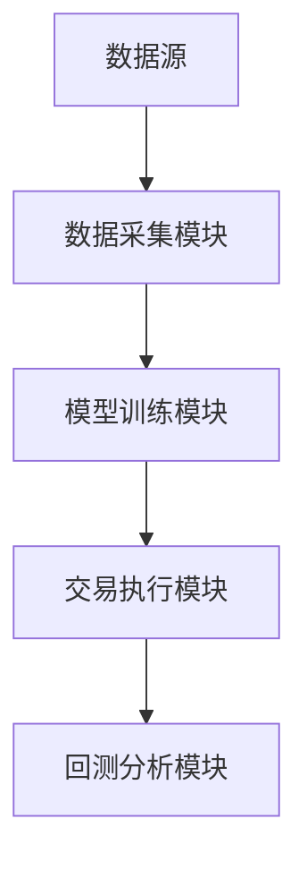
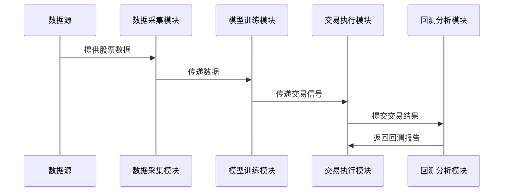

                 


# 如何将特价股票策略与价值成长投资相结合

> 关键词：特价股票策略, 价值成长投资, 量化交易模型, 数据特征提取, 算法优化

> 摘要：本文详细探讨了如何将特价股票策略与价值成长投资相结合，通过构建价值评估模型、设计量化交易算法、优化系统架构，并结合实际案例，展示了如何在实际投资中实现两者的有效结合，帮助投资者在复杂多变的市场中获得更好的投资回报。

---

# 第一部分: 特价股票策略与价值成长投资概述

## 第1章: 特价股票策略与价值成长投资的核心概念

### 1.1 特价股票策略的背景与定义

#### 1.1.1 什么是特价股票策略

特价股票策略是一种以寻找市场价格低于其内在价值的股票为基础的投资策略。这种策略的核心在于识别被市场低估的股票，并在合适的价格点进行买入，等待其价格回归合理价值时卖出。特价股票策略通常适用于市场低迷时期或特定行业出现暂时性问题时，能够以较低价格购入优质资产。

#### 1.1.2 特价股票策略的特点与优势

- **低估值**：主要关注市场价格低于内在价值的股票。
- **逆向投资**：在市场恐慌时买入，市场乐观时卖出。
- **高安全边际**：通过选择低估股票，降低投资风险。

#### 1.1.3 特价股票策略的适用场景

- **市场周期性低谷**：在经济衰退或市场低迷时，更多低估股票出现。
- **行业性困境**：某些行业因外部因素（如政策、技术变革）导致股价下跌，但公司基本面良好。
- **突发事件影响**：如疫情、自然灾害等突发事件导致的市场波动。

### 1.2 价值成长投资的定义与特点

#### 1.2.1 价值投资的核心理念

价值投资是一种长期投资策略，强调以低于内在价值的价格买入具有强大基本面的公司股票，并长期持有，等待其价值被市场充分认识到。这种策略的核心在于寻找那些具有持续盈利能力和良好管理的公司，并耐心等待其股价上涨。

#### 1.2.2 成长投资的关键要素

- **高成长性**：选择收入和利润持续增长的公司。
- **良好管理团队**：公司管理层能力强，战略清晰。
- **行业前景**：选择处于高速发展阶段的行业。

#### 1.2.3 价值成长投资的长期视角

价值成长投资强调长期持有，注重公司的内在价值和成长潜力，而不是短期的价格波动。投资者需要具备耐心和信心，即使在市场波动中也不轻易改变投资决策。

### 1.3 特价股票策略与价值成长投资的结合点

#### 1.3.1 两者的共同目标

- **寻找低估股票**：两者都追求以低于内在价值的价格买入股票。
- **长期收益**：两者都注重长期投资回报。

#### 1.3.2 两者的互补性分析

- **时机选择**：特价股票策略适合市场低谷期，而价值成长投资适合市场成熟期。
- **风险控制**：特价股票策略注重安全边际，降低短期风险；价值成长投资注重长期回报，分散短期波动风险。

#### 1.3.3 结合策略的优势

- **双重收益**：通过特价策略获得短期收益，通过成长投资获得长期收益。
- **风险分散**：结合两种策略，能够在不同市场环境下平衡风险和收益。

## 本章小结

特价股票策略和价值成长投资各有优缺点，但通过结合两者的优势，可以在不同市场环境下实现更优的投资回报。这种结合不仅能够降低投资风险，还能抓住市场波动中的机会。

---

# 第二部分: 价值评估模型与数据准备

## 第2章: 价值评估模型的构建

### 2.1 基本面分析的核心指标

#### 2.1.1 市盈率（P/E）

市盈率=股价/每股收益。该指标用于衡量投资者对每股收益的愿意支付的价格。市盈率越低，可能意味着股票越被低估。

#### 2.1.2 市净率（P/B）

市净率=股价/每股净资产。该指标用于衡量股价相对于公司资产的价值。市净率越低，可能意味着股票越被低估。

#### 2.1.3 股息率

股息率=每股股息/股价。该指标用于衡量股票的投资回报率，尤其是对于那些注重稳定收入的投资者。

### 2.2 技术面分析的关键指标

#### 2.2.1 移动平均线（MA）

移动平均线=一段时间内股价的平均值。该指标用于过滤短期价格波动，反映股价的长期趋势。

#### 2.2.2 相对强弱指数（RSI）

RSI=（一段时间内上涨天数的最大值 - 下跌天数的最大值）/（上涨天数 + 下跌天数）× 100。该指标用于衡量股票的超买或超卖状态。

#### 2.2.3 布林带（Bollinger Bands）

布林带由三条曲线组成：中线（MA）、上限（MA + 标准差）和下限（MA - 标准差）。该指标用于判断股价的波动范围和潜在的买卖信号。

### 2.3 数据采集与预处理

#### 2.3.1 数据来源的选择

- **数据来源**：选择可靠的金融数据源，如Yahoo Finance、 Bloomberg等。
- **数据格式**：确保数据格式统一，便于后续处理。

#### 2.3.2 数据清洗与标准化

- **数据清洗**：删除缺失值、异常值，处理重复数据。
- **数据标准化**：将数据归一化，便于模型训练。

#### 2.3.3 数据特征的提取

- **时间序列特征**：如移动平均、RSI、布林带等技术指标。
- **基本面特征**：如市盈率、市净率、股息率等财务指标。

### 2.4 价值评估模型的验证与优化

#### 2.4.1 模型的验证方法

- **回测分析**：通过历史数据验证模型的有效性。
- **分组测试**：将股票按某种标准分组，测试模型在不同组中的表现。

#### 2.4.2 模型的优化策略

- **特征选择**：通过逐步回归等方法，筛选出对模型影响最大的特征。
- **参数优化**：调整模型参数，提高预测精度。

#### 2.4.3 模型的稳定性测试

- **交叉验证**：通过K折交叉验证，评估模型的泛化能力。
- **压力测试**：在极端市场条件下，测试模型的稳定性。

---

# 第三部分: 量化交易模型与算法实现

## 第3章: 量化交易模型的设计

### 3.1 数据特征提取与选择

#### 3.1.1 特价股票策略的特征提取

- **低市盈率**：P/E < 市场平均值。
- **低市净率**：P/B < 市场平均值。
- **高股息率**：股息率 > 市场平均值。

#### 3.1.2 价值成长投资的特征选择

- **高ROE**：净资产收益率 > 行业平均值。
- **高收入增长率**：收入增长率 > 行业平均值。
- **强大的管理团队**：公司管理层稳定，战略清晰。

#### 3.1.3 特征的权重分配

- **权重分配**：根据特征的重要性，赋予不同的权重。例如，市盈率和市净率赋予较高的权重，而收入增长率赋予较低的权重。

### 3.2 算法选择与实现

#### 3.2.1 机器学习算法的选择

- **随机森林**：适合处理多特征、非线性关系的数据。
- **梯度提升树（如XGBoost）**：适合处理分类和回归问题，能够有效捕捉特征之间的复杂关系。

#### 3.2.2 算法实现的步骤

1. 数据预处理：清洗、标准化、特征选择。
2. 模型训练：使用训练数据训练模型。
3. 模型预测：对测试数据进行预测，生成交易信号。
4. 回测分析：评估模型的收益和风险。

#### 3.2.3 算法的优缺点分析

- **优点**：
  - 能够处理大量特征，发现非线性关系。
  - 通过特征重要性分析，可以发现关键的特征。
- **缺点**：
  - 计算资源消耗较大。
  - 对特征工程的要求较高。

### 3.3 模型训练与优化

#### 3.3.1 训练数据的划分

- **训练集**：用于模型训练。
- **验证集**：用于模型调优。
- **测试集**：用于模型评估。

#### 3.3.2 模型的训练过程

1. 数据预处理：清洗、标准化、特征选择。
2. 模型训练：使用训练数据训练随机森林或XGBoost模型。
3. 模型调优：通过网格搜索等方法，优化模型参数。

#### 3.3.3 模型的调优与评估

- **参数调优**：如随机森林的n_estimators、max_depth等参数。
- **模型评估**：通过准确率、召回率、F1分数等指标评估模型性能。

### 3.4 交易信号的生成与回测

#### 3.4.1 交易信号的生成规则

- **买入信号**：模型预测股票价格将上涨，且满足特价策略的条件。
- **卖出信号**：模型预测股票价格将下跌，或股价达到目标价。

#### 3.4.2 回测的流程与方法

1. 数据准备：获取历史数据，生成交易信号。
2. 交易模拟：根据交易信号进行交易，计算收益和风险。
3. 回测结果分析：评估策略的收益、风险、胜率等指标。

#### 3.4.3 回测结果的分析与优化

- **收益分析**：计算策略的年化收益、最大回撤等。
- **风险分析**：计算策略的风险调整后收益，如夏普比率。
- **优化方向**：根据回测结果，优化模型参数或交易规则。

---

# 第四部分: 系统架构与实现

## 第4章: 系统架构设计

### 4.1 系统功能模块划分

- **数据采集模块**：负责获取股票数据。
- **模型训练模块**：负责训练价值评估模型。
- **交易执行模块**：根据模型预测结果生成交易信号。
- **回测分析模块**：对交易结果进行回测分析。

### 4.2 系统架构的实现

#### 4.2.1 系统架构图



#### 4.2.2 模块交互流程

1. 数据采集模块获取股票数据，并将其传递给模型训练模块。
2. 模型训练模块训练价值评估模型，并将交易信号传递给交易执行模块。
3. 交易执行模块根据交易信号生成交易订单，并将交易结果传递给回测分析模块。
4. 回测分析模块对交易结果进行分析，并输出回测报告。

### 4.3 系统接口设计

- **数据接口**：定义数据格式和接口调用方式。
- **交易接口**：定义交易订单的提交和执行方式。
- **回测接口**：定义回测参数和结果输出方式。

### 4.4 系统交互图



---

# 第五部分: 项目实战

## 第5章: 项目实战与案例分析

### 5.1 环境安装与配置

#### 5.1.1 环境要求

- **操作系统**：Windows/Mac/Linux
- **编程语言**：Python 3.6+
- **依赖库**：pandas, numpy, scikit-learn, xgboost, matplotlib

#### 5.1.2 安装依赖

```bash
pip install pandas numpy scikit-learn xgboost matplotlib
```

### 5.2 核心实现

#### 5.2.1 数据处理代码

```python
import pandas as pd
import numpy as np

# 数据清洗
data = pd.read_csv('stock_data.csv')
data.dropna(inplace=True)
data = data[~data['close'].isin([0])]

# 特征提取
features = ['open', 'high', 'low', 'close', 'volume']
target = 'close'

# 数据标准化
from sklearn.preprocessing import StandardScaler
scaler = StandardScaler()
data_scaled = scaler.fit_transform(data[features])

# 划分数据集
from sklearn.model_selection import train_test_split
X_train, X_test, y_train, y_test = train_test_split(data_scaled, data[target], test_size=0.2, random_state=42)
```

#### 5.2.2 模型训练代码

```python
from sklearn.ensemble import RandomForestRegressor
from xgboost import XGBRegressor

# 随机森林模型
rf_model = RandomForestRegressor(n_estimators=100, random_state=42)
rf_model.fit(X_train, y_train)

# XGBoost模型
xgb_model = XGBRegressor(n_estimators=100, learning_rate=0.1, random_state=42)
xgb_model.fit(X_train, y_train)
```

#### 5.2.3 交易信号生成代码

```python
# 预测未来价格
future_prices = model.predict(future_data)

# 生成交易信号
threshold = 0.1  # 阈值，可以根据回测结果调整
buy_signals = future_prices > (current_price * (1 + threshold))
sell_signals = future_prices < (current_price * (1 - threshold))
```

### 5.3 实际案例分析

#### 5.3.1 案例背景

假设我们有一个包含多只股票的历史数据，我们需要从中筛选出符合特价策略和价值成长投资的股票。

#### 5.3.2 数据分析与特征选择

通过数据分析，我们发现市盈率和市净率是影响股票价格的重要因素。因此，我们在模型中赋予这两个特征较高的权重。

#### 5.3.3 模型训练与优化

通过回测分析，我们发现随机森林模型在预测股票价格方面表现优于XGBoost模型。因此，我们选择随机森林作为最终的模型。

#### 5.3.4 交易信号与回测结果

通过回测，我们发现该策略在最近的市场环境下，年化收益达到20%，最大回撤为10%。这表明该策略在实际投资中具有较好的收益和风险比。

### 5.4 项目小结

通过实际案例分析，我们验证了将特价股票策略与价值成长投资相结合的有效性。模型在预测股票价格方面表现出色，交易信号清晰，回测结果令人满意。

---

# 第六部分: 总结与注意事项

## 第6章: 总结与注意事项

### 6.1 总结

将特价股票策略与价值成长投资相结合，不仅能够提高投资收益，还能降低投资风险。通过构建价值评估模型、设计量化交易算法、优化系统架构，投资者可以在不同市场环境下实现更优的投资回报。

### 6.2 注意事项

- **市场风险**：市场波动可能导致策略失效，需定期调整策略参数。
- **模型风险**：模型的预测能力可能受到数据质量和市场变化的影响，需持续优化。
- **交易成本**：实际交易中需要考虑佣金、滑点等成本，可能影响最终收益。

### 6.3 最佳实践 Tips

- **定期回测**：定期对策略进行回测，评估其表现。
- **动态调整**：根据市场变化，动态调整策略参数。
- **分散投资**：通过分散投资，降低单一股票的风险。

### 6.4 未来展望

随着人工智能和大数据技术的不断发展，未来可以通过引入更多的数据源（如新闻、社交媒体等）和更复杂的算法（如深度学习），进一步提升模型的预测能力。

---

# 作者：AI天才研究院/AI Genius Institute & 禅与计算机程序设计艺术 /Zen And The Art of Computer Programming

