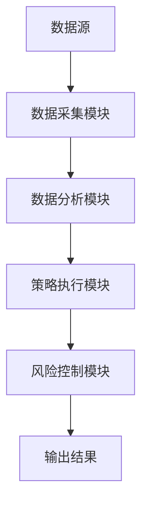

                 


# 如何将特价股票策略与其他投资策略结合

> 关键词：特价股票，投资策略，技术分析，基本面分析，套利策略

> 摘要：本文深入探讨了如何将特价股票策略与其他投资策略相结合，通过技术分析、基本面分析和套利策略等多种方法，优化投资组合，提升收益并控制风险。文章结合实际案例和系统设计，详细分析了策略的实现过程和优化方法。

---

## 第1章: 特价股票策略的背景与概念

### 1.1 特价股票的定义与特点

#### 1.1.1 什么是特价股票
特价股票是指在特定市场条件下，价格被低估或临时折扣的股票。这些股票通常具有较高的潜在收益，但同时也伴随着较高的风险。

#### 1.1.2 特价股票的特点
- **价格低估**：相对于内在价值，价格较低。
- **短期机会**：通常为短期投资机会。
- **波动性高**：价格波动较大，容易受市场情绪影响。
- **高杠杆效应**：价格波动可能导致较高收益或损失。

#### 1.1.3 特价股票与其他股票的区别
| 特性 | 特价股票 | 普通股票 |
|------|----------|----------|
| 价格 | 低于内在价值 | 接近或高于内在价值 |
| 风险 | 高 | 中等或低 |
| 收益 | 高潜力 | 稳定或中等 |

### 1.2 特价股票策略的核心要素

#### 1.2.1 投资目标
- 短期收益最大化。
- 利用市场波动捕捉机会。

#### 1.2.2 投资原则
- **价值发现**：寻找被市场低估的股票。
- **风险控制**：设置止损点，避免重大损失。
- **分散投资**：避免过度集中，降低风险。

#### 1.2.3 投资工具
- 技术分析工具（如K线图、均线、成交量分析）。
- 基本面分析工具（如市盈率、市净率、股息率）。
- 套利工具（如跨市场套利、事件套利）。

### 1.3 特价股票策略的优缺点

#### 1.3.1 优点
- 收益潜力大。
- 适合短期投资者。

#### 1.3.2 缺点
- 风险高，容易亏损。
- 需要高频交易，对市场敏感度要求高。

#### 1.3.3 适用场景
- 市场波动较大时。
- 特定事件驱动下（如资产重组、公司收购）。

### 1.4 本章小结
本章介绍了特价股票的定义、特点、核心要素及其优缺点，为后续策略的结合奠定了基础。

---

## 第2章: 特价股票策略与其他投资策略的结合

### 2.1 其他主要投资策略概述

#### 2.1.1 技术分析策略
- **定义**：通过分析价格和成交量数据，预测未来价格走势。
- **工具**：K线图、均线、MACD、RSI等指标。

#### 2.1.2 基本面分析策略
- **定义**：通过分析公司的财务状况、行业地位、盈利能力等基本面因素，评估股票的内在价值。
- **工具**：市盈率（P/E）、市净率（P/B）、股息率等。

#### 2.1.3 套利策略
- **定义**：利用不同市场或资产之间的价差，进行无风险或低风险套利。
- **工具**：跨市场套利、事件套利、配对交易等。

#### 2.1.4 资产配置策略
- **定义**：根据投资者的风险承受能力和收益目标，合理配置不同资产（如股票、债券、基金等）。
- **工具**：资产分配模型、风险调整后的收益模型。

### 2.2 特价股票策略与技术分析的结合

#### 2.2.1 技术分析在特价股票中的应用
- **趋势识别**：利用均线、趋势线等工具，识别股票的短期趋势。
- **超买超卖信号**：通过RSI、MACD等指标，判断买卖时机。

#### 2.2.2 常用技术指标的筛选与优化
| 指标 | 优缺点 | 应用场景 |
|------|--------|----------|
| RSI | 易受极端市场影响 | 判断超买超卖 |
| MACD | 参数敏感 | 判断趋势和动能 |
| 均线 | 短期波动干扰大 | 判断趋势方向 |

#### 2.2.3 技术分析与特价股票策略的结合案例
**案例**：某股票在经历短期下跌后，RSI指标显示超卖信号，结合均线分析，确认短期底部，投资者可在此时介入。

### 2.3 特价股票策略与基本面分析的结合

#### 2.3.1 基本面分析在特价股票中的应用
- **估值分析**：通过P/E、P/B等指标，判断股票是否被低估。
- **财务状况分析**：分析公司盈利能力、资产负债情况等。

#### 2.3.2 估值指标的筛选与优化
| 指标 | 计算公式 | 应用场景 |
|------|----------|----------|
| P/E | 市盈率 = 价格 / 每股收益 | 判断股票是否被低估 |
| P/B | 市净率 = 价格 / 每股净资产 | 适用于金融、地产等行业 |
| 股息率 | 股息率 = 每股股息 / 价格 | 判断分红能力 |

#### 2.3.3 基本面分析与特价股票策略的结合案例
**案例**：某公司因短期业绩下滑导致股价下跌，但其市盈率远低于行业平均水平，基本面分析显示公司具有较高的内在价值，投资者可在此时介入。

### 2.4 特价股票策略与套利策略的结合

#### 2.4.1 套利策略的基本原理
- **跨市场套利**：利用不同市场间的价差进行套利。
- **事件套利**：利用公司并购、重组等事件带来的价差。

#### 2.4.2 特价股票套利的机会识别
- **市场价差**：同一股票在不同市场或平台的价格差异。
- **事件驱动**：公司公告、行业政策变化等事件引发的市场反应。

#### 2.4.3 套利策略与特价股票策略的结合案例
**案例**：某公司公告重大资产重组，市场反应不一，A股价格大幅下跌，H股价格稳定，投资者可进行跨市场套利。

### 2.5 本章小结
本章分析了技术分析、基本面分析和套利策略的特点，并探讨了它们与特价股票策略的结合方式，为优化投资组合提供了多种可能性。

---

## 第3章: 特价股票策略的系统设计与实现

### 3.1 系统设计概述

#### 3.1.1 系统目标
- 实现特价股票策略与其他策略的结合。
- 提供实时数据支持和风险控制。

#### 3.1.2 系统功能模块划分
| 模块 | 功能 |
|------|------|
| 数据采集 | 收集股票价格、财务数据等 |
| 数据分析 | 进行技术分析和基本面分析 |
| 策略执行 | 执行买卖指令 |
| 风险控制 | 监控风险，触发止损 |

#### 3.1.3 系统架构设计


### 3.2 系统功能设计

#### 3.2.1 数据采集模块
- **功能**：实时采集股票价格、成交量等数据。
- **工具**：API接口、数据爬虫。

#### 3.2.2 数据分析模块
- **功能**：进行技术分析和基本面分析。
- **工具**：Python的pandas、matplotlib库。

#### 3.2.3 策略执行模块
- **功能**：根据分析结果，执行买卖指令。
- **工具**：交易平台API。

#### 3.2.4 风险控制模块
- **功能**：监控投资组合的风险，触发止损点。
- **工具**：风险评估模型。

### 3.3 系统架构设计

#### 3.3.1 分层架构设计


#### 3.3.2 模块间交互设计


### 3.4 系统实现案例

#### 3.4.1 环境安装与配置
- **工具**：Python 3.8+, pandas, numpy, matplotlib。

#### 3.4.2 核心实现代码
```python
import pandas as pd
import numpy as np
import matplotlib.pyplot as plt

def calculate_rsi(data, period=14):
    # 计算RSI
    delta = data['close'].diff()
    up = delta.where(delta > 0, 0)
    down = delta.where(delta < 0, 0)
    rs = up.rolling(period).sum() / down.rolling(period).sum()
    rsi = 100 - 100 * (1 - rs)
    return rsi

data = pd.read_csv('stock_data.csv')
rsi = calculate_rsi(data)
plt.plot(rsi)
plt.title('RSI Analysis')
plt.show()
```

#### 3.4.3 代码应用解读与分析
- **代码功能**：计算股票的RSI指标，判断超买超卖信号。
- **应用场景**：结合RSI指标和其他技术指标，优化特价股票的买卖时机。

### 3.5 本章小结
本章详细介绍了系统设计与实现过程，包括功能模块划分、架构设计和核心代码实现，为投资者提供了技术支持。

---

## 第4章: 特价股票策略的风险管理与优化

### 4.1 风险管理的重要性

#### 4.1.1 风险的来源
- 市场风险：市场波动导致的价格下跌。
- 信用风险：公司信用问题导致的股价下跌。
- 操作风险：交易操作失误导致的损失。

#### 4.1.2 风险管理的目标
- 降低投资组合的波动性。
- 控制最大可能的损失。

### 4.2 风险控制策略

#### 4.2.1 止损策略
- **固定比例止损**：设定最大亏损比例，如5%或10%。
- **技术指标止损**：根据RSI、均线等技术指标触发止损。

#### 4.2.2 仓位管理
- **固定比例投资**：将资金按比例分配到不同股票。
- **动态调整**：根据市场变化调整仓位。

### 4.3 风险调整后的收益优化

#### 4.3.1 风险调整后的收益模型
$$ \text{夏普比率} = \frac{\text{预期收益} - \text{无风险利率}}{\text{收益波动率}} $$

#### 4.3.2 优化方法
- **风险中性化**：通过组合投资，降低特定风险。
- **风险溢价**：考虑市场风险溢价，优化收益。

### 4.4 本章小结
本章探讨了风险管理的重要性，并提出了多种风险控制策略，帮助投资者在结合特价股票策略时降低风险。

---

## 第5章: 实战案例与未来展望

### 5.1 实战案例分析

#### 5.1.1 案例背景
- 公司公告重大资产重组，股价短期下跌。

#### 5.1.2 案例分析
- **技术分析**：RSI显示超卖信号，均线显示短期底部。
- **基本面分析**：公司估值被低估，重组后有较大增长潜力。
- **套利策略**：跨市场套利，利用A股和H股的价格差异。

#### 5.1.3 投资决策
- 结合技术分析和基本面分析，决定介入。
- 设定止损点，控制风险。

### 5.2 未来展望

#### 5.2.1 技术创新
- AI技术在投资策略中的应用。
- 大数据技术在市场预测中的应用。

#### 5.2.2 投资策略的多样化
- 多策略结合：技术分析、基本面分析、套利策略的有机结合。
- 跨资产投资：股票、债券、基金等多种资产的结合。

### 5.3 本章小结
本章通过实战案例展示了特价股票策略的应用，并展望了未来投资策略的发展方向。

---

## 作者：AI天才研究院/AI Genius Institute & 禅与计算机程序设计艺术 /Zen And The Art of Computer Programming

